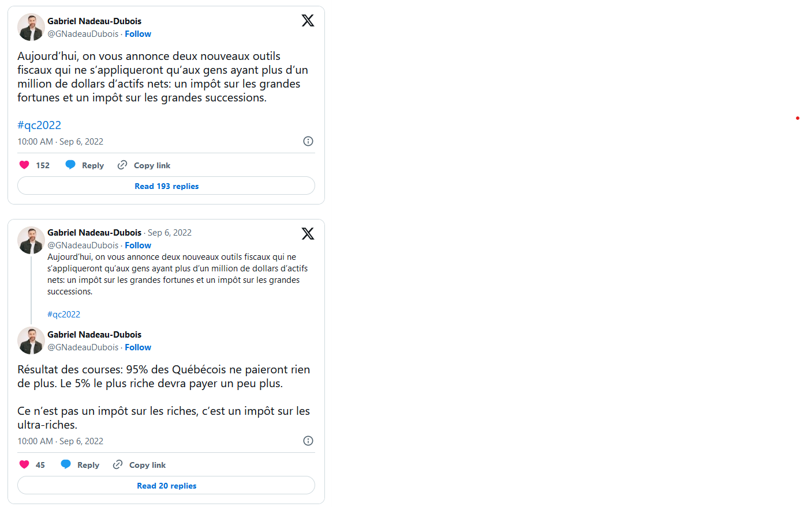

::: {.cell}

:::


Québec Solidaire a identifié un bon problème aujourd'hui avec son idée de taxer la richesses.     

J'ai tilté sur quelques choses.  

- Premièrement, je n'irais pas jusqu'à dire que quelqu'un qui vaut un million de dollars est un ultra-riche.    Si vous êtes une femme de 65 ans et que vous avez un million de dollar dans votre REER à 65 ans (et pas de maison), vous avez assez d'argent pour vous acheter [une annuité à la Sun Life](https://www.sunlife.ca/en/tools-and-resources/tools-and-calculators/annuity-calculator/) qui va vous donner 52 298 beaux dollars avant impôt (environ 34 384 après impôt)  à chaque année jusqu'à votre mort. Vos héritiers ne recevront rien, parce que c'est une annuité.
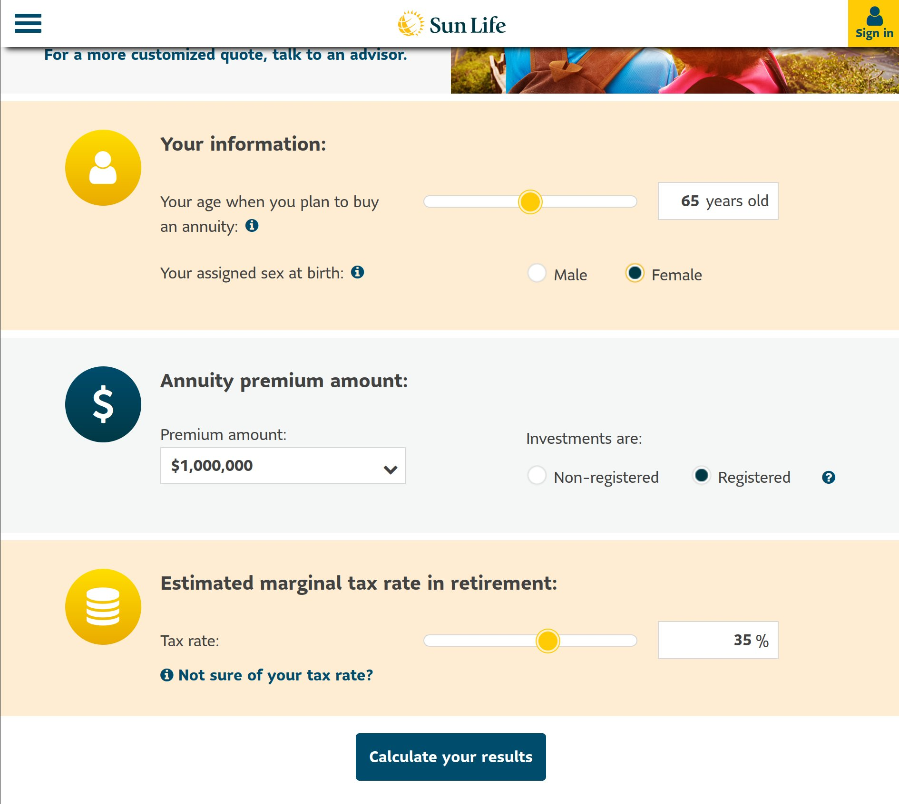

Ce n'est certainement pas ça que j'Appelle être un ultra-riche.

Ensuite, j'ai l'impression que le pourcentage de gens qui valent plus d'un million à l'approche de la retraite va être beaucoup plus élevé que 5%.  Je ne serais pas surpris que ce soit quelque chose comme 20% des 55-64 ans. Est-ce qu'on veut vraiment emmerder une forte proportiondes  nouveaux/futurs retraités en leur demandant d'estimer la valeur marchande de leur maison (on se paie tous un estimateur à 300 piasses ?) et de leur fond de pension (comment?) et de leur voiture usagée (une soirée sur marketplace?) à chaque année pour leur prélever genre 100$ d'impôt au final?

Avant on était  "We are the 99%", maintenant on vise "We are the 95%", voire  "We are the 80%" chez les 55-64 ans si mon hypothèse se vérifie.  C'est bien beau "eat the rich", mais ça commence à faire beaucoup de riches à manger  ... :)

Dans tous les cas, c'est pas des montants énormes.  On parle de 1000$ à 2 millions d'actifs nets.  Personne va arrêter de travailler parce que ça ne vaut plus la peine. C'est surtout le vocabulaire d'ultra-riches et la charge de travail que je suspecte imposée à beaucoup de monde pour récupérer peu d'argent au final qui me gosse.


On investigue!  

# Les données  

La meilleure source de données au Canada pour la valeur nettes de gens, c'est l'enquête sur la sécurité financières des ménages de statistique canada.  Déjà, le plus gros problème c'est qu'elle vise le ménage, plutôt que l'individu comme la mesure de Québec Solidaire.  

Le premier tableau à voir est donc le Tableau 1 dans le Quotidien du 22 décembre 2020. 

https://www150.statcan.gc.ca/n1/daily-quotidien/201222/dq201222b-fra.htm

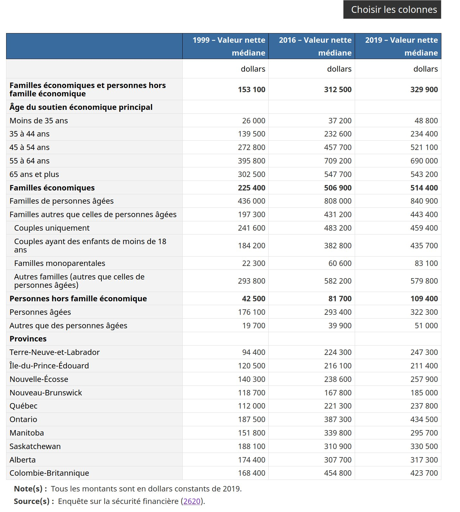

La richesse médiane des ménages au Canada était de 329 900$ en 2019.
Chez les Québécois , elle était de seulement 237 800$.


Quand on regarde par âge, on se rend compte que plus on est vieux, plus on a accumulé d'avoirs en prévision de la retraite.  Ainsi, la médiane des 55-64 ans était de 690 000$


::: {.cell}
::: {.cell-output-display}
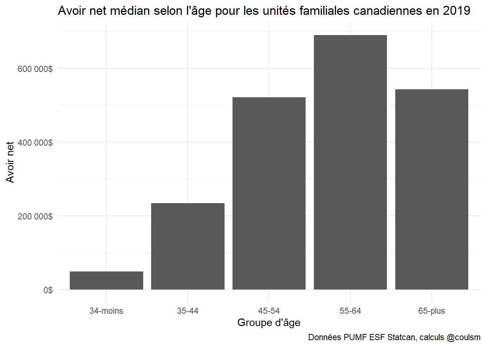{width=672}
:::
:::


Le problème, c'est qu'on veut connaître le 95e percentile, chez les Québécois, pour les 55-64 ans et que le tableau ne permet de ventiler que par une variable à la fois (âge, ou province) en plus de n'avoir que la médiane.


Il existe un autre tableau qui permet d'avoir plus de détails, le tableau [11-10-0049-01](https://www150.statcan.gc.ca/t1/tbl1/fr/tv.action?pid=1110004901&pickMembers%5B0%5D=1.1&pickMembers%5B1%5D=2.27&pickMembers%5B2%5D=4.5&cubeTimeFrame.startYear=1999&cubeTimeFrame.endYear=2019&referencePeriods=19990101%2C20190101).

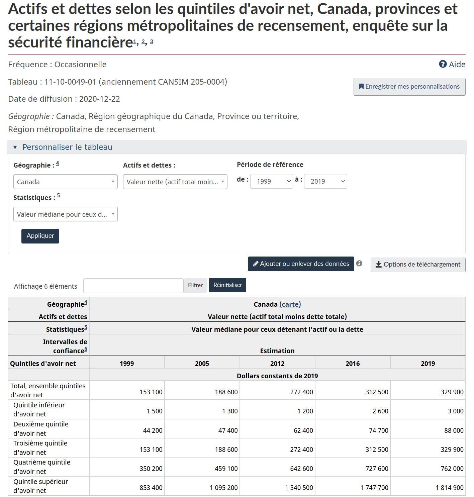

On y voir encore que la richesse médiane est de 329 900$ au Canada.  
Ce qui est intéressant, c'est qu'on apprend la valeur médiane dans chaque quintile d'avoir net.
Ainsi, la médiane du quintile inférieur d'avoir net ( 3000$), correspond au percentile à mi-chemin entre 0 et 20, donc le 10e percentile.  

Le tableau ne permet donc de savoir que les  avoirs nets des 10e 30e, 50e, 70e et 90e percentiles:


::: {.cell}
::: {.cell-output .cell-output-stdout}

```
# A tibble: 5 × 3
  percentile avoir_net type_variable
  <chr>          <dbl> <chr>        
1 10              3000 canada       
2 30             88000 canada       
3 50            329900 canada       
4 70            762000 canada       
5 90           1814900 canada       
```


:::
:::


très cool, on avance!

En plus, on peut choisir la géographie de notre choix, soit le Québec.
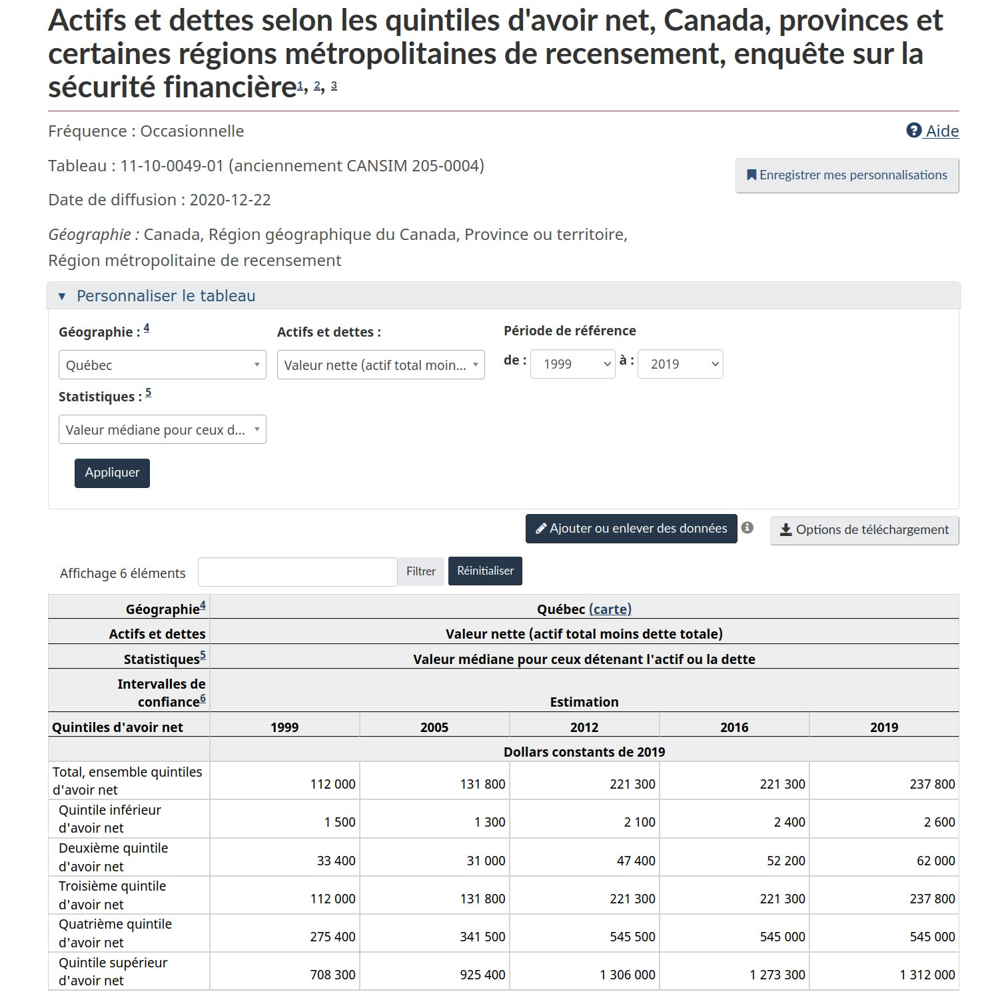


Ça concorde, la médiane du Québecv est de 237 800, soit ce qu'on avait déjà vu dans le quotidien.  Voici les autres chiffres qu'on apprend pour le Québec:


::: {.cell}
::: {.cell-output-display}


|percentile | avoir_net|type_variable |
|:----------|---------:|:-------------|
|10         |      2600|quebec        |
|30         |     62000|quebec        |
|50         |    237800|quebec        |
|70         |    545000|quebec        |
|90         |   1312000|quebec        |


:::
:::


Déjà, on voit que le top 10 des ménages Québécois valait 1 312 000 $ ou plus en 2019.  Certains de ces ménages comptent 2 adultes et le plan de QS est de taxer les personnes qui valent plus de 1 000 000, pas les ménages.


::: {.cell}
::: {.cell-output-display}
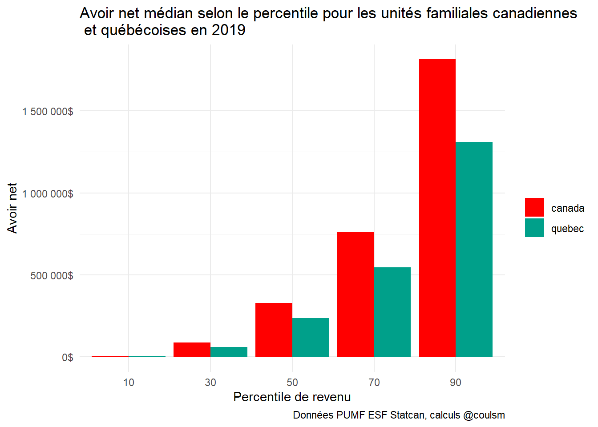{width=672}
:::
:::


On a progressé pas mal!  On a la richesse du ménage au 90e percentile au Québec.  
C'est pas encore ça qu'on veut!  
On veut la richesse de l'individu au 95e percentile des 55-64 ans au Québec.
On va devoir continuer à travailler.

Pour ce faire, on va télécharger les [donnes du PUMF de l'Enquête sur la Sécurité Financière](https://www150.statcan.gc.ca/n1/pub/13m0006x/13m0006x2021001-fra.htm) (prononcé poumf, pour public use microdata file) et on va faire notre tableau nous même!

J'ai donc suivi le lien et cliqué "Télécharger période de référence 2019" pour avoir un fichier zip

Le fichier zip contient les fichiers suivants qui sont intéressants:
`SFS2019_EFAM_PUMF.txt` est un fichier texte de type "fixed width". Ça va être chiant à importer
`SAS/SFS2019_EFAM_PUMF_i.SAS` explique les caractéristique du fichier à importer (largeur et type des colonnes dans le fichier texte)
`SFS2019_PUMF_F.pdf` contient le dictionnaire des données (c'est quoi la colonne province? c'est PPVRES.  C'est quoi le code de la province de Québec? c'est 24.)

Ok, let's go, j'importe ça dans R.


::: {.cell}

:::


Voici les 10 premières lignes du dataset.  On a 10 442 lignes et une centaine de colonnes.
Les variables d'intérêt sont:  
* PWEIGHT , le poids de l'observation.  
* PWNETWPG, la valeur nette de l'unité familiale selon la base de long terme.    
* PWNETWPT, la valeur nette de l'unité familiale selon la base de la terminaison  (je ne sais pas quelle est la bonne base à utiliser, mais les chiffres se ressemblent)  
* PAGEMIEG, la catégorie d'âge   
* PPVRES, la province de résidence    
* PFMTYPG, le type de famille    


::: {.cell}
::: {.cell-output .cell-output-stdout}

```
# A tibble: 10,422 × 100
   PEFAMID PWEIGHT PAGEMIEG PAS1MRAG PAS1MRG1 PAS1MRG2 PASR1MFA PASR1MR PASRBUYG
   <chr>     <dbl> <chr>       <dbl>    <dbl>    <dbl>    <dbl>   <dbl>    <dbl>
 1 00001     4415. 06              6        6        6 99999996       2        7
 2 00002      805. 14              6        6        6 99999996       6       96
 3 00003     1393. 12              6        6        6 99999996       6        4
 4 00004      217. 11              6        6        6 99999996       6        5
 5 00005      455. 11              6        6        6 99999996       6        5
 6 00006     2936. 04              6        6        6 99999996       2        9
 7 00007      920. 13              6        6        6 99999996       6        6
 8 00008     1057. 14              6        6        6 99999996       6        5
 9 00009      940. 07              6        6        6 99999996       6        7
10 00010      214. 11              6        6        6 99999996       6        4
# ℹ 10,412 more rows
# ℹ 91 more variables: PASRCNMG <dbl>, PASRCON <dbl>, PASRCST <dbl>,
#   PASRCURG <dbl>, PASRDPO1 <dbl>, PASRDPO2 <dbl>, PASRDPO3 <dbl>,
#   PASRDPO4 <dbl>, PASRDPO5 <dbl>, PASRDWNG <dbl>, PASRFNMG <dbl>,
#   PASRINT <dbl>, PASRINTG <chr>, PASRMOAG <dbl>, PASRMPFG <dbl>,
#   PASRMRYG <dbl>, PASRRNTG <dbl>, PASRSKP <dbl>, PATTCRC <dbl>,
#   PATTCRLM <dbl>, PATTCRR <dbl>, PATTCRU <dbl>, PATTDIF <dbl>, …
```


:::
:::


C'est quoi la valeur médiane de la valeur nette au Canada.
On va utiliser la fonction Hmisc::wtd.quantile(),  car on doit utiliser les poids d'échantillonnage.


::: {.cell}
::: {.cell-output .cell-output-stdout}

```
   50% 
338450 
```


:::
:::


338 450!!  C'est proche  du chiffre officiel de 329 900$ qu'on avait dans les tableaux.  On ne s'attendait pas à avoir qqch d'identique car nous avons seulement un échantillon des données qui ont été utilisées pour calculer les chiffres officiels. Ça ne semble donc pas trop brisé.   Qu'en est-il des autres percentiles qu'on connait (10, 30, 50, 70, 90) ?


::: {.cell}
::: {.cell-output-display}
{width=672}
:::
:::

ok , on est vraiment proches!!  


Juste pour être sûrs, est-ce qu'on est capable de reproduire les chiffres par groupe d'âge aussi?


::: {.cell}
::: {.cell-output-display}
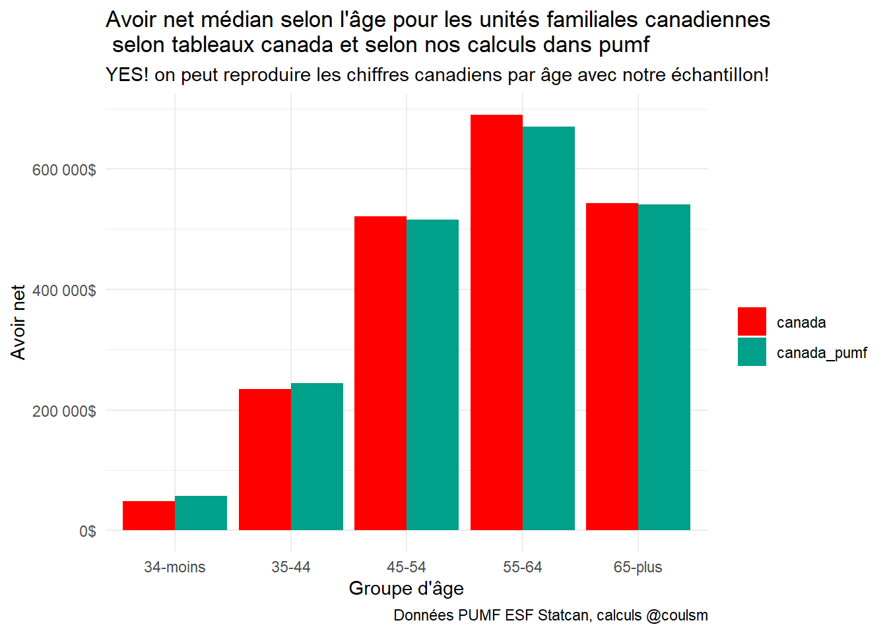{width=672}
:::
:::


What about les percentiles du Québec?


::: {.cell}
::: {.cell-output-display}
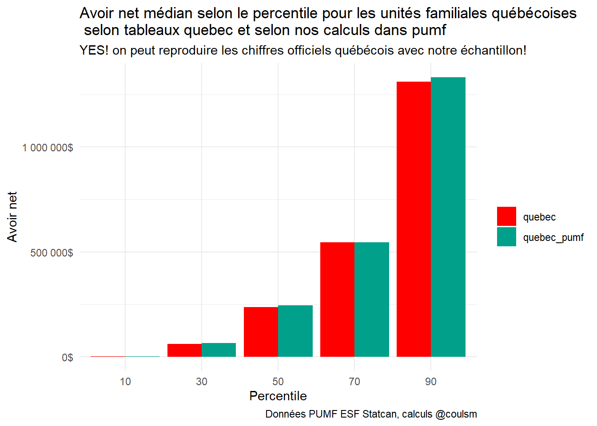{width=672}
:::
:::


Ok, ça veut dire qu'on est vraiment capables de reproduire les chiffres officiels à peu de chose près.  On n'aurait pas pu espérer mieux sachant qu'on travaille avec un échantillon de ce qui est utilisé pour les chiffres officiels.

Maintenant qu'on a confirmé que l'on sait comment travailler avec le PUMF, nous allons enfin pouvoir créer des données "originales" 


here we gooooooooooooo

quel est le pourcentage de ménages québécois dont l'avoir net est supérieur à 1M (tout type de ménage confondu)

::: {.cell}
::: {.cell-output-display}


| pct_over_1_million|
|------------------:|
|          0.1557031|


:::
:::

15.57% des ménages québécois ont un avoir net supérieur à 1 million.  
C'est vastement supérieur au 5% annoncé par QS, mais plusieurs de ces ménages sont composés de 2 adultes.  On va avoir besoin de séparer tout ça plus tard.  

Tant qu'à être ici, quel pourcentage des ménages ont plus de 2 millions d'actif net?

::: {.cell}
::: {.cell-output-display}


| pct_over_2_million|
|------------------:|
|          0.0464127|


:::
:::

4.6% des ménages (toutes tailles confondues)  ont un avoir net de plus de 2 millions. 


Tant qu'à être ici, quel est l'avoir net du top 5%  des ménages? 

::: {.cell}
::: {.cell-output-display}
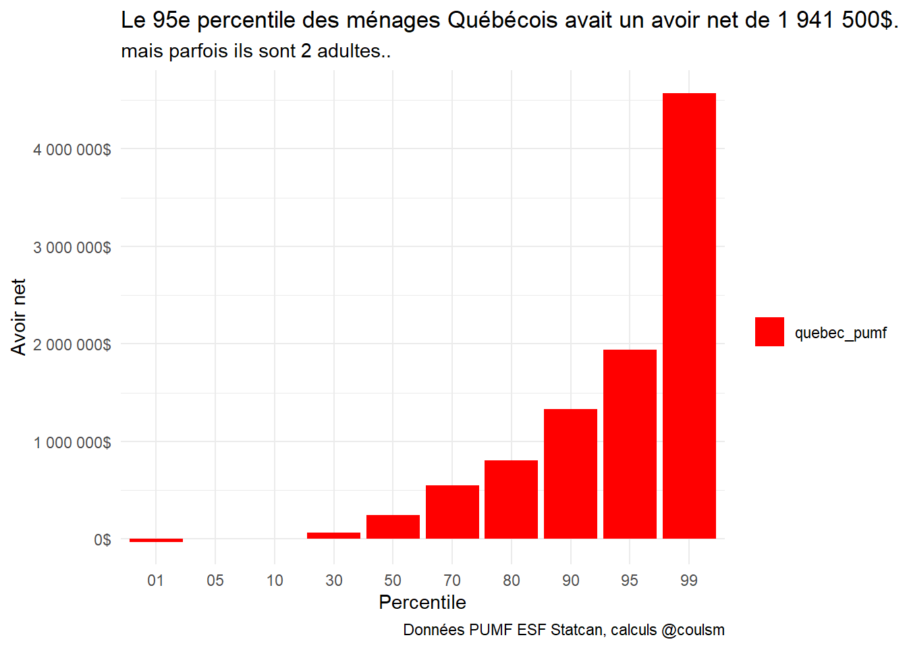{width=672}
:::
:::

Le 95e percentile de Québécois avait un avoir net de 1 941 500$.
Est-ce que QS a juste pris le chiffre de 2 millions puis l'a divisé par 2 pour avoir un montant par individu en supposant que tous les ménages étaient composés d'un couple?  


Peut-être. Mais il y a une autre option.  Il existe  a une variable dans l'enquête: le type de ménage (PFMTYPG). 

Les options sont:  
* personne seule  
* couple sans enfant  
* couple avec enfant ou famille monoparentale  
* autre famille   
- non déclaré  


C'est weird, j'aurais aimé ça pouvoir connaître le nombre d'adultes, mais je ne peux pas à cause de la catégorie #3 qui peut compter 1 ou 2 adultes.  

On va commencer par regarder le pourcentage de chaque type de ménage qui a plus d'1 million en avoir net.


::: {.cell}
::: {.cell-output-display}


|type_menage                                       | pct_over_1_million|
|:-------------------------------------------------|------------------:|
|Autres types de famille                           |          0.2690881|
|Couple, avec des enfants et famille monoparentale |          0.1215458|
|Couple, sans enfant                               |          0.2508584|
|Non déclaré                                       |          0.7619395|
|Personne seule                                    |          0.0524131|


:::
:::

Ce sont 5.2% des personnes seules et 25% des couples sans enfants qui ont un actif net de plus d'un million.  Ce sont 12%  des couples avec enfants et des familles monoparentales  qui sont millionnaires.

On se souvient que c'était 15.7% des ménages globalement qui avaient 1 million ou plus.


On va regarder le pourcentage des familles qui ont plus de 2 millions de dollars d'actifs car les couples doivent partager l'actif entre 2 adultes.  


::: {.cell}
::: {.cell-output-display}


|type_menage                                       | pct_over_2_million|
|:-------------------------------------------------|------------------:|
|Autres types de famille                           |          0.0697072|
|Couple, avec des enfants et famille monoparentale |          0.0286250|
|Couple, sans enfant                               |          0.0685021|
|Non déclaré                                       |          0.5227915|
|Personne seule                                    |          0.0138479|


:::
:::

Seulement 1.3% des personnes seules sont doublement millionnaires.  C'est cependant le cas de 6.8% des couples sans enfants et de 2.8% des couples avec enfants et des familles monoparentales.  


Tant qu'à être là, on va regarder le 95e percentile de revenu dans chacun des types de ménages.

::: {.cell}
::: {.cell-output-display}


|PFMTYPG | avoir_net|percentile |type_variable |type_menage                                       |
|:-------|---------:|:----------|:-------------|:-------------------------------------------------|
|1       |   1044800|95         |quebec_pumf   |Personne seule                                    |
|2       |   2297500|95         |quebec_pumf   |Couple, sans enfant                               |
|3       |   1516000|95         |quebec_pumf   |Couple, avec des enfants et famille monoparentale |
|4       |   2326500|95         |quebec_pumf   |Autres types de famille                           |
|9       |  14336450|95         |quebec_pumf   |Non déclaré                                       |


:::
:::


Le 95e percentile des personnes seules au Québec est de 1044800$, tout âge confondu.
C'est peut-être juste ça.  un peu plus de 5% des personnes seules valent plus d'un million.


Pour les couples sans enfants, le top 5% vaut 2.3 million.  Donc si on divise par 2 adultes, c'est aussi un peu plus de 5% des personnes qui valent plus d'un million.  

Pour les familles (1 ou 2 parents), le top 5% vaut 1.5 million

Il existe une autre variable intéressante : PFSZ, soit le nombre de personnes dans l'unité familiale. Mais là je suis fatigué.


::: {.cell}
::: {.cell-output-display}


```{=html}
<div id="mqqhhcissc" style="padding-left:0px;padding-right:0px;padding-top:10px;padding-bottom:10px;overflow-x:auto;overflow-y:auto;width:auto;height:auto;">
<style>#mqqhhcissc table {
  font-family: system-ui, 'Segoe UI', Roboto, Helvetica, Arial, sans-serif, 'Apple Color Emoji', 'Segoe UI Emoji', 'Segoe UI Symbol', 'Noto Color Emoji';
  -webkit-font-smoothing: antialiased;
  -moz-osx-font-smoothing: grayscale;
}

#mqqhhcissc thead, #mqqhhcissc tbody, #mqqhhcissc tfoot, #mqqhhcissc tr, #mqqhhcissc td, #mqqhhcissc th {
  border-style: none;
}

#mqqhhcissc p {
  margin: 0;
  padding: 0;
}

#mqqhhcissc .gt_table {
  display: table;
  border-collapse: collapse;
  line-height: normal;
  margin-left: auto;
  margin-right: auto;
  color: #333333;
  font-size: 16px;
  font-weight: normal;
  font-style: normal;
  background-color: #FFFFFF;
  width: auto;
  border-top-style: solid;
  border-top-width: 2px;
  border-top-color: #A8A8A8;
  border-right-style: none;
  border-right-width: 2px;
  border-right-color: #D3D3D3;
  border-bottom-style: solid;
  border-bottom-width: 2px;
  border-bottom-color: #A8A8A8;
  border-left-style: none;
  border-left-width: 2px;
  border-left-color: #D3D3D3;
}

#mqqhhcissc .gt_caption {
  padding-top: 4px;
  padding-bottom: 4px;
}

#mqqhhcissc .gt_title {
  color: #333333;
  font-size: 125%;
  font-weight: initial;
  padding-top: 4px;
  padding-bottom: 4px;
  padding-left: 5px;
  padding-right: 5px;
  border-bottom-color: #FFFFFF;
  border-bottom-width: 0;
}

#mqqhhcissc .gt_subtitle {
  color: #333333;
  font-size: 85%;
  font-weight: initial;
  padding-top: 3px;
  padding-bottom: 5px;
  padding-left: 5px;
  padding-right: 5px;
  border-top-color: #FFFFFF;
  border-top-width: 0;
}

#mqqhhcissc .gt_heading {
  background-color: #FFFFFF;
  text-align: center;
  border-bottom-color: #FFFFFF;
  border-left-style: none;
  border-left-width: 1px;
  border-left-color: #D3D3D3;
  border-right-style: none;
  border-right-width: 1px;
  border-right-color: #D3D3D3;
}

#mqqhhcissc .gt_bottom_border {
  border-bottom-style: solid;
  border-bottom-width: 2px;
  border-bottom-color: #D3D3D3;
}

#mqqhhcissc .gt_col_headings {
  border-top-style: solid;
  border-top-width: 2px;
  border-top-color: #D3D3D3;
  border-bottom-style: solid;
  border-bottom-width: 2px;
  border-bottom-color: #D3D3D3;
  border-left-style: none;
  border-left-width: 1px;
  border-left-color: #D3D3D3;
  border-right-style: none;
  border-right-width: 1px;
  border-right-color: #D3D3D3;
}

#mqqhhcissc .gt_col_heading {
  color: #333333;
  background-color: #FFFFFF;
  font-size: 100%;
  font-weight: normal;
  text-transform: inherit;
  border-left-style: none;
  border-left-width: 1px;
  border-left-color: #D3D3D3;
  border-right-style: none;
  border-right-width: 1px;
  border-right-color: #D3D3D3;
  vertical-align: bottom;
  padding-top: 5px;
  padding-bottom: 6px;
  padding-left: 5px;
  padding-right: 5px;
  overflow-x: hidden;
}

#mqqhhcissc .gt_column_spanner_outer {
  color: #333333;
  background-color: #FFFFFF;
  font-size: 100%;
  font-weight: normal;
  text-transform: inherit;
  padding-top: 0;
  padding-bottom: 0;
  padding-left: 4px;
  padding-right: 4px;
}

#mqqhhcissc .gt_column_spanner_outer:first-child {
  padding-left: 0;
}

#mqqhhcissc .gt_column_spanner_outer:last-child {
  padding-right: 0;
}

#mqqhhcissc .gt_column_spanner {
  border-bottom-style: solid;
  border-bottom-width: 2px;
  border-bottom-color: #D3D3D3;
  vertical-align: bottom;
  padding-top: 5px;
  padding-bottom: 5px;
  overflow-x: hidden;
  display: inline-block;
  width: 100%;
}

#mqqhhcissc .gt_spanner_row {
  border-bottom-style: hidden;
}

#mqqhhcissc .gt_group_heading {
  padding-top: 8px;
  padding-bottom: 8px;
  padding-left: 5px;
  padding-right: 5px;
  color: #333333;
  background-color: #FFFFFF;
  font-size: 100%;
  font-weight: initial;
  text-transform: inherit;
  border-top-style: solid;
  border-top-width: 2px;
  border-top-color: #D3D3D3;
  border-bottom-style: solid;
  border-bottom-width: 2px;
  border-bottom-color: #D3D3D3;
  border-left-style: none;
  border-left-width: 1px;
  border-left-color: #D3D3D3;
  border-right-style: none;
  border-right-width: 1px;
  border-right-color: #D3D3D3;
  vertical-align: middle;
  text-align: left;
}

#mqqhhcissc .gt_empty_group_heading {
  padding: 0.5px;
  color: #333333;
  background-color: #FFFFFF;
  font-size: 100%;
  font-weight: initial;
  border-top-style: solid;
  border-top-width: 2px;
  border-top-color: #D3D3D3;
  border-bottom-style: solid;
  border-bottom-width: 2px;
  border-bottom-color: #D3D3D3;
  vertical-align: middle;
}

#mqqhhcissc .gt_from_md > :first-child {
  margin-top: 0;
}

#mqqhhcissc .gt_from_md > :last-child {
  margin-bottom: 0;
}

#mqqhhcissc .gt_row {
  padding-top: 8px;
  padding-bottom: 8px;
  padding-left: 5px;
  padding-right: 5px;
  margin: 10px;
  border-top-style: solid;
  border-top-width: 1px;
  border-top-color: #D3D3D3;
  border-left-style: none;
  border-left-width: 1px;
  border-left-color: #D3D3D3;
  border-right-style: none;
  border-right-width: 1px;
  border-right-color: #D3D3D3;
  vertical-align: middle;
  overflow-x: hidden;
}

#mqqhhcissc .gt_stub {
  color: #333333;
  background-color: #FFFFFF;
  font-size: 100%;
  font-weight: initial;
  text-transform: inherit;
  border-right-style: solid;
  border-right-width: 2px;
  border-right-color: #D3D3D3;
  padding-left: 5px;
  padding-right: 5px;
}

#mqqhhcissc .gt_stub_row_group {
  color: #333333;
  background-color: #FFFFFF;
  font-size: 100%;
  font-weight: initial;
  text-transform: inherit;
  border-right-style: solid;
  border-right-width: 2px;
  border-right-color: #D3D3D3;
  padding-left: 5px;
  padding-right: 5px;
  vertical-align: top;
}

#mqqhhcissc .gt_row_group_first td {
  border-top-width: 2px;
}

#mqqhhcissc .gt_row_group_first th {
  border-top-width: 2px;
}

#mqqhhcissc .gt_summary_row {
  color: #333333;
  background-color: #FFFFFF;
  text-transform: inherit;
  padding-top: 8px;
  padding-bottom: 8px;
  padding-left: 5px;
  padding-right: 5px;
}

#mqqhhcissc .gt_first_summary_row {
  border-top-style: solid;
  border-top-color: #D3D3D3;
}

#mqqhhcissc .gt_first_summary_row.thick {
  border-top-width: 2px;
}

#mqqhhcissc .gt_last_summary_row {
  padding-top: 8px;
  padding-bottom: 8px;
  padding-left: 5px;
  padding-right: 5px;
  border-bottom-style: solid;
  border-bottom-width: 2px;
  border-bottom-color: #D3D3D3;
}

#mqqhhcissc .gt_grand_summary_row {
  color: #333333;
  background-color: #FFFFFF;
  text-transform: inherit;
  padding-top: 8px;
  padding-bottom: 8px;
  padding-left: 5px;
  padding-right: 5px;
}

#mqqhhcissc .gt_first_grand_summary_row {
  padding-top: 8px;
  padding-bottom: 8px;
  padding-left: 5px;
  padding-right: 5px;
  border-top-style: double;
  border-top-width: 6px;
  border-top-color: #D3D3D3;
}

#mqqhhcissc .gt_last_grand_summary_row_top {
  padding-top: 8px;
  padding-bottom: 8px;
  padding-left: 5px;
  padding-right: 5px;
  border-bottom-style: double;
  border-bottom-width: 6px;
  border-bottom-color: #D3D3D3;
}

#mqqhhcissc .gt_striped {
  background-color: rgba(128, 128, 128, 0.05);
}

#mqqhhcissc .gt_table_body {
  border-top-style: solid;
  border-top-width: 2px;
  border-top-color: #D3D3D3;
  border-bottom-style: solid;
  border-bottom-width: 2px;
  border-bottom-color: #D3D3D3;
}

#mqqhhcissc .gt_footnotes {
  color: #333333;
  background-color: #FFFFFF;
  border-bottom-style: none;
  border-bottom-width: 2px;
  border-bottom-color: #D3D3D3;
  border-left-style: none;
  border-left-width: 2px;
  border-left-color: #D3D3D3;
  border-right-style: none;
  border-right-width: 2px;
  border-right-color: #D3D3D3;
}

#mqqhhcissc .gt_footnote {
  margin: 0px;
  font-size: 90%;
  padding-top: 4px;
  padding-bottom: 4px;
  padding-left: 5px;
  padding-right: 5px;
}

#mqqhhcissc .gt_sourcenotes {
  color: #333333;
  background-color: #FFFFFF;
  border-bottom-style: none;
  border-bottom-width: 2px;
  border-bottom-color: #D3D3D3;
  border-left-style: none;
  border-left-width: 2px;
  border-left-color: #D3D3D3;
  border-right-style: none;
  border-right-width: 2px;
  border-right-color: #D3D3D3;
}

#mqqhhcissc .gt_sourcenote {
  font-size: 90%;
  padding-top: 4px;
  padding-bottom: 4px;
  padding-left: 5px;
  padding-right: 5px;
}

#mqqhhcissc .gt_left {
  text-align: left;
}

#mqqhhcissc .gt_center {
  text-align: center;
}

#mqqhhcissc .gt_right {
  text-align: right;
  font-variant-numeric: tabular-nums;
}

#mqqhhcissc .gt_font_normal {
  font-weight: normal;
}

#mqqhhcissc .gt_font_bold {
  font-weight: bold;
}

#mqqhhcissc .gt_font_italic {
  font-style: italic;
}

#mqqhhcissc .gt_super {
  font-size: 65%;
}

#mqqhhcissc .gt_footnote_marks {
  font-size: 75%;
  vertical-align: 0.4em;
  position: initial;
}

#mqqhhcissc .gt_asterisk {
  font-size: 100%;
  vertical-align: 0;
}

#mqqhhcissc .gt_indent_1 {
  text-indent: 5px;
}

#mqqhhcissc .gt_indent_2 {
  text-indent: 10px;
}

#mqqhhcissc .gt_indent_3 {
  text-indent: 15px;
}

#mqqhhcissc .gt_indent_4 {
  text-indent: 20px;
}

#mqqhhcissc .gt_indent_5 {
  text-indent: 25px;
}
</style>
<table class="gt_table" data-quarto-disable-processing="false" data-quarto-bootstrap="false">
  <thead>
    <tr class="gt_heading">
      <td colspan="2" class="gt_heading gt_title gt_font_normal" style>Pourcentage des ménages québécois avec un avoir net de plus de 2 millions (tout type de ménage confondus)</td>
    </tr>
    <tr class="gt_heading">
      <td colspan="2" class="gt_heading gt_subtitle gt_font_normal gt_bottom_border" style>data: PUMF ESF 2019, calculs @coulsim</td>
    </tr>
    <tr class="gt_col_headings">
      <th class="gt_col_heading gt_columns_bottom_border gt_left" rowspan="1" colspan="1" scope="col" id=""></th>
      <th class="gt_col_heading gt_columns_bottom_border gt_right" rowspan="1" colspan="1" scope="col" id="Pourcentage">Pourcentage</th>
    </tr>
  </thead>
  <tbody class="gt_table_body">
    <tr><th id="stub_1_1" scope="row" class="gt_row gt_left gt_stub">34-moins</th>
<td headers="stub_1_1 pct_over_2_million" class="gt_row gt_right">0.0%</td></tr>
    <tr><th id="stub_1_2" scope="row" class="gt_row gt_left gt_stub">35-44</th>
<td headers="stub_1_2 pct_over_2_million" class="gt_row gt_right">2.2%</td></tr>
    <tr><th id="stub_1_3" scope="row" class="gt_row gt_left gt_stub">45-54</th>
<td headers="stub_1_3 pct_over_2_million" class="gt_row gt_right">5.6%</td></tr>
    <tr><th id="stub_1_4" scope="row" class="gt_row gt_left gt_stub">55-64</th>
<td headers="stub_1_4 pct_over_2_million" class="gt_row gt_right">10.2%</td></tr>
    <tr><th id="stub_1_5" scope="row" class="gt_row gt_left gt_stub">65-plus</th>
<td headers="stub_1_5 pct_over_2_million" class="gt_row gt_right">4.9%</td></tr>
  </tbody>
  
  
</table>
</div>
```


:::
:::

::: {.cell}
::: {.cell-output-display}


```{=html}
<div id="egzhvgvrdb" style="padding-left:0px;padding-right:0px;padding-top:10px;padding-bottom:10px;overflow-x:auto;overflow-y:auto;width:auto;height:auto;">
<style>#egzhvgvrdb table {
  font-family: system-ui, 'Segoe UI', Roboto, Helvetica, Arial, sans-serif, 'Apple Color Emoji', 'Segoe UI Emoji', 'Segoe UI Symbol', 'Noto Color Emoji';
  -webkit-font-smoothing: antialiased;
  -moz-osx-font-smoothing: grayscale;
}

#egzhvgvrdb thead, #egzhvgvrdb tbody, #egzhvgvrdb tfoot, #egzhvgvrdb tr, #egzhvgvrdb td, #egzhvgvrdb th {
  border-style: none;
}

#egzhvgvrdb p {
  margin: 0;
  padding: 0;
}

#egzhvgvrdb .gt_table {
  display: table;
  border-collapse: collapse;
  line-height: normal;
  margin-left: auto;
  margin-right: auto;
  color: #333333;
  font-size: 16px;
  font-weight: normal;
  font-style: normal;
  background-color: #FFFFFF;
  width: auto;
  border-top-style: solid;
  border-top-width: 2px;
  border-top-color: #A8A8A8;
  border-right-style: none;
  border-right-width: 2px;
  border-right-color: #D3D3D3;
  border-bottom-style: solid;
  border-bottom-width: 2px;
  border-bottom-color: #A8A8A8;
  border-left-style: none;
  border-left-width: 2px;
  border-left-color: #D3D3D3;
}

#egzhvgvrdb .gt_caption {
  padding-top: 4px;
  padding-bottom: 4px;
}

#egzhvgvrdb .gt_title {
  color: #333333;
  font-size: 125%;
  font-weight: initial;
  padding-top: 4px;
  padding-bottom: 4px;
  padding-left: 5px;
  padding-right: 5px;
  border-bottom-color: #FFFFFF;
  border-bottom-width: 0;
}

#egzhvgvrdb .gt_subtitle {
  color: #333333;
  font-size: 85%;
  font-weight: initial;
  padding-top: 3px;
  padding-bottom: 5px;
  padding-left: 5px;
  padding-right: 5px;
  border-top-color: #FFFFFF;
  border-top-width: 0;
}

#egzhvgvrdb .gt_heading {
  background-color: #FFFFFF;
  text-align: center;
  border-bottom-color: #FFFFFF;
  border-left-style: none;
  border-left-width: 1px;
  border-left-color: #D3D3D3;
  border-right-style: none;
  border-right-width: 1px;
  border-right-color: #D3D3D3;
}

#egzhvgvrdb .gt_bottom_border {
  border-bottom-style: solid;
  border-bottom-width: 2px;
  border-bottom-color: #D3D3D3;
}

#egzhvgvrdb .gt_col_headings {
  border-top-style: solid;
  border-top-width: 2px;
  border-top-color: #D3D3D3;
  border-bottom-style: solid;
  border-bottom-width: 2px;
  border-bottom-color: #D3D3D3;
  border-left-style: none;
  border-left-width: 1px;
  border-left-color: #D3D3D3;
  border-right-style: none;
  border-right-width: 1px;
  border-right-color: #D3D3D3;
}

#egzhvgvrdb .gt_col_heading {
  color: #333333;
  background-color: #FFFFFF;
  font-size: 100%;
  font-weight: normal;
  text-transform: inherit;
  border-left-style: none;
  border-left-width: 1px;
  border-left-color: #D3D3D3;
  border-right-style: none;
  border-right-width: 1px;
  border-right-color: #D3D3D3;
  vertical-align: bottom;
  padding-top: 5px;
  padding-bottom: 6px;
  padding-left: 5px;
  padding-right: 5px;
  overflow-x: hidden;
}

#egzhvgvrdb .gt_column_spanner_outer {
  color: #333333;
  background-color: #FFFFFF;
  font-size: 100%;
  font-weight: normal;
  text-transform: inherit;
  padding-top: 0;
  padding-bottom: 0;
  padding-left: 4px;
  padding-right: 4px;
}

#egzhvgvrdb .gt_column_spanner_outer:first-child {
  padding-left: 0;
}

#egzhvgvrdb .gt_column_spanner_outer:last-child {
  padding-right: 0;
}

#egzhvgvrdb .gt_column_spanner {
  border-bottom-style: solid;
  border-bottom-width: 2px;
  border-bottom-color: #D3D3D3;
  vertical-align: bottom;
  padding-top: 5px;
  padding-bottom: 5px;
  overflow-x: hidden;
  display: inline-block;
  width: 100%;
}

#egzhvgvrdb .gt_spanner_row {
  border-bottom-style: hidden;
}

#egzhvgvrdb .gt_group_heading {
  padding-top: 8px;
  padding-bottom: 8px;
  padding-left: 5px;
  padding-right: 5px;
  color: #333333;
  background-color: #FFFFFF;
  font-size: 100%;
  font-weight: initial;
  text-transform: inherit;
  border-top-style: solid;
  border-top-width: 2px;
  border-top-color: #D3D3D3;
  border-bottom-style: solid;
  border-bottom-width: 2px;
  border-bottom-color: #D3D3D3;
  border-left-style: none;
  border-left-width: 1px;
  border-left-color: #D3D3D3;
  border-right-style: none;
  border-right-width: 1px;
  border-right-color: #D3D3D3;
  vertical-align: middle;
  text-align: left;
}

#egzhvgvrdb .gt_empty_group_heading {
  padding: 0.5px;
  color: #333333;
  background-color: #FFFFFF;
  font-size: 100%;
  font-weight: initial;
  border-top-style: solid;
  border-top-width: 2px;
  border-top-color: #D3D3D3;
  border-bottom-style: solid;
  border-bottom-width: 2px;
  border-bottom-color: #D3D3D3;
  vertical-align: middle;
}

#egzhvgvrdb .gt_from_md > :first-child {
  margin-top: 0;
}

#egzhvgvrdb .gt_from_md > :last-child {
  margin-bottom: 0;
}

#egzhvgvrdb .gt_row {
  padding-top: 8px;
  padding-bottom: 8px;
  padding-left: 5px;
  padding-right: 5px;
  margin: 10px;
  border-top-style: solid;
  border-top-width: 1px;
  border-top-color: #D3D3D3;
  border-left-style: none;
  border-left-width: 1px;
  border-left-color: #D3D3D3;
  border-right-style: none;
  border-right-width: 1px;
  border-right-color: #D3D3D3;
  vertical-align: middle;
  overflow-x: hidden;
}

#egzhvgvrdb .gt_stub {
  color: #333333;
  background-color: #FFFFFF;
  font-size: 100%;
  font-weight: initial;
  text-transform: inherit;
  border-right-style: solid;
  border-right-width: 2px;
  border-right-color: #D3D3D3;
  padding-left: 5px;
  padding-right: 5px;
}

#egzhvgvrdb .gt_stub_row_group {
  color: #333333;
  background-color: #FFFFFF;
  font-size: 100%;
  font-weight: initial;
  text-transform: inherit;
  border-right-style: solid;
  border-right-width: 2px;
  border-right-color: #D3D3D3;
  padding-left: 5px;
  padding-right: 5px;
  vertical-align: top;
}

#egzhvgvrdb .gt_row_group_first td {
  border-top-width: 2px;
}

#egzhvgvrdb .gt_row_group_first th {
  border-top-width: 2px;
}

#egzhvgvrdb .gt_summary_row {
  color: #333333;
  background-color: #FFFFFF;
  text-transform: inherit;
  padding-top: 8px;
  padding-bottom: 8px;
  padding-left: 5px;
  padding-right: 5px;
}

#egzhvgvrdb .gt_first_summary_row {
  border-top-style: solid;
  border-top-color: #D3D3D3;
}

#egzhvgvrdb .gt_first_summary_row.thick {
  border-top-width: 2px;
}

#egzhvgvrdb .gt_last_summary_row {
  padding-top: 8px;
  padding-bottom: 8px;
  padding-left: 5px;
  padding-right: 5px;
  border-bottom-style: solid;
  border-bottom-width: 2px;
  border-bottom-color: #D3D3D3;
}

#egzhvgvrdb .gt_grand_summary_row {
  color: #333333;
  background-color: #FFFFFF;
  text-transform: inherit;
  padding-top: 8px;
  padding-bottom: 8px;
  padding-left: 5px;
  padding-right: 5px;
}

#egzhvgvrdb .gt_first_grand_summary_row {
  padding-top: 8px;
  padding-bottom: 8px;
  padding-left: 5px;
  padding-right: 5px;
  border-top-style: double;
  border-top-width: 6px;
  border-top-color: #D3D3D3;
}

#egzhvgvrdb .gt_last_grand_summary_row_top {
  padding-top: 8px;
  padding-bottom: 8px;
  padding-left: 5px;
  padding-right: 5px;
  border-bottom-style: double;
  border-bottom-width: 6px;
  border-bottom-color: #D3D3D3;
}

#egzhvgvrdb .gt_striped {
  background-color: rgba(128, 128, 128, 0.05);
}

#egzhvgvrdb .gt_table_body {
  border-top-style: solid;
  border-top-width: 2px;
  border-top-color: #D3D3D3;
  border-bottom-style: solid;
  border-bottom-width: 2px;
  border-bottom-color: #D3D3D3;
}

#egzhvgvrdb .gt_footnotes {
  color: #333333;
  background-color: #FFFFFF;
  border-bottom-style: none;
  border-bottom-width: 2px;
  border-bottom-color: #D3D3D3;
  border-left-style: none;
  border-left-width: 2px;
  border-left-color: #D3D3D3;
  border-right-style: none;
  border-right-width: 2px;
  border-right-color: #D3D3D3;
}

#egzhvgvrdb .gt_footnote {
  margin: 0px;
  font-size: 90%;
  padding-top: 4px;
  padding-bottom: 4px;
  padding-left: 5px;
  padding-right: 5px;
}

#egzhvgvrdb .gt_sourcenotes {
  color: #333333;
  background-color: #FFFFFF;
  border-bottom-style: none;
  border-bottom-width: 2px;
  border-bottom-color: #D3D3D3;
  border-left-style: none;
  border-left-width: 2px;
  border-left-color: #D3D3D3;
  border-right-style: none;
  border-right-width: 2px;
  border-right-color: #D3D3D3;
}

#egzhvgvrdb .gt_sourcenote {
  font-size: 90%;
  padding-top: 4px;
  padding-bottom: 4px;
  padding-left: 5px;
  padding-right: 5px;
}

#egzhvgvrdb .gt_left {
  text-align: left;
}

#egzhvgvrdb .gt_center {
  text-align: center;
}

#egzhvgvrdb .gt_right {
  text-align: right;
  font-variant-numeric: tabular-nums;
}

#egzhvgvrdb .gt_font_normal {
  font-weight: normal;
}

#egzhvgvrdb .gt_font_bold {
  font-weight: bold;
}

#egzhvgvrdb .gt_font_italic {
  font-style: italic;
}

#egzhvgvrdb .gt_super {
  font-size: 65%;
}

#egzhvgvrdb .gt_footnote_marks {
  font-size: 75%;
  vertical-align: 0.4em;
  position: initial;
}

#egzhvgvrdb .gt_asterisk {
  font-size: 100%;
  vertical-align: 0;
}

#egzhvgvrdb .gt_indent_1 {
  text-indent: 5px;
}

#egzhvgvrdb .gt_indent_2 {
  text-indent: 10px;
}

#egzhvgvrdb .gt_indent_3 {
  text-indent: 15px;
}

#egzhvgvrdb .gt_indent_4 {
  text-indent: 20px;
}

#egzhvgvrdb .gt_indent_5 {
  text-indent: 25px;
}
</style>
<table class="gt_table" data-quarto-disable-processing="false" data-quarto-bootstrap="false">
  <thead>
    <tr class="gt_heading">
      <td colspan="2" class="gt_heading gt_title gt_font_normal" style>Pourcentage des ménages québécois composés d'une personne seule avec un avoir net de plus de *1* millions</td>
    </tr>
    <tr class="gt_heading">
      <td colspan="2" class="gt_heading gt_subtitle gt_font_normal gt_bottom_border" style>data: PUMF ESF 2019, calculs @coulsim</td>
    </tr>
    <tr class="gt_col_headings">
      <th class="gt_col_heading gt_columns_bottom_border gt_left" rowspan="1" colspan="1" scope="col" id=""></th>
      <th class="gt_col_heading gt_columns_bottom_border gt_right" rowspan="1" colspan="1" scope="col" id="Pourcentage">Pourcentage</th>
    </tr>
  </thead>
  <tbody class="gt_table_body">
    <tr><th id="stub_1_1" scope="row" class="gt_row gt_left gt_stub">34-moins</th>
<td headers="stub_1_1 pct_over_1_million" class="gt_row gt_right">0.0%</td></tr>
    <tr><th id="stub_1_2" scope="row" class="gt_row gt_left gt_stub">35-44</th>
<td headers="stub_1_2 pct_over_1_million" class="gt_row gt_right">2.4%</td></tr>
    <tr><th id="stub_1_3" scope="row" class="gt_row gt_left gt_stub">45-54</th>
<td headers="stub_1_3 pct_over_1_million" class="gt_row gt_right">7.5%</td></tr>
    <tr><th id="stub_1_4" scope="row" class="gt_row gt_left gt_stub">55-64</th>
<td headers="stub_1_4 pct_over_1_million" class="gt_row gt_right">9.6%</td></tr>
    <tr><th id="stub_1_5" scope="row" class="gt_row gt_left gt_stub">65-plus</th>
<td headers="stub_1_5 pct_over_1_million" class="gt_row gt_right">6.0%</td></tr>
  </tbody>
  
  
</table>
</div>
```


:::
:::

::: {.cell}
::: {.cell-output-display}


```{=html}
<div id="ugspgrfuvl" style="padding-left:0px;padding-right:0px;padding-top:10px;padding-bottom:10px;overflow-x:auto;overflow-y:auto;width:auto;height:auto;">
<style>#ugspgrfuvl table {
  font-family: system-ui, 'Segoe UI', Roboto, Helvetica, Arial, sans-serif, 'Apple Color Emoji', 'Segoe UI Emoji', 'Segoe UI Symbol', 'Noto Color Emoji';
  -webkit-font-smoothing: antialiased;
  -moz-osx-font-smoothing: grayscale;
}

#ugspgrfuvl thead, #ugspgrfuvl tbody, #ugspgrfuvl tfoot, #ugspgrfuvl tr, #ugspgrfuvl td, #ugspgrfuvl th {
  border-style: none;
}

#ugspgrfuvl p {
  margin: 0;
  padding: 0;
}

#ugspgrfuvl .gt_table {
  display: table;
  border-collapse: collapse;
  line-height: normal;
  margin-left: auto;
  margin-right: auto;
  color: #333333;
  font-size: 16px;
  font-weight: normal;
  font-style: normal;
  background-color: #FFFFFF;
  width: auto;
  border-top-style: solid;
  border-top-width: 2px;
  border-top-color: #A8A8A8;
  border-right-style: none;
  border-right-width: 2px;
  border-right-color: #D3D3D3;
  border-bottom-style: solid;
  border-bottom-width: 2px;
  border-bottom-color: #A8A8A8;
  border-left-style: none;
  border-left-width: 2px;
  border-left-color: #D3D3D3;
}

#ugspgrfuvl .gt_caption {
  padding-top: 4px;
  padding-bottom: 4px;
}

#ugspgrfuvl .gt_title {
  color: #333333;
  font-size: 125%;
  font-weight: initial;
  padding-top: 4px;
  padding-bottom: 4px;
  padding-left: 5px;
  padding-right: 5px;
  border-bottom-color: #FFFFFF;
  border-bottom-width: 0;
}

#ugspgrfuvl .gt_subtitle {
  color: #333333;
  font-size: 85%;
  font-weight: initial;
  padding-top: 3px;
  padding-bottom: 5px;
  padding-left: 5px;
  padding-right: 5px;
  border-top-color: #FFFFFF;
  border-top-width: 0;
}

#ugspgrfuvl .gt_heading {
  background-color: #FFFFFF;
  text-align: center;
  border-bottom-color: #FFFFFF;
  border-left-style: none;
  border-left-width: 1px;
  border-left-color: #D3D3D3;
  border-right-style: none;
  border-right-width: 1px;
  border-right-color: #D3D3D3;
}

#ugspgrfuvl .gt_bottom_border {
  border-bottom-style: solid;
  border-bottom-width: 2px;
  border-bottom-color: #D3D3D3;
}

#ugspgrfuvl .gt_col_headings {
  border-top-style: solid;
  border-top-width: 2px;
  border-top-color: #D3D3D3;
  border-bottom-style: solid;
  border-bottom-width: 2px;
  border-bottom-color: #D3D3D3;
  border-left-style: none;
  border-left-width: 1px;
  border-left-color: #D3D3D3;
  border-right-style: none;
  border-right-width: 1px;
  border-right-color: #D3D3D3;
}

#ugspgrfuvl .gt_col_heading {
  color: #333333;
  background-color: #FFFFFF;
  font-size: 100%;
  font-weight: normal;
  text-transform: inherit;
  border-left-style: none;
  border-left-width: 1px;
  border-left-color: #D3D3D3;
  border-right-style: none;
  border-right-width: 1px;
  border-right-color: #D3D3D3;
  vertical-align: bottom;
  padding-top: 5px;
  padding-bottom: 6px;
  padding-left: 5px;
  padding-right: 5px;
  overflow-x: hidden;
}

#ugspgrfuvl .gt_column_spanner_outer {
  color: #333333;
  background-color: #FFFFFF;
  font-size: 100%;
  font-weight: normal;
  text-transform: inherit;
  padding-top: 0;
  padding-bottom: 0;
  padding-left: 4px;
  padding-right: 4px;
}

#ugspgrfuvl .gt_column_spanner_outer:first-child {
  padding-left: 0;
}

#ugspgrfuvl .gt_column_spanner_outer:last-child {
  padding-right: 0;
}

#ugspgrfuvl .gt_column_spanner {
  border-bottom-style: solid;
  border-bottom-width: 2px;
  border-bottom-color: #D3D3D3;
  vertical-align: bottom;
  padding-top: 5px;
  padding-bottom: 5px;
  overflow-x: hidden;
  display: inline-block;
  width: 100%;
}

#ugspgrfuvl .gt_spanner_row {
  border-bottom-style: hidden;
}

#ugspgrfuvl .gt_group_heading {
  padding-top: 8px;
  padding-bottom: 8px;
  padding-left: 5px;
  padding-right: 5px;
  color: #333333;
  background-color: #FFFFFF;
  font-size: 100%;
  font-weight: initial;
  text-transform: inherit;
  border-top-style: solid;
  border-top-width: 2px;
  border-top-color: #D3D3D3;
  border-bottom-style: solid;
  border-bottom-width: 2px;
  border-bottom-color: #D3D3D3;
  border-left-style: none;
  border-left-width: 1px;
  border-left-color: #D3D3D3;
  border-right-style: none;
  border-right-width: 1px;
  border-right-color: #D3D3D3;
  vertical-align: middle;
  text-align: left;
}

#ugspgrfuvl .gt_empty_group_heading {
  padding: 0.5px;
  color: #333333;
  background-color: #FFFFFF;
  font-size: 100%;
  font-weight: initial;
  border-top-style: solid;
  border-top-width: 2px;
  border-top-color: #D3D3D3;
  border-bottom-style: solid;
  border-bottom-width: 2px;
  border-bottom-color: #D3D3D3;
  vertical-align: middle;
}

#ugspgrfuvl .gt_from_md > :first-child {
  margin-top: 0;
}

#ugspgrfuvl .gt_from_md > :last-child {
  margin-bottom: 0;
}

#ugspgrfuvl .gt_row {
  padding-top: 8px;
  padding-bottom: 8px;
  padding-left: 5px;
  padding-right: 5px;
  margin: 10px;
  border-top-style: solid;
  border-top-width: 1px;
  border-top-color: #D3D3D3;
  border-left-style: none;
  border-left-width: 1px;
  border-left-color: #D3D3D3;
  border-right-style: none;
  border-right-width: 1px;
  border-right-color: #D3D3D3;
  vertical-align: middle;
  overflow-x: hidden;
}

#ugspgrfuvl .gt_stub {
  color: #333333;
  background-color: #FFFFFF;
  font-size: 100%;
  font-weight: initial;
  text-transform: inherit;
  border-right-style: solid;
  border-right-width: 2px;
  border-right-color: #D3D3D3;
  padding-left: 5px;
  padding-right: 5px;
}

#ugspgrfuvl .gt_stub_row_group {
  color: #333333;
  background-color: #FFFFFF;
  font-size: 100%;
  font-weight: initial;
  text-transform: inherit;
  border-right-style: solid;
  border-right-width: 2px;
  border-right-color: #D3D3D3;
  padding-left: 5px;
  padding-right: 5px;
  vertical-align: top;
}

#ugspgrfuvl .gt_row_group_first td {
  border-top-width: 2px;
}

#ugspgrfuvl .gt_row_group_first th {
  border-top-width: 2px;
}

#ugspgrfuvl .gt_summary_row {
  color: #333333;
  background-color: #FFFFFF;
  text-transform: inherit;
  padding-top: 8px;
  padding-bottom: 8px;
  padding-left: 5px;
  padding-right: 5px;
}

#ugspgrfuvl .gt_first_summary_row {
  border-top-style: solid;
  border-top-color: #D3D3D3;
}

#ugspgrfuvl .gt_first_summary_row.thick {
  border-top-width: 2px;
}

#ugspgrfuvl .gt_last_summary_row {
  padding-top: 8px;
  padding-bottom: 8px;
  padding-left: 5px;
  padding-right: 5px;
  border-bottom-style: solid;
  border-bottom-width: 2px;
  border-bottom-color: #D3D3D3;
}

#ugspgrfuvl .gt_grand_summary_row {
  color: #333333;
  background-color: #FFFFFF;
  text-transform: inherit;
  padding-top: 8px;
  padding-bottom: 8px;
  padding-left: 5px;
  padding-right: 5px;
}

#ugspgrfuvl .gt_first_grand_summary_row {
  padding-top: 8px;
  padding-bottom: 8px;
  padding-left: 5px;
  padding-right: 5px;
  border-top-style: double;
  border-top-width: 6px;
  border-top-color: #D3D3D3;
}

#ugspgrfuvl .gt_last_grand_summary_row_top {
  padding-top: 8px;
  padding-bottom: 8px;
  padding-left: 5px;
  padding-right: 5px;
  border-bottom-style: double;
  border-bottom-width: 6px;
  border-bottom-color: #D3D3D3;
}

#ugspgrfuvl .gt_striped {
  background-color: rgba(128, 128, 128, 0.05);
}

#ugspgrfuvl .gt_table_body {
  border-top-style: solid;
  border-top-width: 2px;
  border-top-color: #D3D3D3;
  border-bottom-style: solid;
  border-bottom-width: 2px;
  border-bottom-color: #D3D3D3;
}

#ugspgrfuvl .gt_footnotes {
  color: #333333;
  background-color: #FFFFFF;
  border-bottom-style: none;
  border-bottom-width: 2px;
  border-bottom-color: #D3D3D3;
  border-left-style: none;
  border-left-width: 2px;
  border-left-color: #D3D3D3;
  border-right-style: none;
  border-right-width: 2px;
  border-right-color: #D3D3D3;
}

#ugspgrfuvl .gt_footnote {
  margin: 0px;
  font-size: 90%;
  padding-top: 4px;
  padding-bottom: 4px;
  padding-left: 5px;
  padding-right: 5px;
}

#ugspgrfuvl .gt_sourcenotes {
  color: #333333;
  background-color: #FFFFFF;
  border-bottom-style: none;
  border-bottom-width: 2px;
  border-bottom-color: #D3D3D3;
  border-left-style: none;
  border-left-width: 2px;
  border-left-color: #D3D3D3;
  border-right-style: none;
  border-right-width: 2px;
  border-right-color: #D3D3D3;
}

#ugspgrfuvl .gt_sourcenote {
  font-size: 90%;
  padding-top: 4px;
  padding-bottom: 4px;
  padding-left: 5px;
  padding-right: 5px;
}

#ugspgrfuvl .gt_left {
  text-align: left;
}

#ugspgrfuvl .gt_center {
  text-align: center;
}

#ugspgrfuvl .gt_right {
  text-align: right;
  font-variant-numeric: tabular-nums;
}

#ugspgrfuvl .gt_font_normal {
  font-weight: normal;
}

#ugspgrfuvl .gt_font_bold {
  font-weight: bold;
}

#ugspgrfuvl .gt_font_italic {
  font-style: italic;
}

#ugspgrfuvl .gt_super {
  font-size: 65%;
}

#ugspgrfuvl .gt_footnote_marks {
  font-size: 75%;
  vertical-align: 0.4em;
  position: initial;
}

#ugspgrfuvl .gt_asterisk {
  font-size: 100%;
  vertical-align: 0;
}

#ugspgrfuvl .gt_indent_1 {
  text-indent: 5px;
}

#ugspgrfuvl .gt_indent_2 {
  text-indent: 10px;
}

#ugspgrfuvl .gt_indent_3 {
  text-indent: 15px;
}

#ugspgrfuvl .gt_indent_4 {
  text-indent: 20px;
}

#ugspgrfuvl .gt_indent_5 {
  text-indent: 25px;
}
</style>
<table class="gt_table" data-quarto-disable-processing="false" data-quarto-bootstrap="false">
  <thead>
    <tr class="gt_heading">
      <td colspan="2" class="gt_heading gt_title gt_font_normal" style>Pourcentage des ménages québécois composés d'un couple sans enfant avec un avoir net de plus de *2* millions</td>
    </tr>
    <tr class="gt_heading">
      <td colspan="2" class="gt_heading gt_subtitle gt_font_normal gt_bottom_border" style>data: PUMF ESF 2019, calculs @coulsim</td>
    </tr>
    <tr class="gt_col_headings">
      <th class="gt_col_heading gt_columns_bottom_border gt_left" rowspan="1" colspan="1" scope="col" id=""></th>
      <th class="gt_col_heading gt_columns_bottom_border gt_right" rowspan="1" colspan="1" scope="col" id="Pourcentage">Pourcentage</th>
    </tr>
  </thead>
  <tbody class="gt_table_body">
    <tr><th id="stub_1_1" scope="row" class="gt_row gt_left gt_stub">34-moins</th>
<td headers="stub_1_1 pct_over_2_million" class="gt_row gt_right">0.0%</td></tr>
    <tr><th id="stub_1_2" scope="row" class="gt_row gt_left gt_stub">35-44</th>
<td headers="stub_1_2 pct_over_2_million" class="gt_row gt_right">3.4%</td></tr>
    <tr><th id="stub_1_3" scope="row" class="gt_row gt_left gt_stub">45-54</th>
<td headers="stub_1_3 pct_over_2_million" class="gt_row gt_right">2.4%</td></tr>
    <tr><th id="stub_1_4" scope="row" class="gt_row gt_left gt_stub">55-64</th>
<td headers="stub_1_4 pct_over_2_million" class="gt_row gt_right">13.3%</td></tr>
    <tr><th id="stub_1_5" scope="row" class="gt_row gt_left gt_stub">65-plus</th>
<td headers="stub_1_5 pct_over_2_million" class="gt_row gt_right">7.3%</td></tr>
  </tbody>
  
  
</table>
</div>
```


:::
:::

::: {.cell}
::: {.cell-output-display}


```{=html}
<div id="mksktuglot" style="padding-left:0px;padding-right:0px;padding-top:10px;padding-bottom:10px;overflow-x:auto;overflow-y:auto;width:auto;height:auto;">
<style>#mksktuglot table {
  font-family: system-ui, 'Segoe UI', Roboto, Helvetica, Arial, sans-serif, 'Apple Color Emoji', 'Segoe UI Emoji', 'Segoe UI Symbol', 'Noto Color Emoji';
  -webkit-font-smoothing: antialiased;
  -moz-osx-font-smoothing: grayscale;
}

#mksktuglot thead, #mksktuglot tbody, #mksktuglot tfoot, #mksktuglot tr, #mksktuglot td, #mksktuglot th {
  border-style: none;
}

#mksktuglot p {
  margin: 0;
  padding: 0;
}

#mksktuglot .gt_table {
  display: table;
  border-collapse: collapse;
  line-height: normal;
  margin-left: auto;
  margin-right: auto;
  color: #333333;
  font-size: 16px;
  font-weight: normal;
  font-style: normal;
  background-color: #FFFFFF;
  width: auto;
  border-top-style: solid;
  border-top-width: 2px;
  border-top-color: #A8A8A8;
  border-right-style: none;
  border-right-width: 2px;
  border-right-color: #D3D3D3;
  border-bottom-style: solid;
  border-bottom-width: 2px;
  border-bottom-color: #A8A8A8;
  border-left-style: none;
  border-left-width: 2px;
  border-left-color: #D3D3D3;
}

#mksktuglot .gt_caption {
  padding-top: 4px;
  padding-bottom: 4px;
}

#mksktuglot .gt_title {
  color: #333333;
  font-size: 125%;
  font-weight: initial;
  padding-top: 4px;
  padding-bottom: 4px;
  padding-left: 5px;
  padding-right: 5px;
  border-bottom-color: #FFFFFF;
  border-bottom-width: 0;
}

#mksktuglot .gt_subtitle {
  color: #333333;
  font-size: 85%;
  font-weight: initial;
  padding-top: 3px;
  padding-bottom: 5px;
  padding-left: 5px;
  padding-right: 5px;
  border-top-color: #FFFFFF;
  border-top-width: 0;
}

#mksktuglot .gt_heading {
  background-color: #FFFFFF;
  text-align: center;
  border-bottom-color: #FFFFFF;
  border-left-style: none;
  border-left-width: 1px;
  border-left-color: #D3D3D3;
  border-right-style: none;
  border-right-width: 1px;
  border-right-color: #D3D3D3;
}

#mksktuglot .gt_bottom_border {
  border-bottom-style: solid;
  border-bottom-width: 2px;
  border-bottom-color: #D3D3D3;
}

#mksktuglot .gt_col_headings {
  border-top-style: solid;
  border-top-width: 2px;
  border-top-color: #D3D3D3;
  border-bottom-style: solid;
  border-bottom-width: 2px;
  border-bottom-color: #D3D3D3;
  border-left-style: none;
  border-left-width: 1px;
  border-left-color: #D3D3D3;
  border-right-style: none;
  border-right-width: 1px;
  border-right-color: #D3D3D3;
}

#mksktuglot .gt_col_heading {
  color: #333333;
  background-color: #FFFFFF;
  font-size: 100%;
  font-weight: normal;
  text-transform: inherit;
  border-left-style: none;
  border-left-width: 1px;
  border-left-color: #D3D3D3;
  border-right-style: none;
  border-right-width: 1px;
  border-right-color: #D3D3D3;
  vertical-align: bottom;
  padding-top: 5px;
  padding-bottom: 6px;
  padding-left: 5px;
  padding-right: 5px;
  overflow-x: hidden;
}

#mksktuglot .gt_column_spanner_outer {
  color: #333333;
  background-color: #FFFFFF;
  font-size: 100%;
  font-weight: normal;
  text-transform: inherit;
  padding-top: 0;
  padding-bottom: 0;
  padding-left: 4px;
  padding-right: 4px;
}

#mksktuglot .gt_column_spanner_outer:first-child {
  padding-left: 0;
}

#mksktuglot .gt_column_spanner_outer:last-child {
  padding-right: 0;
}

#mksktuglot .gt_column_spanner {
  border-bottom-style: solid;
  border-bottom-width: 2px;
  border-bottom-color: #D3D3D3;
  vertical-align: bottom;
  padding-top: 5px;
  padding-bottom: 5px;
  overflow-x: hidden;
  display: inline-block;
  width: 100%;
}

#mksktuglot .gt_spanner_row {
  border-bottom-style: hidden;
}

#mksktuglot .gt_group_heading {
  padding-top: 8px;
  padding-bottom: 8px;
  padding-left: 5px;
  padding-right: 5px;
  color: #333333;
  background-color: #FFFFFF;
  font-size: 100%;
  font-weight: initial;
  text-transform: inherit;
  border-top-style: solid;
  border-top-width: 2px;
  border-top-color: #D3D3D3;
  border-bottom-style: solid;
  border-bottom-width: 2px;
  border-bottom-color: #D3D3D3;
  border-left-style: none;
  border-left-width: 1px;
  border-left-color: #D3D3D3;
  border-right-style: none;
  border-right-width: 1px;
  border-right-color: #D3D3D3;
  vertical-align: middle;
  text-align: left;
}

#mksktuglot .gt_empty_group_heading {
  padding: 0.5px;
  color: #333333;
  background-color: #FFFFFF;
  font-size: 100%;
  font-weight: initial;
  border-top-style: solid;
  border-top-width: 2px;
  border-top-color: #D3D3D3;
  border-bottom-style: solid;
  border-bottom-width: 2px;
  border-bottom-color: #D3D3D3;
  vertical-align: middle;
}

#mksktuglot .gt_from_md > :first-child {
  margin-top: 0;
}

#mksktuglot .gt_from_md > :last-child {
  margin-bottom: 0;
}

#mksktuglot .gt_row {
  padding-top: 8px;
  padding-bottom: 8px;
  padding-left: 5px;
  padding-right: 5px;
  margin: 10px;
  border-top-style: solid;
  border-top-width: 1px;
  border-top-color: #D3D3D3;
  border-left-style: none;
  border-left-width: 1px;
  border-left-color: #D3D3D3;
  border-right-style: none;
  border-right-width: 1px;
  border-right-color: #D3D3D3;
  vertical-align: middle;
  overflow-x: hidden;
}

#mksktuglot .gt_stub {
  color: #333333;
  background-color: #FFFFFF;
  font-size: 100%;
  font-weight: initial;
  text-transform: inherit;
  border-right-style: solid;
  border-right-width: 2px;
  border-right-color: #D3D3D3;
  padding-left: 5px;
  padding-right: 5px;
}

#mksktuglot .gt_stub_row_group {
  color: #333333;
  background-color: #FFFFFF;
  font-size: 100%;
  font-weight: initial;
  text-transform: inherit;
  border-right-style: solid;
  border-right-width: 2px;
  border-right-color: #D3D3D3;
  padding-left: 5px;
  padding-right: 5px;
  vertical-align: top;
}

#mksktuglot .gt_row_group_first td {
  border-top-width: 2px;
}

#mksktuglot .gt_row_group_first th {
  border-top-width: 2px;
}

#mksktuglot .gt_summary_row {
  color: #333333;
  background-color: #FFFFFF;
  text-transform: inherit;
  padding-top: 8px;
  padding-bottom: 8px;
  padding-left: 5px;
  padding-right: 5px;
}

#mksktuglot .gt_first_summary_row {
  border-top-style: solid;
  border-top-color: #D3D3D3;
}

#mksktuglot .gt_first_summary_row.thick {
  border-top-width: 2px;
}

#mksktuglot .gt_last_summary_row {
  padding-top: 8px;
  padding-bottom: 8px;
  padding-left: 5px;
  padding-right: 5px;
  border-bottom-style: solid;
  border-bottom-width: 2px;
  border-bottom-color: #D3D3D3;
}

#mksktuglot .gt_grand_summary_row {
  color: #333333;
  background-color: #FFFFFF;
  text-transform: inherit;
  padding-top: 8px;
  padding-bottom: 8px;
  padding-left: 5px;
  padding-right: 5px;
}

#mksktuglot .gt_first_grand_summary_row {
  padding-top: 8px;
  padding-bottom: 8px;
  padding-left: 5px;
  padding-right: 5px;
  border-top-style: double;
  border-top-width: 6px;
  border-top-color: #D3D3D3;
}

#mksktuglot .gt_last_grand_summary_row_top {
  padding-top: 8px;
  padding-bottom: 8px;
  padding-left: 5px;
  padding-right: 5px;
  border-bottom-style: double;
  border-bottom-width: 6px;
  border-bottom-color: #D3D3D3;
}

#mksktuglot .gt_striped {
  background-color: rgba(128, 128, 128, 0.05);
}

#mksktuglot .gt_table_body {
  border-top-style: solid;
  border-top-width: 2px;
  border-top-color: #D3D3D3;
  border-bottom-style: solid;
  border-bottom-width: 2px;
  border-bottom-color: #D3D3D3;
}

#mksktuglot .gt_footnotes {
  color: #333333;
  background-color: #FFFFFF;
  border-bottom-style: none;
  border-bottom-width: 2px;
  border-bottom-color: #D3D3D3;
  border-left-style: none;
  border-left-width: 2px;
  border-left-color: #D3D3D3;
  border-right-style: none;
  border-right-width: 2px;
  border-right-color: #D3D3D3;
}

#mksktuglot .gt_footnote {
  margin: 0px;
  font-size: 90%;
  padding-top: 4px;
  padding-bottom: 4px;
  padding-left: 5px;
  padding-right: 5px;
}

#mksktuglot .gt_sourcenotes {
  color: #333333;
  background-color: #FFFFFF;
  border-bottom-style: none;
  border-bottom-width: 2px;
  border-bottom-color: #D3D3D3;
  border-left-style: none;
  border-left-width: 2px;
  border-left-color: #D3D3D3;
  border-right-style: none;
  border-right-width: 2px;
  border-right-color: #D3D3D3;
}

#mksktuglot .gt_sourcenote {
  font-size: 90%;
  padding-top: 4px;
  padding-bottom: 4px;
  padding-left: 5px;
  padding-right: 5px;
}

#mksktuglot .gt_left {
  text-align: left;
}

#mksktuglot .gt_center {
  text-align: center;
}

#mksktuglot .gt_right {
  text-align: right;
  font-variant-numeric: tabular-nums;
}

#mksktuglot .gt_font_normal {
  font-weight: normal;
}

#mksktuglot .gt_font_bold {
  font-weight: bold;
}

#mksktuglot .gt_font_italic {
  font-style: italic;
}

#mksktuglot .gt_super {
  font-size: 65%;
}

#mksktuglot .gt_footnote_marks {
  font-size: 75%;
  vertical-align: 0.4em;
  position: initial;
}

#mksktuglot .gt_asterisk {
  font-size: 100%;
  vertical-align: 0;
}

#mksktuglot .gt_indent_1 {
  text-indent: 5px;
}

#mksktuglot .gt_indent_2 {
  text-indent: 10px;
}

#mksktuglot .gt_indent_3 {
  text-indent: 15px;
}

#mksktuglot .gt_indent_4 {
  text-indent: 20px;
}

#mksktuglot .gt_indent_5 {
  text-indent: 25px;
}
</style>
<table class="gt_table" data-quarto-disable-processing="false" data-quarto-bootstrap="false">
  <thead>
    <tr class="gt_heading">
      <td colspan="2" class="gt_heading gt_title gt_font_normal" style>Pourcentage des ménages québécois composés d'un couple avec  enfant ou d'une famille monoparentale avec un avoir net de plus de *2* millions</td>
    </tr>
    <tr class="gt_heading">
      <td colspan="2" class="gt_heading gt_subtitle gt_font_normal gt_bottom_border" style>data: PUMF ESF 2019, calculs @coulsim</td>
    </tr>
    <tr class="gt_col_headings">
      <th class="gt_col_heading gt_columns_bottom_border gt_left" rowspan="1" colspan="1" scope="col" id=""></th>
      <th class="gt_col_heading gt_columns_bottom_border gt_right" rowspan="1" colspan="1" scope="col" id="Pourcentage">Pourcentage</th>
    </tr>
  </thead>
  <tbody class="gt_table_body">
    <tr><th id="stub_1_1" scope="row" class="gt_row gt_left gt_stub">34-moins</th>
<td headers="stub_1_1 pct_over_2_million" class="gt_row gt_right">0.0%</td></tr>
    <tr><th id="stub_1_2" scope="row" class="gt_row gt_left gt_stub">35-44</th>
<td headers="stub_1_2 pct_over_2_million" class="gt_row gt_right">2.1%</td></tr>
    <tr><th id="stub_1_3" scope="row" class="gt_row gt_left gt_stub">45-54</th>
<td headers="stub_1_3 pct_over_2_million" class="gt_row gt_right">4.8%</td></tr>
    <tr><th id="stub_1_4" scope="row" class="gt_row gt_left gt_stub">55-64</th>
<td headers="stub_1_4 pct_over_2_million" class="gt_row gt_right">12.9%</td></tr>
  </tbody>
  
  
</table>
</div>
```


:::
:::


Tiens, tant qu'à faire, voici plusieurs percentiles par groupe d'âge, tout type de ménages confondus.


::: {.cell}
::: {.cell-output-display}
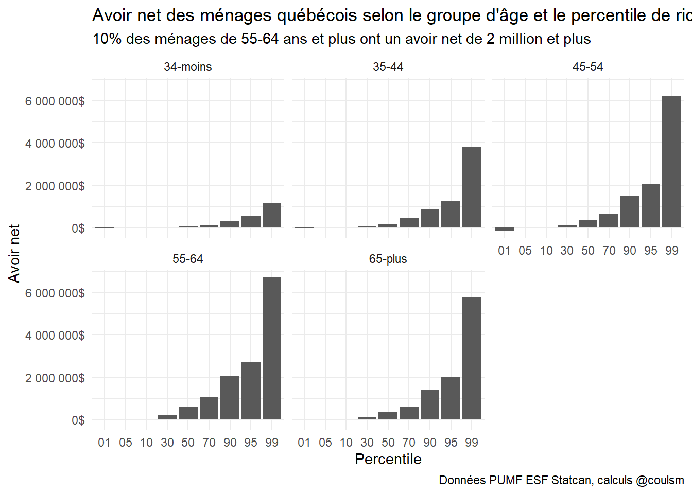{width=672}
:::
:::


# Conclusion

Juste pour être clair:  

Je ne suis pas contre le concept de l'impôt sur la fortune.  

Je suis juste un peu outré par le qualificatif de "ultra riche" pour 10-11% des retraités.  
Je suis aussi un peu outré qu'on alourdirait la charge de travail au moment de préparer les impôt pour  10-15% du monde qui va devoir passer 2 jours à estimer la valeur de sa maison et obtenir la valeur estimée de son fond de pention chaque année pour payer au final peut-être 100$ d'impôt supplémentaire.

Bref, on pourrait peut-être commencer à un niveau plus élevé (mettons 2 millions, chiffre au pif), mais avec un taux plus élevé pour compenser.

Voici nos findings:  

* On n'a pas réussi à trouver la source de données utilisée par Québec Solidaire.  En effet, l'Enquête sur la sécurité des ménages a comme unité de sondage le ménage plutôt que l'individu.  
* On a trouvé des chiffres qui pourraient expliquer leur barême:   
     * 5.2% des personnes seules ont plus de 1 million.
     * 6.8% des couples sans enfants ont plus de *2* millions.
     * Pour les couples avec enfants et les familles monoparentales, c'est 12.8% au dessus de 1 million et 2.8% au dessus de 2 millions.  
     * Sans égard à la taille, ce sont 15.5% des ménages québécois ont un avoir net supérieur à 1 million de dollars. Évidemment, certains de ces ménages ont 2 adultes.
* Le top 5% des ménages québécois ont un avoir net supérieur à 1 941 500$ , sans égard à la taille.
* Chez les 55-64 à l'aube de la retraite ce sont:   
      * 9.6% des personnes seules qui ont plus de 1 million, 
      * 13.3% des couples sans enfants qui ont 2 millions, 
      * 12.9% des couples avec enfants ou des familles monoparentales ont plus de 2 millions.
      * Chez les 55-64, on ne parle donc plus de "We are de 99%" mais plutôt de "We are the 89%-ish".  Mon hypothèse de we are the 80% est donc infirmée, mais c'était un bel effort.
      


