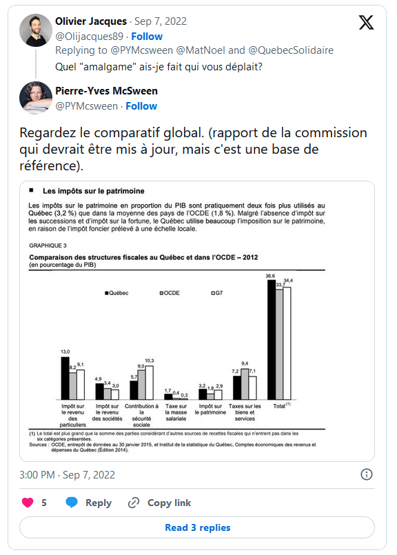
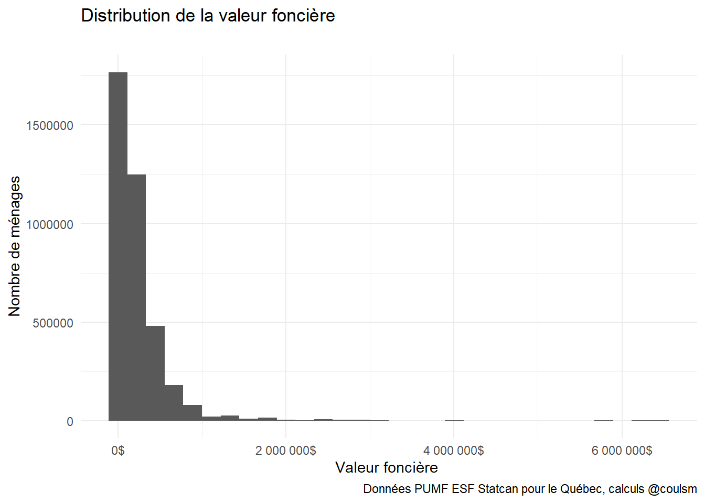
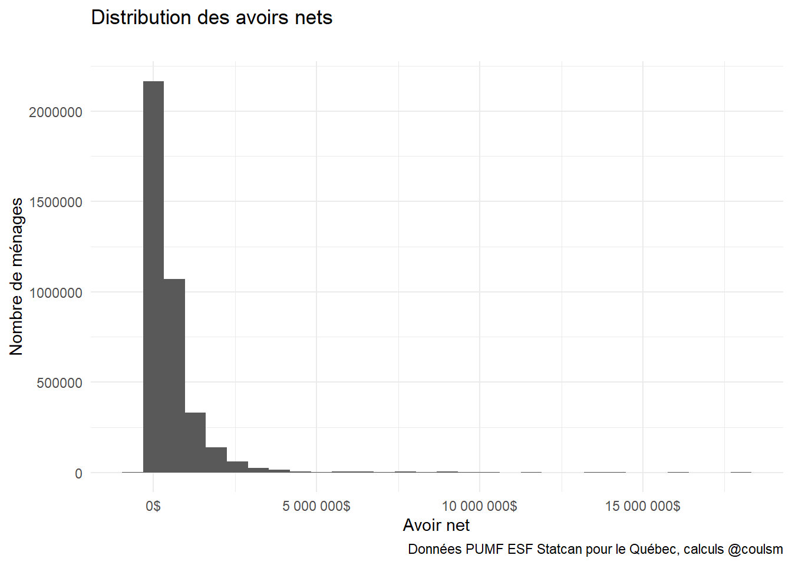
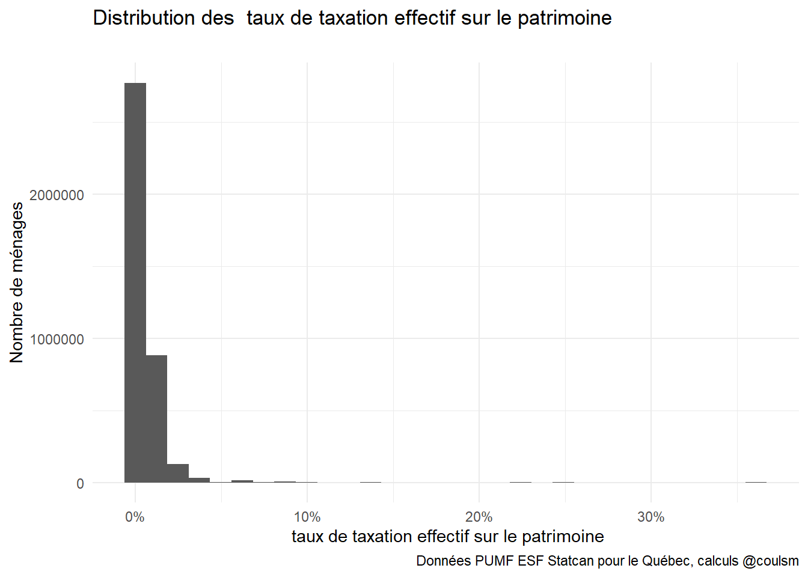
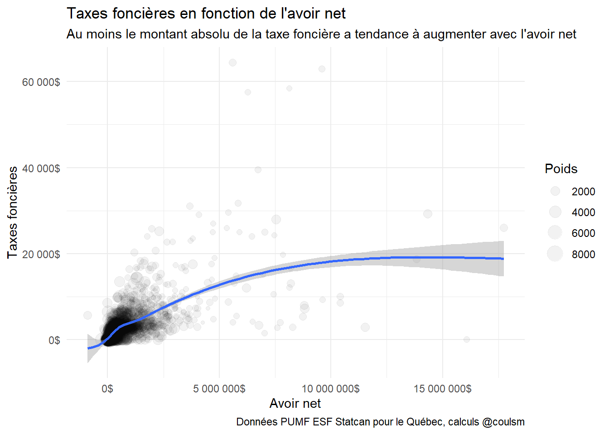
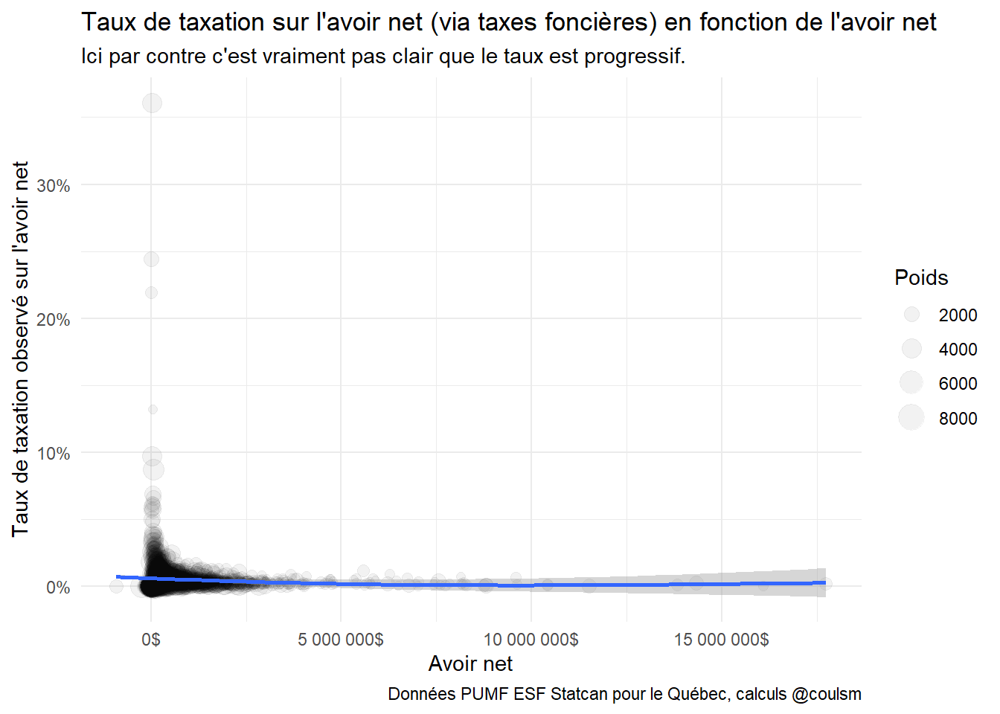
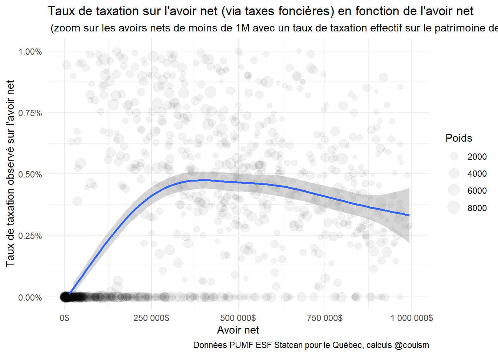
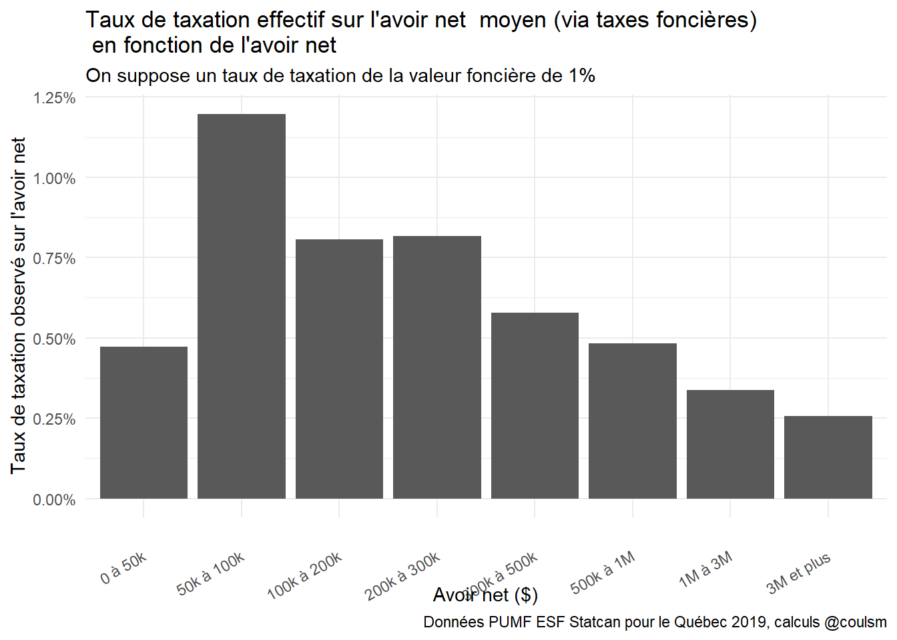
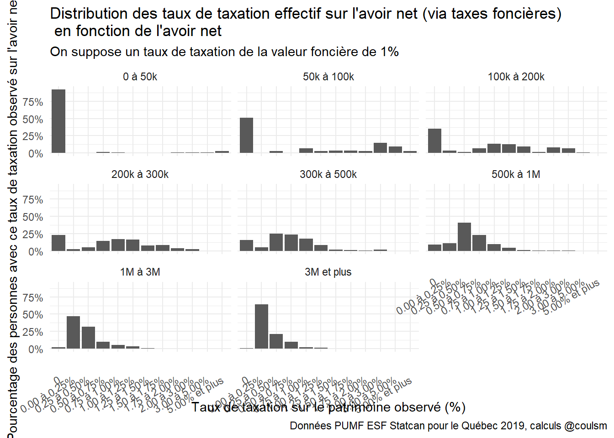

Ça parle beaucoup d'impôt sur le patimoine (ou avoir net) ces temps-ci au Québec

Un échange intéressant entre Pierre-Yves McSween (@PYMcsween) et Olivier Jacques (@OliJacques89) sur twitter m'a fait réaliser que l'impôt foncier ressemble vaguement à un impôt sur le patrimoine.  Quand je dis que je suis un économiste non pratiquant, c'est un bon exemple de mon manque de culture. :)



::: {.cell}

:::

En fait, ce n'est pas un impôt sur l'avoir net, mais un impôt sur l'avoir.  

Si on fait simple et qu'on suppose un taux de taxation foncière  de 1%.

- Le jeune qui vient de mettre tout son argent (60 000\$) en mise fond sur une maison de 300 000$ va payer  3 000$ de taxes foncières. Son taux de taxation "sur le patrimoine" sera de 3 000 / 60 000 = 5%.   

-Son vieux voisin a aussi une maison de 300 000\$.  Il vient de terminer de la payer.  Il n'a aucune autre économie lui non plus.  Son taux de taxation "sur le patrimoine" sera donc de 3 000 / 300 000\$ = 1%.

Le voisin a un avoir net 5x plus élevé, mais il a payé la même taxe en absolu, si bien que son taux de taxation est 5x moins élevé.

Dans mon exemple, on observe qu'il y a un taux de taxation régressif en fonction de l'avoir net.  C'est pas si cool.

La question que je me pose aujourd'hui:
- Est-ce que dans la vraie vie le taux est progressif, uniforme ou régressif?  

On a découvert hier une super source de données:  le PUMF de l'Enquête sur la Sécurité Financière du Statistiques Canada.  

Il comporte les variables suivantes
PWAPRVAL : valeur du domicile principal
PWASTRST : bien immobiliers autres que la reésidence principale 
PWNETWT : valeur nette de l'unité familliale (base de terminaison).  

C'est tout ce que ça nous prend si on fait l'hypothèse d'un taux de taxation uniforme sur les bien immobiliers: 

* On va conserver que les observations pour le Québec.  

* On va calculer `valeur_fonciere` , soit la somme de la valeur du domicile principale et de la valeur des biens immobiliers autre que la résidence principale.  

* On va supposer un taux de taxation sur l'immobilier de 1% pour calculer un "montant de taxes foncières payées".  

* On va calculer le taux de taxe sur la patrimoine en divisant "montant de taxes foncières payées" par la valeur nette de l'unité familiale.  

* Ensuite, on va regarder si le taux de taxation est régressif ou progressif en fonction de la valeur nette de l'unité familiale.  

Pour les gens qui ont un avoir  net négatif mais qui paient quand même des taxes foncières, on va... shit.. trouver ça chien  et faire semblant qu'ils ont rien payé..

Lets' goooo!

# Les données   

[On en a parlé hier](https://www.simoncoulombe.com/2022/09/ultra-riches/), c'était super intéressant, allez voir 


# Les manips   

::: {.cell}

:::

::: {.cell}

:::


Voici à quoi ressemblent les micro-données brutes:

::: {.cell .column-screen-inset-shaded}
::: {.cell-output-display}


```{=html}
<div id="ovsfgwzlgl" style="padding-left:0px;padding-right:0px;padding-top:10px;padding-bottom:10px;overflow-x:auto;overflow-y:auto;width:auto;height:auto;">
<style>#ovsfgwzlgl table {
  font-family: system-ui, 'Segoe UI', Roboto, Helvetica, Arial, sans-serif, 'Apple Color Emoji', 'Segoe UI Emoji', 'Segoe UI Symbol', 'Noto Color Emoji';
  -webkit-font-smoothing: antialiased;
  -moz-osx-font-smoothing: grayscale;
}

#ovsfgwzlgl thead, #ovsfgwzlgl tbody, #ovsfgwzlgl tfoot, #ovsfgwzlgl tr, #ovsfgwzlgl td, #ovsfgwzlgl th {
  border-style: none;
}

#ovsfgwzlgl p {
  margin: 0;
  padding: 0;
}

#ovsfgwzlgl .gt_table {
  display: table;
  border-collapse: collapse;
  line-height: normal;
  margin-left: auto;
  margin-right: auto;
  color: #333333;
  font-size: 16px;
  font-weight: normal;
  font-style: normal;
  background-color: #FFFFFF;
  width: auto;
  border-top-style: solid;
  border-top-width: 2px;
  border-top-color: #A8A8A8;
  border-right-style: none;
  border-right-width: 2px;
  border-right-color: #D3D3D3;
  border-bottom-style: solid;
  border-bottom-width: 2px;
  border-bottom-color: #A8A8A8;
  border-left-style: none;
  border-left-width: 2px;
  border-left-color: #D3D3D3;
}

#ovsfgwzlgl .gt_caption {
  padding-top: 4px;
  padding-bottom: 4px;
}

#ovsfgwzlgl .gt_title {
  color: #333333;
  font-size: 125%;
  font-weight: initial;
  padding-top: 4px;
  padding-bottom: 4px;
  padding-left: 5px;
  padding-right: 5px;
  border-bottom-color: #FFFFFF;
  border-bottom-width: 0;
}

#ovsfgwzlgl .gt_subtitle {
  color: #333333;
  font-size: 85%;
  font-weight: initial;
  padding-top: 3px;
  padding-bottom: 5px;
  padding-left: 5px;
  padding-right: 5px;
  border-top-color: #FFFFFF;
  border-top-width: 0;
}

#ovsfgwzlgl .gt_heading {
  background-color: #FFFFFF;
  text-align: center;
  border-bottom-color: #FFFFFF;
  border-left-style: none;
  border-left-width: 1px;
  border-left-color: #D3D3D3;
  border-right-style: none;
  border-right-width: 1px;
  border-right-color: #D3D3D3;
}

#ovsfgwzlgl .gt_bottom_border {
  border-bottom-style: solid;
  border-bottom-width: 2px;
  border-bottom-color: #D3D3D3;
}

#ovsfgwzlgl .gt_col_headings {
  border-top-style: solid;
  border-top-width: 2px;
  border-top-color: #D3D3D3;
  border-bottom-style: solid;
  border-bottom-width: 2px;
  border-bottom-color: #D3D3D3;
  border-left-style: none;
  border-left-width: 1px;
  border-left-color: #D3D3D3;
  border-right-style: none;
  border-right-width: 1px;
  border-right-color: #D3D3D3;
}

#ovsfgwzlgl .gt_col_heading {
  color: #333333;
  background-color: #FFFFFF;
  font-size: 100%;
  font-weight: normal;
  text-transform: inherit;
  border-left-style: none;
  border-left-width: 1px;
  border-left-color: #D3D3D3;
  border-right-style: none;
  border-right-width: 1px;
  border-right-color: #D3D3D3;
  vertical-align: bottom;
  padding-top: 5px;
  padding-bottom: 6px;
  padding-left: 5px;
  padding-right: 5px;
  overflow-x: hidden;
}

#ovsfgwzlgl .gt_column_spanner_outer {
  color: #333333;
  background-color: #FFFFFF;
  font-size: 100%;
  font-weight: normal;
  text-transform: inherit;
  padding-top: 0;
  padding-bottom: 0;
  padding-left: 4px;
  padding-right: 4px;
}

#ovsfgwzlgl .gt_column_spanner_outer:first-child {
  padding-left: 0;
}

#ovsfgwzlgl .gt_column_spanner_outer:last-child {
  padding-right: 0;
}

#ovsfgwzlgl .gt_column_spanner {
  border-bottom-style: solid;
  border-bottom-width: 2px;
  border-bottom-color: #D3D3D3;
  vertical-align: bottom;
  padding-top: 5px;
  padding-bottom: 5px;
  overflow-x: hidden;
  display: inline-block;
  width: 100%;
}

#ovsfgwzlgl .gt_spanner_row {
  border-bottom-style: hidden;
}

#ovsfgwzlgl .gt_group_heading {
  padding-top: 8px;
  padding-bottom: 8px;
  padding-left: 5px;
  padding-right: 5px;
  color: #333333;
  background-color: #FFFFFF;
  font-size: 100%;
  font-weight: initial;
  text-transform: inherit;
  border-top-style: solid;
  border-top-width: 2px;
  border-top-color: #D3D3D3;
  border-bottom-style: solid;
  border-bottom-width: 2px;
  border-bottom-color: #D3D3D3;
  border-left-style: none;
  border-left-width: 1px;
  border-left-color: #D3D3D3;
  border-right-style: none;
  border-right-width: 1px;
  border-right-color: #D3D3D3;
  vertical-align: middle;
  text-align: left;
}

#ovsfgwzlgl .gt_empty_group_heading {
  padding: 0.5px;
  color: #333333;
  background-color: #FFFFFF;
  font-size: 100%;
  font-weight: initial;
  border-top-style: solid;
  border-top-width: 2px;
  border-top-color: #D3D3D3;
  border-bottom-style: solid;
  border-bottom-width: 2px;
  border-bottom-color: #D3D3D3;
  vertical-align: middle;
}

#ovsfgwzlgl .gt_from_md > :first-child {
  margin-top: 0;
}

#ovsfgwzlgl .gt_from_md > :last-child {
  margin-bottom: 0;
}

#ovsfgwzlgl .gt_row {
  padding-top: 8px;
  padding-bottom: 8px;
  padding-left: 5px;
  padding-right: 5px;
  margin: 10px;
  border-top-style: solid;
  border-top-width: 1px;
  border-top-color: #D3D3D3;
  border-left-style: none;
  border-left-width: 1px;
  border-left-color: #D3D3D3;
  border-right-style: none;
  border-right-width: 1px;
  border-right-color: #D3D3D3;
  vertical-align: middle;
  overflow-x: hidden;
}

#ovsfgwzlgl .gt_stub {
  color: #333333;
  background-color: #FFFFFF;
  font-size: 100%;
  font-weight: initial;
  text-transform: inherit;
  border-right-style: solid;
  border-right-width: 2px;
  border-right-color: #D3D3D3;
  padding-left: 5px;
  padding-right: 5px;
}

#ovsfgwzlgl .gt_stub_row_group {
  color: #333333;
  background-color: #FFFFFF;
  font-size: 100%;
  font-weight: initial;
  text-transform: inherit;
  border-right-style: solid;
  border-right-width: 2px;
  border-right-color: #D3D3D3;
  padding-left: 5px;
  padding-right: 5px;
  vertical-align: top;
}

#ovsfgwzlgl .gt_row_group_first td {
  border-top-width: 2px;
}

#ovsfgwzlgl .gt_row_group_first th {
  border-top-width: 2px;
}

#ovsfgwzlgl .gt_summary_row {
  color: #333333;
  background-color: #FFFFFF;
  text-transform: inherit;
  padding-top: 8px;
  padding-bottom: 8px;
  padding-left: 5px;
  padding-right: 5px;
}

#ovsfgwzlgl .gt_first_summary_row {
  border-top-style: solid;
  border-top-color: #D3D3D3;
}

#ovsfgwzlgl .gt_first_summary_row.thick {
  border-top-width: 2px;
}

#ovsfgwzlgl .gt_last_summary_row {
  padding-top: 8px;
  padding-bottom: 8px;
  padding-left: 5px;
  padding-right: 5px;
  border-bottom-style: solid;
  border-bottom-width: 2px;
  border-bottom-color: #D3D3D3;
}

#ovsfgwzlgl .gt_grand_summary_row {
  color: #333333;
  background-color: #FFFFFF;
  text-transform: inherit;
  padding-top: 8px;
  padding-bottom: 8px;
  padding-left: 5px;
  padding-right: 5px;
}

#ovsfgwzlgl .gt_first_grand_summary_row {
  padding-top: 8px;
  padding-bottom: 8px;
  padding-left: 5px;
  padding-right: 5px;
  border-top-style: double;
  border-top-width: 6px;
  border-top-color: #D3D3D3;
}

#ovsfgwzlgl .gt_last_grand_summary_row_top {
  padding-top: 8px;
  padding-bottom: 8px;
  padding-left: 5px;
  padding-right: 5px;
  border-bottom-style: double;
  border-bottom-width: 6px;
  border-bottom-color: #D3D3D3;
}

#ovsfgwzlgl .gt_striped {
  background-color: rgba(128, 128, 128, 0.05);
}

#ovsfgwzlgl .gt_table_body {
  border-top-style: solid;
  border-top-width: 2px;
  border-top-color: #D3D3D3;
  border-bottom-style: solid;
  border-bottom-width: 2px;
  border-bottom-color: #D3D3D3;
}

#ovsfgwzlgl .gt_footnotes {
  color: #333333;
  background-color: #FFFFFF;
  border-bottom-style: none;
  border-bottom-width: 2px;
  border-bottom-color: #D3D3D3;
  border-left-style: none;
  border-left-width: 2px;
  border-left-color: #D3D3D3;
  border-right-style: none;
  border-right-width: 2px;
  border-right-color: #D3D3D3;
}

#ovsfgwzlgl .gt_footnote {
  margin: 0px;
  font-size: 90%;
  padding-top: 4px;
  padding-bottom: 4px;
  padding-left: 5px;
  padding-right: 5px;
}

#ovsfgwzlgl .gt_sourcenotes {
  color: #333333;
  background-color: #FFFFFF;
  border-bottom-style: none;
  border-bottom-width: 2px;
  border-bottom-color: #D3D3D3;
  border-left-style: none;
  border-left-width: 2px;
  border-left-color: #D3D3D3;
  border-right-style: none;
  border-right-width: 2px;
  border-right-color: #D3D3D3;
}

#ovsfgwzlgl .gt_sourcenote {
  font-size: 90%;
  padding-top: 4px;
  padding-bottom: 4px;
  padding-left: 5px;
  padding-right: 5px;
}

#ovsfgwzlgl .gt_left {
  text-align: left;
}

#ovsfgwzlgl .gt_center {
  text-align: center;
}

#ovsfgwzlgl .gt_right {
  text-align: right;
  font-variant-numeric: tabular-nums;
}

#ovsfgwzlgl .gt_font_normal {
  font-weight: normal;
}

#ovsfgwzlgl .gt_font_bold {
  font-weight: bold;
}

#ovsfgwzlgl .gt_font_italic {
  font-style: italic;
}

#ovsfgwzlgl .gt_super {
  font-size: 65%;
}

#ovsfgwzlgl .gt_footnote_marks {
  font-size: 75%;
  vertical-align: 0.4em;
  position: initial;
}

#ovsfgwzlgl .gt_asterisk {
  font-size: 100%;
  vertical-align: 0;
}

#ovsfgwzlgl .gt_indent_1 {
  text-indent: 5px;
}

#ovsfgwzlgl .gt_indent_2 {
  text-indent: 10px;
}

#ovsfgwzlgl .gt_indent_3 {
  text-indent: 15px;
}

#ovsfgwzlgl .gt_indent_4 {
  text-indent: 20px;
}

#ovsfgwzlgl .gt_indent_5 {
  text-indent: 25px;
}
</style>
<table class="gt_table" data-quarto-disable-processing="false" data-quarto-bootstrap="false">
  <thead>
    <tr class="gt_col_headings">
      <th class="gt_col_heading gt_columns_bottom_border gt_right" rowspan="1" colspan="1" scope="col" id="PWNETWPT">PWNETWPT</th>
      <th class="gt_col_heading gt_columns_bottom_border gt_right" rowspan="1" colspan="1" scope="col" id="PWEIGHT">PWEIGHT</th>
      <th class="gt_col_heading gt_columns_bottom_border gt_right" rowspan="1" colspan="1" scope="col" id="PWAPRVAL">PWAPRVAL</th>
      <th class="gt_col_heading gt_columns_bottom_border gt_right" rowspan="1" colspan="1" scope="col" id="PWASTRST">PWASTRST</th>
      <th class="gt_col_heading gt_columns_bottom_border gt_right" rowspan="1" colspan="1" scope="col" id="PAGEMIEG">PAGEMIEG</th>
      <th class="gt_col_heading gt_columns_bottom_border gt_left" rowspan="1" colspan="1" scope="col" id="gr_age">gr_age</th>
      <th class="gt_col_heading gt_columns_bottom_border gt_right" rowspan="1" colspan="1" scope="col" id="valeur_fonciere">valeur_fonciere</th>
      <th class="gt_col_heading gt_columns_bottom_border gt_right" rowspan="1" colspan="1" scope="col" id="taxes_foncieres">taxes_foncieres</th>
      <th class="gt_col_heading gt_columns_bottom_border gt_right" rowspan="1" colspan="1" scope="col" id="taux_taxation_sur_patrimoine">taux_taxation_sur_patrimoine</th>
    </tr>
  </thead>
  <tbody class="gt_table_body">
    <tr><td headers="PWNETWPT" class="gt_row gt_right">8806000</td>
<td headers="PWEIGHT" class="gt_row gt_right">1393.1613</td>
<td headers="PWAPRVAL" class="gt_row gt_right">800000</td>
<td headers="PWASTRST" class="gt_row gt_right">0</td>
<td headers="PAGEMIEG" class="gt_row gt_right">12</td>
<td headers="gr_age" class="gt_row gt_left">65-plus</td>
<td headers="valeur_fonciere" class="gt_row gt_right">800000</td>
<td headers="taxes_foncieres" class="gt_row gt_right">8000</td>
<td headers="taux_taxation_sur_patrimoine" class="gt_row gt_right">0.0009084715</td></tr>
    <tr><td headers="PWNETWPT" class="gt_row gt_right">155050</td>
<td headers="PWEIGHT" class="gt_row gt_right">2935.6096</td>
<td headers="PWAPRVAL" class="gt_row gt_right">390000</td>
<td headers="PWASTRST" class="gt_row gt_right">0</td>
<td headers="PAGEMIEG" class="gt_row gt_right">04</td>
<td headers="gr_age" class="gt_row gt_left">34-moins</td>
<td headers="valeur_fonciere" class="gt_row gt_right">390000</td>
<td headers="taxes_foncieres" class="gt_row gt_right">3900</td>
<td headers="taux_taxation_sur_patrimoine" class="gt_row gt_right">0.0251531764</td></tr>
    <tr><td headers="PWNETWPT" class="gt_row gt_right">8738950</td>
<td headers="PWEIGHT" class="gt_row gt_right">954.6999</td>
<td headers="PWAPRVAL" class="gt_row gt_right">280000</td>
<td headers="PWASTRST" class="gt_row gt_right">260000</td>
<td headers="PAGEMIEG" class="gt_row gt_right">05</td>
<td headers="gr_age" class="gt_row gt_left">35-44</td>
<td headers="valeur_fonciere" class="gt_row gt_right">540000</td>
<td headers="taxes_foncieres" class="gt_row gt_right">5400</td>
<td headers="taux_taxation_sur_patrimoine" class="gt_row gt_right">0.0006179232</td></tr>
    <tr><td headers="PWNETWPT" class="gt_row gt_right">5005</td>
<td headers="PWEIGHT" class="gt_row gt_right">1367.6644</td>
<td headers="PWAPRVAL" class="gt_row gt_right">0</td>
<td headers="PWASTRST" class="gt_row gt_right">0</td>
<td headers="PAGEMIEG" class="gt_row gt_right">04</td>
<td headers="gr_age" class="gt_row gt_left">34-moins</td>
<td headers="valeur_fonciere" class="gt_row gt_right">0</td>
<td headers="taxes_foncieres" class="gt_row gt_right">0</td>
<td headers="taux_taxation_sur_patrimoine" class="gt_row gt_right">0.0000000000</td></tr>
    <tr><td headers="PWNETWPT" class="gt_row gt_right">73500</td>
<td headers="PWEIGHT" class="gt_row gt_right">1813.3366</td>
<td headers="PWAPRVAL" class="gt_row gt_right">72500</td>
<td headers="PWASTRST" class="gt_row gt_right">0</td>
<td headers="PAGEMIEG" class="gt_row gt_right">14</td>
<td headers="gr_age" class="gt_row gt_left">65-plus</td>
<td headers="valeur_fonciere" class="gt_row gt_right">72500</td>
<td headers="taxes_foncieres" class="gt_row gt_right">725</td>
<td headers="taux_taxation_sur_patrimoine" class="gt_row gt_right">0.0098639456</td></tr>
    <tr><td headers="PWNETWPT" class="gt_row gt_right">1308950</td>
<td headers="PWEIGHT" class="gt_row gt_right">2063.1375</td>
<td headers="PWAPRVAL" class="gt_row gt_right">200000</td>
<td headers="PWASTRST" class="gt_row gt_right">57500</td>
<td headers="PAGEMIEG" class="gt_row gt_right">08</td>
<td headers="gr_age" class="gt_row gt_left">45-54</td>
<td headers="valeur_fonciere" class="gt_row gt_right">257500</td>
<td headers="taxes_foncieres" class="gt_row gt_right">2575</td>
<td headers="taux_taxation_sur_patrimoine" class="gt_row gt_right">0.0019672256</td></tr>
    <tr><td headers="PWNETWPT" class="gt_row gt_right">138050</td>
<td headers="PWEIGHT" class="gt_row gt_right">4314.2599</td>
<td headers="PWAPRVAL" class="gt_row gt_right">0</td>
<td headers="PWASTRST" class="gt_row gt_right">0</td>
<td headers="PAGEMIEG" class="gt_row gt_right">13</td>
<td headers="gr_age" class="gt_row gt_left">65-plus</td>
<td headers="valeur_fonciere" class="gt_row gt_right">0</td>
<td headers="taxes_foncieres" class="gt_row gt_right">0</td>
<td headers="taux_taxation_sur_patrimoine" class="gt_row gt_right">0.0000000000</td></tr>
    <tr><td headers="PWNETWPT" class="gt_row gt_right">117250</td>
<td headers="PWEIGHT" class="gt_row gt_right">1595.1530</td>
<td headers="PWAPRVAL" class="gt_row gt_right">260000</td>
<td headers="PWASTRST" class="gt_row gt_right">0</td>
<td headers="PAGEMIEG" class="gt_row gt_right">04</td>
<td headers="gr_age" class="gt_row gt_left">34-moins</td>
<td headers="valeur_fonciere" class="gt_row gt_right">260000</td>
<td headers="taxes_foncieres" class="gt_row gt_right">2600</td>
<td headers="taux_taxation_sur_patrimoine" class="gt_row gt_right">0.0221748401</td></tr>
    <tr><td headers="PWNETWPT" class="gt_row gt_right">555</td>
<td headers="PWEIGHT" class="gt_row gt_right">3910.7481</td>
<td headers="PWAPRVAL" class="gt_row gt_right">0</td>
<td headers="PWASTRST" class="gt_row gt_right">0</td>
<td headers="PAGEMIEG" class="gt_row gt_right">14</td>
<td headers="gr_age" class="gt_row gt_left">65-plus</td>
<td headers="valeur_fonciere" class="gt_row gt_right">0</td>
<td headers="taxes_foncieres" class="gt_row gt_right">0</td>
<td headers="taux_taxation_sur_patrimoine" class="gt_row gt_right">0.0000000000</td></tr>
    <tr><td headers="PWNETWPT" class="gt_row gt_right">422000</td>
<td headers="PWEIGHT" class="gt_row gt_right">1030.9989</td>
<td headers="PWAPRVAL" class="gt_row gt_right">0</td>
<td headers="PWASTRST" class="gt_row gt_right">0</td>
<td headers="PAGEMIEG" class="gt_row gt_right">11</td>
<td headers="gr_age" class="gt_row gt_left">65-plus</td>
<td headers="valeur_fonciere" class="gt_row gt_right">0</td>
<td headers="taxes_foncieres" class="gt_row gt_right">0</td>
<td headers="taux_taxation_sur_patrimoine" class="gt_row gt_right">0.0000000000</td></tr>
  </tbody>
  
  
</table>
</div>
```


:::
:::


# Exploratory data analysis (en fait on fait juste ça aujourd'hui)   

Ici on va juste regarder la distribution de la valeur foncière, de la valeur nette puis du taux de taxation effectif sur le patrimoine pour s'assurer que tout a du sens.

## Valeur foncière  

Valeurs foncières moyenne


::: {.cell}
::: {.cell-output .cell-output-stdout}

```
[1] "221 938$"
```


:::
:::


Quantiles de valeur foncière  (pondérée)


::: {.cell}
::: {.cell-output-display}


| percentile| valeur_fonciere|
|----------:|---------------:|
|       0.10|               0|
|       0.25|               0|
|       0.40|           26000|
|       0.50|          150000|
|       0.75|          310000|
|       0.90|          520000|
|       0.95|          725000|
|       0.99|         1650000|


:::
:::

::: {.cell}
::: {.cell-output-display}
{width=672}
:::
:::


## Avoir nets

Avoir net moyen


::: {.cell}
::: {.cell-output .cell-output-stdout}

```
[1] "547 451$"
```


:::
:::


Quantiles de avoir net  (pondérée)


::: {.cell}
::: {.cell-output-display}


| percentile| PWNETWPT|
|----------:|--------:|
|       0.10|     2650|
|       0.25|    39450|
|       0.40|   146500|
|       0.50|   245500|
|       0.75|   661250|
|       0.90|  1332500|
|       0.95|  1941500|
|       0.99|  4572700|


:::
:::

Histogram des avoirs nets


::: {.cell}
::: {.cell-output-display}
{width=672}
:::
:::


## Taux de taxation sur le patrimoine   


taux de taxation effectif sur le patrimoine moyen


::: {.cell}
::: {.cell-output .cell-output-stdout}

```
[1] "0.56%"
```


:::
:::


Quantiles de taux de taxation effectif sur le patrimoine  (pondérée)


::: {.cell}
::: {.cell-output-display}


| percentile| taux_taxation_sur_patrimoine|
|----------:|----------------------------:|
|       0.10|                    0.0000000|
|       0.25|                    0.0000000|
|       0.40|                    0.0003764|
|       0.50|                    0.0024785|
|       0.75|                    0.0069550|
|       0.90|                    0.0123395|
|       0.95|                    0.0187879|
|       0.99|                    0.0407830|


:::
:::

Histogram des avoirs nets


::: {.cell}
::: {.cell-output-display}
{width=672}
:::
:::


# Analyse   

C'est ici qu'on va enfin regarder si la taxe foncière est régressive (pourcentage décroît avec l'avoir net) ou progressive (pourcentage accroît avec l'avoir net).

En fait, on pourrait simplement regarder si la part de la valeur foncière dans les avoir nets augmente avec la valeur des avoir nets, mais j'ai envie de travailler avec des dollars..


On va commencer par regarder le montant des taxes foncières en fonction de l'avoir net.


::: {.cell}
::: {.cell-output-display}
{width=672}
:::
:::

Au moins le montant absolu de la taxe foncière a tendance à augmenter avec l'avoir net! 

Voyons maintenant si le taux de taxation du patrimoine a tendance à augmenter avec l'avoir net:


::: {.cell}
::: {.cell-output-display}
{width=672}
:::
:::

Ici par contre c'est vraiment pas clair comment le taux évolue.
Peut-être en zoomant en bas à gauche?


::: {.cell}
::: {.cell-output-display}
{width=672}
:::
:::


Oh!!  C'est intéressant ça.  Ça semble vouloir être progressif jusqu'à environ 300 000\$, puis régressif.

On va faire des buckets, peut-être que ce sera plus clair.


::: {.cell}

:::

::: {.cell}
::: {.cell-output-display}


|avoir_net_bin | taux_taxation_sur_patrimoine_du_bin_moyenne_menage|   n| sum_PWEIGHT| sum_valeur_fonciere| sum_PWNETWPT| sum_taxes_foncieres| taux_taxation_sur_patrimoine_du_bin_moyenne_dollar|
|:-------------|--------------------------------------------------:|---:|-----------:|-------------------:|------------:|-------------------:|--------------------------------------------------:|
|0 à 50k       |                                          0.0047160| 353|   898175.89|             4222250|      5912455|             42222.5|                                          0.0071413|
|50k à 100k    |                                          0.0119654|  98|   235365.02|             8156500|      7351120|             81565.0|                                          0.0110956|
|100k à 200k   |                                          0.0080738| 173|   438963.06|            22568500|     25507620|            225685.0|                                          0.0088477|
|200k à 300k   |                                          0.0081696| 154|   356080.65|            31040250|     38157270|            310402.5|                                          0.0081348|
|300k à 500k   |                                          0.0057910| 229|   482629.51|            55611900|     90927465|            556119.0|                                          0.0061161|
|500k à 1M     |                                          0.0048203| 374|   655769.28|           133407600|    267998705|           1334076.0|                                          0.0049779|
|1M à 3M       |                                          0.0033813| 455|   529757.27|           251354875|    761825150|           2513548.8|                                          0.0032994|
|3M et plus    |                                          0.0025630|  92|    69596.93|           132703000|    531430870|           1327030.0|                                          0.0024971|


:::
:::


Le taux de taxation sur l'avoir net *moyen* semble effectivement régressif à partir de 100 000\$ car son taux décroît à partir de cette valeur.  


::: {.cell}
::: {.cell-output-display}
{width=672}
:::
:::


Mais attention !  Ces moyennes cachent une grande variabilité des taux effectifs.  On observe chez certains "pauvres" (avoir net inférieur à 100 000\$) un taux de taxation sur l'avoir net supérieur à 5%.   Cela arrive lorsque leur valeur foncière est plus de 5x plus élevé que leur avoir net (par exemple, ils ont achet une maison avec une mise de fond de moins de 20% et cela représentait tout leur argent).


::: {.cell}
::: {.cell-output-display}


```{=html}
<div id="robsktxifw" style="padding-left:0px;padding-right:0px;padding-top:10px;padding-bottom:10px;overflow-x:auto;overflow-y:auto;width:auto;height:auto;">
<style>#robsktxifw table {
  font-family: system-ui, 'Segoe UI', Roboto, Helvetica, Arial, sans-serif, 'Apple Color Emoji', 'Segoe UI Emoji', 'Segoe UI Symbol', 'Noto Color Emoji';
  -webkit-font-smoothing: antialiased;
  -moz-osx-font-smoothing: grayscale;
}

#robsktxifw thead, #robsktxifw tbody, #robsktxifw tfoot, #robsktxifw tr, #robsktxifw td, #robsktxifw th {
  border-style: none;
}

#robsktxifw p {
  margin: 0;
  padding: 0;
}

#robsktxifw .gt_table {
  display: table;
  border-collapse: collapse;
  line-height: normal;
  margin-left: auto;
  margin-right: auto;
  color: #333333;
  font-size: 16px;
  font-weight: normal;
  font-style: normal;
  background-color: #FFFFFF;
  width: auto;
  border-top-style: solid;
  border-top-width: 2px;
  border-top-color: #A8A8A8;
  border-right-style: none;
  border-right-width: 2px;
  border-right-color: #D3D3D3;
  border-bottom-style: solid;
  border-bottom-width: 2px;
  border-bottom-color: #A8A8A8;
  border-left-style: none;
  border-left-width: 2px;
  border-left-color: #D3D3D3;
}

#robsktxifw .gt_caption {
  padding-top: 4px;
  padding-bottom: 4px;
}

#robsktxifw .gt_title {
  color: #333333;
  font-size: 125%;
  font-weight: initial;
  padding-top: 4px;
  padding-bottom: 4px;
  padding-left: 5px;
  padding-right: 5px;
  border-bottom-color: #FFFFFF;
  border-bottom-width: 0;
}

#robsktxifw .gt_subtitle {
  color: #333333;
  font-size: 85%;
  font-weight: initial;
  padding-top: 3px;
  padding-bottom: 5px;
  padding-left: 5px;
  padding-right: 5px;
  border-top-color: #FFFFFF;
  border-top-width: 0;
}

#robsktxifw .gt_heading {
  background-color: #FFFFFF;
  text-align: center;
  border-bottom-color: #FFFFFF;
  border-left-style: none;
  border-left-width: 1px;
  border-left-color: #D3D3D3;
  border-right-style: none;
  border-right-width: 1px;
  border-right-color: #D3D3D3;
}

#robsktxifw .gt_bottom_border {
  border-bottom-style: solid;
  border-bottom-width: 2px;
  border-bottom-color: #D3D3D3;
}

#robsktxifw .gt_col_headings {
  border-top-style: solid;
  border-top-width: 2px;
  border-top-color: #D3D3D3;
  border-bottom-style: solid;
  border-bottom-width: 2px;
  border-bottom-color: #D3D3D3;
  border-left-style: none;
  border-left-width: 1px;
  border-left-color: #D3D3D3;
  border-right-style: none;
  border-right-width: 1px;
  border-right-color: #D3D3D3;
}

#robsktxifw .gt_col_heading {
  color: #333333;
  background-color: #FFFFFF;
  font-size: 100%;
  font-weight: normal;
  text-transform: inherit;
  border-left-style: none;
  border-left-width: 1px;
  border-left-color: #D3D3D3;
  border-right-style: none;
  border-right-width: 1px;
  border-right-color: #D3D3D3;
  vertical-align: bottom;
  padding-top: 5px;
  padding-bottom: 6px;
  padding-left: 5px;
  padding-right: 5px;
  overflow-x: hidden;
}

#robsktxifw .gt_column_spanner_outer {
  color: #333333;
  background-color: #FFFFFF;
  font-size: 100%;
  font-weight: normal;
  text-transform: inherit;
  padding-top: 0;
  padding-bottom: 0;
  padding-left: 4px;
  padding-right: 4px;
}

#robsktxifw .gt_column_spanner_outer:first-child {
  padding-left: 0;
}

#robsktxifw .gt_column_spanner_outer:last-child {
  padding-right: 0;
}

#robsktxifw .gt_column_spanner {
  border-bottom-style: solid;
  border-bottom-width: 2px;
  border-bottom-color: #D3D3D3;
  vertical-align: bottom;
  padding-top: 5px;
  padding-bottom: 5px;
  overflow-x: hidden;
  display: inline-block;
  width: 100%;
}

#robsktxifw .gt_spanner_row {
  border-bottom-style: hidden;
}

#robsktxifw .gt_group_heading {
  padding-top: 8px;
  padding-bottom: 8px;
  padding-left: 5px;
  padding-right: 5px;
  color: #333333;
  background-color: #FFFFFF;
  font-size: 100%;
  font-weight: initial;
  text-transform: inherit;
  border-top-style: solid;
  border-top-width: 2px;
  border-top-color: #D3D3D3;
  border-bottom-style: solid;
  border-bottom-width: 2px;
  border-bottom-color: #D3D3D3;
  border-left-style: none;
  border-left-width: 1px;
  border-left-color: #D3D3D3;
  border-right-style: none;
  border-right-width: 1px;
  border-right-color: #D3D3D3;
  vertical-align: middle;
  text-align: left;
}

#robsktxifw .gt_empty_group_heading {
  padding: 0.5px;
  color: #333333;
  background-color: #FFFFFF;
  font-size: 100%;
  font-weight: initial;
  border-top-style: solid;
  border-top-width: 2px;
  border-top-color: #D3D3D3;
  border-bottom-style: solid;
  border-bottom-width: 2px;
  border-bottom-color: #D3D3D3;
  vertical-align: middle;
}

#robsktxifw .gt_from_md > :first-child {
  margin-top: 0;
}

#robsktxifw .gt_from_md > :last-child {
  margin-bottom: 0;
}

#robsktxifw .gt_row {
  padding-top: 8px;
  padding-bottom: 8px;
  padding-left: 5px;
  padding-right: 5px;
  margin: 10px;
  border-top-style: solid;
  border-top-width: 1px;
  border-top-color: #D3D3D3;
  border-left-style: none;
  border-left-width: 1px;
  border-left-color: #D3D3D3;
  border-right-style: none;
  border-right-width: 1px;
  border-right-color: #D3D3D3;
  vertical-align: middle;
  overflow-x: hidden;
}

#robsktxifw .gt_stub {
  color: #333333;
  background-color: #FFFFFF;
  font-size: 100%;
  font-weight: initial;
  text-transform: inherit;
  border-right-style: solid;
  border-right-width: 2px;
  border-right-color: #D3D3D3;
  padding-left: 5px;
  padding-right: 5px;
}

#robsktxifw .gt_stub_row_group {
  color: #333333;
  background-color: #FFFFFF;
  font-size: 100%;
  font-weight: initial;
  text-transform: inherit;
  border-right-style: solid;
  border-right-width: 2px;
  border-right-color: #D3D3D3;
  padding-left: 5px;
  padding-right: 5px;
  vertical-align: top;
}

#robsktxifw .gt_row_group_first td {
  border-top-width: 2px;
}

#robsktxifw .gt_row_group_first th {
  border-top-width: 2px;
}

#robsktxifw .gt_summary_row {
  color: #333333;
  background-color: #FFFFFF;
  text-transform: inherit;
  padding-top: 8px;
  padding-bottom: 8px;
  padding-left: 5px;
  padding-right: 5px;
}

#robsktxifw .gt_first_summary_row {
  border-top-style: solid;
  border-top-color: #D3D3D3;
}

#robsktxifw .gt_first_summary_row.thick {
  border-top-width: 2px;
}

#robsktxifw .gt_last_summary_row {
  padding-top: 8px;
  padding-bottom: 8px;
  padding-left: 5px;
  padding-right: 5px;
  border-bottom-style: solid;
  border-bottom-width: 2px;
  border-bottom-color: #D3D3D3;
}

#robsktxifw .gt_grand_summary_row {
  color: #333333;
  background-color: #FFFFFF;
  text-transform: inherit;
  padding-top: 8px;
  padding-bottom: 8px;
  padding-left: 5px;
  padding-right: 5px;
}

#robsktxifw .gt_first_grand_summary_row {
  padding-top: 8px;
  padding-bottom: 8px;
  padding-left: 5px;
  padding-right: 5px;
  border-top-style: double;
  border-top-width: 6px;
  border-top-color: #D3D3D3;
}

#robsktxifw .gt_last_grand_summary_row_top {
  padding-top: 8px;
  padding-bottom: 8px;
  padding-left: 5px;
  padding-right: 5px;
  border-bottom-style: double;
  border-bottom-width: 6px;
  border-bottom-color: #D3D3D3;
}

#robsktxifw .gt_striped {
  background-color: rgba(128, 128, 128, 0.05);
}

#robsktxifw .gt_table_body {
  border-top-style: solid;
  border-top-width: 2px;
  border-top-color: #D3D3D3;
  border-bottom-style: solid;
  border-bottom-width: 2px;
  border-bottom-color: #D3D3D3;
}

#robsktxifw .gt_footnotes {
  color: #333333;
  background-color: #FFFFFF;
  border-bottom-style: none;
  border-bottom-width: 2px;
  border-bottom-color: #D3D3D3;
  border-left-style: none;
  border-left-width: 2px;
  border-left-color: #D3D3D3;
  border-right-style: none;
  border-right-width: 2px;
  border-right-color: #D3D3D3;
}

#robsktxifw .gt_footnote {
  margin: 0px;
  font-size: 90%;
  padding-top: 4px;
  padding-bottom: 4px;
  padding-left: 5px;
  padding-right: 5px;
}

#robsktxifw .gt_sourcenotes {
  color: #333333;
  background-color: #FFFFFF;
  border-bottom-style: none;
  border-bottom-width: 2px;
  border-bottom-color: #D3D3D3;
  border-left-style: none;
  border-left-width: 2px;
  border-left-color: #D3D3D3;
  border-right-style: none;
  border-right-width: 2px;
  border-right-color: #D3D3D3;
}

#robsktxifw .gt_sourcenote {
  font-size: 90%;
  padding-top: 4px;
  padding-bottom: 4px;
  padding-left: 5px;
  padding-right: 5px;
}

#robsktxifw .gt_left {
  text-align: left;
}

#robsktxifw .gt_center {
  text-align: center;
}

#robsktxifw .gt_right {
  text-align: right;
  font-variant-numeric: tabular-nums;
}

#robsktxifw .gt_font_normal {
  font-weight: normal;
}

#robsktxifw .gt_font_bold {
  font-weight: bold;
}

#robsktxifw .gt_font_italic {
  font-style: italic;
}

#robsktxifw .gt_super {
  font-size: 65%;
}

#robsktxifw .gt_footnote_marks {
  font-size: 75%;
  vertical-align: 0.4em;
  position: initial;
}

#robsktxifw .gt_asterisk {
  font-size: 100%;
  vertical-align: 0;
}

#robsktxifw .gt_indent_1 {
  text-indent: 5px;
}

#robsktxifw .gt_indent_2 {
  text-indent: 10px;
}

#robsktxifw .gt_indent_3 {
  text-indent: 15px;
}

#robsktxifw .gt_indent_4 {
  text-indent: 20px;
}

#robsktxifw .gt_indent_5 {
  text-indent: 25px;
}
</style>
<table class="gt_table" data-quarto-disable-processing="false" data-quarto-bootstrap="false">
  <caption>Données PUMF ESF Statcan pour le Québec 2019, calculs @coulsm</caption>
  <thead>
    <tr class="gt_heading">
      <td colspan="13" class="gt_heading gt_title gt_font_normal" style>Distribution des taux effectifs de taxation sur l'avoir net  en fonction de l'avoir net  </td>
    </tr>
    <tr class="gt_heading">
      <td colspan="13" class="gt_heading gt_subtitle gt_font_normal gt_bottom_border" style>Bien que le taux moyen effectif observé chez le groupe le plus pauvre (0 à 50 000$) soit de seulement 0.472% car plusieurs (92.4%) d'entre eux ne possèdent pas d'immobilier, plusieurs (2.8%) d'entre eux font face à un taux supérieur à 5%.</td>
    </tr>
    <tr class="gt_col_headings">
      <th class="gt_col_heading gt_columns_bottom_border gt_left" rowspan="1" colspan="1" scope="col" id=""></th>
      <th class="gt_col_heading gt_columns_bottom_border gt_right" rowspan="1" colspan="1" scope="col" id="0">0</th>
      <th class="gt_col_heading gt_columns_bottom_border gt_right" rowspan="1" colspan="1" scope="col" id="0.00 à 0.25%">0.00 à 0.25%</th>
      <th class="gt_col_heading gt_columns_bottom_border gt_right" rowspan="1" colspan="1" scope="col" id="0.25 à 0.50%">0.25 à 0.50%</th>
      <th class="gt_col_heading gt_columns_bottom_border gt_right" rowspan="1" colspan="1" scope="col" id="0.50 à 0.75%">0.50 à 0.75%</th>
      <th class="gt_col_heading gt_columns_bottom_border gt_right" rowspan="1" colspan="1" scope="col" id="0.75 à 1.00%">0.75 à 1.00%</th>
      <th class="gt_col_heading gt_columns_bottom_border gt_right" rowspan="1" colspan="1" scope="col" id="1.00 à 1.25%">1.00 à 1.25%</th>
      <th class="gt_col_heading gt_columns_bottom_border gt_right" rowspan="1" colspan="1" scope="col" id="1.25 à 1.50%">1.25 à 1.50%</th>
      <th class="gt_col_heading gt_columns_bottom_border gt_right" rowspan="1" colspan="1" scope="col" id="1.50 à 1.75%">1.50 à 1.75%</th>
      <th class="gt_col_heading gt_columns_bottom_border gt_right" rowspan="1" colspan="1" scope="col" id="1.75 à 2.00%">1.75 à 2.00%</th>
      <th class="gt_col_heading gt_columns_bottom_border gt_right" rowspan="1" colspan="1" scope="col" id="2.00 à 3.00%">2.00 à 3.00%</th>
      <th class="gt_col_heading gt_columns_bottom_border gt_right" rowspan="1" colspan="1" scope="col" id="3.00 à 5.00%">3.00 à 5.00%</th>
      <th class="gt_col_heading gt_columns_bottom_border gt_right" rowspan="1" colspan="1" scope="col" id="5.00% et plus">5.00% et plus</th>
    </tr>
  </thead>
  <tbody class="gt_table_body">
    <tr><th id="stub_1_1" scope="row" class="gt_row gt_center gt_stub">0 à 50k</th>
<td headers="stub_1_1 0" class="gt_row gt_right">92.4%</td>
<td headers="stub_1_1 0.00 à 0.25%" class="gt_row gt_right">0.0%</td>
<td headers="stub_1_1 0.25 à 0.50%" class="gt_row gt_right">0.3%</td>
<td headers="stub_1_1 0.50 à 0.75%" class="gt_row gt_right">1.2%</td>
<td headers="stub_1_1 0.75 à 1.00%" class="gt_row gt_right">0.6%</td>
<td headers="stub_1_1 1.00 à 1.25%" class="gt_row gt_right">0.0%</td>
<td headers="stub_1_1 1.25 à 1.50%" class="gt_row gt_right">0.2%</td>
<td headers="stub_1_1 1.50 à 1.75%" class="gt_row gt_right">0.0%</td>
<td headers="stub_1_1 1.75 à 2.00%" class="gt_row gt_right">0.6%</td>
<td headers="stub_1_1 2.00 à 3.00%" class="gt_row gt_right">0.7%</td>
<td headers="stub_1_1 3.00 à 5.00%" class="gt_row gt_right">1.1%</td>
<td headers="stub_1_1 5.00% et plus" class="gt_row gt_right">2.8%</td></tr>
    <tr><th id="stub_1_2" scope="row" class="gt_row gt_center gt_stub">50k à 100k</th>
<td headers="stub_1_2 0" class="gt_row gt_right">51.4%</td>
<td headers="stub_1_2 0.00 à 0.25%" class="gt_row gt_right">0.0%</td>
<td headers="stub_1_2 0.25 à 0.50%" class="gt_row gt_right">2.5%</td>
<td headers="stub_1_2 0.50 à 0.75%" class="gt_row gt_right">0.0%</td>
<td headers="stub_1_2 0.75 à 1.00%" class="gt_row gt_right">6.8%</td>
<td headers="stub_1_2 1.00 à 1.25%" class="gt_row gt_right">3.1%</td>
<td headers="stub_1_2 1.25 à 1.50%" class="gt_row gt_right">3.1%</td>
<td headers="stub_1_2 1.50 à 1.75%" class="gt_row gt_right">3.5%</td>
<td headers="stub_1_2 1.75 à 2.00%" class="gt_row gt_right">2.5%</td>
<td headers="stub_1_2 2.00 à 3.00%" class="gt_row gt_right">14.9%</td>
<td headers="stub_1_2 3.00 à 5.00%" class="gt_row gt_right">9.3%</td>
<td headers="stub_1_2 5.00% et plus" class="gt_row gt_right">2.9%</td></tr>
    <tr><th id="stub_1_3" scope="row" class="gt_row gt_center gt_stub">100k à 200k</th>
<td headers="stub_1_3 0" class="gt_row gt_right">35.2%</td>
<td headers="stub_1_3 0.00 à 0.25%" class="gt_row gt_right">3.1%</td>
<td headers="stub_1_3 0.25 à 0.50%" class="gt_row gt_right">1.6%</td>
<td headers="stub_1_3 0.50 à 0.75%" class="gt_row gt_right">6.4%</td>
<td headers="stub_1_3 0.75 à 1.00%" class="gt_row gt_right">13.5%</td>
<td headers="stub_1_3 1.00 à 1.25%" class="gt_row gt_right">13.0%</td>
<td headers="stub_1_3 1.25 à 1.50%" class="gt_row gt_right">9.7%</td>
<td headers="stub_1_3 1.50 à 1.75%" class="gt_row gt_right">1.5%</td>
<td headers="stub_1_3 1.75 à 2.00%" class="gt_row gt_right">8.0%</td>
<td headers="stub_1_3 2.00 à 3.00%" class="gt_row gt_right">7.0%</td>
<td headers="stub_1_3 3.00 à 5.00%" class="gt_row gt_right">1.0%</td>
<td headers="stub_1_3 5.00% et plus" class="gt_row gt_right">0.0%</td></tr>
    <tr><th id="stub_1_4" scope="row" class="gt_row gt_center gt_stub">200k à 300k</th>
<td headers="stub_1_4 0" class="gt_row gt_right">23.0%</td>
<td headers="stub_1_4 0.00 à 0.25%" class="gt_row gt_right">2.2%</td>
<td headers="stub_1_4 0.25 à 0.50%" class="gt_row gt_right">4.8%</td>
<td headers="stub_1_4 0.50 à 0.75%" class="gt_row gt_right">14.4%</td>
<td headers="stub_1_4 0.75 à 1.00%" class="gt_row gt_right">16.7%</td>
<td headers="stub_1_4 1.00 à 1.25%" class="gt_row gt_right">16.5%</td>
<td headers="stub_1_4 1.25 à 1.50%" class="gt_row gt_right">7.9%</td>
<td headers="stub_1_4 1.50 à 1.75%" class="gt_row gt_right">8.6%</td>
<td headers="stub_1_4 1.75 à 2.00%" class="gt_row gt_right">3.5%</td>
<td headers="stub_1_4 2.00 à 3.00%" class="gt_row gt_right">2.5%</td>
<td headers="stub_1_4 3.00 à 5.00%" class="gt_row gt_right">0.0%</td>
<td headers="stub_1_4 5.00% et plus" class="gt_row gt_right">0.0%</td></tr>
    <tr><th id="stub_1_5" scope="row" class="gt_row gt_center gt_stub">300k à 500k</th>
<td headers="stub_1_5 0" class="gt_row gt_right">15.5%</td>
<td headers="stub_1_5 0.00 à 0.25%" class="gt_row gt_right">5.1%</td>
<td headers="stub_1_5 0.25 à 0.50%" class="gt_row gt_right">25.2%</td>
<td headers="stub_1_5 0.50 à 0.75%" class="gt_row gt_right">23.6%</td>
<td headers="stub_1_5 0.75 à 1.00%" class="gt_row gt_right">17.6%</td>
<td headers="stub_1_5 1.00 à 1.25%" class="gt_row gt_right">8.3%</td>
<td headers="stub_1_5 1.25 à 1.50%" class="gt_row gt_right">1.7%</td>
<td headers="stub_1_5 1.50 à 1.75%" class="gt_row gt_right">0.8%</td>
<td headers="stub_1_5 1.75 à 2.00%" class="gt_row gt_right">0.4%</td>
<td headers="stub_1_5 2.00 à 3.00%" class="gt_row gt_right">1.7%</td>
<td headers="stub_1_5 3.00 à 5.00%" class="gt_row gt_right">0.0%</td>
<td headers="stub_1_5 5.00% et plus" class="gt_row gt_right">0.0%</td></tr>
    <tr><th id="stub_1_6" scope="row" class="gt_row gt_center gt_stub">500k à 1M</th>
<td headers="stub_1_6 0" class="gt_row gt_right">9.1%</td>
<td headers="stub_1_6 0.00 à 0.25%" class="gt_row gt_right">10.9%</td>
<td headers="stub_1_6 0.25 à 0.50%" class="gt_row gt_right">40.7%</td>
<td headers="stub_1_6 0.50 à 0.75%" class="gt_row gt_right">23.1%</td>
<td headers="stub_1_6 0.75 à 1.00%" class="gt_row gt_right">9.3%</td>
<td headers="stub_1_6 1.00 à 1.25%" class="gt_row gt_right">4.1%</td>
<td headers="stub_1_6 1.25 à 1.50%" class="gt_row gt_right">1.1%</td>
<td headers="stub_1_6 1.50 à 1.75%" class="gt_row gt_right">0.6%</td>
<td headers="stub_1_6 1.75 à 2.00%" class="gt_row gt_right">0.6%</td>
<td headers="stub_1_6 2.00 à 3.00%" class="gt_row gt_right">0.4%</td>
<td headers="stub_1_6 3.00 à 5.00%" class="gt_row gt_right">0.0%</td>
<td headers="stub_1_6 5.00% et plus" class="gt_row gt_right">0.0%</td></tr>
    <tr><th id="stub_1_7" scope="row" class="gt_row gt_center gt_stub">1M à 3M</th>
<td headers="stub_1_7 0" class="gt_row gt_right">2.1%</td>
<td headers="stub_1_7 0.00 à 0.25%" class="gt_row gt_right">47.3%</td>
<td headers="stub_1_7 0.25 à 0.50%" class="gt_row gt_right">31.4%</td>
<td headers="stub_1_7 0.50 à 0.75%" class="gt_row gt_right">9.6%</td>
<td headers="stub_1_7 0.75 à 1.00%" class="gt_row gt_right">5.4%</td>
<td headers="stub_1_7 1.00 à 1.25%" class="gt_row gt_right">3.6%</td>
<td headers="stub_1_7 1.25 à 1.50%" class="gt_row gt_right">0.5%</td>
<td headers="stub_1_7 1.50 à 1.75%" class="gt_row gt_right">0.2%</td>
<td headers="stub_1_7 1.75 à 2.00%" class="gt_row gt_right">0.0%</td>
<td headers="stub_1_7 2.00 à 3.00%" class="gt_row gt_right">0.0%</td>
<td headers="stub_1_7 3.00 à 5.00%" class="gt_row gt_right">0.0%</td>
<td headers="stub_1_7 5.00% et plus" class="gt_row gt_right">0.0%</td></tr>
    <tr><th id="stub_1_8" scope="row" class="gt_row gt_center gt_stub">3M et plus</th>
<td headers="stub_1_8 0" class="gt_row gt_right">0.8%</td>
<td headers="stub_1_8 0.00 à 0.25%" class="gt_row gt_right">64.3%</td>
<td headers="stub_1_8 0.25 à 0.50%" class="gt_row gt_right">21.3%</td>
<td headers="stub_1_8 0.50 à 0.75%" class="gt_row gt_right">9.9%</td>
<td headers="stub_1_8 0.75 à 1.00%" class="gt_row gt_right">2.1%</td>
<td headers="stub_1_8 1.00 à 1.25%" class="gt_row gt_right">1.6%</td>
<td headers="stub_1_8 1.25 à 1.50%" class="gt_row gt_right">0.0%</td>
<td headers="stub_1_8 1.50 à 1.75%" class="gt_row gt_right">0.0%</td>
<td headers="stub_1_8 1.75 à 2.00%" class="gt_row gt_right">0.0%</td>
<td headers="stub_1_8 2.00 à 3.00%" class="gt_row gt_right">0.0%</td>
<td headers="stub_1_8 3.00 à 5.00%" class="gt_row gt_right">0.0%</td>
<td headers="stub_1_8 5.00% et plus" class="gt_row gt_right">0.0%</td></tr>
  </tbody>
  
  
</table>
</div>
```


:::
:::


ou, sous forme graphique: 


::: {.cell}
::: {.cell-output-display}
{width=672}
:::
:::


# Conclusion   

Ok! 
C'est super cool.
La taxe foncière serait une taxe régressive (en fonction de l'avoir net) jusqu'à environ 100 000\$, puis décroît tranquillement.

Mais attention, c'est loin d'être uniforme.   Environ 3% des ménages plus pauvres (ceux en bas de 100 000\$) fait face à des taux de taxation effectif

C'est dû au fait que les immeubles représentent une plus grande part des avoirs nets des "pauvres" qui valent moins de 100 000\$.


