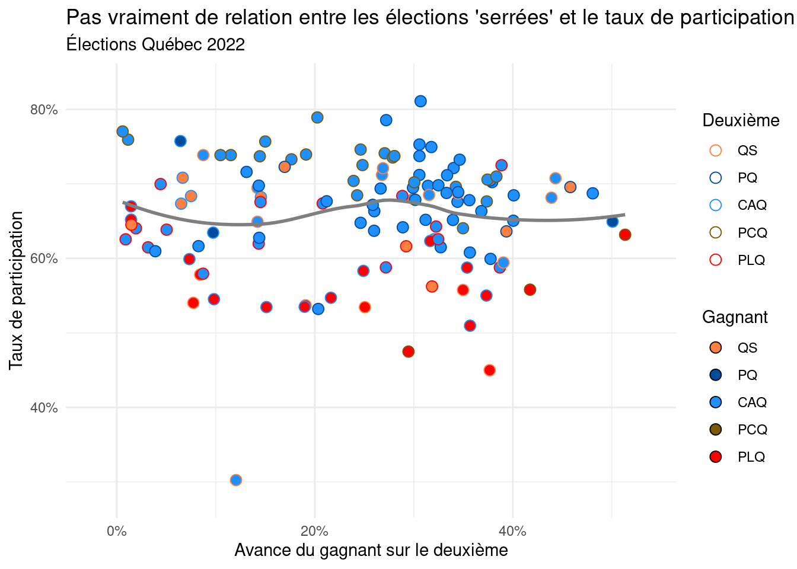
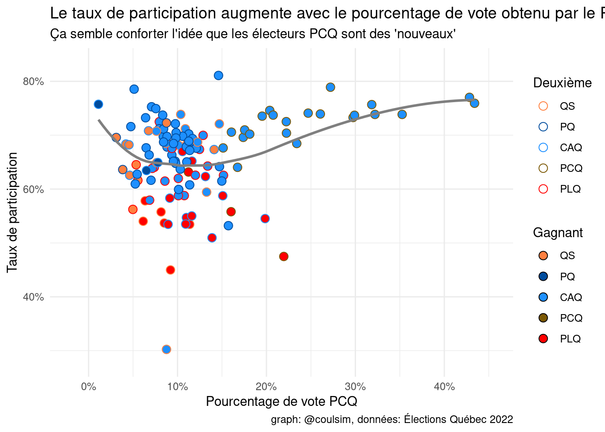

Question:  Est-ce que le taux de participation est corrélée avec le fait d'avoir une élection "serrée" dans une circonscription?

Réponse : pas vraiment.

Nouvelle hypothèse: peut-être qu'On devrait mettre le nombre de victoires du parti dominant dans les 10 dernières élections en X.


données proviennent d'ici:
https://www.dgeq.org/donnees.html

on utilise 
https://www.dgeq.org/circonscriptions.csv
pour le taux de participation et 
candidats.csv
pour le nombre de votes des candidats.


::: {.cell}

:::

::: {.cell}

:::

::: {.cell}
::: {.cell-output-display}
{width=672}
:::
:::


Le même graphique mais interactif pour pouvoir identifier les circonscriptions (mettez votre curseur vis à vis un point pour identifier la circonscription).


::: {.cell}
::: {.cell-output-display}


```{=html}
<div id="htmlwidget-ca381c2045961714589e" style="width:100%;height:480px;" class="widgetframe html-widget"></div>
<script type="application/json" data-for="htmlwidget-ca381c2045961714589e">{"x":{"url":"index.ca-fr_files/figure-html//widgets/widget_unnamed-chunk-4.html","options":{"xdomain":"*","allowfullscreen":false,"lazyload":false}},"evals":[],"jsHooks":[]}</script>
```


:::
:::


Nouvelle Hypothèse: est-ce que le taux de participation augmente avec le pourcentage de vote obtenu par le PCQ ?  Si oui, ça solidifierait l'idée que les électeurs du PCQ sont des nouveaux électeurs qui s'abstenaient dans le passé.

Résultat: on dirait que oui!! 


::: {.cell}
::: {.cell-output-display}
{width=672}
:::
:::

::: {.cell}
::: {.cell-output-display}


```{=html}
<div id="htmlwidget-7588375a6aebc1c05093" style="width:100%;height:480px;" class="widgetframe html-widget"></div>
<script type="application/json" data-for="htmlwidget-7588375a6aebc1c05093">{"x":{"url":"index.ca-fr_files/figure-html//widgets/widget_unnamed-chunk-6.html","options":{"xdomain":"*","allowfullscreen":false,"lazyload":false}},"evals":[],"jsHooks":[]}</script>
```


:::
:::
