# Objective   

I want to implement a tweedie regression similar to what one would face in the insurance industry using the {tidymodels} ecosystem.  

Some context:  I built my first tweedie regression model [three years ago](https://www.simoncoulombe.com/2020/03/tweedie-vs-poisson-gamma/).  That blog post was also the first time I used the `recipes` and `rsample` packages and I have been a huge fan since then.  However, I delayed trying  `parsnip` and `workflows` packages until today because  I felt that many of the specifics of my models were hard to implement using these packages.  


Here's a list of "new to me" stuff I do in the code below that work:   


* use `rsample`functions `group_initial_split()` and `group_vfold_cv()`  to do a "grouped" train/test data split. This is often required when using insurance data because a given `policy_id` will have multiple rows and I want all rows for a given policy to be either in train or test rather than spread all over the place,    
* use case weights  (in my case, `exposure`),  
* use `embed::step_lencode_glm()` to replace high-cardinality variables with embedded values,    
* use  `GLM`, `GAM`, `xgboost` and `lightgbm`  model specifications and check that the output is the same as fitting the models outside of tidymodels.  Spoiler : for GAMs you need to pass a formula with the `add_model()`  or the `update_workflow_model()` functions,  
* create `tweedie` regressions and check that the output is the same as what I would get by fitting the models outside of tidymodels .  
* use workflow sets to apply the same pre-processors (recipe or formula) to a bunch of model specifications and pick the best one using cross validation.   bonus: tune some hyperparameters at the same time.  

Things I would like to figure out eventually:

* is **weighted** normalized gini  available?   Useful when evaluating tweedie regression.  (order by predicted annual loss, but weight with exposure).  As used in the "fire peril loss cost kaggle" (https://www.kaggle.com/c/liberty-mutual-fire-peril/discussion/9880) or seen in this yardstick issue  (https://github.com/tidymodels/yardstick/issues/442).
* figure out a way to use GAMs with splines when using a recipe pre-processor (how can I craft a formula  when I dont know the variable names created by the recipe step_dummy and step_other functions  and these variables could change for each resample?,
* how to weight records using `exposure` when creating the train/test split and the resamples so that all resamples have the same total exposure rather than the same number of records,      
* figure out a way to use case weights in `lightgbm`,   
* create `poisson` and `gamma` regressions (should be similar to tweedie, but I'm out of time).  


Let's get started!    

# The data   

Copying from my 2020 post, here is the description of the data:   


The dataCar data from the `insuranceData` package.  It contains 67 856 one-year vehicle insurance policies taken out in 2004 or 2005.   It originally came with the book [Generalized Linear Models for Insurance Data (2008)](http://www.businessandeconomics.mq.edu.au/our_departments/Applied_Finance_and_Actuarial_Studies/research/books/GLMsforInsuranceData).

The presence of a claim is indicated by the `clm` (0 or 1) , which indicates that there is at least one claim.  We will rename the variable to `has_claim`.

The total dollar value of claims for a given period is  `claimcst0`, which we will rename to `dollar_loss`.  We will divide it by the exposure to obtain `loss_cost`, the dollar loss per year.  

The `exposure` variable  represents the "number of years of exposure" and is used as the case weight variable.  It is bound between 0 and 1.   

The independent variables are as follow:  

* `veh_value`, the vehicle value in tens of thousand of dollars,  
* `veh_body`, vehicle body, coded as 13 different values:  BUS CONVT COUPE HBACK HDTOP MCARA MIBUS PANVN RDSTR SEDAN STNWG TRUCK UTE,  
* `veh_age`, 1 (youngest), 2, 3, 4,   
* `gender`, a factor with levels F M,   
* `area` a factor with levels A B C D E F,   
* `agecat` 1 (youngest), 2, 3, 4, 5, 6  

The `loss_cost` variable is what actuaries want to model (and charge you with a slight markup).  In insurance, it is typically modelled directly using a `tweedie`regression, or indirectly by multiplying the output of two models, one predicting  the frequency of claims  (poisson regression)  and the other predicting the severity of claims (gamma regression).

NOTE: While the end goal of this blog post is to model the `loss_cost`, I will start with baby steps and start with modelling `has_claim_fct` using logistic regression.  

Note: when using the frequency*severity approach, we will use the `has_claim_fct` variable in the Poisson (frequency) variable instead of `numclaims` (actual number of claims) because we don't have the breakdown of the value of each  claims when there is more than one.  In practice, this means modelling "a lower frequency multiplied with an higher average severity" than reality, but the overall predicted annual loss will be the same.

I create `exposure_weight`, which is the result of hardhat::importance_weights(exposure).  This will often allow us to pass weights to the tidymodels  use_case_weights() function.    

I also create a factor `has_claim_fct` because parsnip want classification models to work on factors, not integers.   

FUN #1:  I am going to create a fake policy_id column, which has a 10% chance of being the same as the row above it.  This is to represent that a policy_id can have multiple records.  I will want all records for a given policy to be in the same resample.   


::: {.cell}

```{.r .cell-code}
set.seed(42)

data(dataCar)

# claimcst0 = claim amount in dollars (0 if no claim)
# clm = 0 or 1 = has a claim yes/ no  
#  numclaims = number of claims  0 , 1 ,2 ,3 or 4).       
# we use clm because the corresponding dollar amount is for all claims combined.  
mydb <- dataCar %>%
  select(has_claim = clm, dollar_loss= claimcst0, exposure, veh_value, veh_body,
         veh_age, gender, area, agecat) %>% 
  mutate(
    loss_cost = dollar_loss / exposure,
    policy_id =1,
    random = runif(nrow(.)),
    has_claim_fct = factor(if_else(has_claim==1, "yes", "no"), levels = c("yes", "no")),
    exposure_weight = hardhat::importance_weights(exposure) 
  )


# ugly and slow, but this is what I could come up with quickly
for (i in seq(from =2, to =nrow(mydb))){
  if (mydb[i,"random"]< 0.2 ){
    mydb[i,"policy_id"] <-  mydb[i-1,"policy_id"] 
  } else{
    mydb[i,"policy_id"] <-  mydb[i-1,"policy_id"] +1
  }
}

mydb %>%
  count(policy_id) %>% 
  count(n) %>%
  gt(caption="most (fake) policy_id have only 1 record in the dataset, but many have more",
  ) %>%
  cols_width(    everything() ~ px(200))
```

::: {.cell-output-display}


```{=html}
<div id="zbgwxzhnkk" style="padding-left:0px;padding-right:0px;padding-top:10px;padding-bottom:10px;overflow-x:auto;overflow-y:auto;width:auto;height:auto;">
<style>#zbgwxzhnkk table {
  font-family: system-ui, 'Segoe UI', Roboto, Helvetica, Arial, sans-serif, 'Apple Color Emoji', 'Segoe UI Emoji', 'Segoe UI Symbol', 'Noto Color Emoji';
  -webkit-font-smoothing: antialiased;
  -moz-osx-font-smoothing: grayscale;
}

#zbgwxzhnkk thead, #zbgwxzhnkk tbody, #zbgwxzhnkk tfoot, #zbgwxzhnkk tr, #zbgwxzhnkk td, #zbgwxzhnkk th {
  border-style: none;
}

#zbgwxzhnkk p {
  margin: 0;
  padding: 0;
}

#zbgwxzhnkk .gt_table {
  display: table;
  border-collapse: collapse;
  line-height: normal;
  margin-left: auto;
  margin-right: auto;
  color: #333333;
  font-size: 16px;
  font-weight: normal;
  font-style: normal;
  background-color: #FFFFFF;
  width: auto;
  border-top-style: solid;
  border-top-width: 2px;
  border-top-color: #A8A8A8;
  border-right-style: none;
  border-right-width: 2px;
  border-right-color: #D3D3D3;
  border-bottom-style: solid;
  border-bottom-width: 2px;
  border-bottom-color: #A8A8A8;
  border-left-style: none;
  border-left-width: 2px;
  border-left-color: #D3D3D3;
}

#zbgwxzhnkk .gt_caption {
  padding-top: 4px;
  padding-bottom: 4px;
}

#zbgwxzhnkk .gt_title {
  color: #333333;
  font-size: 125%;
  font-weight: initial;
  padding-top: 4px;
  padding-bottom: 4px;
  padding-left: 5px;
  padding-right: 5px;
  border-bottom-color: #FFFFFF;
  border-bottom-width: 0;
}

#zbgwxzhnkk .gt_subtitle {
  color: #333333;
  font-size: 85%;
  font-weight: initial;
  padding-top: 3px;
  padding-bottom: 5px;
  padding-left: 5px;
  padding-right: 5px;
  border-top-color: #FFFFFF;
  border-top-width: 0;
}

#zbgwxzhnkk .gt_heading {
  background-color: #FFFFFF;
  text-align: center;
  border-bottom-color: #FFFFFF;
  border-left-style: none;
  border-left-width: 1px;
  border-left-color: #D3D3D3;
  border-right-style: none;
  border-right-width: 1px;
  border-right-color: #D3D3D3;
}

#zbgwxzhnkk .gt_bottom_border {
  border-bottom-style: solid;
  border-bottom-width: 2px;
  border-bottom-color: #D3D3D3;
}

#zbgwxzhnkk .gt_col_headings {
  border-top-style: solid;
  border-top-width: 2px;
  border-top-color: #D3D3D3;
  border-bottom-style: solid;
  border-bottom-width: 2px;
  border-bottom-color: #D3D3D3;
  border-left-style: none;
  border-left-width: 1px;
  border-left-color: #D3D3D3;
  border-right-style: none;
  border-right-width: 1px;
  border-right-color: #D3D3D3;
}

#zbgwxzhnkk .gt_col_heading {
  color: #333333;
  background-color: #FFFFFF;
  font-size: 100%;
  font-weight: normal;
  text-transform: inherit;
  border-left-style: none;
  border-left-width: 1px;
  border-left-color: #D3D3D3;
  border-right-style: none;
  border-right-width: 1px;
  border-right-color: #D3D3D3;
  vertical-align: bottom;
  padding-top: 5px;
  padding-bottom: 6px;
  padding-left: 5px;
  padding-right: 5px;
  overflow-x: hidden;
}

#zbgwxzhnkk .gt_column_spanner_outer {
  color: #333333;
  background-color: #FFFFFF;
  font-size: 100%;
  font-weight: normal;
  text-transform: inherit;
  padding-top: 0;
  padding-bottom: 0;
  padding-left: 4px;
  padding-right: 4px;
}

#zbgwxzhnkk .gt_column_spanner_outer:first-child {
  padding-left: 0;
}

#zbgwxzhnkk .gt_column_spanner_outer:last-child {
  padding-right: 0;
}

#zbgwxzhnkk .gt_column_spanner {
  border-bottom-style: solid;
  border-bottom-width: 2px;
  border-bottom-color: #D3D3D3;
  vertical-align: bottom;
  padding-top: 5px;
  padding-bottom: 5px;
  overflow-x: hidden;
  display: inline-block;
  width: 100%;
}

#zbgwxzhnkk .gt_spanner_row {
  border-bottom-style: hidden;
}

#zbgwxzhnkk .gt_group_heading {
  padding-top: 8px;
  padding-bottom: 8px;
  padding-left: 5px;
  padding-right: 5px;
  color: #333333;
  background-color: #FFFFFF;
  font-size: 100%;
  font-weight: initial;
  text-transform: inherit;
  border-top-style: solid;
  border-top-width: 2px;
  border-top-color: #D3D3D3;
  border-bottom-style: solid;
  border-bottom-width: 2px;
  border-bottom-color: #D3D3D3;
  border-left-style: none;
  border-left-width: 1px;
  border-left-color: #D3D3D3;
  border-right-style: none;
  border-right-width: 1px;
  border-right-color: #D3D3D3;
  vertical-align: middle;
  text-align: left;
}

#zbgwxzhnkk .gt_empty_group_heading {
  padding: 0.5px;
  color: #333333;
  background-color: #FFFFFF;
  font-size: 100%;
  font-weight: initial;
  border-top-style: solid;
  border-top-width: 2px;
  border-top-color: #D3D3D3;
  border-bottom-style: solid;
  border-bottom-width: 2px;
  border-bottom-color: #D3D3D3;
  vertical-align: middle;
}

#zbgwxzhnkk .gt_from_md > :first-child {
  margin-top: 0;
}

#zbgwxzhnkk .gt_from_md > :last-child {
  margin-bottom: 0;
}

#zbgwxzhnkk .gt_row {
  padding-top: 8px;
  padding-bottom: 8px;
  padding-left: 5px;
  padding-right: 5px;
  margin: 10px;
  border-top-style: solid;
  border-top-width: 1px;
  border-top-color: #D3D3D3;
  border-left-style: none;
  border-left-width: 1px;
  border-left-color: #D3D3D3;
  border-right-style: none;
  border-right-width: 1px;
  border-right-color: #D3D3D3;
  vertical-align: middle;
  overflow-x: hidden;
}

#zbgwxzhnkk .gt_stub {
  color: #333333;
  background-color: #FFFFFF;
  font-size: 100%;
  font-weight: initial;
  text-transform: inherit;
  border-right-style: solid;
  border-right-width: 2px;
  border-right-color: #D3D3D3;
  padding-left: 5px;
  padding-right: 5px;
}

#zbgwxzhnkk .gt_stub_row_group {
  color: #333333;
  background-color: #FFFFFF;
  font-size: 100%;
  font-weight: initial;
  text-transform: inherit;
  border-right-style: solid;
  border-right-width: 2px;
  border-right-color: #D3D3D3;
  padding-left: 5px;
  padding-right: 5px;
  vertical-align: top;
}

#zbgwxzhnkk .gt_row_group_first td {
  border-top-width: 2px;
}

#zbgwxzhnkk .gt_row_group_first th {
  border-top-width: 2px;
}

#zbgwxzhnkk .gt_summary_row {
  color: #333333;
  background-color: #FFFFFF;
  text-transform: inherit;
  padding-top: 8px;
  padding-bottom: 8px;
  padding-left: 5px;
  padding-right: 5px;
}

#zbgwxzhnkk .gt_first_summary_row {
  border-top-style: solid;
  border-top-color: #D3D3D3;
}

#zbgwxzhnkk .gt_first_summary_row.thick {
  border-top-width: 2px;
}

#zbgwxzhnkk .gt_last_summary_row {
  padding-top: 8px;
  padding-bottom: 8px;
  padding-left: 5px;
  padding-right: 5px;
  border-bottom-style: solid;
  border-bottom-width: 2px;
  border-bottom-color: #D3D3D3;
}

#zbgwxzhnkk .gt_grand_summary_row {
  color: #333333;
  background-color: #FFFFFF;
  text-transform: inherit;
  padding-top: 8px;
  padding-bottom: 8px;
  padding-left: 5px;
  padding-right: 5px;
}

#zbgwxzhnkk .gt_first_grand_summary_row {
  padding-top: 8px;
  padding-bottom: 8px;
  padding-left: 5px;
  padding-right: 5px;
  border-top-style: double;
  border-top-width: 6px;
  border-top-color: #D3D3D3;
}

#zbgwxzhnkk .gt_last_grand_summary_row_top {
  padding-top: 8px;
  padding-bottom: 8px;
  padding-left: 5px;
  padding-right: 5px;
  border-bottom-style: double;
  border-bottom-width: 6px;
  border-bottom-color: #D3D3D3;
}

#zbgwxzhnkk .gt_striped {
  background-color: rgba(128, 128, 128, 0.05);
}

#zbgwxzhnkk .gt_table_body {
  border-top-style: solid;
  border-top-width: 2px;
  border-top-color: #D3D3D3;
  border-bottom-style: solid;
  border-bottom-width: 2px;
  border-bottom-color: #D3D3D3;
}

#zbgwxzhnkk .gt_footnotes {
  color: #333333;
  background-color: #FFFFFF;
  border-bottom-style: none;
  border-bottom-width: 2px;
  border-bottom-color: #D3D3D3;
  border-left-style: none;
  border-left-width: 2px;
  border-left-color: #D3D3D3;
  border-right-style: none;
  border-right-width: 2px;
  border-right-color: #D3D3D3;
}

#zbgwxzhnkk .gt_footnote {
  margin: 0px;
  font-size: 90%;
  padding-top: 4px;
  padding-bottom: 4px;
  padding-left: 5px;
  padding-right: 5px;
}

#zbgwxzhnkk .gt_sourcenotes {
  color: #333333;
  background-color: #FFFFFF;
  border-bottom-style: none;
  border-bottom-width: 2px;
  border-bottom-color: #D3D3D3;
  border-left-style: none;
  border-left-width: 2px;
  border-left-color: #D3D3D3;
  border-right-style: none;
  border-right-width: 2px;
  border-right-color: #D3D3D3;
}

#zbgwxzhnkk .gt_sourcenote {
  font-size: 90%;
  padding-top: 4px;
  padding-bottom: 4px;
  padding-left: 5px;
  padding-right: 5px;
}

#zbgwxzhnkk .gt_left {
  text-align: left;
}

#zbgwxzhnkk .gt_center {
  text-align: center;
}

#zbgwxzhnkk .gt_right {
  text-align: right;
  font-variant-numeric: tabular-nums;
}

#zbgwxzhnkk .gt_font_normal {
  font-weight: normal;
}

#zbgwxzhnkk .gt_font_bold {
  font-weight: bold;
}

#zbgwxzhnkk .gt_font_italic {
  font-style: italic;
}

#zbgwxzhnkk .gt_super {
  font-size: 65%;
}

#zbgwxzhnkk .gt_footnote_marks {
  font-size: 75%;
  vertical-align: 0.4em;
  position: initial;
}

#zbgwxzhnkk .gt_asterisk {
  font-size: 100%;
  vertical-align: 0;
}

#zbgwxzhnkk .gt_indent_1 {
  text-indent: 5px;
}

#zbgwxzhnkk .gt_indent_2 {
  text-indent: 10px;
}

#zbgwxzhnkk .gt_indent_3 {
  text-indent: 15px;
}

#zbgwxzhnkk .gt_indent_4 {
  text-indent: 20px;
}

#zbgwxzhnkk .gt_indent_5 {
  text-indent: 25px;
}
</style>
<table class="gt_table" style="table-layout: fixed;; width: 0px" data-quarto-disable-processing="false" data-quarto-bootstrap="false">
  <caption>most (fake) policy_id have only 1 record in the dataset, but many have more</caption>
  <colgroup>
    <col style="width:200px;"/>
    <col style="width:200px;"/>
  </colgroup>
  <thead>
    <tr class="gt_col_headings">
      <th class="gt_col_heading gt_columns_bottom_border gt_right" rowspan="1" colspan="1" scope="col" id="n">n</th>
      <th class="gt_col_heading gt_columns_bottom_border gt_right" rowspan="1" colspan="1" scope="col" id="nn">nn</th>
    </tr>
  </thead>
  <tbody class="gt_table_body">
    <tr><td headers="n" class="gt_row gt_right">1</td>
<td headers="nn" class="gt_row gt_right">43148</td></tr>
    <tr><td headers="n" class="gt_row gt_right">2</td>
<td headers="nn" class="gt_row gt_right">8660</td></tr>
    <tr><td headers="n" class="gt_row gt_right">3</td>
<td headers="nn" class="gt_row gt_right">1790</td></tr>
    <tr><td headers="n" class="gt_row gt_right">4</td>
<td headers="nn" class="gt_row gt_right">380</td></tr>
    <tr><td headers="n" class="gt_row gt_right">5</td>
<td headers="nn" class="gt_row gt_right">79</td></tr>
    <tr><td headers="n" class="gt_row gt_right">6</td>
<td headers="nn" class="gt_row gt_right">16</td></tr>
    <tr><td headers="n" class="gt_row gt_right">7</td>
<td headers="nn" class="gt_row gt_right">1</td></tr>
  </tbody>
  
  
</table>
</div>
```


:::
:::


# {rsample} Grouped and stratified train/test split and resamples     

We want all the records for a given `policy_id` to end up in either train or test.  We also want to try to have roughly the same annual loss in the train and test.  

To do this, we use  `recipes::group_initial_split()` to group by `policy_id` and stratify by  `loss_cost`.


::: {.cell}

```{.r .cell-code}
set.seed(123)
try(my_split <- group_initial_split( mydb, group = policy_id, prop= 3/4, strata = loss_cost))
```

::: {.cell-output .cell-output-stdout}

```
Error in check_grouped_strata({ : 
  `strata` must be constant across all members of each `group`.
```


:::
:::

oooh !   our first error.:  "`strata` must be constant across all members of each `group`.".  This happens because some records for a given policy will have a claim and other won't.   I'm going to calculate an average loss_cost over all records for a given policy_id.  I would love to be able to weight records by exposure (to have the same total exposure  and average loss_cost in all resamples), but I don't think that's possible.   

here we go:


::: {.cell}

```{.r .cell-code}
mydb <- mydb %>%
  group_by(policy_id) %>%
  mutate(policy_loss_cost = sum( dollar_loss) / sum(exposure)) %>%
  ungroup()

set.seed(123)
my_split <- group_initial_split( mydb, group = policy_id, prop= 3/4, strata = policy_loss_cost) # this works!  

my_train <- training(my_split)
my_test  <- testing(my_split)
```
:::


are any policy_id split between train and test?    No.  (this is what we wanted)


::: {.cell}

```{.r .cell-code}
both <- bind_rows(
  my_train %>% mutate(type = "train"),
  my_test %>% mutate(type = "test"),
)


both %>%
  distinct(policy_id, type) %>% 
  count(policy_id) %>%
  count(n) %>%
  gt(caption = "all policy_id are seen in only 1 type (either train or test), never both") %>%
  cols_width(    everything() ~ px(200))
```

::: {.cell-output-display}


```{=html}
<div id="etruhexnbz" style="padding-left:0px;padding-right:0px;padding-top:10px;padding-bottom:10px;overflow-x:auto;overflow-y:auto;width:auto;height:auto;">
<style>#etruhexnbz table {
  font-family: system-ui, 'Segoe UI', Roboto, Helvetica, Arial, sans-serif, 'Apple Color Emoji', 'Segoe UI Emoji', 'Segoe UI Symbol', 'Noto Color Emoji';
  -webkit-font-smoothing: antialiased;
  -moz-osx-font-smoothing: grayscale;
}

#etruhexnbz thead, #etruhexnbz tbody, #etruhexnbz tfoot, #etruhexnbz tr, #etruhexnbz td, #etruhexnbz th {
  border-style: none;
}

#etruhexnbz p {
  margin: 0;
  padding: 0;
}

#etruhexnbz .gt_table {
  display: table;
  border-collapse: collapse;
  line-height: normal;
  margin-left: auto;
  margin-right: auto;
  color: #333333;
  font-size: 16px;
  font-weight: normal;
  font-style: normal;
  background-color: #FFFFFF;
  width: auto;
  border-top-style: solid;
  border-top-width: 2px;
  border-top-color: #A8A8A8;
  border-right-style: none;
  border-right-width: 2px;
  border-right-color: #D3D3D3;
  border-bottom-style: solid;
  border-bottom-width: 2px;
  border-bottom-color: #A8A8A8;
  border-left-style: none;
  border-left-width: 2px;
  border-left-color: #D3D3D3;
}

#etruhexnbz .gt_caption {
  padding-top: 4px;
  padding-bottom: 4px;
}

#etruhexnbz .gt_title {
  color: #333333;
  font-size: 125%;
  font-weight: initial;
  padding-top: 4px;
  padding-bottom: 4px;
  padding-left: 5px;
  padding-right: 5px;
  border-bottom-color: #FFFFFF;
  border-bottom-width: 0;
}

#etruhexnbz .gt_subtitle {
  color: #333333;
  font-size: 85%;
  font-weight: initial;
  padding-top: 3px;
  padding-bottom: 5px;
  padding-left: 5px;
  padding-right: 5px;
  border-top-color: #FFFFFF;
  border-top-width: 0;
}

#etruhexnbz .gt_heading {
  background-color: #FFFFFF;
  text-align: center;
  border-bottom-color: #FFFFFF;
  border-left-style: none;
  border-left-width: 1px;
  border-left-color: #D3D3D3;
  border-right-style: none;
  border-right-width: 1px;
  border-right-color: #D3D3D3;
}

#etruhexnbz .gt_bottom_border {
  border-bottom-style: solid;
  border-bottom-width: 2px;
  border-bottom-color: #D3D3D3;
}

#etruhexnbz .gt_col_headings {
  border-top-style: solid;
  border-top-width: 2px;
  border-top-color: #D3D3D3;
  border-bottom-style: solid;
  border-bottom-width: 2px;
  border-bottom-color: #D3D3D3;
  border-left-style: none;
  border-left-width: 1px;
  border-left-color: #D3D3D3;
  border-right-style: none;
  border-right-width: 1px;
  border-right-color: #D3D3D3;
}

#etruhexnbz .gt_col_heading {
  color: #333333;
  background-color: #FFFFFF;
  font-size: 100%;
  font-weight: normal;
  text-transform: inherit;
  border-left-style: none;
  border-left-width: 1px;
  border-left-color: #D3D3D3;
  border-right-style: none;
  border-right-width: 1px;
  border-right-color: #D3D3D3;
  vertical-align: bottom;
  padding-top: 5px;
  padding-bottom: 6px;
  padding-left: 5px;
  padding-right: 5px;
  overflow-x: hidden;
}

#etruhexnbz .gt_column_spanner_outer {
  color: #333333;
  background-color: #FFFFFF;
  font-size: 100%;
  font-weight: normal;
  text-transform: inherit;
  padding-top: 0;
  padding-bottom: 0;
  padding-left: 4px;
  padding-right: 4px;
}

#etruhexnbz .gt_column_spanner_outer:first-child {
  padding-left: 0;
}

#etruhexnbz .gt_column_spanner_outer:last-child {
  padding-right: 0;
}

#etruhexnbz .gt_column_spanner {
  border-bottom-style: solid;
  border-bottom-width: 2px;
  border-bottom-color: #D3D3D3;
  vertical-align: bottom;
  padding-top: 5px;
  padding-bottom: 5px;
  overflow-x: hidden;
  display: inline-block;
  width: 100%;
}

#etruhexnbz .gt_spanner_row {
  border-bottom-style: hidden;
}

#etruhexnbz .gt_group_heading {
  padding-top: 8px;
  padding-bottom: 8px;
  padding-left: 5px;
  padding-right: 5px;
  color: #333333;
  background-color: #FFFFFF;
  font-size: 100%;
  font-weight: initial;
  text-transform: inherit;
  border-top-style: solid;
  border-top-width: 2px;
  border-top-color: #D3D3D3;
  border-bottom-style: solid;
  border-bottom-width: 2px;
  border-bottom-color: #D3D3D3;
  border-left-style: none;
  border-left-width: 1px;
  border-left-color: #D3D3D3;
  border-right-style: none;
  border-right-width: 1px;
  border-right-color: #D3D3D3;
  vertical-align: middle;
  text-align: left;
}

#etruhexnbz .gt_empty_group_heading {
  padding: 0.5px;
  color: #333333;
  background-color: #FFFFFF;
  font-size: 100%;
  font-weight: initial;
  border-top-style: solid;
  border-top-width: 2px;
  border-top-color: #D3D3D3;
  border-bottom-style: solid;
  border-bottom-width: 2px;
  border-bottom-color: #D3D3D3;
  vertical-align: middle;
}

#etruhexnbz .gt_from_md > :first-child {
  margin-top: 0;
}

#etruhexnbz .gt_from_md > :last-child {
  margin-bottom: 0;
}

#etruhexnbz .gt_row {
  padding-top: 8px;
  padding-bottom: 8px;
  padding-left: 5px;
  padding-right: 5px;
  margin: 10px;
  border-top-style: solid;
  border-top-width: 1px;
  border-top-color: #D3D3D3;
  border-left-style: none;
  border-left-width: 1px;
  border-left-color: #D3D3D3;
  border-right-style: none;
  border-right-width: 1px;
  border-right-color: #D3D3D3;
  vertical-align: middle;
  overflow-x: hidden;
}

#etruhexnbz .gt_stub {
  color: #333333;
  background-color: #FFFFFF;
  font-size: 100%;
  font-weight: initial;
  text-transform: inherit;
  border-right-style: solid;
  border-right-width: 2px;
  border-right-color: #D3D3D3;
  padding-left: 5px;
  padding-right: 5px;
}

#etruhexnbz .gt_stub_row_group {
  color: #333333;
  background-color: #FFFFFF;
  font-size: 100%;
  font-weight: initial;
  text-transform: inherit;
  border-right-style: solid;
  border-right-width: 2px;
  border-right-color: #D3D3D3;
  padding-left: 5px;
  padding-right: 5px;
  vertical-align: top;
}

#etruhexnbz .gt_row_group_first td {
  border-top-width: 2px;
}

#etruhexnbz .gt_row_group_first th {
  border-top-width: 2px;
}

#etruhexnbz .gt_summary_row {
  color: #333333;
  background-color: #FFFFFF;
  text-transform: inherit;
  padding-top: 8px;
  padding-bottom: 8px;
  padding-left: 5px;
  padding-right: 5px;
}

#etruhexnbz .gt_first_summary_row {
  border-top-style: solid;
  border-top-color: #D3D3D3;
}

#etruhexnbz .gt_first_summary_row.thick {
  border-top-width: 2px;
}

#etruhexnbz .gt_last_summary_row {
  padding-top: 8px;
  padding-bottom: 8px;
  padding-left: 5px;
  padding-right: 5px;
  border-bottom-style: solid;
  border-bottom-width: 2px;
  border-bottom-color: #D3D3D3;
}

#etruhexnbz .gt_grand_summary_row {
  color: #333333;
  background-color: #FFFFFF;
  text-transform: inherit;
  padding-top: 8px;
  padding-bottom: 8px;
  padding-left: 5px;
  padding-right: 5px;
}

#etruhexnbz .gt_first_grand_summary_row {
  padding-top: 8px;
  padding-bottom: 8px;
  padding-left: 5px;
  padding-right: 5px;
  border-top-style: double;
  border-top-width: 6px;
  border-top-color: #D3D3D3;
}

#etruhexnbz .gt_last_grand_summary_row_top {
  padding-top: 8px;
  padding-bottom: 8px;
  padding-left: 5px;
  padding-right: 5px;
  border-bottom-style: double;
  border-bottom-width: 6px;
  border-bottom-color: #D3D3D3;
}

#etruhexnbz .gt_striped {
  background-color: rgba(128, 128, 128, 0.05);
}

#etruhexnbz .gt_table_body {
  border-top-style: solid;
  border-top-width: 2px;
  border-top-color: #D3D3D3;
  border-bottom-style: solid;
  border-bottom-width: 2px;
  border-bottom-color: #D3D3D3;
}

#etruhexnbz .gt_footnotes {
  color: #333333;
  background-color: #FFFFFF;
  border-bottom-style: none;
  border-bottom-width: 2px;
  border-bottom-color: #D3D3D3;
  border-left-style: none;
  border-left-width: 2px;
  border-left-color: #D3D3D3;
  border-right-style: none;
  border-right-width: 2px;
  border-right-color: #D3D3D3;
}

#etruhexnbz .gt_footnote {
  margin: 0px;
  font-size: 90%;
  padding-top: 4px;
  padding-bottom: 4px;
  padding-left: 5px;
  padding-right: 5px;
}

#etruhexnbz .gt_sourcenotes {
  color: #333333;
  background-color: #FFFFFF;
  border-bottom-style: none;
  border-bottom-width: 2px;
  border-bottom-color: #D3D3D3;
  border-left-style: none;
  border-left-width: 2px;
  border-left-color: #D3D3D3;
  border-right-style: none;
  border-right-width: 2px;
  border-right-color: #D3D3D3;
}

#etruhexnbz .gt_sourcenote {
  font-size: 90%;
  padding-top: 4px;
  padding-bottom: 4px;
  padding-left: 5px;
  padding-right: 5px;
}

#etruhexnbz .gt_left {
  text-align: left;
}

#etruhexnbz .gt_center {
  text-align: center;
}

#etruhexnbz .gt_right {
  text-align: right;
  font-variant-numeric: tabular-nums;
}

#etruhexnbz .gt_font_normal {
  font-weight: normal;
}

#etruhexnbz .gt_font_bold {
  font-weight: bold;
}

#etruhexnbz .gt_font_italic {
  font-style: italic;
}

#etruhexnbz .gt_super {
  font-size: 65%;
}

#etruhexnbz .gt_footnote_marks {
  font-size: 75%;
  vertical-align: 0.4em;
  position: initial;
}

#etruhexnbz .gt_asterisk {
  font-size: 100%;
  vertical-align: 0;
}

#etruhexnbz .gt_indent_1 {
  text-indent: 5px;
}

#etruhexnbz .gt_indent_2 {
  text-indent: 10px;
}

#etruhexnbz .gt_indent_3 {
  text-indent: 15px;
}

#etruhexnbz .gt_indent_4 {
  text-indent: 20px;
}

#etruhexnbz .gt_indent_5 {
  text-indent: 25px;
}
</style>
<table class="gt_table" style="table-layout: fixed;; width: 0px" data-quarto-disable-processing="false" data-quarto-bootstrap="false">
  <caption>all policy_id are seen in only 1 type (either train or test), never both</caption>
  <colgroup>
    <col style="width:200px;"/>
    <col style="width:200px;"/>
  </colgroup>
  <thead>
    <tr class="gt_col_headings">
      <th class="gt_col_heading gt_columns_bottom_border gt_right" rowspan="1" colspan="1" scope="col" id="n">n</th>
      <th class="gt_col_heading gt_columns_bottom_border gt_right" rowspan="1" colspan="1" scope="col" id="nn">nn</th>
    </tr>
  </thead>
  <tbody class="gt_table_body">
    <tr><td headers="n" class="gt_row gt_right">1</td>
<td headers="nn" class="gt_row gt_right">54074</td></tr>
  </tbody>
  
  
</table>
</div>
```


:::
:::

Is the proportion of records 3/4 train and 1/4 test?  Yes! 


::: {.cell}

```{.r .cell-code}
both %>% 
  count(type) %>%
  mutate(pct = n/sum(n)) %>% 
  gt(caption="proportion of records in train/test is exactly  75% vs 25%, as expected") %>%
  cols_width(    everything() ~ px(200))
```

::: {.cell-output-display}


```{=html}
<div id="yimikurtyt" style="padding-left:0px;padding-right:0px;padding-top:10px;padding-bottom:10px;overflow-x:auto;overflow-y:auto;width:auto;height:auto;">
<style>#yimikurtyt table {
  font-family: system-ui, 'Segoe UI', Roboto, Helvetica, Arial, sans-serif, 'Apple Color Emoji', 'Segoe UI Emoji', 'Segoe UI Symbol', 'Noto Color Emoji';
  -webkit-font-smoothing: antialiased;
  -moz-osx-font-smoothing: grayscale;
}

#yimikurtyt thead, #yimikurtyt tbody, #yimikurtyt tfoot, #yimikurtyt tr, #yimikurtyt td, #yimikurtyt th {
  border-style: none;
}

#yimikurtyt p {
  margin: 0;
  padding: 0;
}

#yimikurtyt .gt_table {
  display: table;
  border-collapse: collapse;
  line-height: normal;
  margin-left: auto;
  margin-right: auto;
  color: #333333;
  font-size: 16px;
  font-weight: normal;
  font-style: normal;
  background-color: #FFFFFF;
  width: auto;
  border-top-style: solid;
  border-top-width: 2px;
  border-top-color: #A8A8A8;
  border-right-style: none;
  border-right-width: 2px;
  border-right-color: #D3D3D3;
  border-bottom-style: solid;
  border-bottom-width: 2px;
  border-bottom-color: #A8A8A8;
  border-left-style: none;
  border-left-width: 2px;
  border-left-color: #D3D3D3;
}

#yimikurtyt .gt_caption {
  padding-top: 4px;
  padding-bottom: 4px;
}

#yimikurtyt .gt_title {
  color: #333333;
  font-size: 125%;
  font-weight: initial;
  padding-top: 4px;
  padding-bottom: 4px;
  padding-left: 5px;
  padding-right: 5px;
  border-bottom-color: #FFFFFF;
  border-bottom-width: 0;
}

#yimikurtyt .gt_subtitle {
  color: #333333;
  font-size: 85%;
  font-weight: initial;
  padding-top: 3px;
  padding-bottom: 5px;
  padding-left: 5px;
  padding-right: 5px;
  border-top-color: #FFFFFF;
  border-top-width: 0;
}

#yimikurtyt .gt_heading {
  background-color: #FFFFFF;
  text-align: center;
  border-bottom-color: #FFFFFF;
  border-left-style: none;
  border-left-width: 1px;
  border-left-color: #D3D3D3;
  border-right-style: none;
  border-right-width: 1px;
  border-right-color: #D3D3D3;
}

#yimikurtyt .gt_bottom_border {
  border-bottom-style: solid;
  border-bottom-width: 2px;
  border-bottom-color: #D3D3D3;
}

#yimikurtyt .gt_col_headings {
  border-top-style: solid;
  border-top-width: 2px;
  border-top-color: #D3D3D3;
  border-bottom-style: solid;
  border-bottom-width: 2px;
  border-bottom-color: #D3D3D3;
  border-left-style: none;
  border-left-width: 1px;
  border-left-color: #D3D3D3;
  border-right-style: none;
  border-right-width: 1px;
  border-right-color: #D3D3D3;
}

#yimikurtyt .gt_col_heading {
  color: #333333;
  background-color: #FFFFFF;
  font-size: 100%;
  font-weight: normal;
  text-transform: inherit;
  border-left-style: none;
  border-left-width: 1px;
  border-left-color: #D3D3D3;
  border-right-style: none;
  border-right-width: 1px;
  border-right-color: #D3D3D3;
  vertical-align: bottom;
  padding-top: 5px;
  padding-bottom: 6px;
  padding-left: 5px;
  padding-right: 5px;
  overflow-x: hidden;
}

#yimikurtyt .gt_column_spanner_outer {
  color: #333333;
  background-color: #FFFFFF;
  font-size: 100%;
  font-weight: normal;
  text-transform: inherit;
  padding-top: 0;
  padding-bottom: 0;
  padding-left: 4px;
  padding-right: 4px;
}

#yimikurtyt .gt_column_spanner_outer:first-child {
  padding-left: 0;
}

#yimikurtyt .gt_column_spanner_outer:last-child {
  padding-right: 0;
}

#yimikurtyt .gt_column_spanner {
  border-bottom-style: solid;
  border-bottom-width: 2px;
  border-bottom-color: #D3D3D3;
  vertical-align: bottom;
  padding-top: 5px;
  padding-bottom: 5px;
  overflow-x: hidden;
  display: inline-block;
  width: 100%;
}

#yimikurtyt .gt_spanner_row {
  border-bottom-style: hidden;
}

#yimikurtyt .gt_group_heading {
  padding-top: 8px;
  padding-bottom: 8px;
  padding-left: 5px;
  padding-right: 5px;
  color: #333333;
  background-color: #FFFFFF;
  font-size: 100%;
  font-weight: initial;
  text-transform: inherit;
  border-top-style: solid;
  border-top-width: 2px;
  border-top-color: #D3D3D3;
  border-bottom-style: solid;
  border-bottom-width: 2px;
  border-bottom-color: #D3D3D3;
  border-left-style: none;
  border-left-width: 1px;
  border-left-color: #D3D3D3;
  border-right-style: none;
  border-right-width: 1px;
  border-right-color: #D3D3D3;
  vertical-align: middle;
  text-align: left;
}

#yimikurtyt .gt_empty_group_heading {
  padding: 0.5px;
  color: #333333;
  background-color: #FFFFFF;
  font-size: 100%;
  font-weight: initial;
  border-top-style: solid;
  border-top-width: 2px;
  border-top-color: #D3D3D3;
  border-bottom-style: solid;
  border-bottom-width: 2px;
  border-bottom-color: #D3D3D3;
  vertical-align: middle;
}

#yimikurtyt .gt_from_md > :first-child {
  margin-top: 0;
}

#yimikurtyt .gt_from_md > :last-child {
  margin-bottom: 0;
}

#yimikurtyt .gt_row {
  padding-top: 8px;
  padding-bottom: 8px;
  padding-left: 5px;
  padding-right: 5px;
  margin: 10px;
  border-top-style: solid;
  border-top-width: 1px;
  border-top-color: #D3D3D3;
  border-left-style: none;
  border-left-width: 1px;
  border-left-color: #D3D3D3;
  border-right-style: none;
  border-right-width: 1px;
  border-right-color: #D3D3D3;
  vertical-align: middle;
  overflow-x: hidden;
}

#yimikurtyt .gt_stub {
  color: #333333;
  background-color: #FFFFFF;
  font-size: 100%;
  font-weight: initial;
  text-transform: inherit;
  border-right-style: solid;
  border-right-width: 2px;
  border-right-color: #D3D3D3;
  padding-left: 5px;
  padding-right: 5px;
}

#yimikurtyt .gt_stub_row_group {
  color: #333333;
  background-color: #FFFFFF;
  font-size: 100%;
  font-weight: initial;
  text-transform: inherit;
  border-right-style: solid;
  border-right-width: 2px;
  border-right-color: #D3D3D3;
  padding-left: 5px;
  padding-right: 5px;
  vertical-align: top;
}

#yimikurtyt .gt_row_group_first td {
  border-top-width: 2px;
}

#yimikurtyt .gt_row_group_first th {
  border-top-width: 2px;
}

#yimikurtyt .gt_summary_row {
  color: #333333;
  background-color: #FFFFFF;
  text-transform: inherit;
  padding-top: 8px;
  padding-bottom: 8px;
  padding-left: 5px;
  padding-right: 5px;
}

#yimikurtyt .gt_first_summary_row {
  border-top-style: solid;
  border-top-color: #D3D3D3;
}

#yimikurtyt .gt_first_summary_row.thick {
  border-top-width: 2px;
}

#yimikurtyt .gt_last_summary_row {
  padding-top: 8px;
  padding-bottom: 8px;
  padding-left: 5px;
  padding-right: 5px;
  border-bottom-style: solid;
  border-bottom-width: 2px;
  border-bottom-color: #D3D3D3;
}

#yimikurtyt .gt_grand_summary_row {
  color: #333333;
  background-color: #FFFFFF;
  text-transform: inherit;
  padding-top: 8px;
  padding-bottom: 8px;
  padding-left: 5px;
  padding-right: 5px;
}

#yimikurtyt .gt_first_grand_summary_row {
  padding-top: 8px;
  padding-bottom: 8px;
  padding-left: 5px;
  padding-right: 5px;
  border-top-style: double;
  border-top-width: 6px;
  border-top-color: #D3D3D3;
}

#yimikurtyt .gt_last_grand_summary_row_top {
  padding-top: 8px;
  padding-bottom: 8px;
  padding-left: 5px;
  padding-right: 5px;
  border-bottom-style: double;
  border-bottom-width: 6px;
  border-bottom-color: #D3D3D3;
}

#yimikurtyt .gt_striped {
  background-color: rgba(128, 128, 128, 0.05);
}

#yimikurtyt .gt_table_body {
  border-top-style: solid;
  border-top-width: 2px;
  border-top-color: #D3D3D3;
  border-bottom-style: solid;
  border-bottom-width: 2px;
  border-bottom-color: #D3D3D3;
}

#yimikurtyt .gt_footnotes {
  color: #333333;
  background-color: #FFFFFF;
  border-bottom-style: none;
  border-bottom-width: 2px;
  border-bottom-color: #D3D3D3;
  border-left-style: none;
  border-left-width: 2px;
  border-left-color: #D3D3D3;
  border-right-style: none;
  border-right-width: 2px;
  border-right-color: #D3D3D3;
}

#yimikurtyt .gt_footnote {
  margin: 0px;
  font-size: 90%;
  padding-top: 4px;
  padding-bottom: 4px;
  padding-left: 5px;
  padding-right: 5px;
}

#yimikurtyt .gt_sourcenotes {
  color: #333333;
  background-color: #FFFFFF;
  border-bottom-style: none;
  border-bottom-width: 2px;
  border-bottom-color: #D3D3D3;
  border-left-style: none;
  border-left-width: 2px;
  border-left-color: #D3D3D3;
  border-right-style: none;
  border-right-width: 2px;
  border-right-color: #D3D3D3;
}

#yimikurtyt .gt_sourcenote {
  font-size: 90%;
  padding-top: 4px;
  padding-bottom: 4px;
  padding-left: 5px;
  padding-right: 5px;
}

#yimikurtyt .gt_left {
  text-align: left;
}

#yimikurtyt .gt_center {
  text-align: center;
}

#yimikurtyt .gt_right {
  text-align: right;
  font-variant-numeric: tabular-nums;
}

#yimikurtyt .gt_font_normal {
  font-weight: normal;
}

#yimikurtyt .gt_font_bold {
  font-weight: bold;
}

#yimikurtyt .gt_font_italic {
  font-style: italic;
}

#yimikurtyt .gt_super {
  font-size: 65%;
}

#yimikurtyt .gt_footnote_marks {
  font-size: 75%;
  vertical-align: 0.4em;
  position: initial;
}

#yimikurtyt .gt_asterisk {
  font-size: 100%;
  vertical-align: 0;
}

#yimikurtyt .gt_indent_1 {
  text-indent: 5px;
}

#yimikurtyt .gt_indent_2 {
  text-indent: 10px;
}

#yimikurtyt .gt_indent_3 {
  text-indent: 15px;
}

#yimikurtyt .gt_indent_4 {
  text-indent: 20px;
}

#yimikurtyt .gt_indent_5 {
  text-indent: 25px;
}
</style>
<table class="gt_table" style="table-layout: fixed;; width: 0px" data-quarto-disable-processing="false" data-quarto-bootstrap="false">
  <caption>proportion of records in train/test is exactly  75% vs 25%, as expected</caption>
  <colgroup>
    <col style="width:200px;"/>
    <col style="width:200px;"/>
    <col style="width:200px;"/>
  </colgroup>
  <thead>
    <tr class="gt_col_headings">
      <th class="gt_col_heading gt_columns_bottom_border gt_left" rowspan="1" colspan="1" scope="col" id="type">type</th>
      <th class="gt_col_heading gt_columns_bottom_border gt_right" rowspan="1" colspan="1" scope="col" id="n">n</th>
      <th class="gt_col_heading gt_columns_bottom_border gt_right" rowspan="1" colspan="1" scope="col" id="pct">pct</th>
    </tr>
  </thead>
  <tbody class="gt_table_body">
    <tr><td headers="type" class="gt_row gt_left">test</td>
<td headers="n" class="gt_row gt_right">16963</td>
<td headers="pct" class="gt_row gt_right">0.2499853</td></tr>
    <tr><td headers="type" class="gt_row gt_left">train</td>
<td headers="n" class="gt_row gt_right">50893</td>
<td headers="pct" class="gt_row gt_right">0.7500147</td></tr>
  </tbody>
  
  
</table>
</div>
```


:::
:::

however, exposure isnt  spread 75%/25%. This is normal because  we couldnt weight records in the group_initial_split() function, but this would have been nice:   


::: {.cell}

```{.r .cell-code}
both %>% 
  group_by(type) %>% 
  summarise(exposure = sum(exposure)) %>%
  mutate(pct = exposure/sum(exposure)) %>%
  gt(caption="exposure is NOT split exactly  75-25 because we couldnt weight records when splitting") %>%
  cols_width(    everything() ~ px(200))
```

::: {.cell-output-display}


```{=html}
<div id="wcohycrrpy" style="padding-left:0px;padding-right:0px;padding-top:10px;padding-bottom:10px;overflow-x:auto;overflow-y:auto;width:auto;height:auto;">
<style>#wcohycrrpy table {
  font-family: system-ui, 'Segoe UI', Roboto, Helvetica, Arial, sans-serif, 'Apple Color Emoji', 'Segoe UI Emoji', 'Segoe UI Symbol', 'Noto Color Emoji';
  -webkit-font-smoothing: antialiased;
  -moz-osx-font-smoothing: grayscale;
}

#wcohycrrpy thead, #wcohycrrpy tbody, #wcohycrrpy tfoot, #wcohycrrpy tr, #wcohycrrpy td, #wcohycrrpy th {
  border-style: none;
}

#wcohycrrpy p {
  margin: 0;
  padding: 0;
}

#wcohycrrpy .gt_table {
  display: table;
  border-collapse: collapse;
  line-height: normal;
  margin-left: auto;
  margin-right: auto;
  color: #333333;
  font-size: 16px;
  font-weight: normal;
  font-style: normal;
  background-color: #FFFFFF;
  width: auto;
  border-top-style: solid;
  border-top-width: 2px;
  border-top-color: #A8A8A8;
  border-right-style: none;
  border-right-width: 2px;
  border-right-color: #D3D3D3;
  border-bottom-style: solid;
  border-bottom-width: 2px;
  border-bottom-color: #A8A8A8;
  border-left-style: none;
  border-left-width: 2px;
  border-left-color: #D3D3D3;
}

#wcohycrrpy .gt_caption {
  padding-top: 4px;
  padding-bottom: 4px;
}

#wcohycrrpy .gt_title {
  color: #333333;
  font-size: 125%;
  font-weight: initial;
  padding-top: 4px;
  padding-bottom: 4px;
  padding-left: 5px;
  padding-right: 5px;
  border-bottom-color: #FFFFFF;
  border-bottom-width: 0;
}

#wcohycrrpy .gt_subtitle {
  color: #333333;
  font-size: 85%;
  font-weight: initial;
  padding-top: 3px;
  padding-bottom: 5px;
  padding-left: 5px;
  padding-right: 5px;
  border-top-color: #FFFFFF;
  border-top-width: 0;
}

#wcohycrrpy .gt_heading {
  background-color: #FFFFFF;
  text-align: center;
  border-bottom-color: #FFFFFF;
  border-left-style: none;
  border-left-width: 1px;
  border-left-color: #D3D3D3;
  border-right-style: none;
  border-right-width: 1px;
  border-right-color: #D3D3D3;
}

#wcohycrrpy .gt_bottom_border {
  border-bottom-style: solid;
  border-bottom-width: 2px;
  border-bottom-color: #D3D3D3;
}

#wcohycrrpy .gt_col_headings {
  border-top-style: solid;
  border-top-width: 2px;
  border-top-color: #D3D3D3;
  border-bottom-style: solid;
  border-bottom-width: 2px;
  border-bottom-color: #D3D3D3;
  border-left-style: none;
  border-left-width: 1px;
  border-left-color: #D3D3D3;
  border-right-style: none;
  border-right-width: 1px;
  border-right-color: #D3D3D3;
}

#wcohycrrpy .gt_col_heading {
  color: #333333;
  background-color: #FFFFFF;
  font-size: 100%;
  font-weight: normal;
  text-transform: inherit;
  border-left-style: none;
  border-left-width: 1px;
  border-left-color: #D3D3D3;
  border-right-style: none;
  border-right-width: 1px;
  border-right-color: #D3D3D3;
  vertical-align: bottom;
  padding-top: 5px;
  padding-bottom: 6px;
  padding-left: 5px;
  padding-right: 5px;
  overflow-x: hidden;
}

#wcohycrrpy .gt_column_spanner_outer {
  color: #333333;
  background-color: #FFFFFF;
  font-size: 100%;
  font-weight: normal;
  text-transform: inherit;
  padding-top: 0;
  padding-bottom: 0;
  padding-left: 4px;
  padding-right: 4px;
}

#wcohycrrpy .gt_column_spanner_outer:first-child {
  padding-left: 0;
}

#wcohycrrpy .gt_column_spanner_outer:last-child {
  padding-right: 0;
}

#wcohycrrpy .gt_column_spanner {
  border-bottom-style: solid;
  border-bottom-width: 2px;
  border-bottom-color: #D3D3D3;
  vertical-align: bottom;
  padding-top: 5px;
  padding-bottom: 5px;
  overflow-x: hidden;
  display: inline-block;
  width: 100%;
}

#wcohycrrpy .gt_spanner_row {
  border-bottom-style: hidden;
}

#wcohycrrpy .gt_group_heading {
  padding-top: 8px;
  padding-bottom: 8px;
  padding-left: 5px;
  padding-right: 5px;
  color: #333333;
  background-color: #FFFFFF;
  font-size: 100%;
  font-weight: initial;
  text-transform: inherit;
  border-top-style: solid;
  border-top-width: 2px;
  border-top-color: #D3D3D3;
  border-bottom-style: solid;
  border-bottom-width: 2px;
  border-bottom-color: #D3D3D3;
  border-left-style: none;
  border-left-width: 1px;
  border-left-color: #D3D3D3;
  border-right-style: none;
  border-right-width: 1px;
  border-right-color: #D3D3D3;
  vertical-align: middle;
  text-align: left;
}

#wcohycrrpy .gt_empty_group_heading {
  padding: 0.5px;
  color: #333333;
  background-color: #FFFFFF;
  font-size: 100%;
  font-weight: initial;
  border-top-style: solid;
  border-top-width: 2px;
  border-top-color: #D3D3D3;
  border-bottom-style: solid;
  border-bottom-width: 2px;
  border-bottom-color: #D3D3D3;
  vertical-align: middle;
}

#wcohycrrpy .gt_from_md > :first-child {
  margin-top: 0;
}

#wcohycrrpy .gt_from_md > :last-child {
  margin-bottom: 0;
}

#wcohycrrpy .gt_row {
  padding-top: 8px;
  padding-bottom: 8px;
  padding-left: 5px;
  padding-right: 5px;
  margin: 10px;
  border-top-style: solid;
  border-top-width: 1px;
  border-top-color: #D3D3D3;
  border-left-style: none;
  border-left-width: 1px;
  border-left-color: #D3D3D3;
  border-right-style: none;
  border-right-width: 1px;
  border-right-color: #D3D3D3;
  vertical-align: middle;
  overflow-x: hidden;
}

#wcohycrrpy .gt_stub {
  color: #333333;
  background-color: #FFFFFF;
  font-size: 100%;
  font-weight: initial;
  text-transform: inherit;
  border-right-style: solid;
  border-right-width: 2px;
  border-right-color: #D3D3D3;
  padding-left: 5px;
  padding-right: 5px;
}

#wcohycrrpy .gt_stub_row_group {
  color: #333333;
  background-color: #FFFFFF;
  font-size: 100%;
  font-weight: initial;
  text-transform: inherit;
  border-right-style: solid;
  border-right-width: 2px;
  border-right-color: #D3D3D3;
  padding-left: 5px;
  padding-right: 5px;
  vertical-align: top;
}

#wcohycrrpy .gt_row_group_first td {
  border-top-width: 2px;
}

#wcohycrrpy .gt_row_group_first th {
  border-top-width: 2px;
}

#wcohycrrpy .gt_summary_row {
  color: #333333;
  background-color: #FFFFFF;
  text-transform: inherit;
  padding-top: 8px;
  padding-bottom: 8px;
  padding-left: 5px;
  padding-right: 5px;
}

#wcohycrrpy .gt_first_summary_row {
  border-top-style: solid;
  border-top-color: #D3D3D3;
}

#wcohycrrpy .gt_first_summary_row.thick {
  border-top-width: 2px;
}

#wcohycrrpy .gt_last_summary_row {
  padding-top: 8px;
  padding-bottom: 8px;
  padding-left: 5px;
  padding-right: 5px;
  border-bottom-style: solid;
  border-bottom-width: 2px;
  border-bottom-color: #D3D3D3;
}

#wcohycrrpy .gt_grand_summary_row {
  color: #333333;
  background-color: #FFFFFF;
  text-transform: inherit;
  padding-top: 8px;
  padding-bottom: 8px;
  padding-left: 5px;
  padding-right: 5px;
}

#wcohycrrpy .gt_first_grand_summary_row {
  padding-top: 8px;
  padding-bottom: 8px;
  padding-left: 5px;
  padding-right: 5px;
  border-top-style: double;
  border-top-width: 6px;
  border-top-color: #D3D3D3;
}

#wcohycrrpy .gt_last_grand_summary_row_top {
  padding-top: 8px;
  padding-bottom: 8px;
  padding-left: 5px;
  padding-right: 5px;
  border-bottom-style: double;
  border-bottom-width: 6px;
  border-bottom-color: #D3D3D3;
}

#wcohycrrpy .gt_striped {
  background-color: rgba(128, 128, 128, 0.05);
}

#wcohycrrpy .gt_table_body {
  border-top-style: solid;
  border-top-width: 2px;
  border-top-color: #D3D3D3;
  border-bottom-style: solid;
  border-bottom-width: 2px;
  border-bottom-color: #D3D3D3;
}

#wcohycrrpy .gt_footnotes {
  color: #333333;
  background-color: #FFFFFF;
  border-bottom-style: none;
  border-bottom-width: 2px;
  border-bottom-color: #D3D3D3;
  border-left-style: none;
  border-left-width: 2px;
  border-left-color: #D3D3D3;
  border-right-style: none;
  border-right-width: 2px;
  border-right-color: #D3D3D3;
}

#wcohycrrpy .gt_footnote {
  margin: 0px;
  font-size: 90%;
  padding-top: 4px;
  padding-bottom: 4px;
  padding-left: 5px;
  padding-right: 5px;
}

#wcohycrrpy .gt_sourcenotes {
  color: #333333;
  background-color: #FFFFFF;
  border-bottom-style: none;
  border-bottom-width: 2px;
  border-bottom-color: #D3D3D3;
  border-left-style: none;
  border-left-width: 2px;
  border-left-color: #D3D3D3;
  border-right-style: none;
  border-right-width: 2px;
  border-right-color: #D3D3D3;
}

#wcohycrrpy .gt_sourcenote {
  font-size: 90%;
  padding-top: 4px;
  padding-bottom: 4px;
  padding-left: 5px;
  padding-right: 5px;
}

#wcohycrrpy .gt_left {
  text-align: left;
}

#wcohycrrpy .gt_center {
  text-align: center;
}

#wcohycrrpy .gt_right {
  text-align: right;
  font-variant-numeric: tabular-nums;
}

#wcohycrrpy .gt_font_normal {
  font-weight: normal;
}

#wcohycrrpy .gt_font_bold {
  font-weight: bold;
}

#wcohycrrpy .gt_font_italic {
  font-style: italic;
}

#wcohycrrpy .gt_super {
  font-size: 65%;
}

#wcohycrrpy .gt_footnote_marks {
  font-size: 75%;
  vertical-align: 0.4em;
  position: initial;
}

#wcohycrrpy .gt_asterisk {
  font-size: 100%;
  vertical-align: 0;
}

#wcohycrrpy .gt_indent_1 {
  text-indent: 5px;
}

#wcohycrrpy .gt_indent_2 {
  text-indent: 10px;
}

#wcohycrrpy .gt_indent_3 {
  text-indent: 15px;
}

#wcohycrrpy .gt_indent_4 {
  text-indent: 20px;
}

#wcohycrrpy .gt_indent_5 {
  text-indent: 25px;
}
</style>
<table class="gt_table" style="table-layout: fixed;; width: 0px" data-quarto-disable-processing="false" data-quarto-bootstrap="false">
  <caption>exposure is NOT split exactly  75-25 because we couldnt weight records when splitting</caption>
  <colgroup>
    <col style="width:200px;"/>
    <col style="width:200px;"/>
    <col style="width:200px;"/>
  </colgroup>
  <thead>
    <tr class="gt_col_headings">
      <th class="gt_col_heading gt_columns_bottom_border gt_left" rowspan="1" colspan="1" scope="col" id="type">type</th>
      <th class="gt_col_heading gt_columns_bottom_border gt_right" rowspan="1" colspan="1" scope="col" id="exposure">exposure</th>
      <th class="gt_col_heading gt_columns_bottom_border gt_right" rowspan="1" colspan="1" scope="col" id="pct">pct</th>
    </tr>
  </thead>
  <tbody class="gt_table_body">
    <tr><td headers="type" class="gt_row gt_left">test</td>
<td headers="exposure" class="gt_row gt_right">7961.977</td>
<td headers="pct" class="gt_row gt_right">0.2503702</td></tr>
    <tr><td headers="type" class="gt_row gt_left">train</td>
<td headers="exposure" class="gt_row gt_right">23838.842</td>
<td headers="pct" class="gt_row gt_right">0.7496298</td></tr>
  </tbody>
  
  
</table>
</div>
```


:::
:::

We tried to stratify our groups using the policy_loss_cost variable. However, some policies have more exposure than other.  This means that the average annual loss for the train/test won't be identical.  How different are they?  It appears we got lucky and outliers didnt mess too much with our averages:  


::: {.cell}

```{.r .cell-code}
both %>% 
  group_by(type) %>% 
  summarise(overall_loss_cost = sum(dollar_loss)/ sum(exposure)) %>%
  ungroup() %>% 
  gt(caption="overall annuall loss (dollar loss per year ) isnt the same in both train and test") %>%
  cols_width(    everything() ~ px(200))
```

::: {.cell-output-display}


```{=html}
<div id="hacnavchfz" style="padding-left:0px;padding-right:0px;padding-top:10px;padding-bottom:10px;overflow-x:auto;overflow-y:auto;width:auto;height:auto;">
<style>#hacnavchfz table {
  font-family: system-ui, 'Segoe UI', Roboto, Helvetica, Arial, sans-serif, 'Apple Color Emoji', 'Segoe UI Emoji', 'Segoe UI Symbol', 'Noto Color Emoji';
  -webkit-font-smoothing: antialiased;
  -moz-osx-font-smoothing: grayscale;
}

#hacnavchfz thead, #hacnavchfz tbody, #hacnavchfz tfoot, #hacnavchfz tr, #hacnavchfz td, #hacnavchfz th {
  border-style: none;
}

#hacnavchfz p {
  margin: 0;
  padding: 0;
}

#hacnavchfz .gt_table {
  display: table;
  border-collapse: collapse;
  line-height: normal;
  margin-left: auto;
  margin-right: auto;
  color: #333333;
  font-size: 16px;
  font-weight: normal;
  font-style: normal;
  background-color: #FFFFFF;
  width: auto;
  border-top-style: solid;
  border-top-width: 2px;
  border-top-color: #A8A8A8;
  border-right-style: none;
  border-right-width: 2px;
  border-right-color: #D3D3D3;
  border-bottom-style: solid;
  border-bottom-width: 2px;
  border-bottom-color: #A8A8A8;
  border-left-style: none;
  border-left-width: 2px;
  border-left-color: #D3D3D3;
}

#hacnavchfz .gt_caption {
  padding-top: 4px;
  padding-bottom: 4px;
}

#hacnavchfz .gt_title {
  color: #333333;
  font-size: 125%;
  font-weight: initial;
  padding-top: 4px;
  padding-bottom: 4px;
  padding-left: 5px;
  padding-right: 5px;
  border-bottom-color: #FFFFFF;
  border-bottom-width: 0;
}

#hacnavchfz .gt_subtitle {
  color: #333333;
  font-size: 85%;
  font-weight: initial;
  padding-top: 3px;
  padding-bottom: 5px;
  padding-left: 5px;
  padding-right: 5px;
  border-top-color: #FFFFFF;
  border-top-width: 0;
}

#hacnavchfz .gt_heading {
  background-color: #FFFFFF;
  text-align: center;
  border-bottom-color: #FFFFFF;
  border-left-style: none;
  border-left-width: 1px;
  border-left-color: #D3D3D3;
  border-right-style: none;
  border-right-width: 1px;
  border-right-color: #D3D3D3;
}

#hacnavchfz .gt_bottom_border {
  border-bottom-style: solid;
  border-bottom-width: 2px;
  border-bottom-color: #D3D3D3;
}

#hacnavchfz .gt_col_headings {
  border-top-style: solid;
  border-top-width: 2px;
  border-top-color: #D3D3D3;
  border-bottom-style: solid;
  border-bottom-width: 2px;
  border-bottom-color: #D3D3D3;
  border-left-style: none;
  border-left-width: 1px;
  border-left-color: #D3D3D3;
  border-right-style: none;
  border-right-width: 1px;
  border-right-color: #D3D3D3;
}

#hacnavchfz .gt_col_heading {
  color: #333333;
  background-color: #FFFFFF;
  font-size: 100%;
  font-weight: normal;
  text-transform: inherit;
  border-left-style: none;
  border-left-width: 1px;
  border-left-color: #D3D3D3;
  border-right-style: none;
  border-right-width: 1px;
  border-right-color: #D3D3D3;
  vertical-align: bottom;
  padding-top: 5px;
  padding-bottom: 6px;
  padding-left: 5px;
  padding-right: 5px;
  overflow-x: hidden;
}

#hacnavchfz .gt_column_spanner_outer {
  color: #333333;
  background-color: #FFFFFF;
  font-size: 100%;
  font-weight: normal;
  text-transform: inherit;
  padding-top: 0;
  padding-bottom: 0;
  padding-left: 4px;
  padding-right: 4px;
}

#hacnavchfz .gt_column_spanner_outer:first-child {
  padding-left: 0;
}

#hacnavchfz .gt_column_spanner_outer:last-child {
  padding-right: 0;
}

#hacnavchfz .gt_column_spanner {
  border-bottom-style: solid;
  border-bottom-width: 2px;
  border-bottom-color: #D3D3D3;
  vertical-align: bottom;
  padding-top: 5px;
  padding-bottom: 5px;
  overflow-x: hidden;
  display: inline-block;
  width: 100%;
}

#hacnavchfz .gt_spanner_row {
  border-bottom-style: hidden;
}

#hacnavchfz .gt_group_heading {
  padding-top: 8px;
  padding-bottom: 8px;
  padding-left: 5px;
  padding-right: 5px;
  color: #333333;
  background-color: #FFFFFF;
  font-size: 100%;
  font-weight: initial;
  text-transform: inherit;
  border-top-style: solid;
  border-top-width: 2px;
  border-top-color: #D3D3D3;
  border-bottom-style: solid;
  border-bottom-width: 2px;
  border-bottom-color: #D3D3D3;
  border-left-style: none;
  border-left-width: 1px;
  border-left-color: #D3D3D3;
  border-right-style: none;
  border-right-width: 1px;
  border-right-color: #D3D3D3;
  vertical-align: middle;
  text-align: left;
}

#hacnavchfz .gt_empty_group_heading {
  padding: 0.5px;
  color: #333333;
  background-color: #FFFFFF;
  font-size: 100%;
  font-weight: initial;
  border-top-style: solid;
  border-top-width: 2px;
  border-top-color: #D3D3D3;
  border-bottom-style: solid;
  border-bottom-width: 2px;
  border-bottom-color: #D3D3D3;
  vertical-align: middle;
}

#hacnavchfz .gt_from_md > :first-child {
  margin-top: 0;
}

#hacnavchfz .gt_from_md > :last-child {
  margin-bottom: 0;
}

#hacnavchfz .gt_row {
  padding-top: 8px;
  padding-bottom: 8px;
  padding-left: 5px;
  padding-right: 5px;
  margin: 10px;
  border-top-style: solid;
  border-top-width: 1px;
  border-top-color: #D3D3D3;
  border-left-style: none;
  border-left-width: 1px;
  border-left-color: #D3D3D3;
  border-right-style: none;
  border-right-width: 1px;
  border-right-color: #D3D3D3;
  vertical-align: middle;
  overflow-x: hidden;
}

#hacnavchfz .gt_stub {
  color: #333333;
  background-color: #FFFFFF;
  font-size: 100%;
  font-weight: initial;
  text-transform: inherit;
  border-right-style: solid;
  border-right-width: 2px;
  border-right-color: #D3D3D3;
  padding-left: 5px;
  padding-right: 5px;
}

#hacnavchfz .gt_stub_row_group {
  color: #333333;
  background-color: #FFFFFF;
  font-size: 100%;
  font-weight: initial;
  text-transform: inherit;
  border-right-style: solid;
  border-right-width: 2px;
  border-right-color: #D3D3D3;
  padding-left: 5px;
  padding-right: 5px;
  vertical-align: top;
}

#hacnavchfz .gt_row_group_first td {
  border-top-width: 2px;
}

#hacnavchfz .gt_row_group_first th {
  border-top-width: 2px;
}

#hacnavchfz .gt_summary_row {
  color: #333333;
  background-color: #FFFFFF;
  text-transform: inherit;
  padding-top: 8px;
  padding-bottom: 8px;
  padding-left: 5px;
  padding-right: 5px;
}

#hacnavchfz .gt_first_summary_row {
  border-top-style: solid;
  border-top-color: #D3D3D3;
}

#hacnavchfz .gt_first_summary_row.thick {
  border-top-width: 2px;
}

#hacnavchfz .gt_last_summary_row {
  padding-top: 8px;
  padding-bottom: 8px;
  padding-left: 5px;
  padding-right: 5px;
  border-bottom-style: solid;
  border-bottom-width: 2px;
  border-bottom-color: #D3D3D3;
}

#hacnavchfz .gt_grand_summary_row {
  color: #333333;
  background-color: #FFFFFF;
  text-transform: inherit;
  padding-top: 8px;
  padding-bottom: 8px;
  padding-left: 5px;
  padding-right: 5px;
}

#hacnavchfz .gt_first_grand_summary_row {
  padding-top: 8px;
  padding-bottom: 8px;
  padding-left: 5px;
  padding-right: 5px;
  border-top-style: double;
  border-top-width: 6px;
  border-top-color: #D3D3D3;
}

#hacnavchfz .gt_last_grand_summary_row_top {
  padding-top: 8px;
  padding-bottom: 8px;
  padding-left: 5px;
  padding-right: 5px;
  border-bottom-style: double;
  border-bottom-width: 6px;
  border-bottom-color: #D3D3D3;
}

#hacnavchfz .gt_striped {
  background-color: rgba(128, 128, 128, 0.05);
}

#hacnavchfz .gt_table_body {
  border-top-style: solid;
  border-top-width: 2px;
  border-top-color: #D3D3D3;
  border-bottom-style: solid;
  border-bottom-width: 2px;
  border-bottom-color: #D3D3D3;
}

#hacnavchfz .gt_footnotes {
  color: #333333;
  background-color: #FFFFFF;
  border-bottom-style: none;
  border-bottom-width: 2px;
  border-bottom-color: #D3D3D3;
  border-left-style: none;
  border-left-width: 2px;
  border-left-color: #D3D3D3;
  border-right-style: none;
  border-right-width: 2px;
  border-right-color: #D3D3D3;
}

#hacnavchfz .gt_footnote {
  margin: 0px;
  font-size: 90%;
  padding-top: 4px;
  padding-bottom: 4px;
  padding-left: 5px;
  padding-right: 5px;
}

#hacnavchfz .gt_sourcenotes {
  color: #333333;
  background-color: #FFFFFF;
  border-bottom-style: none;
  border-bottom-width: 2px;
  border-bottom-color: #D3D3D3;
  border-left-style: none;
  border-left-width: 2px;
  border-left-color: #D3D3D3;
  border-right-style: none;
  border-right-width: 2px;
  border-right-color: #D3D3D3;
}

#hacnavchfz .gt_sourcenote {
  font-size: 90%;
  padding-top: 4px;
  padding-bottom: 4px;
  padding-left: 5px;
  padding-right: 5px;
}

#hacnavchfz .gt_left {
  text-align: left;
}

#hacnavchfz .gt_center {
  text-align: center;
}

#hacnavchfz .gt_right {
  text-align: right;
  font-variant-numeric: tabular-nums;
}

#hacnavchfz .gt_font_normal {
  font-weight: normal;
}

#hacnavchfz .gt_font_bold {
  font-weight: bold;
}

#hacnavchfz .gt_font_italic {
  font-style: italic;
}

#hacnavchfz .gt_super {
  font-size: 65%;
}

#hacnavchfz .gt_footnote_marks {
  font-size: 75%;
  vertical-align: 0.4em;
  position: initial;
}

#hacnavchfz .gt_asterisk {
  font-size: 100%;
  vertical-align: 0;
}

#hacnavchfz .gt_indent_1 {
  text-indent: 5px;
}

#hacnavchfz .gt_indent_2 {
  text-indent: 10px;
}

#hacnavchfz .gt_indent_3 {
  text-indent: 15px;
}

#hacnavchfz .gt_indent_4 {
  text-indent: 20px;
}

#hacnavchfz .gt_indent_5 {
  text-indent: 25px;
}
</style>
<table class="gt_table" style="table-layout: fixed;; width: 0px" data-quarto-disable-processing="false" data-quarto-bootstrap="false">
  <caption>overall annuall loss (dollar loss per year ) isnt the same in both train and test</caption>
  <colgroup>
    <col style="width:200px;"/>
    <col style="width:200px;"/>
  </colgroup>
  <thead>
    <tr class="gt_col_headings">
      <th class="gt_col_heading gt_columns_bottom_border gt_left" rowspan="1" colspan="1" scope="col" id="type">type</th>
      <th class="gt_col_heading gt_columns_bottom_border gt_right" rowspan="1" colspan="1" scope="col" id="overall_loss_cost">overall_loss_cost</th>
    </tr>
  </thead>
  <tbody class="gt_table_body">
    <tr><td headers="type" class="gt_row gt_left">test</td>
<td headers="overall_loss_cost" class="gt_row gt_right">295.0815</td></tr>
    <tr><td headers="type" class="gt_row gt_left">train</td>
<td headers="overall_loss_cost" class="gt_row gt_right">292.1775</td></tr>
  </tbody>
  
  
</table>
</div>
```


:::
:::

The overall  frequency should also be different between train and test.  It shouldnt be as volatile  because frequency depends only on frequency (duh), while annual loss depends on frequency and severity.  


::: {.cell}

```{.r .cell-code}
both %>% 
  group_by(type) %>% 
  summarise(overall_frequency = sum(has_claim)/ sum(exposure)) %>%
  ungroup() %>% 
  gt(caption="overall frequency (claims per year) is less different  between train and test  than the overall annual loss") %>%
  cols_width(    everything() ~ px(200))
```

::: {.cell-output-display}


```{=html}
<div id="guqcrkkeoj" style="padding-left:0px;padding-right:0px;padding-top:10px;padding-bottom:10px;overflow-x:auto;overflow-y:auto;width:auto;height:auto;">
<style>#guqcrkkeoj table {
  font-family: system-ui, 'Segoe UI', Roboto, Helvetica, Arial, sans-serif, 'Apple Color Emoji', 'Segoe UI Emoji', 'Segoe UI Symbol', 'Noto Color Emoji';
  -webkit-font-smoothing: antialiased;
  -moz-osx-font-smoothing: grayscale;
}

#guqcrkkeoj thead, #guqcrkkeoj tbody, #guqcrkkeoj tfoot, #guqcrkkeoj tr, #guqcrkkeoj td, #guqcrkkeoj th {
  border-style: none;
}

#guqcrkkeoj p {
  margin: 0;
  padding: 0;
}

#guqcrkkeoj .gt_table {
  display: table;
  border-collapse: collapse;
  line-height: normal;
  margin-left: auto;
  margin-right: auto;
  color: #333333;
  font-size: 16px;
  font-weight: normal;
  font-style: normal;
  background-color: #FFFFFF;
  width: auto;
  border-top-style: solid;
  border-top-width: 2px;
  border-top-color: #A8A8A8;
  border-right-style: none;
  border-right-width: 2px;
  border-right-color: #D3D3D3;
  border-bottom-style: solid;
  border-bottom-width: 2px;
  border-bottom-color: #A8A8A8;
  border-left-style: none;
  border-left-width: 2px;
  border-left-color: #D3D3D3;
}

#guqcrkkeoj .gt_caption {
  padding-top: 4px;
  padding-bottom: 4px;
}

#guqcrkkeoj .gt_title {
  color: #333333;
  font-size: 125%;
  font-weight: initial;
  padding-top: 4px;
  padding-bottom: 4px;
  padding-left: 5px;
  padding-right: 5px;
  border-bottom-color: #FFFFFF;
  border-bottom-width: 0;
}

#guqcrkkeoj .gt_subtitle {
  color: #333333;
  font-size: 85%;
  font-weight: initial;
  padding-top: 3px;
  padding-bottom: 5px;
  padding-left: 5px;
  padding-right: 5px;
  border-top-color: #FFFFFF;
  border-top-width: 0;
}

#guqcrkkeoj .gt_heading {
  background-color: #FFFFFF;
  text-align: center;
  border-bottom-color: #FFFFFF;
  border-left-style: none;
  border-left-width: 1px;
  border-left-color: #D3D3D3;
  border-right-style: none;
  border-right-width: 1px;
  border-right-color: #D3D3D3;
}

#guqcrkkeoj .gt_bottom_border {
  border-bottom-style: solid;
  border-bottom-width: 2px;
  border-bottom-color: #D3D3D3;
}

#guqcrkkeoj .gt_col_headings {
  border-top-style: solid;
  border-top-width: 2px;
  border-top-color: #D3D3D3;
  border-bottom-style: solid;
  border-bottom-width: 2px;
  border-bottom-color: #D3D3D3;
  border-left-style: none;
  border-left-width: 1px;
  border-left-color: #D3D3D3;
  border-right-style: none;
  border-right-width: 1px;
  border-right-color: #D3D3D3;
}

#guqcrkkeoj .gt_col_heading {
  color: #333333;
  background-color: #FFFFFF;
  font-size: 100%;
  font-weight: normal;
  text-transform: inherit;
  border-left-style: none;
  border-left-width: 1px;
  border-left-color: #D3D3D3;
  border-right-style: none;
  border-right-width: 1px;
  border-right-color: #D3D3D3;
  vertical-align: bottom;
  padding-top: 5px;
  padding-bottom: 6px;
  padding-left: 5px;
  padding-right: 5px;
  overflow-x: hidden;
}

#guqcrkkeoj .gt_column_spanner_outer {
  color: #333333;
  background-color: #FFFFFF;
  font-size: 100%;
  font-weight: normal;
  text-transform: inherit;
  padding-top: 0;
  padding-bottom: 0;
  padding-left: 4px;
  padding-right: 4px;
}

#guqcrkkeoj .gt_column_spanner_outer:first-child {
  padding-left: 0;
}

#guqcrkkeoj .gt_column_spanner_outer:last-child {
  padding-right: 0;
}

#guqcrkkeoj .gt_column_spanner {
  border-bottom-style: solid;
  border-bottom-width: 2px;
  border-bottom-color: #D3D3D3;
  vertical-align: bottom;
  padding-top: 5px;
  padding-bottom: 5px;
  overflow-x: hidden;
  display: inline-block;
  width: 100%;
}

#guqcrkkeoj .gt_spanner_row {
  border-bottom-style: hidden;
}

#guqcrkkeoj .gt_group_heading {
  padding-top: 8px;
  padding-bottom: 8px;
  padding-left: 5px;
  padding-right: 5px;
  color: #333333;
  background-color: #FFFFFF;
  font-size: 100%;
  font-weight: initial;
  text-transform: inherit;
  border-top-style: solid;
  border-top-width: 2px;
  border-top-color: #D3D3D3;
  border-bottom-style: solid;
  border-bottom-width: 2px;
  border-bottom-color: #D3D3D3;
  border-left-style: none;
  border-left-width: 1px;
  border-left-color: #D3D3D3;
  border-right-style: none;
  border-right-width: 1px;
  border-right-color: #D3D3D3;
  vertical-align: middle;
  text-align: left;
}

#guqcrkkeoj .gt_empty_group_heading {
  padding: 0.5px;
  color: #333333;
  background-color: #FFFFFF;
  font-size: 100%;
  font-weight: initial;
  border-top-style: solid;
  border-top-width: 2px;
  border-top-color: #D3D3D3;
  border-bottom-style: solid;
  border-bottom-width: 2px;
  border-bottom-color: #D3D3D3;
  vertical-align: middle;
}

#guqcrkkeoj .gt_from_md > :first-child {
  margin-top: 0;
}

#guqcrkkeoj .gt_from_md > :last-child {
  margin-bottom: 0;
}

#guqcrkkeoj .gt_row {
  padding-top: 8px;
  padding-bottom: 8px;
  padding-left: 5px;
  padding-right: 5px;
  margin: 10px;
  border-top-style: solid;
  border-top-width: 1px;
  border-top-color: #D3D3D3;
  border-left-style: none;
  border-left-width: 1px;
  border-left-color: #D3D3D3;
  border-right-style: none;
  border-right-width: 1px;
  border-right-color: #D3D3D3;
  vertical-align: middle;
  overflow-x: hidden;
}

#guqcrkkeoj .gt_stub {
  color: #333333;
  background-color: #FFFFFF;
  font-size: 100%;
  font-weight: initial;
  text-transform: inherit;
  border-right-style: solid;
  border-right-width: 2px;
  border-right-color: #D3D3D3;
  padding-left: 5px;
  padding-right: 5px;
}

#guqcrkkeoj .gt_stub_row_group {
  color: #333333;
  background-color: #FFFFFF;
  font-size: 100%;
  font-weight: initial;
  text-transform: inherit;
  border-right-style: solid;
  border-right-width: 2px;
  border-right-color: #D3D3D3;
  padding-left: 5px;
  padding-right: 5px;
  vertical-align: top;
}

#guqcrkkeoj .gt_row_group_first td {
  border-top-width: 2px;
}

#guqcrkkeoj .gt_row_group_first th {
  border-top-width: 2px;
}

#guqcrkkeoj .gt_summary_row {
  color: #333333;
  background-color: #FFFFFF;
  text-transform: inherit;
  padding-top: 8px;
  padding-bottom: 8px;
  padding-left: 5px;
  padding-right: 5px;
}

#guqcrkkeoj .gt_first_summary_row {
  border-top-style: solid;
  border-top-color: #D3D3D3;
}

#guqcrkkeoj .gt_first_summary_row.thick {
  border-top-width: 2px;
}

#guqcrkkeoj .gt_last_summary_row {
  padding-top: 8px;
  padding-bottom: 8px;
  padding-left: 5px;
  padding-right: 5px;
  border-bottom-style: solid;
  border-bottom-width: 2px;
  border-bottom-color: #D3D3D3;
}

#guqcrkkeoj .gt_grand_summary_row {
  color: #333333;
  background-color: #FFFFFF;
  text-transform: inherit;
  padding-top: 8px;
  padding-bottom: 8px;
  padding-left: 5px;
  padding-right: 5px;
}

#guqcrkkeoj .gt_first_grand_summary_row {
  padding-top: 8px;
  padding-bottom: 8px;
  padding-left: 5px;
  padding-right: 5px;
  border-top-style: double;
  border-top-width: 6px;
  border-top-color: #D3D3D3;
}

#guqcrkkeoj .gt_last_grand_summary_row_top {
  padding-top: 8px;
  padding-bottom: 8px;
  padding-left: 5px;
  padding-right: 5px;
  border-bottom-style: double;
  border-bottom-width: 6px;
  border-bottom-color: #D3D3D3;
}

#guqcrkkeoj .gt_striped {
  background-color: rgba(128, 128, 128, 0.05);
}

#guqcrkkeoj .gt_table_body {
  border-top-style: solid;
  border-top-width: 2px;
  border-top-color: #D3D3D3;
  border-bottom-style: solid;
  border-bottom-width: 2px;
  border-bottom-color: #D3D3D3;
}

#guqcrkkeoj .gt_footnotes {
  color: #333333;
  background-color: #FFFFFF;
  border-bottom-style: none;
  border-bottom-width: 2px;
  border-bottom-color: #D3D3D3;
  border-left-style: none;
  border-left-width: 2px;
  border-left-color: #D3D3D3;
  border-right-style: none;
  border-right-width: 2px;
  border-right-color: #D3D3D3;
}

#guqcrkkeoj .gt_footnote {
  margin: 0px;
  font-size: 90%;
  padding-top: 4px;
  padding-bottom: 4px;
  padding-left: 5px;
  padding-right: 5px;
}

#guqcrkkeoj .gt_sourcenotes {
  color: #333333;
  background-color: #FFFFFF;
  border-bottom-style: none;
  border-bottom-width: 2px;
  border-bottom-color: #D3D3D3;
  border-left-style: none;
  border-left-width: 2px;
  border-left-color: #D3D3D3;
  border-right-style: none;
  border-right-width: 2px;
  border-right-color: #D3D3D3;
}

#guqcrkkeoj .gt_sourcenote {
  font-size: 90%;
  padding-top: 4px;
  padding-bottom: 4px;
  padding-left: 5px;
  padding-right: 5px;
}

#guqcrkkeoj .gt_left {
  text-align: left;
}

#guqcrkkeoj .gt_center {
  text-align: center;
}

#guqcrkkeoj .gt_right {
  text-align: right;
  font-variant-numeric: tabular-nums;
}

#guqcrkkeoj .gt_font_normal {
  font-weight: normal;
}

#guqcrkkeoj .gt_font_bold {
  font-weight: bold;
}

#guqcrkkeoj .gt_font_italic {
  font-style: italic;
}

#guqcrkkeoj .gt_super {
  font-size: 65%;
}

#guqcrkkeoj .gt_footnote_marks {
  font-size: 75%;
  vertical-align: 0.4em;
  position: initial;
}

#guqcrkkeoj .gt_asterisk {
  font-size: 100%;
  vertical-align: 0;
}

#guqcrkkeoj .gt_indent_1 {
  text-indent: 5px;
}

#guqcrkkeoj .gt_indent_2 {
  text-indent: 10px;
}

#guqcrkkeoj .gt_indent_3 {
  text-indent: 15px;
}

#guqcrkkeoj .gt_indent_4 {
  text-indent: 20px;
}

#guqcrkkeoj .gt_indent_5 {
  text-indent: 25px;
}
</style>
<table class="gt_table" style="table-layout: fixed;; width: 0px" data-quarto-disable-processing="false" data-quarto-bootstrap="false">
  <caption>overall frequency (claims per year) is less different  between train and test  than the overall annual loss</caption>
  <colgroup>
    <col style="width:200px;"/>
    <col style="width:200px;"/>
  </colgroup>
  <thead>
    <tr class="gt_col_headings">
      <th class="gt_col_heading gt_columns_bottom_border gt_left" rowspan="1" colspan="1" scope="col" id="type">type</th>
      <th class="gt_col_heading gt_columns_bottom_border gt_right" rowspan="1" colspan="1" scope="col" id="overall_frequency">overall_frequency</th>
    </tr>
  </thead>
  <tbody class="gt_table_body">
    <tr><td headers="type" class="gt_row gt_left">test</td>
<td headers="overall_frequency" class="gt_row gt_right">0.1451901</td></tr>
    <tr><td headers="type" class="gt_row gt_left">train</td>
<td headers="overall_frequency" class="gt_row gt_right">0.1454769</td></tr>
  </tbody>
  
  
</table>
</div>
```


:::
:::


to create folds , we use the `group_vfold_cv`, again stratified over policy_loss_cost   


::: {.cell}

```{.r .cell-code}
set.seed(234)
train_resamples <- group_vfold_cv(my_train,
                                  group="policy_id",
                                  strata = policy_loss_cost,
                                  v= 5)
```
:::


I won't check the overall annual loss and overall frequency for each resamples, but the volatility here would be interesting to look at.   

# {doMC} Set up parallel processing    

We are going to run a lot of models when fitting models on multiples resamples and multiple hyperparameter sets.  tune_grid()  can use multiple cores if we tell it to:    


::: {.cell}

```{.r .cell-code}
#doMC::registerDoMC(cores = 6)  # linux


cl <- makePSOCKcluster(6) # windows
registerDoParallel(cl) # windows
```
:::


# Logistic Regression with formula pre-processor

We need to learn to walk before we learn to run.  So I'm going to try building a logistic regression before diving into the "complicated" models like tweedie, poisson and gamma.  

Let's just pretend everyone has the same exposure and create a simple logistic regression on whether or not a record has a claim. 

Here's the formula for my logistic regression:  


::: {.cell}

```{.r .cell-code}
my_logistic_reg_formula <- as.formula("has_claim_fct ~ veh_value + veh_body + veh_age +  gender +  area +  agecat")
```
:::


## Reproducing "non-tidymodels" specs in tidymodels  

Before diving into the cool stuff like evaluating the model on multiple resamples and tuning parameters, I'll just make sure I can reproduce the model fit inside and outside `tidymodels`  

### GLM (unweighted)    


The code below to generate the specification for a  GLM logistic regression was initially generated by running `parsnip::parsnip_addin()`, selecting `classification`,  `logistic_reg (glm)` and unchecking `tag parameters for tuning (if any)` then clicking the gren `write specification code` button.   

**Tidymodels output**


::: {.cell}

```{.r .cell-code}
logistic_glm_spec <- 
  parsnip::logistic_reg() %>%
  parsnip::set_engine("glm")

logistic_glm_fit <-logistic_glm_spec %>%
  parsnip::fit(
    formula = my_logistic_reg_formula,
    data = my_train)

logistic_glm_fit %>%
  extract_fit_engine() %>% 
  tidy()
```

::: {.cell-output .cell-output-stdout}

```
# A tibble: 22 × 5
   term          estimate std.error statistic p.value
   <chr>            <dbl>     <dbl>     <dbl>   <dbl>
 1 (Intercept)     1.20      0.443       2.71 0.00670
 2 veh_value      -0.0543    0.0207     -2.62 0.00879
 3 veh_bodyCONVT   2.25      0.849       2.65 0.00796
 4 veh_bodyCOUPE   0.963     0.453       2.12 0.0337 
 5 veh_bodyHBACK   1.28      0.431       2.97 0.00300
 6 veh_bodyHDTOP   1.12      0.442       2.54 0.0111 
 7 veh_bodyMCARA   0.532     0.530       1.00 0.316  
 8 veh_bodyMIBUS   1.44      0.466       3.09 0.00198
 9 veh_bodyPANVN   1.05      0.455       2.30 0.0216 
10 veh_bodyRDSTR   1.25      0.856       1.46 0.144  
# ℹ 12 more rows
```


:::
:::


**Non-tidymodels output**
is this the same output as directly running the normal glm?  
yes!

::: {.cell}

```{.r .cell-code}
glm(my_logistic_reg_formula,    family = "binomial", data = my_train)  %>% 
  tidy()
```

::: {.cell-output .cell-output-stdout}

```
# A tibble: 22 × 5
   term          estimate std.error statistic p.value
   <chr>            <dbl>     <dbl>     <dbl>   <dbl>
 1 (Intercept)     1.20      0.443       2.71 0.00670
 2 veh_value      -0.0543    0.0207     -2.62 0.00879
 3 veh_bodyCONVT   2.25      0.849       2.65 0.00796
 4 veh_bodyCOUPE   0.963     0.453       2.12 0.0337 
 5 veh_bodyHBACK   1.28      0.431       2.97 0.00300
 6 veh_bodyHDTOP   1.12      0.442       2.54 0.0111 
 7 veh_bodyMCARA   0.532     0.530       1.00 0.316  
 8 veh_bodyMIBUS   1.44      0.466       3.09 0.00198
 9 veh_bodyPANVN   1.05      0.455       2.30 0.0216 
10 veh_bodyRDSTR   1.25      0.856       1.46 0.144  
# ℹ 12 more rows
```


:::
:::


### GLM (weighted)   

What if we want to weights records?   It doesnt really make sense in this logistic example, but will in the future for the loss_cost model.   .  Apparently we can use `add_case_weights()` and refer to the `exposure_weight` column of type `importance_weight` we created earlier:

**Tidymodels output**  

::: {.cell}

```{.r .cell-code}
weighted_logistic_glm_wf <-   workflow() %>% 
  add_case_weights(exposure_weight) %>% 
  add_formula(my_logistic_reg_formula) %>%
  add_model(logistic_glm_spec)

weighted_logistic_glm_wf_fit <-  weighted_logistic_glm_wf%>% 
  fit(data = my_train)

weighted_logistic_glm_wf_fit %>% tidy()
```

::: {.cell-output .cell-output-stdout}

```
# A tibble: 22 × 5
   term          estimate std.error statistic p.value
   <chr>            <dbl>     <dbl>     <dbl>   <dbl>
 1 (Intercept)     0.634     0.544      1.17  0.243  
 2 veh_value      -0.0461    0.0271    -1.70  0.0893 
 3 veh_bodyCONVT   1.99      1.03       1.93  0.0539 
 4 veh_bodyCOUPE   1.03      0.563      1.83  0.0667 
 5 veh_bodyHBACK   1.41      0.527      2.68  0.00729
 6 veh_bodyHDTOP   1.20      0.541      2.22  0.0262 
 7 veh_bodyMCARA   0.625     0.676      0.923 0.356  
 8 veh_bodyMIBUS   1.42      0.574      2.46  0.0137 
 9 veh_bodyPANVN   1.13      0.556      2.04  0.0417 
10 veh_bodyRDSTR   0.934     1.02       0.916 0.360  
# ℹ 12 more rows
```


:::
:::


**Non-tidymodels output**  

is it the same a directly modelling outside tidymodels?   Yes!

::: {.cell}

```{.r .cell-code}
glm(my_logistic_reg_formula,    family = "binomial", data = my_train, weights = exposure) %>% tidy()
```

::: {.cell-output .cell-output-stdout}

```
# A tibble: 22 × 5
   term          estimate std.error statistic p.value
   <chr>            <dbl>     <dbl>     <dbl>   <dbl>
 1 (Intercept)     0.634     0.544      1.17  0.243  
 2 veh_value      -0.0461    0.0271    -1.70  0.0893 
 3 veh_bodyCONVT   1.99      1.03       1.93  0.0539 
 4 veh_bodyCOUPE   1.03      0.563      1.83  0.0667 
 5 veh_bodyHBACK   1.41      0.527      2.68  0.00729
 6 veh_bodyHDTOP   1.20      0.541      2.22  0.0262 
 7 veh_bodyMCARA   0.625     0.676      0.923 0.356  
 8 veh_bodyMIBUS   1.42      0.574      2.46  0.0137 
 9 veh_bodyPANVN   1.13      0.556      2.04  0.0417 
10 veh_bodyRDSTR   0.934     1.02       0.916 0.360  
# ℹ 12 more rows
```


:::
:::


### GAM (with splines) (weighted)     

* Note 1:  the REML method is passed to set_engine() rather than gen_additive_mod() because this option is specific to the mgcv package.    
* Note 2: GAMs  need us  to specify the formula twice, once in add_model() and another time in add_formula.  Interesting:   I need to add the spline in the formula in add_model(my_logistic_reg_formula_with_splines), but not in add_formula(my_logistic_reg_formula).
more here : https://community.rstudio.com/t/how-to-define-smoothed-models-for-a-gam-using-tidymodels-and-recipe/144772/2
* Note 3:  I need to add `parametric=TRUE` to broom::tidy()  to get the mgcv parameters (https://broom.tidymodels.org/reference/tidy.gam.html). Te default (parametric=FALSE) returns the fitted spline.    


::: {.cell}

```{.r .cell-code}
# parsnip_addin()

logistic_gam_spec <-
  gen_additive_mod() %>%
  set_engine('mgcv', method= "REML") %>%
  set_mode('classification')

my_logistic_reg_formula_with_splines <- as.formula('has_claim_fct ~ s(veh_value, bs= "tp") + veh_body + veh_age +  gender +  area +  agecat')


logistic_gam_wf <- workflow() %>%
  add_model(logistic_gam_spec, formula = my_logistic_reg_formula_with_splines) %>%  # need to add formula twice, and  in add_formula
  add_formula(my_logistic_reg_formula) %>%
  add_case_weights(exposure_weight)


logistic_gam_wf_fit <-  logistic_gam_wf%>% 
  fit(data = my_train )


logistic_gam_wf_fit %>% tidy(parametric = TRUE)
```

::: {.cell-output .cell-output-stdout}

```
# A tibble: 21 × 5
   term          estimate std.error statistic p.value
   <chr>            <dbl>     <dbl>     <dbl>   <dbl>
 1 (Intercept)      0.789     0.542     1.45  0.146  
 2 veh_bodyCONVT    1.66      1.04      1.60  0.110  
 3 veh_bodyCOUPE    0.982     0.566     1.74  0.0826 
 4 veh_bodyHBACK    1.32      0.531     2.48  0.0131 
 5 veh_bodyHDTOP    1.27      0.545     2.34  0.0195 
 6 veh_bodyMCARA    0.709     0.679     1.04  0.296  
 7 veh_bodyMIBUS    1.50      0.578     2.60  0.00945
 8 veh_bodyPANVN    1.11      0.559     1.98  0.0475 
 9 veh_bodyRDSTR    0.872     1.02      0.853 0.394  
10 veh_bodySEDAN    1.30      0.530     2.46  0.0138 
# ℹ 11 more rows
```


:::
:::

same result if I do it directly using mgcv::gam?  Yes! 


::: {.cell}

```{.r .cell-code}
mgcv::gam(
  formula = my_logistic_reg_formula_with_splines, 
  data = my_train, 
  weights = exposure,
  family = stats::binomial(link = "logit"),
  method="REML") %>% 
  broom::tidy(parametric= TRUE)
```

::: {.cell-output .cell-output-stdout}

```
# A tibble: 21 × 5
   term          estimate std.error statistic p.value
   <chr>            <dbl>     <dbl>     <dbl>   <dbl>
 1 (Intercept)      0.789     0.542     1.45  0.146  
 2 veh_bodyCONVT    1.66      1.04      1.60  0.110  
 3 veh_bodyCOUPE    0.982     0.566     1.74  0.0826 
 4 veh_bodyHBACK    1.32      0.531     2.48  0.0131 
 5 veh_bodyHDTOP    1.27      0.545     2.34  0.0195 
 6 veh_bodyMCARA    0.709     0.679     1.04  0.296  
 7 veh_bodyMIBUS    1.50      0.578     2.60  0.00945
 8 veh_bodyPANVN    1.11      0.559     1.98  0.0475 
 9 veh_bodyRDSTR    0.872     1.02      0.853 0.394  
10 veh_bodySEDAN    1.30      0.530     2.46  0.0138 
# ℹ 11 more rows
```


:::
:::


### XGBoost  (weighted)     

Let's start with specifying all the hyperparameters manually.  Tuning will have to wait for now.  


::: {.cell}

```{.r .cell-code}
logistic_xgb_spec <-
  boost_tree(
    tree_depth = 3,
    trees= 200,
    learn_rate = 0.1,
    min_n = 50,
    loss_reduction = 0,
    sample_size = 1.0,
    stop_iter = 50
  ) %>%
  set_engine('xgboost', nthread = 1) %>%
  set_mode('classification')

logistic_xgb_wf <- workflow() %>%
  add_model(logistic_xgb_spec) %>%
  add_formula(my_logistic_reg_formula) %>%
  add_case_weights(exposure_weight)

set.seed(345)
logistic_xgb_wf_fit <-  logistic_xgb_wf%>% 
  fit(data = my_train )


logistic_xgb_wf_fit %>% extract_fit_engine() %>% vip::vip(num_features= 30L)
```

::: {.cell-output-display}
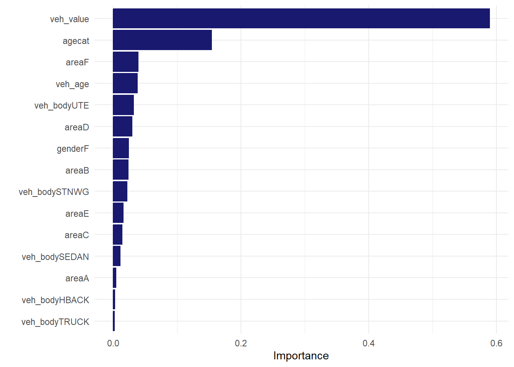{width=672}
:::
:::


Can I train the exact same thing using xgboost directly?
Answer: YES!  
NOTE: I need to one-hot encode dummy variables to match what {tidymodels} do.  


::: {.cell}

```{.r .cell-code}
my_recipe <- recipe(my_train ) %>%
  update_role(all_of(labels(terms(my_logistic_reg_formula))), new_role = "predictor") %>%
  update_role(has_claim, new_role= "outcome") %>% 
  update_role(exposure, new_role = "weight") %>%
  step_dummy(all_nominal_predictors(), one_hot = TRUE) %>% ## APPARENTLY tidymodels use one_hot = TRUE because their model has 24 features. when I dont set one_hot  I only have 21 features.  
  step_select(has_role(c("predictor", "outcome", "weight")))

prepped_recipe <- prep(my_recipe) 
baked_train <- bake(prepped_recipe, my_train)
baked_test <- bake(prepped_recipe, my_test)

my_params <- list(
  eta = 0.1, 
  max_depth = 3,
  gamma = 0, 
  colsample_bytree = 1,
  colsample_bynode = 1,
  min_child_weight = 50,
  subsample = 1,
  nthread = 1)
xgtrain <- xgboost::xgb.DMatrix(
  data = as.matrix(baked_train %>% select(-has_claim, -exposure)),
  label = baked_train$has_claim,
  weight = baked_train$exposure
)

xgtest <- xgboost::xgb.DMatrix(
  data = as.matrix(baked_test %>% select(-has_claim, -exposure)),
  label = baked_test$has_claim,
  weight = baked_test$exposure
)

set.seed(345)
direct_xgb_fit <- xgboost::xgb.train(
  data = xgtrain,
  params = my_params,
  nrounds = 200,
  objective = "binary:logistic"
)
vip::vip(direct_xgb_fit, num_features = 30L)
```

::: {.cell-output-display}
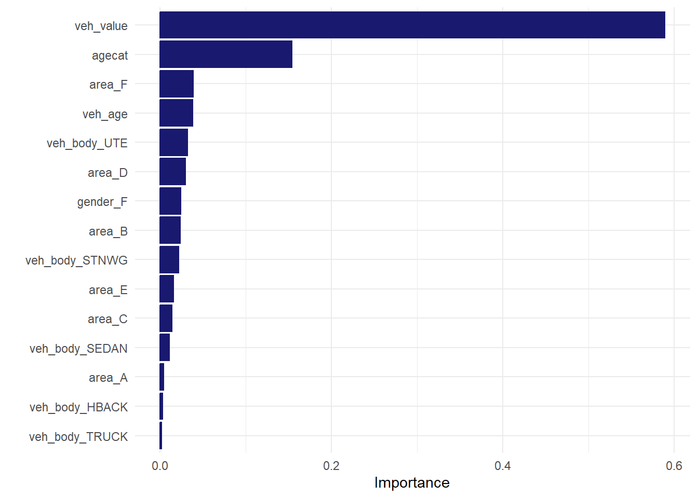{width=672}
:::
:::

Same predictions for the first.. 6 digits?


::: {.cell}

```{.r .cell-code}
pred_tidy <- predict(logistic_xgb_wf_fit, new_data = my_test, type = "prob")   %>% select(.pred_yes)
pred_direct <- predict(direct_xgb_fit, newdata = xgtest)
z <- pred_tidy %>% rename(pred_tidy = .pred_yes) %>%  add_column(pred_direct)
z %>% ggplot(aes(x= pred_tidy, y = pred_direct)) +
  geom_point(alpha = 0.05) +
  geom_smooth() +
  coord_equal()
```

::: {.cell-output-display}
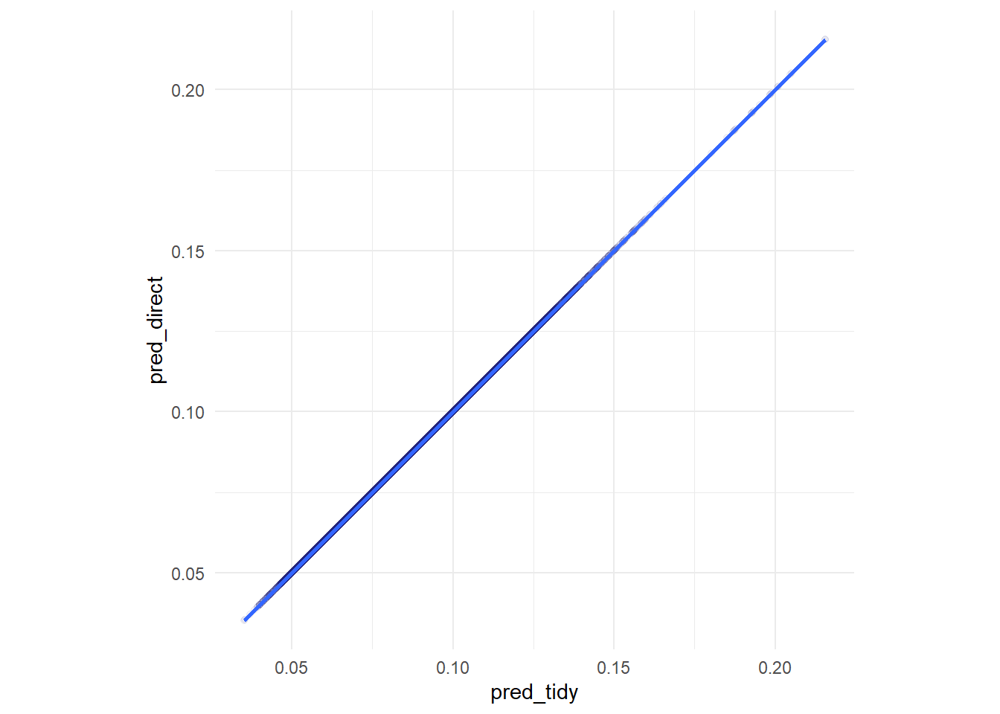{width=672}
:::
:::


Identical first tree:  
tidymodels xgboost model tree #1:  

::: {.cell}

```{.r .cell-code}
xgb.plot.tree(model = logistic_xgb_wf_fit %>% extract_fit_engine(), trees = 1)
```

::: {.cell-output-display}


```{=html}
<div class="grViz html-widget html-fill-item" id="htmlwidget-b6ff34448c8caf3c6faa" style="width:100%;height:464px;"></div>
<script type="application/json" data-for="htmlwidget-b6ff34448c8caf3c6faa">{"x":{"diagram":"digraph {\n\ngraph [layout = \"dot\",\n       rankdir = \"LR\"]\n\nnode [color = \"DimGray\",\n      style = \"filled\",\n      fontname = \"Helvetica\"]\n\nedge [color = \"DimGray\",\n     arrowsize = \"1.5\",\n     arrowhead = \"vee\",\n     fontname = \"Helvetica\"]\n\n  \"1\" [label = \"Tree 1\nveh_value\nCover: 5919.604\nGain: 7.85644531\", fillcolor = \"Beige\", shape = \"rectangle\", fontcolor = \"black\"] \n  \"2\" [label = \"agecat\nCover: 2104.68506\nGain: 0.131347656\", fillcolor = \"Beige\", shape = \"rectangle\", fontcolor = \"black\"] \n  \"3\" [label = \"agecat\nCover: 3814.9187\nGain: 2.02490234\", fillcolor = \"Beige\", shape = \"rectangle\", fontcolor = \"black\"] \n  \"4\" [label = \"Leaf\nCover: 1511.03198\nValue: -0.152327865\", fillcolor = \"Khaki\", shape = \"oval\", fontcolor = \"black\"] \n  \"5\" [label = \"Leaf\nCover: 593.653198\nValue: -0.160011396\", fillcolor = \"Khaki\", shape = \"oval\", fontcolor = \"black\"] \n  \"6\" [label = \"Leaf\nCover: 1062.20764\nValue: -0.140604839\", fillcolor = \"Khaki\", shape = \"oval\", fontcolor = \"black\"] \n  \"7\" [label = \"areaF\nCover: 2752.71094\nGain: 0.434570312\", fillcolor = \"Beige\", shape = \"rectangle\", fontcolor = \"black\"] \n  \"8\" [label = \"Leaf\nCover: 2604.31567\nValue: -0.148649722\", fillcolor = \"Khaki\", shape = \"oval\", fontcolor = \"black\"] \n  \"9\" [label = \"Leaf\nCover: 148.395248\nValue: -0.135023504\", fillcolor = \"Khaki\", shape = \"oval\", fontcolor = \"black\"] \n\"1\"->\"2\" [label = \"< 1.255\", style = \"bold\"] \n\"2\"->\"4\" [label = \"< 4.5\", style = \"bold\"] \n\"3\"->\"6\" [label = \"< 2.5\", style = \"bold\"] \n\"7\"->\"8\" [label = \"< 0.5\", style = \"bold\"] \n\"1\"->\"3\" [style = \"bold\", style = \"solid\"] \n\"2\"->\"5\" [style = \"solid\", style = \"solid\"] \n\"3\"->\"7\" [style = \"solid\", style = \"solid\"] \n\"7\"->\"9\" [style = \"solid\", style = \"solid\"] \n}","config":{"engine":"dot","options":null}},"evals":[],"jsHooks":[]}</script>
```


:::
:::


direct xgboost model tree #1:

::: {.cell}

```{.r .cell-code}
xgb.plot.tree(model = direct_xgb_fit, trees = 1)
```

::: {.cell-output-display}


```{=html}
<div class="grViz html-widget html-fill-item" id="htmlwidget-fbeb0841da5dac8a3b0b" style="width:100%;height:464px;"></div>
<script type="application/json" data-for="htmlwidget-fbeb0841da5dac8a3b0b">{"x":{"diagram":"digraph {\n\ngraph [layout = \"dot\",\n       rankdir = \"LR\"]\n\nnode [color = \"DimGray\",\n      style = \"filled\",\n      fontname = \"Helvetica\"]\n\nedge [color = \"DimGray\",\n     arrowsize = \"1.5\",\n     arrowhead = \"vee\",\n     fontname = \"Helvetica\"]\n\n  \"1\" [label = \"Tree 1\nveh_value\nCover: 5919.604\nGain: 7.85644531\", fillcolor = \"Beige\", shape = \"rectangle\", fontcolor = \"black\"] \n  \"2\" [label = \"agecat\nCover: 2104.68506\nGain: 0.131347656\", fillcolor = \"Beige\", shape = \"rectangle\", fontcolor = \"black\"] \n  \"3\" [label = \"agecat\nCover: 3814.9187\nGain: 2.02490234\", fillcolor = \"Beige\", shape = \"rectangle\", fontcolor = \"black\"] \n  \"4\" [label = \"Leaf\nCover: 1511.03198\nValue: -0.152327865\", fillcolor = \"Khaki\", shape = \"oval\", fontcolor = \"black\"] \n  \"5\" [label = \"Leaf\nCover: 593.653198\nValue: -0.160011396\", fillcolor = \"Khaki\", shape = \"oval\", fontcolor = \"black\"] \n  \"6\" [label = \"Leaf\nCover: 1062.20764\nValue: -0.140604839\", fillcolor = \"Khaki\", shape = \"oval\", fontcolor = \"black\"] \n  \"7\" [label = \"area_F\nCover: 2752.71094\nGain: 0.434570312\", fillcolor = \"Beige\", shape = \"rectangle\", fontcolor = \"black\"] \n  \"8\" [label = \"Leaf\nCover: 2604.31567\nValue: -0.148649722\", fillcolor = \"Khaki\", shape = \"oval\", fontcolor = \"black\"] \n  \"9\" [label = \"Leaf\nCover: 148.395248\nValue: -0.135023504\", fillcolor = \"Khaki\", shape = \"oval\", fontcolor = \"black\"] \n\"1\"->\"2\" [label = \"< 1.255\", style = \"bold\"] \n\"2\"->\"4\" [label = \"< 4.5\", style = \"bold\"] \n\"3\"->\"6\" [label = \"< 2.5\", style = \"bold\"] \n\"7\"->\"8\" [label = \"< 0.5\", style = \"bold\"] \n\"1\"->\"3\" [style = \"bold\", style = \"solid\"] \n\"2\"->\"5\" [style = \"solid\", style = \"solid\"] \n\"3\"->\"7\" [style = \"solid\", style = \"solid\"] \n\"7\"->\"9\" [style = \"solid\", style = \"solid\"] \n}","config":{"engine":"dot","options":null}},"evals":[],"jsHooks":[]}</script>
```


:::
:::


same parameters:  

tidymodels parameters:  

::: {.cell}

```{.r .cell-code}
logistic_xgb_wf_fit %>% extract_fit_engine()
```

::: {.cell-output .cell-output-stdout}

```
##### xgb.Booster
raw: 202.8 Kb 
call:
  xgboost::xgb.train(params = list(eta = 0.1, max_depth = 3, gamma = 0, 
    colsample_bytree = 1, colsample_bynode = 1, min_child_weight = 50, 
    subsample = 1), data = x$data, nrounds = 200, watchlist = x$watchlist, 
    verbose = 0, early_stopping_rounds = 50, nthread = 1, objective = "binary:logistic")
params (as set within xgb.train):
  eta = "0.1", max_depth = "3", gamma = "0", colsample_bytree = "1", colsample_bynode = "1", min_child_weight = "50", subsample = "1", nthread = "1", objective = "binary:logistic", validate_parameters = "TRUE"
xgb.attributes:
  best_iteration, best_msg, best_ntreelimit, best_score, niter
callbacks:
  cb.evaluation.log()
  cb.early.stop(stopping_rounds = early_stopping_rounds, maximize = maximize, 
    verbose = verbose)
# of features: 24 
niter: 200
best_iteration : 200 
best_ntreelimit : 200 
best_score : 0.2954026 
best_msg : [200]	training-logloss:0.295403 
nfeatures : 24 
evaluation_log:
     iter training_logloss
    <num>            <num>
        1        0.6288661
        2        0.5763974
---                       
      199        0.2954106
      200        0.2954026
```


:::
:::

direct fit parameters:  

::: {.cell}

```{.r .cell-code}
direct_xgb_fit
```

::: {.cell-output .cell-output-stdout}

```
##### xgb.Booster
raw: 202.6 Kb 
call:
  xgboost::xgb.train(params = my_params, data = xgtrain, nrounds = 200, 
    objective = "binary:logistic")
params (as set within xgb.train):
  eta = "0.1", max_depth = "3", gamma = "0", colsample_bytree = "1", colsample_bynode = "1", min_child_weight = "50", subsample = "1", nthread = "1", objective = "binary:logistic", validate_parameters = "TRUE"
xgb.attributes:
  niter
callbacks:
  cb.print.evaluation(period = print_every_n)
# of features: 24 
niter: 200
nfeatures : 24 
```


:::
:::


looks likes I managed to get the same thing  


### lightgbm (unweighted)   


Here's how to create a lightgbm model in tidymodels. TODO :try to reproduce it by fitting it directly (outside tidymodels)

::: {.cell}

```{.r .cell-code}
logistic_lightgbm_spec <-
  boost_tree(
    trees= 200
  ) %>%
  set_engine('lightgbm') %>%  # num_leaves = tune()
  set_mode('classification')

logistic_lightgbm_wf <- workflow() %>%
  add_model(logistic_lightgbm_spec) %>%
  add_formula(my_logistic_reg_formula) 


set.seed(345)
logistic_lightgbm_wf_fit <-  logistic_lightgbm_wf%>% 
  fit(data = my_train ) # Case weights are not enabled by the underlying model implementation.


logistic_lightgbm_wf_fit %>% extract_fit_engine() %>% vip::vip()
```

::: {.cell-output-display}
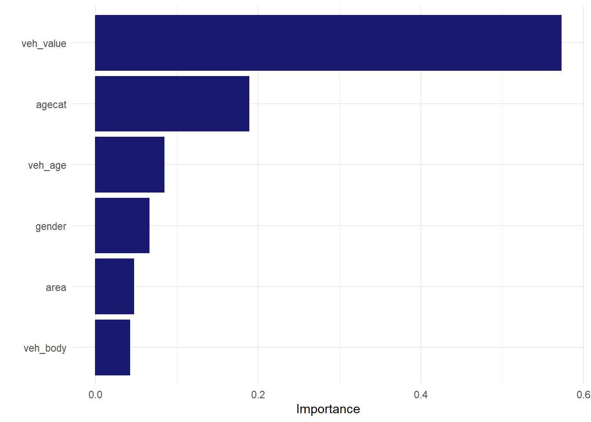{width=672}
:::
:::


### lightgbm weighted   (not implemented in tidymodels)

appears not possible at the moment:  
TL;DR: `Case weights are not enabled by the underlying model implementation.`


::: {.cell}

```{.r .cell-code}
try(
  workflow() %>%
    add_model(logistic_lightgbm_spec) %>%
    add_formula(my_logistic_reg_formula)  %>% 
    add_case_weights(exposure_weight) %>% 
    fit(data = my_train ) 
)
```

::: {.cell-output .cell-output-stdout}

```
Error in check_case_weights(case_weights, object) : 
  Case weights are not enabled by the underlying model implementation.
```


:::
:::


## Use workflow_set to fit all logitics models specification on all resamples   

Alright, that was fun!  Now that I feel I know how to train a model in tidymodels, let's try to define all the models at once using a preprocessor  and a list of model specifications.  Then we apply fit_resamples() to fit all workflows to all resamples.  

In our case, the pre-processor is a formula, but we could have used a recipe as the preprocessor.  We'll try that in another part later (named "Logistic Regression with recipe pre-processor").    

This workflow_set will be mapped to the `fit_resamples()` to fit all models on all folds.  Tuning will be in another part using the `tune_grid` function.

NOTE 1 :  update_workflow_model() **exists** https://github.com/tidymodels/workflowsets/issues/64 and is used to add the formula to the GAM model inside a workflow_set.  

NOTE 2 : we're could have used a list multiple different pre-processors to test different model specifications.   we'll try that in a part later.  


::: {.cell}

```{.r .cell-code}
all_workflows <- 
  workflow_set(
    preproc = list("formula"= my_logistic_reg_formula ),
    models = list(
      logistic_glm = logistic_glm_spec,
      logistic_gam = logistic_gam_spec,
      logistic_xgboost = logistic_xgb_spec
    ),
    case_weights = exposure_weight
  )

all_workflows <- update_workflow_model(all_workflows,
                                       i =  "formula_logistic_gam",
                                       spec = logistic_gam_spec,
                                       formula = my_logistic_reg_formula)

# Workflows can take special arguments for the recipe (e.g. a blueprint) or a model (e.g. a special formula). However, when creating a workflow set, there is no way to specify these extra components. update_workflow_model() and update_workflow_recipe() allow users to set these values after the workflow set is initially created. They are analogous to workflows::add_model() or workflows::add_recipe().

all_workflows2 <- 
  all_workflows %>%
  workflow_map(resamples = train_resamples,
               fn = "fit_resamples",
               verbose = TRUE)
```
:::

::: {.cell}

```{.r .cell-code}
rank_results(all_workflows2, rank_metric = "roc_auc")
```

::: {.cell-output .cell-output-stdout}

```
# A tibble: 9 × 9
  wflow_id         .config .metric   mean std_err     n preprocessor model  rank
  <chr>            <chr>   <chr>    <dbl>   <dbl> <int> <chr>        <chr> <int>
1 formula_logisti… Prepro… accura… 0.932  0.00133     5 formula      logi…     1
2 formula_logisti… Prepro… brier_… 0.0639 0.00106     5 formula      logi…     1
3 formula_logisti… Prepro… roc_auc 0.540  0.00112     5 formula      logi…     1
4 formula_logisti… Prepro… accura… 0.932  0.00133     5 formula      gen_…     2
5 formula_logisti… Prepro… brier_… 0.0639 0.00106     5 formula      gen_…     2
6 formula_logisti… Prepro… roc_auc 0.540  0.00112     5 formula      gen_…     2
7 formula_logisti… Prepro… accura… 0.932  0.00133     5 formula      boos…     3
8 formula_logisti… Prepro… brier_… 0.0640 0.00108     5 formula      boos…     3
9 formula_logisti… Prepro… roc_auc 0.539  0.00273     5 formula      boos…     3
```


:::
:::

::: {.cell}

```{.r .cell-code}
autoplot(all_workflows2, metric="roc_auc")
```

::: {.cell-output-display}
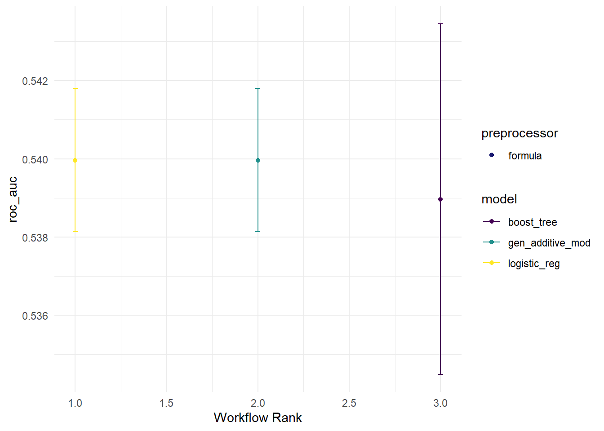{width=672}
:::
:::


## Add hyperparameter tuning to the workflow_set   

ok, that was fun.  Here's how to do try with a grid of hyperparameters


::: {.cell}

```{.r .cell-code}
logistic_tuneable_xgb_spec <-
  boost_tree(
    trees= 200,
    learn_rate = 0.05,
    tree_depth = tune(),
    min_n = tune(),
    loss_reduction = 0,
    sample_size = 1,
    mtry= 1, # colsample_bynode
    stop_iter = 50 
  ) %>%
  set_engine('xgboost', nthread = 1) %>%
  set_mode('classification')
```
:::

create a grid with 12 different sets of hyperparameters.  

::: {.cell}

```{.r .cell-code}
set.seed(789)
my_grid <- grid_latin_hypercube(
  tree_depth(range = c(2,10)),
  min_n(),
  size = 12
)
```
:::

::: {.cell}

```{.r .cell-code}
all_workflows3 <- 
  workflow_set(
    preproc = list("formula"= my_logistic_reg_formula ),
    models = list(
      logistic_glm = logistic_glm_spec,
      logistic_gam = logistic_gam_spec,
      logistic_xgboost = logistic_xgb_spec,
      logistic_tuneable_xgb = logistic_tuneable_xgb_spec
    ),
    case_weights = exposure_weight
  )

all_workflows3 <- update_workflow_model(all_workflows3,
                                        i =  "formula_logistic_gam",
                                        spec = logistic_gam_spec,
                                        formula = my_logistic_reg_formula)

# Workflows can take special arguments for the recipe (e.g. a blueprint) or a model (e.g. a special formula). However, when creating a workflow set, there is no way to specify these extra components. update_workflow_model() and update_workflow_recipe() allow users to set these values after the workflow set is initially created. They are analogous to workflows::add_model() or workflows::add_recipe().

all_workflows4 <- 
  all_workflows3 %>%
  #option_add(control = control_grid(save_pred = TRUE), grid = 12) %>% 
  option_add(control = control_grid(save_pred = TRUE), grid = my_grid) %>%
  workflow_map(resamples = train_resamples,
               fn = "tune_grid",
               verbose = TRUE,
               seed = 567) 
```
:::


this time we have a lot more of boosted trees because `logistic_tuneable_xgb` goes through a grid of 12 sets of hyperparameters. (most of which are shitty..)


::: {.cell}

```{.r .cell-code}
autoplot(all_workflows4, metric="roc_auc")
```

::: {.cell-output-display}
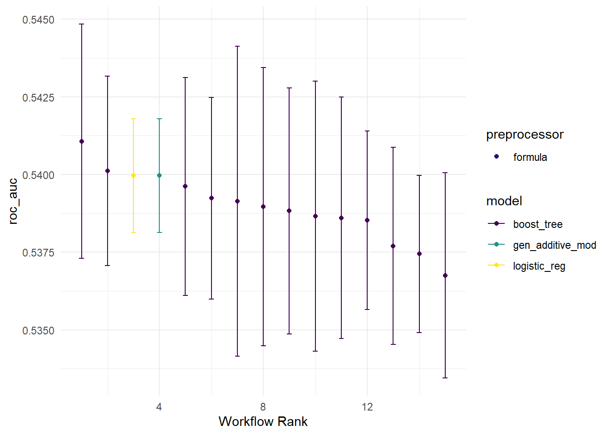{width=672}
:::
:::

::: {.cell}

```{.r .cell-code}
rank_results(all_workflows4, rank_metric = "roc_auc") %>% filter(.metric == "roc_auc")
```

::: {.cell-output .cell-output-stdout}

```
# A tibble: 15 × 9
   wflow_id         .config .metric  mean std_err     n preprocessor model  rank
   <chr>            <chr>   <chr>   <dbl>   <dbl> <int> <chr>        <chr> <int>
 1 formula_logisti… Prepro… roc_auc 0.541 0.00229     5 formula      boos…     1
 2 formula_logisti… Prepro… roc_auc 0.540 0.00185     5 formula      boos…     2
 3 formula_logisti… Prepro… roc_auc 0.540 0.00112     5 formula      logi…     3
 4 formula_logisti… Prepro… roc_auc 0.540 0.00112     5 formula      gen_…     4
 5 formula_logisti… Prepro… roc_auc 0.540 0.00213     5 formula      boos…     5
 6 formula_logisti… Prepro… roc_auc 0.539 0.00197     5 formula      boos…     6
 7 formula_logisti… Prepro… roc_auc 0.539 0.00303     5 formula      boos…     7
 8 formula_logisti… Prepro… roc_auc 0.539 0.00273     5 formula      boos…     8
 9 formula_logisti… Prepro… roc_auc 0.539 0.00241     5 formula      boos…     9
10 formula_logisti… Prepro… roc_auc 0.539 0.00265     5 formula      boos…    10
11 formula_logisti… Prepro… roc_auc 0.539 0.00237     5 formula      boos…    11
12 formula_logisti… Prepro… roc_auc 0.539 0.00175     5 formula      boos…    12
13 formula_logisti… Prepro… roc_auc 0.538 0.00193     5 formula      boos…    13
14 formula_logisti… Prepro… roc_auc 0.537 0.00154     5 formula      boos…    14
15 formula_logisti… Prepro… roc_auc 0.537 0.00201     5 formula      boos…    15
```


:::
:::


note: we can  compare the out-of-sample predictions of all models using collect_predictions(all_workflows4). Here are the predictions of all 15 models for the first row in test:  


::: {.cell}

```{.r .cell-code}
out_of_sample_preds <- collect_predictions(all_workflows4)
out_of_sample_preds %>% filter(.row ==1) %>% arrange(desc(.pred_yes))
```

::: {.cell-output .cell-output-stdout}

```
# A tibble: 15 × 9
   wflow_id           .config preproc model .pred_class .pred_yes .pred_no  .row
   <chr>              <chr>   <chr>   <chr> <fct>           <dbl>    <dbl> <int>
 1 formula_logistic_… Prepro… formula boos… no             0.0846    0.915     1
 2 formula_logistic_… Prepro… formula boos… no             0.0843    0.916     1
 3 formula_logistic_… Prepro… formula boos… no             0.0842    0.916     1
 4 formula_logistic_… Prepro… formula boos… no             0.0841    0.916     1
 5 formula_logistic_… Prepro… formula boos… no             0.0814    0.919     1
 6 formula_logistic_… Prepro… formula boos… no             0.0813    0.919     1
 7 formula_logistic_… Prepro… formula boos… no             0.0813    0.919     1
 8 formula_logistic_… Prepro… formula logi… no             0.0811    0.919     1
 9 formula_logistic_… Prepro… formula gen_… no             0.0811    0.919     1
10 formula_logistic_… Prepro… formula boos… no             0.0808    0.919     1
11 formula_logistic_… Prepro… formula boos… no             0.0802    0.920     1
12 formula_logistic_… Prepro… formula boos… no             0.0801    0.920     1
13 formula_logistic_… Prepro… formula boos… no             0.0800    0.920     1
14 formula_logistic_… Prepro… formula boos… no             0.0787    0.921     1
15 formula_logistic_… Prepro… formula boos… no             0.0744    0.926     1
# ℹ 1 more variable: has_claim_fct <fct>
```


:::
:::


just making sure.. is my weighted average pred equal to my weighted average "has_claim" for my logistic_glm workflow?  yup

::: {.cell}

```{.r .cell-code}
my_train %>% add_column(
  out_of_sample_preds %>%
    filter(wflow_id=="formula_logistic_glm") %>%
    select(.pred_yes)
) %>%
  summarise(weighted_average_pred = sum(exposure * .pred_yes)/sum(exposure),
            weighted_average_has_claim = sum(has_claim * exposure) / sum(exposure)
  )
```

::: {.cell-output .cell-output-stdout}

```
# A tibble: 1 × 2
  weighted_average_pred weighted_average_has_claim
                  <dbl>                      <dbl>
1                0.0888                     0.0889
```


:::
:::


Here the best modelon set  of hyperparameters from "formula_logistic_tuneable_xgb" workflow.  Let's extract that workflow, then show the best 5 results and finally select_best() hyperparameters and finalise the `logistic_tuneable_xgb` by running the model on the whole training set with the best hyperparameters.    

::: {.cell}

```{.r .cell-code}
logistic_tuneable_xgb_wf_result <- 
  all_workflows4 %>%
  extract_workflow_set_result("formula_logistic_tuneable_xgb")

logistic_tuneable_xgb_wf_result %>% show_best(metric = "roc_auc")
```

::: {.cell-output .cell-output-stdout}

```
# A tibble: 5 × 8
  min_n tree_depth .metric .estimator  mean     n std_err .config              
  <int>      <int> <chr>   <chr>      <dbl> <int>   <dbl> <chr>                
1    12          9 roc_auc binary     0.541     5 0.00229 Preprocessor1_Model01
2     8          6 roc_auc binary     0.540     5 0.00185 Preprocessor1_Model11
3    15         10 roc_auc binary     0.540     5 0.00213 Preprocessor1_Model04
4    35          9 roc_auc binary     0.539     5 0.00197 Preprocessor1_Model02
5     9          5 roc_auc binary     0.539     5 0.00303 Preprocessor1_Model05
```


:::
:::

::: {.cell}

```{.r .cell-code}
logistic_tuneable_xgb_wf_fit <- all_workflows4 %>%
  extract_workflow("formula_logistic_tuneable_xgb") %>%
  finalize_workflow(select_best(logistic_tuneable_xgb_wf_result, metric = "roc_auc")) %>%
  last_fit(split= my_split)

logistic_tuneable_xgb_wf_fit
```

::: {.cell-output .cell-output-stdout}

```
# Resampling results
# Manual resampling 
# A tibble: 1 × 6
  splits                id             .metrics .notes   .predictions .workflow 
  <list>                <chr>          <list>   <list>   <list>       <list>    
1 <split [50893/16963]> train/test sp… <tibble> <tibble> <tibble>     <workflow>
```


:::
:::

::: {.cell}

```{.r .cell-code}
preds <- collect_predictions(logistic_tuneable_xgb_wf_fit)
test_with_preds <- augment(logistic_tuneable_xgb_wf_fit)

test_with_preds %>%
  ggplot(aes(x=.pred_yes)) +
  geom_histogram()
```

::: {.cell-output-display}
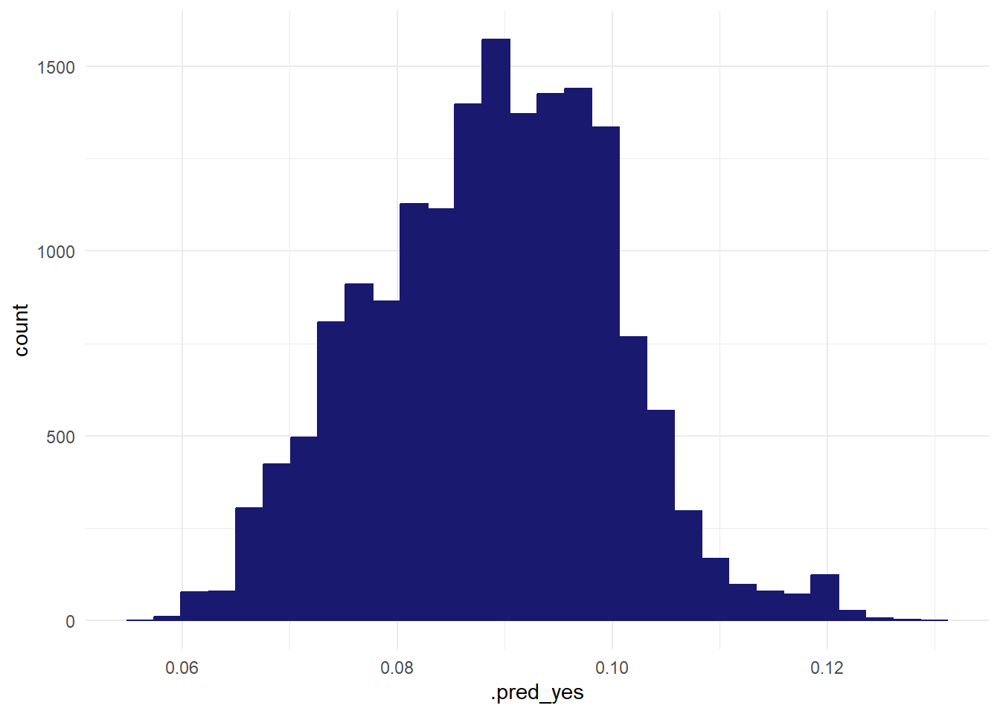{width=672}
:::
:::


here's how to check the metrics: () https://juliasilge.com/blog/nber-papers/)

::: {.cell}

```{.r .cell-code}
collect_metrics(logistic_tuneable_xgb_wf_fit)
```

::: {.cell-output .cell-output-stdout}

```
# A tibble: 3 × 4
  .metric     .estimator .estimate .config             
  <chr>       <chr>          <dbl> <chr>               
1 accuracy    binary        0.932  Preprocessor1_Model1
2 roc_auc     binary        0.541  Preprocessor1_Model1
3 brier_class binary        0.0639 Preprocessor1_Model1
```


:::
:::

::: {.cell}

```{.r .cell-code}
collect_predictions(logistic_tuneable_xgb_wf_fit) %>%
  conf_mat(has_claim_fct, .pred_class) %>%
  autoplot()
```

::: {.cell-output-display}
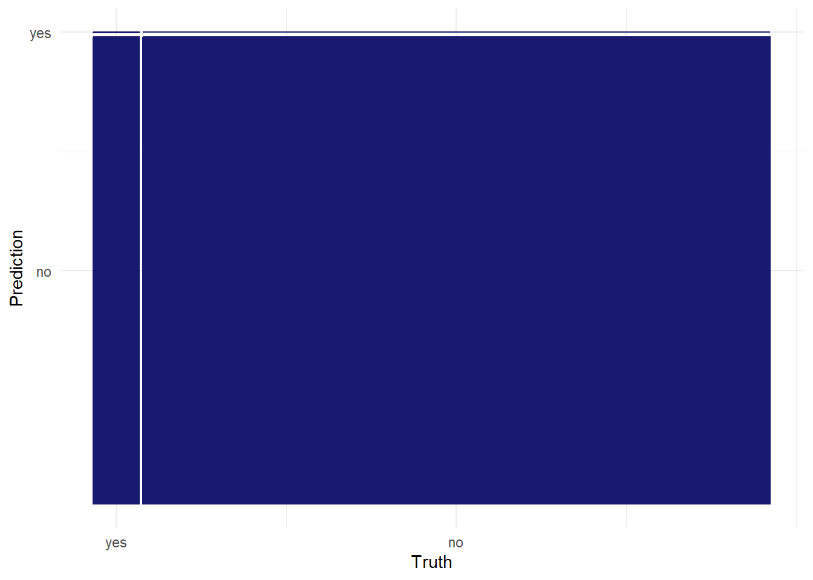{width=672}
:::
:::

::: {.cell}

```{.r .cell-code}
collect_predictions(logistic_tuneable_xgb_wf_fit) %>%
  roc_curve(truth = has_claim_fct, .pred_yes) %>%
  ggplot(aes(1 - specificity, sensitivity)) +
  geom_abline(slope = 1, color = "gray50", lty = 2, alpha = 0.8) +
  geom_path(size = 1.5, alpha = 0.7) +
  labs(color = NULL) +
  coord_fixed()
```

::: {.cell-output-display}
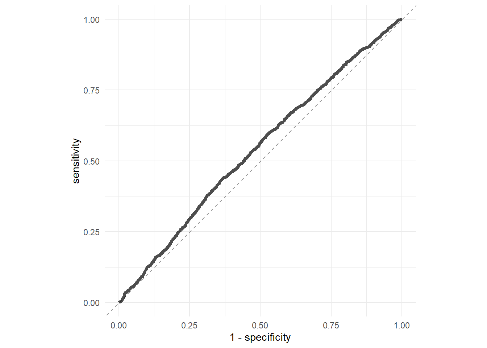{width=672}
:::
:::


# Logistic Regression with recipe pre-processor

ok, let's use the option to pass a recipe instead of a formula  to the workflow_set.  This will allow us to do some feature engineering,  like:
* imputing missing values (this doesnt happen in this dataset),  
* create an "other" categorical values for factors levels that dont happen often (we'll do that with `area`), 
* replace high cardinality variables using using step_lencode_glm()  (we'll pretend that's the case of veh_body, even though it only has 13 unique values.  


::: {.cell}

```{.r .cell-code}
my_recipe_with_imputation <- recipe(my_train ) %>%
  update_role(all_of(labels(terms(my_logistic_reg_formula))), new_role = "predictor") %>% # assign the role of predictor to right-side terms of my formula
  update_role(has_claim_fct, new_role= "outcome") %>%  ## was has_claim  in "my_recipe", but needs to be a factor for tidymodels
  update_role(exposure, new_role = "weight") %>%
  
  step_impute_median(all_numeric_predictors()) %>%  # impute median to missing numerical values
  step_impute_mode(all_nominal_predictors()) %>%  # impute mode to missing nominal values  
  embed::step_lencode_glm(veh_body, outcome = vars(has_claim_fct)) %>% #  encode veh_body   
  step_other(area, threshold = 0.10) %>% 
  step_dummy(all_nominal_predictors())# %>%
#step_select(has_role(c("predictor", "outcome", "weight", "case_weights"))) # don't forger case_weights
```
:::

we don't actually need to prep/bake the recipe, but it's interesting to check what is the output data.

::: {.cell}

```{.r .cell-code}
prepped_recipe <- prep(my_recipe_with_imputation)
baked_train <- bake(prepped_recipe, my_train)
baked_train %>% glimpse()
```

::: {.cell-output .cell-output-stdout}

```
Rows: 50,893
Columns: 18
$ has_claim        <int> 0, 0, 0, 0, 0, 0, 0, 0, 0, 1, 1, 0, 0, 0, 0, 0, 0, 0,…
$ dollar_loss      <dbl> 0.0000, 0.0000, 0.0000, 0.0000, 0.0000, 0.0000, 0.000…
$ exposure         <dbl> 0.64887064, 0.56947296, 0.85420945, 0.85420945, 0.555…
$ veh_value        <dbl> 1.03, 3.26, 2.01, 1.60, 1.47, 0.52, 1.38, 1.22, 1.00,…
$ veh_body         <dbl> -2.384210, -2.480687, -2.156805, -2.114655, -2.384210…
$ veh_age          <int> 2, 2, 3, 3, 2, 4, 2, 3, 2, 3, 3, 4, 3, 1, 4, 1, 2, 4,…
$ agecat           <int> 4, 2, 4, 4, 6, 3, 2, 4, 4, 4, 4, 2, 3, 1, 5, 1, 2, 3,…
$ loss_cost        <dbl> 0.0000, 0.0000, 0.0000, 0.0000, 0.0000, 0.0000, 0.000…
$ policy_id        <dbl> 2, 3, 6, 7, 7, 8, 10, 11, 12, 16, 16, 17, 18, 19, 19,…
$ random           <dbl> 0.937075413, 0.286139535, 0.519095949, 0.736588315, 0…
$ has_claim_fct    <fct> no, no, no, no, no, no, no, no, no, yes, yes, no, no,…
$ exposure_weight  <imp_wts> 0.64887064, 0.56947296, 0.85420945, 0.85420945, 0…
$ policy_loss_cost <dbl> 0.0000, 0.0000, 0.0000, 0.0000, 0.0000, 0.0000, 0.000…
$ gender_M         <dbl> 0, 0, 1, 1, 1, 0, 1, 1, 0, 0, 1, 0, 0, 1, 1, 0, 0, 1,…
$ area_B           <dbl> 0, 0, 0, 0, 1, 0, 0, 0, 0, 0, 0, 0, 0, 0, 0, 1, 0, 0,…
$ area_C           <dbl> 0, 0, 1, 0, 0, 0, 0, 1, 1, 0, 1, 0, 1, 0, 1, 0, 0, 1,…
$ area_D           <dbl> 0, 0, 0, 0, 0, 0, 0, 0, 0, 0, 0, 1, 0, 0, 0, 0, 0, 0,…
$ area_other       <dbl> 0, 1, 0, 0, 0, 0, 0, 0, 0, 1, 0, 0, 0, 0, 0, 0, 0, 0,…
```


:::
:::

as we can see, the dummies have been created and there are only 3 areas left (area_B, area_C, area_D), the other being bundled inside "area_other".    Also, the veh_body nominal variable has been replaced with a numeric variable with the following possible values.


::: {.cell}

```{.r .cell-code}
baked_train %>% count(veh_body)
```

::: {.cell-output .cell-output-stdout}

```
# A tibble: 13 × 2
   veh_body     n
      <dbl> <int>
 1   -2.64     54
 2   -2.48   3448
 3   -2.42    546
 4   -2.38  14203
 5   -2.35  16702
 6   -2.32   1339
 7   -2.26  12146
 8   -2.16   1181
 9   -2.11    568
10   -2.00    557
11   -1.66     93
12   -1.66     24
13   -0.965    32
```


:::
:::

Looking at the original counds in the data, we understand that 0.9653894	 (with n=32) is for "BUS" and 2.3842100	 (with n=14203) is for UTE, the riskiest body type.


::: {.cell}

```{.r .cell-code}
my_train %>% count(veh_body)
```

::: {.cell-output .cell-output-stdout}

```
# A tibble: 13 × 2
   veh_body     n
   <fct>    <int>
 1 BUS         32
 2 CONVT       54
 3 COUPE      557
 4 HBACK    14203
 5 HDTOP     1181
 6 MCARA       93
 7 MIBUS      546
 8 PANVN      568
 9 RDSTR       24
10 SEDAN    16702
11 STNWG    12146
12 TRUCK     1339
13 UTE       3448
```


:::
:::


anyway, let's create a workflow set with this recipe.  

NOTE: I'M NOT SURE IF I CAN HAVE GAMs HERE BECAUSE THE FORMULA DEPENDS ON WHAT DUMMY THE RECIPE CREATED AND THIS MIGHT CHANGE FOR ALL RESAMPLES (given the use of step_other)


::: {.cell}

```{.r .cell-code}
all_workflows5 <- 
  workflow_set(
    preproc = list("recipe_with_imputation" = my_recipe_with_imputation ), # "recipe_with_feature_engineering"= my_recipe_with_imputation, 
    models = list(
      logistic_glm = logistic_glm_spec,
      #logistic_gam = logistic_gam_spec#,
      logistic_xgboost = logistic_xgb_spec,
      logistic_tuneable_xgb = logistic_tuneable_xgb_spec
    ),
    case_weights = exposure_weight
  )
# 
# all_workflows5 <- update_workflow_model(all_workflows5,
#                       i =  "recipe_with_imputation_logistic_gam",
#                       spec = logistic_gam_spec,
#                       formula = my_logistic_reg_formula)

# Workflows can take special arguments for the recipe (e.g. a blueprint) or a model (e.g. a special formula). However, when creating a workflow set, there is no way to specify these extra components. update_workflow_model() and update_workflow_recipe() allow users to set these values after the workflow set is initially created. They are analogous to workflows::add_model() or workflows::add_recipe().

all_workflows6 <- 
  all_workflows5 %>%
  workflow_map(resamples = train_resamples,
               fn = "tune_grid",
               verbose = TRUE)
```
:::

::: {.cell}

```{.r .cell-code}
autoplot(all_workflows6, metric="roc_auc")
```

::: {.cell-output-display}
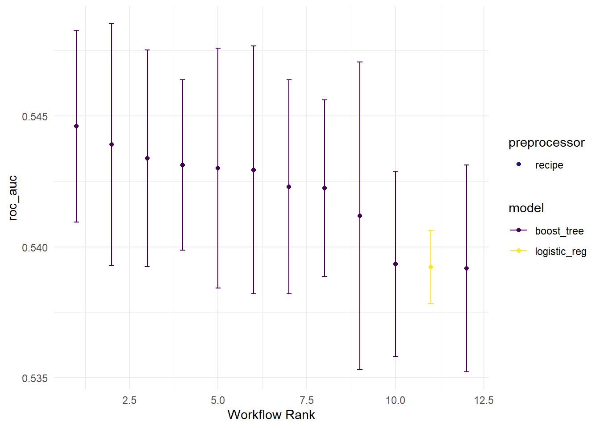{width=672}
:::
:::

::: {.cell}

```{.r .cell-code}
rank_results(all_workflows6, rank_metric = "roc_auc")
```

::: {.cell-output .cell-output-stdout}

```
# A tibble: 36 × 9
   wflow_id        .config .metric   mean std_err     n preprocessor model  rank
   <chr>           <chr>   <chr>    <dbl>   <dbl> <int> <chr>        <chr> <int>
 1 recipe_with_im… Prepro… accura… 0.932  0.00133     5 recipe       boos…     1
 2 recipe_with_im… Prepro… brier_… 0.0639 0.00106     5 recipe       boos…     1
 3 recipe_with_im… Prepro… roc_auc 0.545  0.00222     5 recipe       boos…     1
 4 recipe_with_im… Prepro… accura… 0.932  0.00133     5 recipe       boos…     2
 5 recipe_with_im… Prepro… brier_… 0.0640 0.00106     5 recipe       boos…     2
 6 recipe_with_im… Prepro… roc_auc 0.544  0.00280     5 recipe       boos…     2
 7 recipe_with_im… Prepro… accura… 0.932  0.00133     5 recipe       boos…     3
 8 recipe_with_im… Prepro… brier_… 0.0639 0.00105     5 recipe       boos…     3
 9 recipe_with_im… Prepro… roc_auc 0.543  0.00251     5 recipe       boos…     3
10 recipe_with_im… Prepro… accura… 0.932  0.00133     5 recipe       boos…     4
# ℹ 26 more rows
```


:::
:::

let's fit the best model on the ful ldata set and check how it performs on the test set :


::: {.cell}

```{.r .cell-code}
best_workflow_fit <- all_workflows6 %>%
  extract_workflow("recipe_with_imputation_logistic_tuneable_xgb") %>%
  finalize_workflow(select_best(all_workflows6 %>%
                                  extract_workflow_set_result("recipe_with_imputation_logistic_tuneable_xgb"), metric = "roc_auc")
  ) %>%
  last_fit(split= my_split)

best_workflow_fit %>% 
  extract_fit_engine() %>% 
  vip(num_features=20)
```

::: {.cell-output-display}
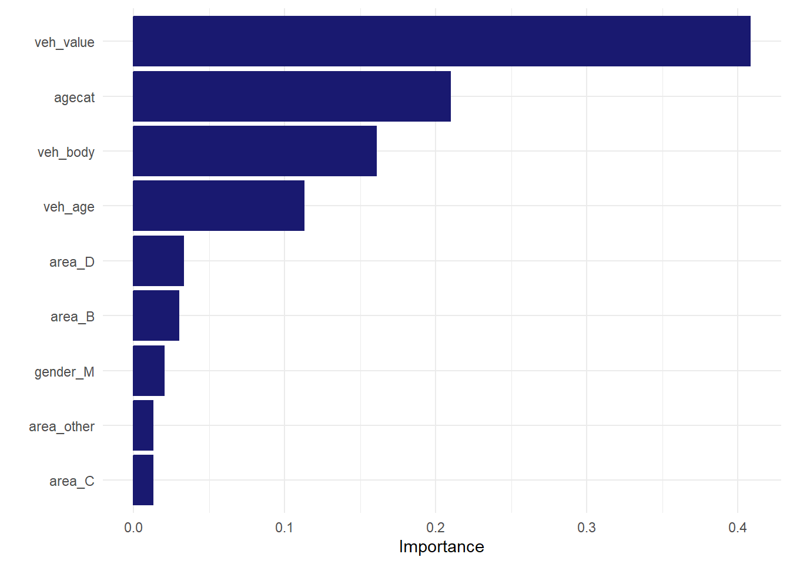{width=672}
:::
:::


# Tweedie regression  

alright that was fun, let's try to model the weedie.   


::: {.cell}

```{.r .cell-code}
my_loss_cost_formula <- as.formula("loss_cost ~ veh_value + veh_body + veh_age +  gender +  area +  agecat")
```
:::


## Estimate tweedie "p" parameter  

We first need to estimate the tweedie index parameter p.    I will do it only once on the full training data set.  There will be some data leak when estimating the resamples, but I'm not sure how I could estimate it for each resamples.   

We use tweedie.profile() to estimate the p parameter.  If the tweedie.profile() function fails to converge, we can try switching the method to "saddeploint" or "interpolation" (as per ?tweedie.profile).

::: {.cell}

```{.r .cell-code}
out <- tweedie::tweedie.profile(
  my_loss_cost_formula, 
  data = my_train,
  p.vec = seq(1.05, 1.95, by=0.05),
  weights= my_train$exposure,
  link.power = 0,
  do.smooth= TRUE,
  do.plot = TRUE)
```

::: {.cell-output .cell-output-stdout}

```
1.05 1.1 1.15 1.2 1.25 1.3 1.35 1.4 1.45 1.5 1.55 1.6 1.65 1.7 1.75 1.8 1.85 1.9 1.95 
...................Done.
```


:::

::: {.cell-output-display}
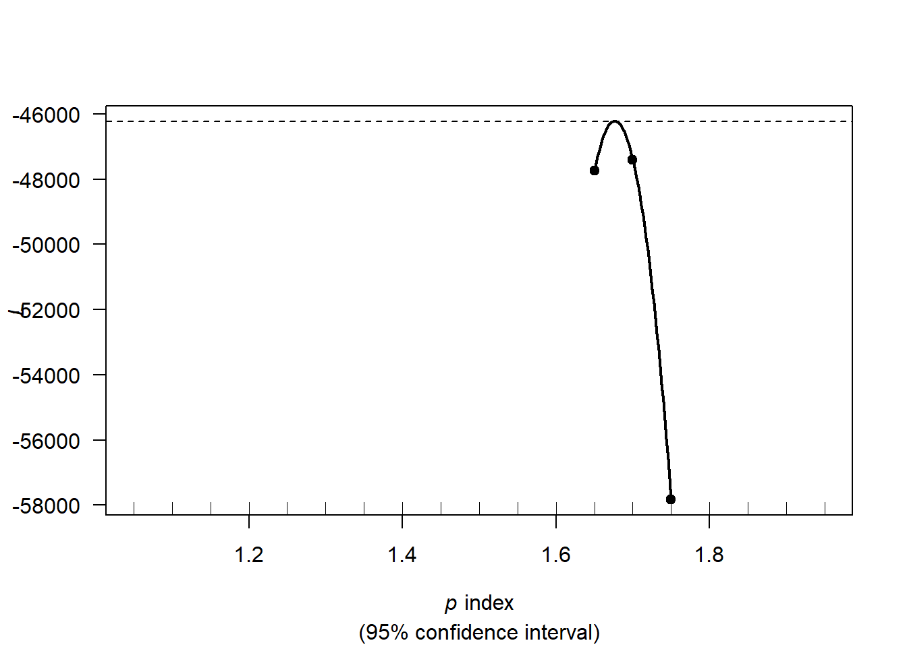{width=672}
:::

```{.r .cell-code}
out
```

::: {.cell-output .cell-output-stdout}

```
$y
 [1] -47730.79 -47506.76 -47300.66 -47112.47 -46942.21 -46789.86 -46655.44
 [8] -46538.95 -46440.37 -46359.71 -46296.98 -46252.17 -46225.28 -46216.32
[15] -46225.27 -46252.15 -46296.94 -46359.67 -46440.31 -46538.87 -46655.36
[22] -46789.76 -46942.09 -47112.35 -47300.52 -47506.61 -47730.63 -47972.57
[29] -48232.43 -48510.21 -48805.92 -49119.54 -49451.09 -49800.56 -50167.95
[36] -50553.27 -50956.50 -51377.66 -51816.74 -52273.74 -52748.66 -53241.51
[43] -53752.27 -54280.96 -54827.57 -55392.10 -55974.56 -56574.93 -57193.23
[50] -57829.45

$x
 [1] 1.650000 1.652041 1.654082 1.656122 1.658163 1.660204 1.662245 1.664286
 [9] 1.666327 1.668367 1.670408 1.672449 1.674490 1.676531 1.678571 1.680612
[17] 1.682653 1.684694 1.686735 1.688776 1.690816 1.692857 1.694898 1.696939
[25] 1.698980 1.701020 1.703061 1.705102 1.707143 1.709184 1.711224 1.713265
[33] 1.715306 1.717347 1.719388 1.721429 1.723469 1.725510 1.727551 1.729592
[41] 1.731633 1.733673 1.735714 1.737755 1.739796 1.741837 1.743878 1.745918
[49] 1.747959 1.750000

$ht
[1] -46218.24

$L
 [1]       NaN       NaN       NaN       NaN      -Inf      -Inf      -Inf
 [8]      -Inf      -Inf      -Inf      -Inf      -Inf -47730.79 -47401.33
[15] -57829.45        NA        NA        NA        NA

$p
 [1] 1.05 1.10 1.15 1.20 1.25 1.30 1.35 1.40 1.45 1.50 1.55 1.60 1.65 1.70 1.75
[16] 1.80 1.85 1.90 1.95

$p.max
[1] 1.676531

$L.max
[1] -46216.32

$phi
 [1] 15721.8783 14176.4100  7900.2438  4402.6561  3969.8736  2212.3358
 [7]  1232.8935  1111.7004   619.5304   558.6312   311.3155   280.7140
[13]   498.4586   412.0971  3468.7345         NA         NA         NA
[19]         NA

$phi.max
[1] 449.5171

$ci
[1] 2.300698 2.300698

$method
[1] "inversion"

$phi.method
[1] "mle"
```


:::
:::

Our estimate for the tweedie p parameter is out$p.max.  
**FUN #3 !!! For some reason, when I dont round my_p_max (or I keep more than 3 digits), my "direct" tweedie  xgboost has slightly different results than the tidymodels xgboost.  **


::: {.cell}

```{.r .cell-code}
my_p_max <- round(out$p.max, digits = 2)
my_p_max
```

::: {.cell-output .cell-output-stdout}

```
[1] 1.68
```


:::
:::


## Reproducing "non-tidymodels" specs in tidymodels  

### GLM weighted   

direct call to glm()  with tweedie family:


::: {.cell}

```{.r .cell-code}
tweedie_fit <- 
  glm(formula =  my_loss_cost_formula,
      family=tweedie(var.power=my_p_max, link.power=0),
      weights = exposure,
      data = my_train)

tweedie_fit %>% tidy()
```

::: {.cell-output .cell-output-stdout}

```
# A tibble: 22 × 5
   term          estimate std.error statistic p.value
   <chr>            <dbl>     <dbl>     <dbl>   <dbl>
 1 (Intercept)     5.81      2.56      2.27    0.0231
 2 veh_value       0.0624    0.0939    0.664   0.507 
 3 veh_bodyCONVT  -2.32      4.21     -0.550   0.582 
 4 veh_bodyCOUPE   0.441     2.60      0.169   0.866 
 5 veh_bodyHBACK  -0.123     2.52     -0.0490  0.961 
 6 veh_bodyHDTOP   0.110     2.55      0.0430  0.966 
 7 veh_bodyMCARA  -0.758     3.19     -0.238   0.812 
 8 veh_bodyMIBUS  -0.111     2.61     -0.0425  0.966 
 9 veh_bodyPANVN  -0.192     2.59     -0.0741  0.941 
10 veh_bodyRDSTR  -0.927     4.74     -0.196   0.845 
# ℹ 12 more rows
```


:::
:::


tidymodels call glm regression with tweedie family:


::: {.cell}

```{.r .cell-code}
tweedie_glm_spec <- 
  parsnip::linear_reg(mode = "regression") %>%
  parsnip::set_engine("glm", family=tweedie(var.power=my_p_max, link.power=0))


tweedie_glm_wf <-   workflow() %>% 
  add_case_weights(exposure_weight) %>% 
  add_formula(my_loss_cost_formula) %>%
  add_model(tweedie_glm_spec)

tweedie_glm_wf_fit <-  tweedie_glm_wf %>% 
  fit(data = my_train)

tweedie_glm_wf_fit %>%  tidy()
```

::: {.cell-output .cell-output-stdout}

```
# A tibble: 22 × 5
   term          estimate std.error statistic p.value
   <chr>            <dbl>     <dbl>     <dbl>   <dbl>
 1 (Intercept)     5.81      2.56      2.27    0.0231
 2 veh_value       0.0624    0.0939    0.664   0.507 
 3 veh_bodyCONVT  -2.32      4.21     -0.550   0.582 
 4 veh_bodyCOUPE   0.441     2.60      0.169   0.866 
 5 veh_bodyHBACK  -0.123     2.52     -0.0490  0.961 
 6 veh_bodyHDTOP   0.110     2.55      0.0430  0.966 
 7 veh_bodyMCARA  -0.758     3.19     -0.238   0.812 
 8 veh_bodyMIBUS  -0.111     2.61     -0.0425  0.966 
 9 veh_bodyPANVN  -0.192     2.59     -0.0741  0.941 
10 veh_bodyRDSTR  -0.927     4.74     -0.196   0.845 
# ℹ 12 more rows
```


:::
:::


it's identical, yes!

### GAM (with splines) weighted     


::: {.cell}

```{.r .cell-code}
my_loss_cost_spline_formula <- as.formula('loss_cost ~ s(veh_value, bs= "tp") + veh_body + veh_age +  gender +  area +  agecat')
```
:::

::: {.cell}

```{.r .cell-code}
tweedie_gam_spec <-
  gen_additive_mod() %>%
  set_engine('mgcv', method= "REML", family = Tweedie(p = my_p_max, link = "log")) %>%
  set_mode('regression')

tweedie_gam_wf <- workflow() %>%
  add_model(tweedie_gam_spec, formula = my_loss_cost_spline_formula) %>%  # need to add formula twice, and  in add_formula
  add_formula(my_loss_cost_formula) %>%
  add_case_weights(exposure_weight)


tweedie_gam_wf_fit <-  tweedie_gam_wf%>% 
  fit(data = my_train )

tweedie_gam_wf_fit %>% tidy(parametric = TRUE)
```

::: {.cell-output .cell-output-stdout}

```
# A tibble: 21 × 5
   term          estimate std.error statistic    p.value
   <chr>            <dbl>     <dbl>     <dbl>      <dbl>
 1 (Intercept)      5.92       1.23    4.83   0.00000136
 2 veh_bodyCONVT   -2.32       2.03   -1.14   0.254     
 3 veh_bodyCOUPE    0.441      1.26    0.351  0.726     
 4 veh_bodyHBACK   -0.123      1.22   -0.101  0.919     
 5 veh_bodyHDTOP    0.110      1.23    0.0890 0.929     
 6 veh_bodyMCARA   -0.759      1.54   -0.493  0.622     
 7 veh_bodyMIBUS   -0.112      1.26   -0.0884 0.930     
 8 veh_bodyPANVN   -0.192      1.25   -0.153  0.878     
 9 veh_bodyRDSTR   -0.928      2.29   -0.406  0.685     
10 veh_bodySEDAN   -0.138      1.21   -0.113  0.910     
# ℹ 11 more rows
```


:::
:::

same result if I do it directly using mgcv::gam?


::: {.cell}

```{.r .cell-code}
mgcv::gam(
  formula = my_loss_cost_spline_formula, 
  data = my_train, 
  weights = exposure,
  family = Tweedie(p = my_p_max, link = "log"),
  method="REML") %>% 
  broom::tidy(parametric= TRUE)
```

::: {.cell-output .cell-output-stdout}

```
# A tibble: 21 × 5
   term          estimate std.error statistic    p.value
   <chr>            <dbl>     <dbl>     <dbl>      <dbl>
 1 (Intercept)      5.92       1.23    4.83   0.00000136
 2 veh_bodyCONVT   -2.32       2.03   -1.14   0.254     
 3 veh_bodyCOUPE    0.441      1.26    0.351  0.726     
 4 veh_bodyHBACK   -0.123      1.22   -0.101  0.919     
 5 veh_bodyHDTOP    0.110      1.23    0.0890 0.929     
 6 veh_bodyMCARA   -0.759      1.54   -0.493  0.622     
 7 veh_bodyMIBUS   -0.112      1.26   -0.0884 0.930     
 8 veh_bodyPANVN   -0.192      1.25   -0.153  0.878     
 9 veh_bodyRDSTR   -0.928      2.29   -0.406  0.685     
10 veh_bodySEDAN   -0.138      1.21   -0.113  0.910     
# ℹ 11 more rows
```


:::
:::


YES!! ESTI QUE JE SUIS BON AHAH!

### XGBoost  weighted     


Here's how I could train an xgboost outside parsnip:

NOTE: I need to one-hot encode dummy variables to match what {tidymodels} do.  


::: {.cell}

```{.r .cell-code}
my_tweedie_recipe <- recipe(my_train ) %>%
  update_role(all_of(labels(terms(my_loss_cost_formula))), new_role = "predictor") %>%
  update_role(loss_cost, new_role= "outcome") %>% 
  update_role(exposure, new_role = "weight") %>%
  step_dummy(all_nominal_predictors(), one_hot = TRUE) %>% ## APPARENTLY tidymodels use one_hot = TRUE because their model has 24 features. when I dont set one_hot  I only have 21 features.  
  step_select(has_role(c("predictor", "outcome", "weight")))

prepped_tweedie_recipe <- prep(my_tweedie_recipe) 
baked_train <- bake(prepped_tweedie_recipe, my_train)
baked_test <- bake(prepped_tweedie_recipe, my_test)

my_params <- list(
  eta = 0.1, 
  max_depth = 3,
  gamma = 0, 
  colsample_bytree = 1,
  colsample_bynode = 1,
  min_child_weight = 50,
  subsample = 1,
  nthread = 1)

xgtrain <- xgboost::xgb.DMatrix(
  data = as.matrix(baked_train %>% select(-loss_cost, -exposure)),
  label = baked_train$loss_cost,
  weight = baked_train$exposure
)

xgtest <- xgboost::xgb.DMatrix(
  data = as.matrix(baked_test %>% select(-loss_cost, -exposure)),
  label = baked_test$loss_cost,
  weight = baked_test$exposure
)

set.seed(456)
direct_xgb_tweedie_fit <- xgboost::xgb.train(
  data = xgtrain,
  params = my_params,
  nrounds = 200,
  objective = "reg:tweedie",
  eval_metric=paste0("tweedie-nloglik@",my_p_max), 
  tweedie_variance_power = my_p_max
)
vip::vip(direct_xgb_tweedie_fit, num_features = 30L)
```

::: {.cell-output-display}
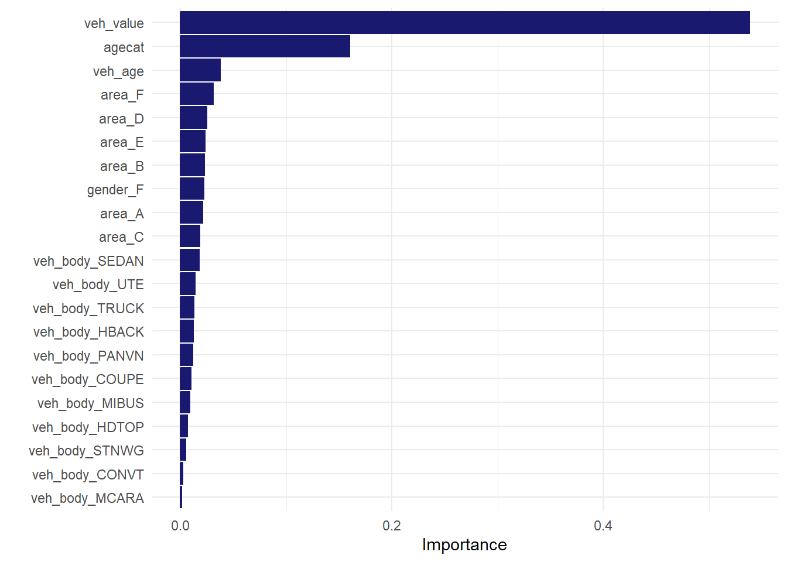{width=672}
:::
:::


Here's how I would train the same model in tidymodels:


::: {.cell}

```{.r .cell-code}
tweedie_xgb_spec <-
  boost_tree(
    tree_depth = 3,
    trees= 200,
    learn_rate = 0.1,
    min_n = 50,
    loss_reduction = 0,
    sample_size = 1.0,
    stop_iter = NULL
  ) %>%
  set_engine('xgboost', nthread = 1, 
             objective = "reg:tweedie",
             eval_metric=paste0("tweedie-nloglik@",my_p_max), 
             tweedie_variance_power = my_p_max) %>% ##https://www.kaggle.com/code/olehmezhenskyi/tweedie-xgboost
  set_mode('regression') 


tweedie_xgb_wf <- workflow() %>%
  add_model(tweedie_xgb_spec) %>%
  add_formula(my_loss_cost_formula) %>%
  add_case_weights(exposure_weight)

set.seed(456)
tweedie_xgb_wf_fit <-  tweedie_xgb_wf%>% 
  fit(data = my_train )


tweedie_xgb_wf_fit %>% extract_fit_engine() %>% vip::vip(num_features = 30L)
```

::: {.cell-output-display}
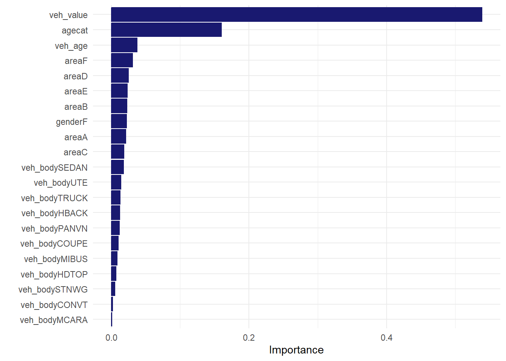{width=672}
:::
:::


let's compare them:


Same predictions for the first.. 6 digits?


::: {.cell}

```{.r .cell-code}
pred_tidy <- predict(tweedie_xgb_wf_fit, new_data = my_test)   
pred_direct <- predict(direct_xgb_tweedie_fit, newdata = xgtest)
z <- pred_tidy %>% rename(pred_tidy = .pred) %>%  add_column(pred_direct) %>%
  mutate(diff_percent = (pred_tidy-pred_direct)/pred_tidy)
z %>% ggplot(aes(x= pred_tidy, y = pred_direct)) +
  geom_point(alpha = 0.05) +
  geom_smooth() +
  coord_equal()
```

::: {.cell-output-display}
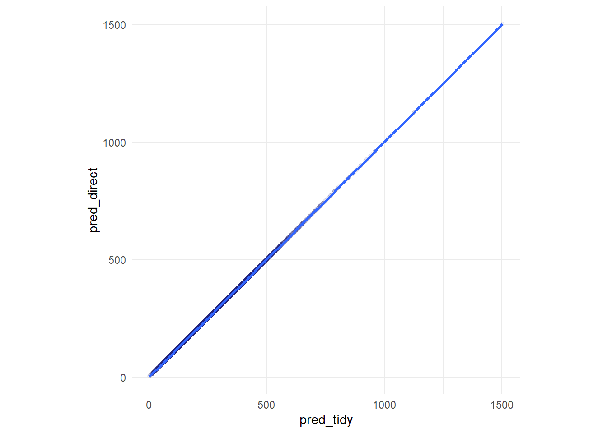{width=672}
:::
:::

::: {.cell}

```{.r .cell-code}
z %>% select(diff_percent) %>% skimr::skim()
```

::: {.cell-output-display}

Table: Data summary

|                         |           |
|:------------------------|:----------|
|Name                     |Piped data |
|Number of rows           |16963      |
|Number of columns        |1          |
|_______________________  |           |
|Column type frequency:   |           |
|numeric                  |1          |
|________________________ |           |
|Group variables          |None       |


**Variable type: numeric**

|skim_variable | n_missing| complete_rate| mean| sd| p0| p25| p50| p75| p100|hist  |
|:-------------|---------:|-------------:|----:|--:|--:|---:|---:|---:|----:|:-----|
|diff_percent  |         0|             1|    0|  0|  0|   0|   0|   0|    0|▁▁▇▁▁ |


:::
:::


Identical first tree?
tidymodels xgboost model tree #1:  

::: {.cell}

```{.r .cell-code}
xgb.plot.tree(model = tweedie_xgb_wf_fit %>% extract_fit_engine(), trees = 1)
```

::: {.cell-output-display}


```{=html}
<div class="grViz html-widget html-fill-item" id="htmlwidget-b9fbc4de69c2ecdc09cc" style="width:100%;height:464px;"></div>
<script type="application/json" data-for="htmlwidget-b9fbc4de69c2ecdc09cc">{"x":{"diagram":"digraph {\n\ngraph [layout = \"dot\",\n       rankdir = \"LR\"]\n\nnode [color = \"DimGray\",\n      style = \"filled\",\n      fontname = \"Helvetica\"]\n\nedge [color = \"DimGray\",\n     arrowsize = \"1.5\",\n     arrowhead = \"vee\",\n     fontname = \"Helvetica\"]\n\n  \"1\" [label = \"Tree 1\nagecat\nCover: 6874257.5\nGain: 3\", fillcolor = \"Beige\", shape = \"rectangle\", fontcolor = \"black\"] \n  \"2\" [label = \"veh_value\nCover: 2446275.75\nGain: 1.5\", fillcolor = \"Beige\", shape = \"rectangle\", fontcolor = \"black\"] \n  \"3\" [label = \"Leaf\nCover: 4427981.5\nValue: 0.146573007\", fillcolor = \"Khaki\", shape = \"oval\", fontcolor = \"black\"] \n  \"4\" [label = \"veh_value\nCover: 5542.45166\nGain: 0.18359375\", fillcolor = \"Beige\", shape = \"rectangle\", fontcolor = \"black\"] \n  \"5\" [label = \"Leaf\nCover: 2440733.25\nValue: 0.146740392\", fillcolor = \"Khaki\", shape = \"oval\", fontcolor = \"black\"] \n  \"6\" [label = \"Leaf\nCover: 2395.56616\nValue: 0.146565974\", fillcolor = \"Khaki\", shape = \"oval\", fontcolor = \"black\"] \n  \"7\" [label = \"Leaf\nCover: 3146.8855\nValue: 0.142487332\", fillcolor = \"Khaki\", shape = \"oval\", fontcolor = \"black\"] \n\"1\"->\"2\" [label = \"< 2.5\", style = \"bold\"] \n\"2\"->\"4\" [label = \"< 0.405000001\", style = \"bold\"] \n\"4\"->\"6\" [label = \"< 0.0900000036\", style = \"bold\"] \n\"1\"->\"3\" [style = \"bold\", style = \"solid\"] \n\"2\"->\"5\" [style = \"solid\", style = \"solid\"] \n\"4\"->\"7\" [style = \"solid\", style = \"solid\"] \n}","config":{"engine":"dot","options":null}},"evals":[],"jsHooks":[]}</script>
```


:::
:::


direct xgboost model tree #1:

::: {.cell}

```{.r .cell-code}
xgb.plot.tree(model = direct_xgb_tweedie_fit, trees = 1)
```

::: {.cell-output-display}


```{=html}
<div class="grViz html-widget html-fill-item" id="htmlwidget-321c2fd52d4ca3a22fc4" style="width:100%;height:464px;"></div>
<script type="application/json" data-for="htmlwidget-321c2fd52d4ca3a22fc4">{"x":{"diagram":"digraph {\n\ngraph [layout = \"dot\",\n       rankdir = \"LR\"]\n\nnode [color = \"DimGray\",\n      style = \"filled\",\n      fontname = \"Helvetica\"]\n\nedge [color = \"DimGray\",\n     arrowsize = \"1.5\",\n     arrowhead = \"vee\",\n     fontname = \"Helvetica\"]\n\n  \"1\" [label = \"Tree 1\nagecat\nCover: 6874257.5\nGain: 3\", fillcolor = \"Beige\", shape = \"rectangle\", fontcolor = \"black\"] \n  \"2\" [label = \"veh_value\nCover: 2446275.75\nGain: 1.5\", fillcolor = \"Beige\", shape = \"rectangle\", fontcolor = \"black\"] \n  \"3\" [label = \"Leaf\nCover: 4427981.5\nValue: 0.146573007\", fillcolor = \"Khaki\", shape = \"oval\", fontcolor = \"black\"] \n  \"4\" [label = \"veh_value\nCover: 5542.45166\nGain: 0.18359375\", fillcolor = \"Beige\", shape = \"rectangle\", fontcolor = \"black\"] \n  \"5\" [label = \"Leaf\nCover: 2440733.25\nValue: 0.146740392\", fillcolor = \"Khaki\", shape = \"oval\", fontcolor = \"black\"] \n  \"6\" [label = \"Leaf\nCover: 2395.56616\nValue: 0.146565974\", fillcolor = \"Khaki\", shape = \"oval\", fontcolor = \"black\"] \n  \"7\" [label = \"Leaf\nCover: 3146.8855\nValue: 0.142487332\", fillcolor = \"Khaki\", shape = \"oval\", fontcolor = \"black\"] \n\"1\"->\"2\" [label = \"< 2.5\", style = \"bold\"] \n\"2\"->\"4\" [label = \"< 0.405000001\", style = \"bold\"] \n\"4\"->\"6\" [label = \"< 0.0900000036\", style = \"bold\"] \n\"1\"->\"3\" [style = \"bold\", style = \"solid\"] \n\"2\"->\"5\" [style = \"solid\", style = \"solid\"] \n\"4\"->\"7\" [style = \"solid\", style = \"solid\"] \n}","config":{"engine":"dot","options":null}},"evals":[],"jsHooks":[]}</script>
```


:::
:::


same parameters?  

tidymodels parameters:  

::: {.cell}

```{.r .cell-code}
tweedie_xgb_wf_fit %>% extract_fit_engine()
```

::: {.cell-output .cell-output-stdout}

```
##### xgb.Booster
raw: 226.2 Kb 
call:
  xgboost::xgb.train(params = list(eta = 0.1, max_depth = 3, gamma = 0, 
    colsample_bytree = 1, colsample_bynode = 1, min_child_weight = 50, 
    subsample = 1), data = x$data, nrounds = 200, watchlist = x$watchlist, 
    verbose = 0, nthread = 1, objective = "reg:tweedie", eval_metric = "tweedie-nloglik@1.68", 
    tweedie_variance_power = 1.68)
params (as set within xgb.train):
  eta = "0.1", max_depth = "3", gamma = "0", colsample_bytree = "1", colsample_bynode = "1", min_child_weight = "50", subsample = "1", nthread = "1", objective = "reg:tweedie", eval_metric = "tweedie-nloglik@1.68", tweedie_variance_power = "1.68", validate_parameters = "TRUE"
xgb.attributes:
  niter
callbacks:
  cb.evaluation.log()
# of features: 24 
niter: 200
nfeatures : 24 
evaluation_log:
     iter training_tweedie_nloglik@1.68
    <num>                         <num>
        1                     625.66655
        2                     566.66643
---                                    
      199                      26.83899
      200                      26.83779
```


:::
:::

direct fit parameters:  

::: {.cell}

```{.r .cell-code}
direct_xgb_tweedie_fit
```

::: {.cell-output .cell-output-stdout}

```
##### xgb.Booster
raw: 226.2 Kb 
call:
  xgboost::xgb.train(params = my_params, data = xgtrain, nrounds = 200, 
    objective = "reg:tweedie", eval_metric = paste0("tweedie-nloglik@", 
        my_p_max), tweedie_variance_power = my_p_max)
params (as set within xgb.train):
  eta = "0.1", max_depth = "3", gamma = "0", colsample_bytree = "1", colsample_bynode = "1", min_child_weight = "50", subsample = "1", nthread = "1", objective = "reg:tweedie", eval_metric = "tweedie-nloglik@1.68", tweedie_variance_power = "1.68", validate_parameters = "TRUE"
xgb.attributes:
  niter
callbacks:
  cb.print.evaluation(period = print_every_n)
# of features: 24 
niter: 200
nfeatures : 24 
```


:::
:::


# TODO: Poisson regression  

## Reproducing "non-tidymodels" specs in tidymodels  

### GLM weighted   
### GAM (with splines) weighted     
### xgboost  weighted     

# TODO: Gamma regression   

stackoverflow adding gamma to glm regression: https://stackoverflow.com/questions/66024469/glm-family-using-tidymodels
## Reproducing "non-tidymodels" specs in tidymodels  
### GLM weighted   
### GAM (with splines) weighted     
### xgboost  weighted     


# resources


* tidy modelling with r book https://www.tmwr.org/resampling  
* all of juliasilge's blog posts juliasilge.com  
* just stumbled on this website by taylor dunn as I put the finishing touch to this post (damn https://bookdown.org/taylordunn/islr-tidy-1655226885741/moving-beyond-linearity.html)


:::{.callout-note collapse="true"}
## Reproductibilité  

Ce document a été généré le 19 avril 2024 à 10:29:22 .    par le programme index.en-us.rmarkdown.  Note: les fichiers `.qmd` voient leur extension remplacée par rmarkdown ici.  


::: {.cell}
::: {.cell-output .cell-output-stdout}

```
Local:    main C:/Users/simon/OneDrive/Documents/snippets_quarto
Remote:   main @ origin (git@github.com:SimonCoulombe/snippets_quarto.git)
Head:     [634f718] 2024-04-19: weewoo
```


:::
:::

::: {.cell}
::: {.cell-output .cell-output-stdout}

```
─ Session info ───────────────────────────────────────────────────────────────
 setting  value
 version  R version 4.3.3 (2024-02-29 ucrt)
 os       Windows 11 x64 (build 22631)
 system   x86_64, mingw32
 ui       RTerm
 language (EN)
 collate  French_Canada.utf8
 ctype    French_Canada.utf8
 tz       America/Toronto
 date     2024-04-19
 pandoc   3.1.11 @ C:\\Users\\simon\\AppData\\Local\\Programs\\Quarto\\bin\\tools/ (via rmarkdown)
 quarto   1.4.553 @ C:\\Users\\simon\\AppData\\Local\\Programs\\Quarto\\bin\\quarto.exe

─ Packages ───────────────────────────────────────────────────────────────────
 ! package       * version date (UTC) lib source
 P bonsai        * 0.2.1   2022-11-29 [?] RSPM
 P broom         * 1.0.5   2023-06-09 [?] RSPM
 P DiagrammeR    * 1.0.11  2024-02-02 [?] RSPM
 P dials         * 1.2.1   2024-02-22 [?] RSPM
 P doParallel    * 1.0.17  2022-02-07 [?] RSPM
 P dplyr         * 1.1.4   2023-11-17 [?] RSPM
 P embed         * 1.1.4   2024-03-20 [?] RSPM
 P forcats       * 1.0.0   2023-01-29 [?] RSPM
 P foreach       * 1.5.2   2022-02-02 [?] RSPM
 P ggplot2       * 3.5.0   2024-02-23 [?] RSPM
 P gt            * 0.10.1  2024-01-17 [?] RSPM
 P infer         * 1.0.7   2024-03-25 [?] RSPM
 P insuranceData * 1.0     2014-09-04 [?] RSPM
 P iterators     * 1.0.14  2022-02-05 [?] RSPM
 P lightgbm      * 4.3.0   2024-01-18 [?] RSPM
 P lubridate     * 1.9.3   2023-09-27 [?] RSPM
 P mgcv          * 1.9-1   2023-12-21 [?] CRAN (R 4.3.3)
 P modeldata     * 1.3.0   2024-01-21 [?] RSPM
 P nlme          * 3.1-164 2023-11-27 [?] CRAN (R 4.3.3)
 P parsnip       * 1.2.1   2024-03-22 [?] RSPM
 P purrr         * 1.0.2   2023-08-10 [?] RSPM
 P readr         * 2.1.5   2024-01-10 [?] RSPM
 P recipes       * 1.0.10  2024-02-18 [?] RSPM
 P rsample       * 1.2.1   2024-03-25 [?] RSPM
 P scales        * 1.3.0   2023-11-28 [?] RSPM
 P sessioninfo   * 1.2.2   2021-12-06 [?] RSPM
 P statmod       * 1.5.0   2023-01-06 [?] RSPM
 P stringr       * 1.5.1   2023-11-14 [?] RSPM
 P tibble        * 3.2.1   2023-03-20 [?] RSPM
 P tidymodels    * 1.2.0   2024-03-25 [?] RSPM
 P tidyr         * 1.3.1   2024-01-24 [?] RSPM
 P tidyverse     * 2.0.0   2023-02-22 [?] RSPM
 P tune          * 1.2.0   2024-03-20 [?] RSPM
 P tweedie       * 2.3.5   2022-08-17 [?] RSPM
 P vip           * 0.4.1   2023-08-21 [?] RSPM
 P workflows     * 1.1.4   2024-02-19 [?] RSPM
 P workflowsets  * 1.1.0   2024-03-21 [?] RSPM
 P xgboost       * 1.7.7.1 2024-01-25 [?] RSPM
 P yardstick     * 1.3.1   2024-03-21 [?] RSPM

 [1] C:/Users/simon/OneDrive/Documents/snippets_quarto/renv/library/R-4.3/x86_64-w64-mingw32
 [2] C:/Users/simon/AppData/Local/R/cache/R/renv/sandbox/R-4.3/x86_64-w64-mingw32/7cdaab8d

 P ── Loaded and on-disk path mismatch.

──────────────────────────────────────────────────────────────────────────────
```


:::
:::

:::
