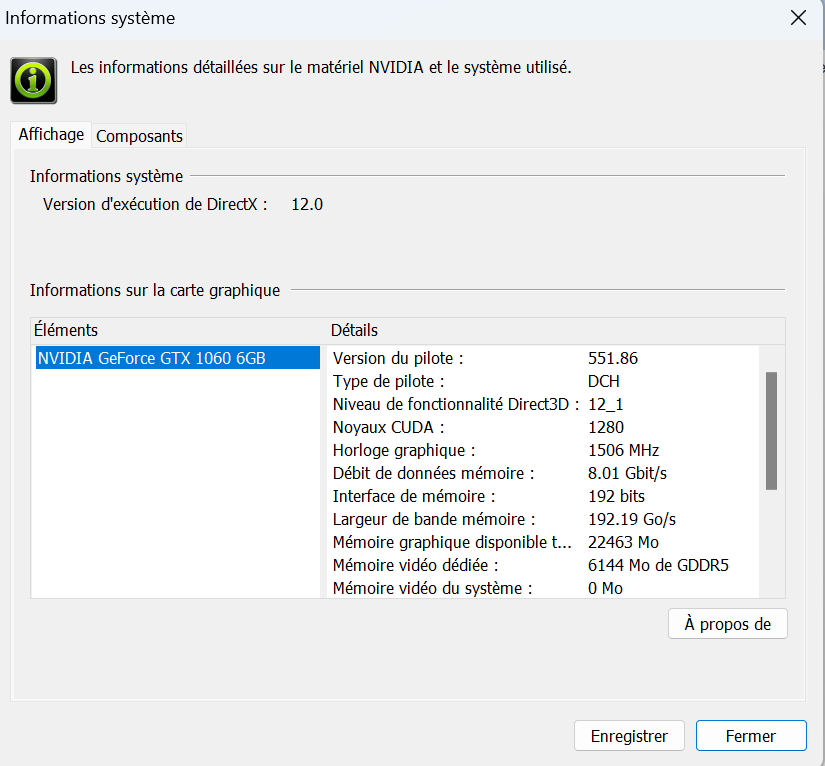

::: callout-tip
## Pourquoi est-ce qu'on est ici?
Je veux faire rouler llama3 8B sur mon vieux GPU de 8 ans (6GB VRAM) sans quitter Windows 11.  Peut-être que ça va me motiver à upgrader mon GPU.  
:::

# Setup

Hardware: Un CPU Ryzen 5500, 32 GB de RAM et une vieille NVidia GTX1060 que j'aimerais utiliser afin de me prouver que je sais comment ça marche avant d'éventueller investir dans un meilleur GPU si l'envie me prends.

Software: Windows 11 pro.  Les drivers nvidia sont à jour (Right-click on your desktop and select NVIDIA Control Panel. From the NVIDIA Control Panel menu, select Help \> System Information. ):\
{.lightbox height="1.5in"}

#  new:  ollama windows preview   

Finalement c'est encore plus simple que je pensais...

Sur le [github de ollama](https://github.com/ollama/ollama) il y a un lien vers le "windows preview".. je download, j'installe, je  pars u ncommand prompt et j'écris "ollama run llama3".

that's it.


# old: WSL   

Au début, j'avais essayé WSL, mais ça semble pas nécessaire.  Je note quand même les étapes ici.   


J'ai installé WSL en suivant les [instructions sur le site de microsoft](https://learn.microsoft.com/en-us/windows/wsl/install). Simplement, tu ouvres le power shell en mode administrator puis tu tapes

``` powershell
wsl --install
wsl --update
```

Ensuite j'ai exécuté wsl et je me suis rendu compte que `nvidia-smi`, qui est nécessaire à l'utilisation du GPU par llama ne marchait pas.  C'est parce que j'avais déjà une autre version de wsl (celle de docker-desktop) et que c'était elle qui roulait par défaut.  J'ai changé la version par default et tout va mieux:

``` powershell  
wsl --list --verbose
wsl
nvidia-smi
exit
wsl --set-default ubuntu
wsl
nvidia-smi
exit

```
{.lightbox height="1.5in"}

bon mon nvidia-smi marche.. alors pour installer ollama
(https://github.com/ollama/ollama?tab=readme-ov-file)
tout ce que j'ai à faire c'Est 
``` powershell    
wsl   
curl -fsSL https://ollama.com/install.sh | sh  
ollama run llama3    --verbose
```

et ça marche et ça utilise le GPU 
holy shit, c'était simple.


## References:    
  * https://learn.microsoft.com/en-us/windows/wsl/install  
  * https://github.com/ollama/ollama  
  * getting started with meta llama https://llama.meta.com/docs/get-started/  
  * todo: karpathy https://www.youtube.com/watch?v=kCc8FmEb1nY


## notes quarto pour un jour plus investiguer  

  * note quarto: lui semble avoir ce que je veux pour un code chunk, mais comment il fait? https://github.com/carpentries-incubator/reproducible-publications-quarto/blob/ad9a94a050ab8267125fc5b47a89bfbdf75a9670/\_episodes/02-quarto/05-code-qmd.md?plain=1#L121  
  * y'A meme un guide ici https://github.com/carpentries-incubator/reproducible-publications-quarto  
  *  carpentries template https://github.com/carpentries-incubator/template  
  * https://github.com/carpentries-incubator/reproducible-publications-quarto/blob/0a8b05ad9bc9219980378364aca281961f747a4a/_episodes_rmd/07-code-chunks.rmd  
  * slidecraft code quarto https://emilhvitfeldt.com/post/slidecraft-code-output/  

