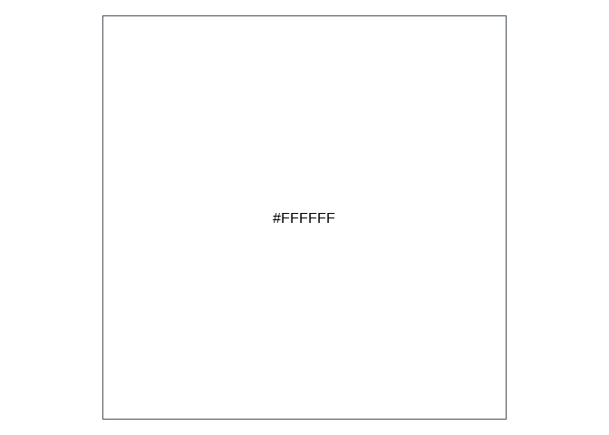
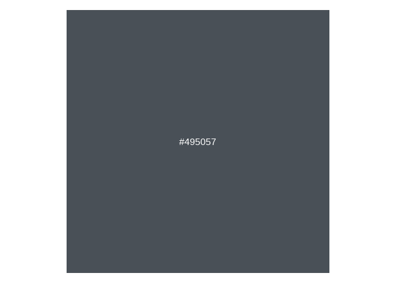
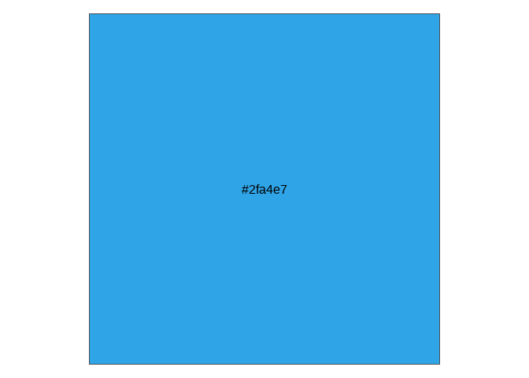
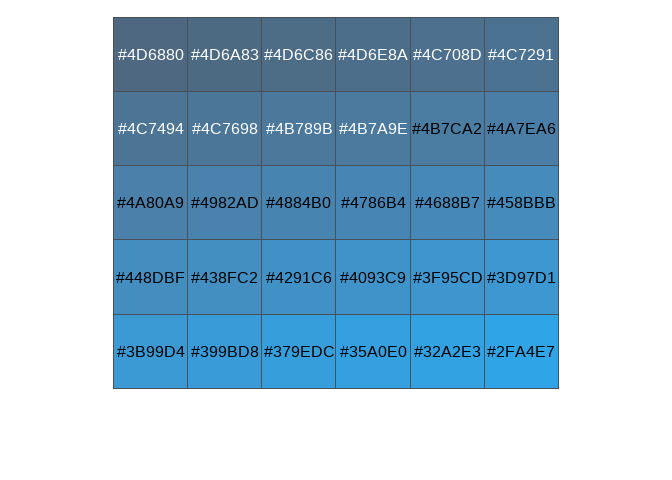
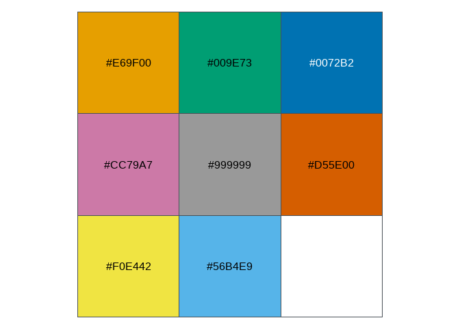

here is the content of the yaml header of my markdown file that sets the bootswatch cerulean theme:

```r
---
title: "Quick and dirty way to get colors from a bootswatch theme using thematic_rmd and thematic_get_option"
output: 
  html_document:
    keep_md: yes
    theme: 
      version: 5  
      bootswatch: cerulean
      base_font: bslib::font_google("Inter")
date: "2024-04-21"
---
```


```r
library(bslib)
```

```
## 
## Attachement du package : 'bslib'
```

```
## L'objet suivant est masqué depuis 'package:utils':
## 
##     page
```

```r
library(thematic)
library(scales)
thematic_rmd() 
```


```r
thematic_get_option("bg")
```

```
## [1] "#FFFFFF"
## attr(,"class")
## [1] "thematic_auto"
```


```r
scales::show_col(thematic_get_option("bg"))
```

<!-- -->


```r
thematic_get_option("fg")
```

```
## [1] "#495057"
## attr(,"class")
## [1] "thematic_auto"
```


```r
scales::show_col(thematic_get_option("fg"))
```

<!-- -->


```r
thematic_get_option("accent")
```

```
## [1] "#2fa4e7"
## attr(,"class")
## [1] "thematic_auto"
```


```r
scales::show_col(thematic_get_option("accent"))
```

<!-- -->


```r
thematic_get_option("sequential")
```

```
##  [1] "#4D6880" "#4D6A83" "#4D6C86" "#4D6E8A" "#4C708D" "#4C7291" "#4C7494"
##  [8] "#4C7698" "#4B789B" "#4B7A9E" "#4B7CA2" "#4A7EA6" "#4A80A9" "#4982AD"
## [15] "#4884B0" "#4786B4" "#4688B7" "#458BBB" "#448DBF" "#438FC2" "#4291C6"
## [22] "#4093C9" "#3F95CD" "#3D97D1" "#3B99D4" "#399BD8" "#379EDC" "#35A0E0"
## [29] "#32A2E3" "#2FA4E7"
## attr(,"sequential_func")
## function (fg, accent, bg, ...) 
## {
##     accent <- accent[1]
##     if (anyNA(c(fg, accent, bg))) 
##         return(NA)
##     fg_dist <- farver::compare_colour(farver::decode_colour(fg), 
##         farver::decode_colour(accent), from_space = "rgb", method = "cmc")
##     bg_dist <- farver::compare_colour(farver::decode_colour(bg), 
##         farver::decode_colour(accent), from_space = "rgb", method = "cmc")
##     total_dist <- bg_dist + fg_dist
##     rng <- if (fg_low) {
##         c(-fg_weight * as.numeric(fg_dist/total_dist), bg_weight * 
##             as.numeric(bg_dist/total_dist))
##     }
##     else {
##         c(-bg_weight * as.numeric(bg_dist/total_dist), fg_weight * 
##             as.numeric(fg_dist/total_dist))
##     }
##     grid <- scales::rescale(seq(0, 1, length.out = n), to = pmax(pmin(rng + 
##         0.5, 1), 0))
##     cols <- if (fg_low) 
##         c(fg, accent, bg)
##     else c(bg, accent, fg)
##     (scales::colour_ramp(cols, alpha = TRUE))(grid)
## }
## <bytecode: 0x00000230c29e8c08>
## <environment: 0x00000230c29f5d40>
```


```r
scales::show_col(thematic_get_option("sequential"))
```

<!-- -->


```r
thematic_get_option("qualitative")
```

```
## [1] "#E69F00" "#009E73" "#0072B2" "#CC79A7" "#999999" "#D55E00" "#F0E442"
## [8] "#56B4E9"
```


```r
scales::show_col(thematic_get_option("qualitative"))
```

<!-- -->


```r
thematic_get_option("font")
```

```
## $families
## [1] ""
## 
## $scale
## [1] 1
## 
## $install
## [1] TRUE
## 
## $quiet
## [1] TRUE
## 
## attr(,"class")
## [1] "font_spec"
```
