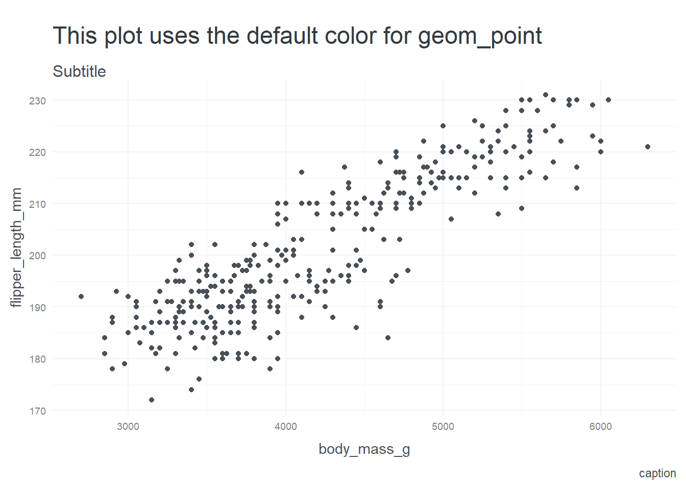
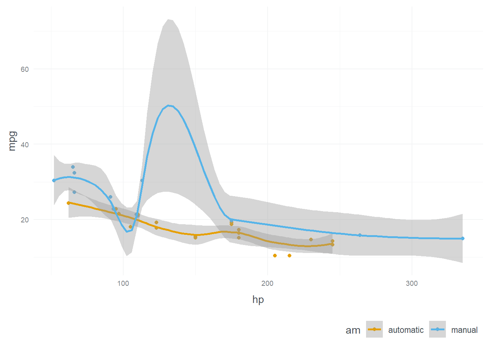

:::{.callout-tip}
## Pourquoi est-ce qu'on est ici?  
:::


::: {.cell}

:::


First,  I cross reference @fig-charts for fun.  


## nicer code chunks!!   
pris des idées en regardant le code de ce document 
https://quarto.org/docs/extensions/filters.html

puis lesvrais infos sont ici (Sections appearance et filenace)
https://quarto.org/docs/output-formats/html-code.html#appearance
https://quarto.org/docs/output-formats/html-code.html#code-filename


not run: fenced R code block for sharing code using {{}}:  
```{{r}}
1 + 1
```

not run:  echo R code + eval = false, ça ne montre par les backticks avant et après.  

::: {.cell}

```{.r .cell-code}
1 +1 
```
:::


ici je mets 4 backtics pour mettre plusieurs code chunks back to back:  
````
---
title: "My document"
---

Some markdown content.

```{{python}}

1 + 1
```

Some additional markdown content.
````
(fin du 4 backtics  )
not run:  using the filename option in code chunks allows me to give a title   

::: {.cell filename='science.R'}

```{.r .cell-code}
1+1
```
:::


```{.bash filename=".bash"}      
quarto create project <type> <name>
```


::: {#fig-charts .cell layout-ncol="2"}
::: {.cell-output-display}
{#fig-charts-1 width=672}
:::

::: {.cell-output-display}
{#fig-charts-2 width=672}
:::

mes charts
:::


# toutes les largeurs   
(source: https://quarto.org/docs/authoring/article-layout.html#page-column)
on peut insérer du stock avec le paramètre `#| column : xxx` ou bien avec les trucs funky de quarto:

``` markdown
:::{.column-page}

:::
```

For computational output, you can specify the page column in your code cell options. For example:

::: {.cell .column-page}

````{.cell-code}
```{{r}}
#| column: page

knitr::kable(
  mtcars[1:6, 1:10]
)
```
````

::: {.cell-output-display}


|                  |  mpg| cyl| disp|  hp| drat|    wt|  qsec| vs| am| gear|
|:-----------------|----:|---:|----:|---:|----:|-----:|-----:|--:|--:|----:|
|Mazda RX4         | 21.0|   6|  160| 110| 3.90| 2.620| 16.46|  0|  1|    4|
|Mazda RX4 Wag     | 21.0|   6|  160| 110| 3.90| 2.875| 17.02|  0|  1|    4|
|Datsun 710        | 22.8|   4|  108|  93| 3.85| 2.320| 18.61|  1|  1|    4|
|Hornet 4 Drive    | 21.4|   6|  258| 110| 3.08| 3.215| 19.44|  1|  0|    3|
|Hornet Sportabout | 18.7|   8|  360| 175| 3.15| 3.440| 17.02|  0|  0|    3|
|Valiant           | 18.1|   6|  225| 105| 2.76| 3.460| 20.22|  1|  0|    3|


:::
:::


The following code displays a Leaflet map across the whole page using the column: screen 


::: {.cell .column-screen}

````{.cell-code}
```{{r}}
#| column: screen

leaflet() %>%
  addTiles() %>%  # Add default OpenStreetMap map tiles
  addMarkers(lng=174.768, lat=-36.852, popup="The birthplace of R")
```
````

::: {.cell-output-display}


```{=html}
<div class="leaflet html-widget html-fill-item" id="htmlwidget-5f0829d05b97789bb945" style="width:100%;height:464px;"></div>
<script type="application/json" data-for="htmlwidget-5f0829d05b97789bb945">{"x":{"options":{"crs":{"crsClass":"L.CRS.EPSG3857","code":null,"proj4def":null,"projectedBounds":null,"options":{}}},"calls":[{"method":"addTiles","args":["https://{s}.tile.openstreetmap.org/{z}/{x}/{y}.png",null,null,{"minZoom":0,"maxZoom":18,"tileSize":256,"subdomains":"abc","errorTileUrl":"","tms":false,"noWrap":false,"zoomOffset":0,"zoomReverse":false,"opacity":1,"zIndex":1,"detectRetina":false,"attribution":"&copy; <a href=\"https://openstreetmap.org/copyright/\">OpenStreetMap<\/a>,  <a href=\"https://opendatacommons.org/licenses/odbl/\">ODbL<\/a>"}]},{"method":"addMarkers","args":[-36.852,174.768,null,null,null,{"interactive":true,"draggable":false,"keyboard":true,"title":"","alt":"","zIndexOffset":0,"opacity":1,"riseOnHover":false,"riseOffset":250},"The birthplace of R",null,null,null,null,{"interactive":false,"permanent":false,"direction":"auto","opacity":1,"offset":[0,0],"textsize":"10px","textOnly":false,"className":"","sticky":true},null]}],"limits":{"lat":[-36.852,-36.852],"lng":[174.768,174.768]}},"evals":[],"jsHooks":[]}</script>
```


:::
:::


# toutes les largeurs possibles :   

:::{.column-body-outset}
Outset content...  
:::

:::{.column-body-page}
page content...  
:::

:::{.column-body-page-inset}
page-inset content...  
:::

:::{.column-body-screen-inset}
screen-inset content...  
:::


:::{.column-body-screen}
screen content...  
:::

# margins   

(source: https://quarto.org/docs/authoring/article-layout.html#margin-content)

## margins figures   


::: {.cell .column-margin}
::: {.cell-output-display}
{#fig-mtcars width=672}
:::
:::


## margins tables


::: {.cell .column-margin}
::: {.cell-output-display}


|                  |  mpg| cyl| disp|
|:-----------------|----:|---:|----:|
|Mazda RX4         | 21.0|   6|  160|
|Mazda RX4 Wag     | 21.0|   6|  160|
|Datsun 710        | 22.8|   4|  108|
|Hornet 4 Drive    | 21.4|   6|  258|
|Hornet Sportabout | 18.7|   8|  360|
|Valiant           | 18.1|   6|  225|


:::
:::


## table with figure in the output    

::: {.cell .fig-column-margin}
::: {.cell-output-display}


|                  |  mpg| cyl| disp|  hp| drat|    wt|
|:-----------------|----:|---:|----:|---:|----:|-----:|
|Mazda RX4         | 21.0|   6|  160| 110| 3.90| 2.620|
|Mazda RX4 Wag     | 21.0|   6|  160| 110| 3.90| 2.875|
|Datsun 710        | 22.8|   4|  108|  93| 3.85| 2.320|
|Hornet 4 Drive    | 21.4|   6|  258| 110| 3.08| 3.215|
|Hornet Sportabout | 18.7|   8|  360| 175| 3.15| 3.440|
|Valiant           | 18.1|   6|  225| 105| 2.76| 3.460|


:::

::: {.cell-output-display}
{width=672}
:::
:::


<!-- :::{.callout-note collapse="true"} -->
## Reproductibilité  {.unnumbered .unlisted}     
<!-- unlisted doesnt appear in table of contents -->

Ce document a été généré le 21 avril 2024 à 02:44:58 .    par le programme index.rmarkdown.  Note: les fichiers `.qmd` voient leur extension remplacée par rmarkdown ici.  


::: {.cell}
::: {.cell-output .cell-output-stdout}

```
Local:    main C:/Users/simon/OneDrive/Documents/snippets_quarto
Remote:   main @ origin (git@github.com:SimonCoulombe/snippets_quarto.git)
Head:     [1f12a57] 2024-04-21: cool template
```


:::
:::

::: {.cell}
::: {.cell-output .cell-output-stdout}

```
─ Session info ───────────────────────────────────────────────────────────────
 setting  value
 version  R version 4.3.3 (2024-02-29 ucrt)
 os       Windows 11 x64 (build 22631)
 system   x86_64, mingw32
 ui       RTerm
 language (EN)
 collate  French_Canada.utf8
 ctype    French_Canada.utf8
 tz       America/Toronto
 date     2024-04-21
 pandoc   3.1.1 @ C:/Program Files/RStudio/resources/app/bin/quarto/bin/tools/ (via rmarkdown)
 quarto   1.4.553 @ C:\\Users\\simon\\AppData\\Local\\Programs\\Quarto\\bin\\quarto.exe

─ Packages ───────────────────────────────────────────────────────────────────
 ! package        * version    date (UTC) lib source
 P dplyr          * 1.1.4      2023-11-17 [?] RSPM
   ggokabeito     * 0.1.0.9000 2024-04-19 [1] Github (malcolmbarrett/ggokabeito@e28e8b7)
 P ggplot2        * 3.5.0      2024-02-23 [?] RSPM
 P leaflet        * 2.2.2      2024-03-26 [?] RSPM
 P palmerpenguins * 0.1.1      2022-08-15 [?] RSPM
 P sessioninfo    * 1.2.2      2021-12-06 [?] RSPM

 [1] C:/Users/simon/OneDrive/Documents/snippets_quarto/renv/library/R-4.3/x86_64-w64-mingw32
 [2] C:/Users/simon/AppData/Local/R/cache/R/renv/sandbox/R-4.3/x86_64-w64-mingw32/7cdaab8d

 P ── Loaded and on-disk path mismatch.

──────────────────────────────────────────────────────────────────────────────
```


:::
:::

<!-- ::: -->
