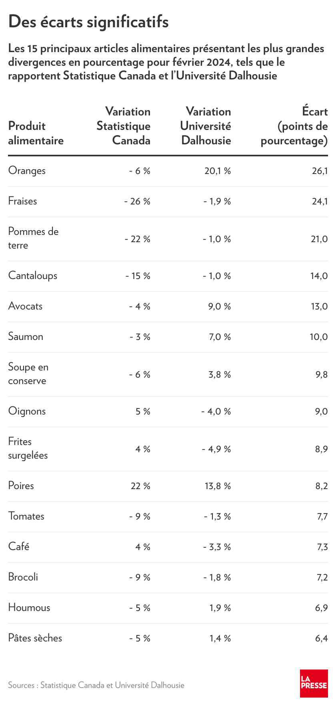
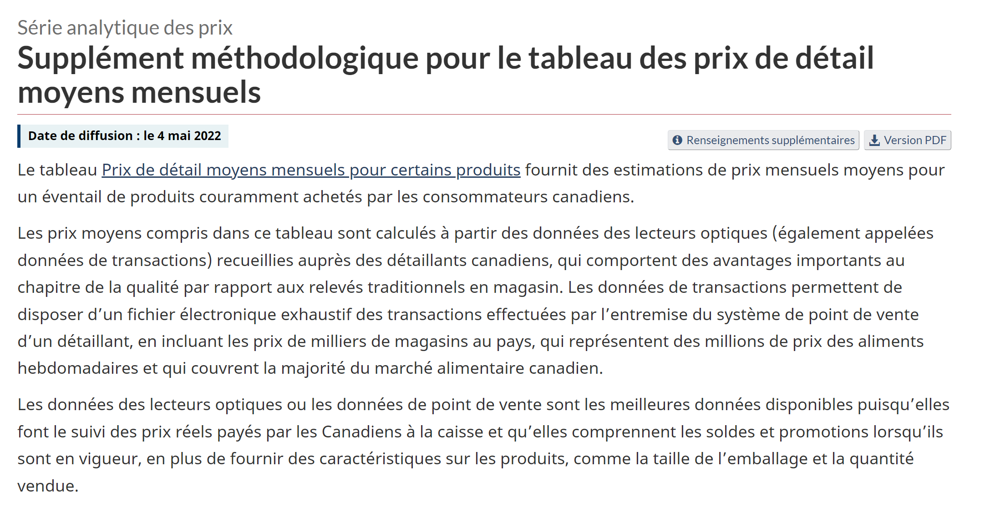
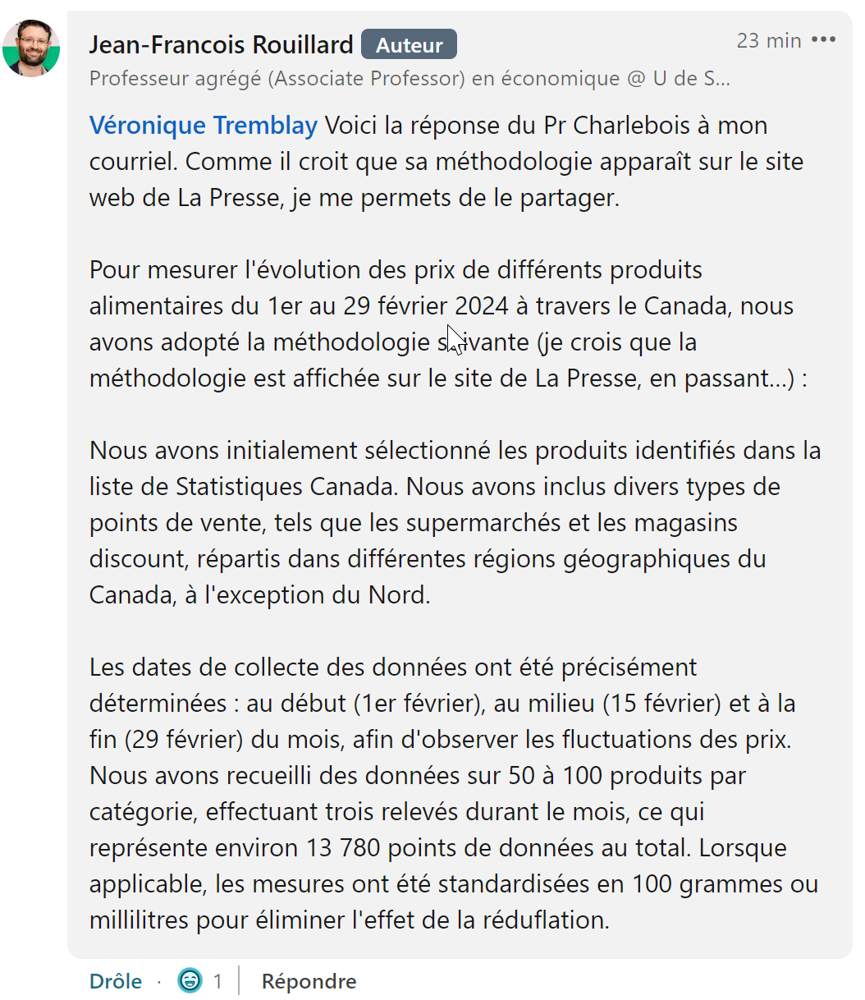
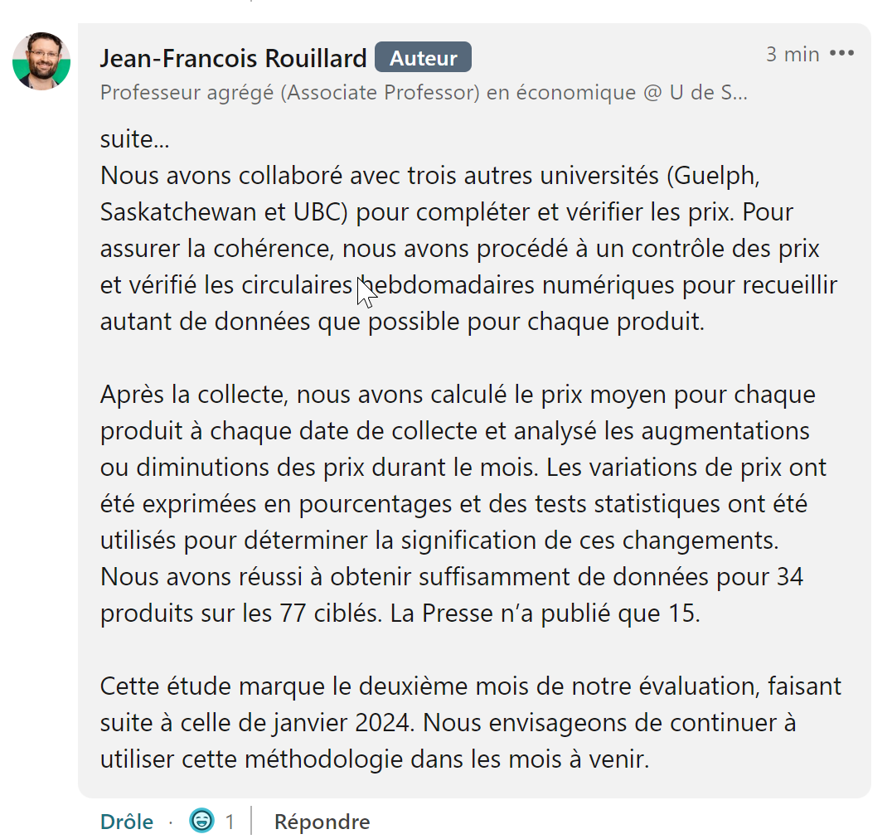

::: {.cell}

:::


:::{.callout-tip}
## Pourquoi est-ce qu'on est ici?  

Yo!  

Petite chicane d'économistes sur linkedin tantôt à propos d'[un article dans la presse d'un prof de dalhousie qui parle du prix de la bouffe](https://www.lapresse.ca/affaires/chroniques/2024-04-18/panier-d-epicerie/peut-on-vraiment-se-fier-a-statistique-canada.php).  Il compare son IPC qu'il a calculé *personnellement* à celui de statistique canada et évidemment toute différence entre son chiffre et celui par publié par statcan s'explique par une erreur de statcan de 5.59% en moyenne.  Tout ça sans partager sa méthodologie et ses données.  C'est fucking hilarant.   

Anyway, je me suis demandé si j'étais capable de : 

1)  Iidentifier la source de données chez statcan  (spoiler:  [18-10-0245](https://www150.statcan.gc.ca/t1/tbl1/fr/tv.action?pid=1810024501&pickMembers%5B0%5D=1.11&request_locale=fr))  
2)  (todo)Me faire un beau grahique interactif automatiquement mis à jour du prix des aliments sur mon blog avec observable js     
3)  Trouver la [méthodo de Statscan](https://www150.statcan.gc.ca/n1/pub/62f0014m/62f0014m2022007-fra.htm)      
4)  Trouver la méthodo de Dalhousie (lol)  


:::   


## Les Données    

Voici les noms de quelques tableux prometteurs de Statcan:  

::: {.cell}
::: {.cell-output-display}


|cansim_table_number |cube_title_fr                                                                    |
|:-------------------|:--------------------------------------------------------------------------------|
|18-10-0001          |Prix de détail moyens mensuel, essence et mazout, par géographie                 |
|18-10-0002          |Prix de détail moyens mensuels pour les aliments et autres produits sélectionnés |
|18-10-0245          |Prix de détail moyens mensuels pour certains produits                            |


:::
:::


Note: le tableau "18-10-0004" était prometteur aussi, mais n'a pas de cantaloupe.   

J'ai regardé ces 4 tableaux et le seul qui contenait le mot "cantaloupe" est [18-10-0245](https://www150.statcan.gc.ca/t1/tbl1/fr/tv.action?pid=1810024501&pickMembers%5B0%5D=1.11&request_locale=fr).  J'imagine que c'est à celui-là que fait référence l'article de la presse, ce qui aurait du sens parce que le "prix de détail" c'est la seule chose qu'un citoyen peut mesurer anyway.

L'article de la presse ne spécifie pas si la hausse de prix est celle de janvier 2024 à février 2024 (1 mois) ou celle de février 2023 à février 2024.  On ne spécifie pas non plus la géographie (Canada? Québec?).  

Bref, j'ai downloadé les chiffres, j'ai pitché ça dans un tableau et j'ai calculé moi-même une différence en % afin de voir si je réussis à retrouver les chiffres de l'article de la presse. 

Après un peu trop d'aller-retour, j'ai déterminé que ce sont les chiffres de janvier2024 à février 2024 pour la géographique "Canada" qui sont cités dans l'article de la presse pour statscan.

Voici donc les chiffres que j'avais envie de voir:


::: {.cell .column-screen}
::: {.cell-output-display}


```{=html}
<div id="kpxidoffvg" style="padding-left:0px;padding-right:0px;padding-top:10px;padding-bottom:10px;overflow-x:auto;overflow-y:auto;width:auto;height:auto;">
<style>#kpxidoffvg table {
  font-family: system-ui, 'Segoe UI', Roboto, Helvetica, Arial, sans-serif, 'Apple Color Emoji', 'Segoe UI Emoji', 'Segoe UI Symbol', 'Noto Color Emoji';
  -webkit-font-smoothing: antialiased;
  -moz-osx-font-smoothing: grayscale;
}

#kpxidoffvg thead, #kpxidoffvg tbody, #kpxidoffvg tfoot, #kpxidoffvg tr, #kpxidoffvg td, #kpxidoffvg th {
  border-style: none;
}

#kpxidoffvg p {
  margin: 0;
  padding: 0;
}

#kpxidoffvg .gt_table {
  display: table;
  border-collapse: collapse;
  line-height: normal;
  margin-left: auto;
  margin-right: auto;
  color: #333333;
  font-size: 16px;
  font-weight: normal;
  font-style: normal;
  background-color: #FFFFFF;
  width: auto;
  border-top-style: solid;
  border-top-width: 2px;
  border-top-color: #A8A8A8;
  border-right-style: none;
  border-right-width: 2px;
  border-right-color: #D3D3D3;
  border-bottom-style: solid;
  border-bottom-width: 2px;
  border-bottom-color: #A8A8A8;
  border-left-style: none;
  border-left-width: 2px;
  border-left-color: #D3D3D3;
}

#kpxidoffvg .gt_caption {
  padding-top: 4px;
  padding-bottom: 4px;
}

#kpxidoffvg .gt_title {
  color: #333333;
  font-size: 125%;
  font-weight: initial;
  padding-top: 4px;
  padding-bottom: 4px;
  padding-left: 5px;
  padding-right: 5px;
  border-bottom-color: #FFFFFF;
  border-bottom-width: 0;
}

#kpxidoffvg .gt_subtitle {
  color: #333333;
  font-size: 85%;
  font-weight: initial;
  padding-top: 3px;
  padding-bottom: 5px;
  padding-left: 5px;
  padding-right: 5px;
  border-top-color: #FFFFFF;
  border-top-width: 0;
}

#kpxidoffvg .gt_heading {
  background-color: #FFFFFF;
  text-align: center;
  border-bottom-color: #FFFFFF;
  border-left-style: none;
  border-left-width: 1px;
  border-left-color: #D3D3D3;
  border-right-style: none;
  border-right-width: 1px;
  border-right-color: #D3D3D3;
}

#kpxidoffvg .gt_bottom_border {
  border-bottom-style: solid;
  border-bottom-width: 2px;
  border-bottom-color: #D3D3D3;
}

#kpxidoffvg .gt_col_headings {
  border-top-style: solid;
  border-top-width: 2px;
  border-top-color: #D3D3D3;
  border-bottom-style: solid;
  border-bottom-width: 2px;
  border-bottom-color: #D3D3D3;
  border-left-style: none;
  border-left-width: 1px;
  border-left-color: #D3D3D3;
  border-right-style: none;
  border-right-width: 1px;
  border-right-color: #D3D3D3;
}

#kpxidoffvg .gt_col_heading {
  color: #333333;
  background-color: #FFFFFF;
  font-size: 100%;
  font-weight: normal;
  text-transform: inherit;
  border-left-style: none;
  border-left-width: 1px;
  border-left-color: #D3D3D3;
  border-right-style: none;
  border-right-width: 1px;
  border-right-color: #D3D3D3;
  vertical-align: bottom;
  padding-top: 5px;
  padding-bottom: 6px;
  padding-left: 5px;
  padding-right: 5px;
  overflow-x: hidden;
}

#kpxidoffvg .gt_column_spanner_outer {
  color: #333333;
  background-color: #FFFFFF;
  font-size: 100%;
  font-weight: normal;
  text-transform: inherit;
  padding-top: 0;
  padding-bottom: 0;
  padding-left: 4px;
  padding-right: 4px;
}

#kpxidoffvg .gt_column_spanner_outer:first-child {
  padding-left: 0;
}

#kpxidoffvg .gt_column_spanner_outer:last-child {
  padding-right: 0;
}

#kpxidoffvg .gt_column_spanner {
  border-bottom-style: solid;
  border-bottom-width: 2px;
  border-bottom-color: #D3D3D3;
  vertical-align: bottom;
  padding-top: 5px;
  padding-bottom: 5px;
  overflow-x: hidden;
  display: inline-block;
  width: 100%;
}

#kpxidoffvg .gt_spanner_row {
  border-bottom-style: hidden;
}

#kpxidoffvg .gt_group_heading {
  padding-top: 8px;
  padding-bottom: 8px;
  padding-left: 5px;
  padding-right: 5px;
  color: #333333;
  background-color: #FFFFFF;
  font-size: 100%;
  font-weight: initial;
  text-transform: inherit;
  border-top-style: solid;
  border-top-width: 2px;
  border-top-color: #D3D3D3;
  border-bottom-style: solid;
  border-bottom-width: 2px;
  border-bottom-color: #D3D3D3;
  border-left-style: none;
  border-left-width: 1px;
  border-left-color: #D3D3D3;
  border-right-style: none;
  border-right-width: 1px;
  border-right-color: #D3D3D3;
  vertical-align: middle;
  text-align: left;
}

#kpxidoffvg .gt_empty_group_heading {
  padding: 0.5px;
  color: #333333;
  background-color: #FFFFFF;
  font-size: 100%;
  font-weight: initial;
  border-top-style: solid;
  border-top-width: 2px;
  border-top-color: #D3D3D3;
  border-bottom-style: solid;
  border-bottom-width: 2px;
  border-bottom-color: #D3D3D3;
  vertical-align: middle;
}

#kpxidoffvg .gt_from_md > :first-child {
  margin-top: 0;
}

#kpxidoffvg .gt_from_md > :last-child {
  margin-bottom: 0;
}

#kpxidoffvg .gt_row {
  padding-top: 8px;
  padding-bottom: 8px;
  padding-left: 5px;
  padding-right: 5px;
  margin: 10px;
  border-top-style: solid;
  border-top-width: 1px;
  border-top-color: #D3D3D3;
  border-left-style: none;
  border-left-width: 1px;
  border-left-color: #D3D3D3;
  border-right-style: none;
  border-right-width: 1px;
  border-right-color: #D3D3D3;
  vertical-align: middle;
  overflow-x: hidden;
}

#kpxidoffvg .gt_stub {
  color: #333333;
  background-color: #FFFFFF;
  font-size: 100%;
  font-weight: initial;
  text-transform: inherit;
  border-right-style: solid;
  border-right-width: 2px;
  border-right-color: #D3D3D3;
  padding-left: 5px;
  padding-right: 5px;
}

#kpxidoffvg .gt_stub_row_group {
  color: #333333;
  background-color: #FFFFFF;
  font-size: 100%;
  font-weight: initial;
  text-transform: inherit;
  border-right-style: solid;
  border-right-width: 2px;
  border-right-color: #D3D3D3;
  padding-left: 5px;
  padding-right: 5px;
  vertical-align: top;
}

#kpxidoffvg .gt_row_group_first td {
  border-top-width: 2px;
}

#kpxidoffvg .gt_row_group_first th {
  border-top-width: 2px;
}

#kpxidoffvg .gt_summary_row {
  color: #333333;
  background-color: #FFFFFF;
  text-transform: inherit;
  padding-top: 8px;
  padding-bottom: 8px;
  padding-left: 5px;
  padding-right: 5px;
}

#kpxidoffvg .gt_first_summary_row {
  border-top-style: solid;
  border-top-color: #D3D3D3;
}

#kpxidoffvg .gt_first_summary_row.thick {
  border-top-width: 2px;
}

#kpxidoffvg .gt_last_summary_row {
  padding-top: 8px;
  padding-bottom: 8px;
  padding-left: 5px;
  padding-right: 5px;
  border-bottom-style: solid;
  border-bottom-width: 2px;
  border-bottom-color: #D3D3D3;
}

#kpxidoffvg .gt_grand_summary_row {
  color: #333333;
  background-color: #FFFFFF;
  text-transform: inherit;
  padding-top: 8px;
  padding-bottom: 8px;
  padding-left: 5px;
  padding-right: 5px;
}

#kpxidoffvg .gt_first_grand_summary_row {
  padding-top: 8px;
  padding-bottom: 8px;
  padding-left: 5px;
  padding-right: 5px;
  border-top-style: double;
  border-top-width: 6px;
  border-top-color: #D3D3D3;
}

#kpxidoffvg .gt_last_grand_summary_row_top {
  padding-top: 8px;
  padding-bottom: 8px;
  padding-left: 5px;
  padding-right: 5px;
  border-bottom-style: double;
  border-bottom-width: 6px;
  border-bottom-color: #D3D3D3;
}

#kpxidoffvg .gt_striped {
  background-color: rgba(128, 128, 128, 0.05);
}

#kpxidoffvg .gt_table_body {
  border-top-style: solid;
  border-top-width: 2px;
  border-top-color: #D3D3D3;
  border-bottom-style: solid;
  border-bottom-width: 2px;
  border-bottom-color: #D3D3D3;
}

#kpxidoffvg .gt_footnotes {
  color: #333333;
  background-color: #FFFFFF;
  border-bottom-style: none;
  border-bottom-width: 2px;
  border-bottom-color: #D3D3D3;
  border-left-style: none;
  border-left-width: 2px;
  border-left-color: #D3D3D3;
  border-right-style: none;
  border-right-width: 2px;
  border-right-color: #D3D3D3;
}

#kpxidoffvg .gt_footnote {
  margin: 0px;
  font-size: 90%;
  padding-top: 4px;
  padding-bottom: 4px;
  padding-left: 5px;
  padding-right: 5px;
}

#kpxidoffvg .gt_sourcenotes {
  color: #333333;
  background-color: #FFFFFF;
  border-bottom-style: none;
  border-bottom-width: 2px;
  border-bottom-color: #D3D3D3;
  border-left-style: none;
  border-left-width: 2px;
  border-left-color: #D3D3D3;
  border-right-style: none;
  border-right-width: 2px;
  border-right-color: #D3D3D3;
}

#kpxidoffvg .gt_sourcenote {
  font-size: 90%;
  padding-top: 4px;
  padding-bottom: 4px;
  padding-left: 5px;
  padding-right: 5px;
}

#kpxidoffvg .gt_left {
  text-align: left;
}

#kpxidoffvg .gt_center {
  text-align: center;
}

#kpxidoffvg .gt_right {
  text-align: right;
  font-variant-numeric: tabular-nums;
}

#kpxidoffvg .gt_font_normal {
  font-weight: normal;
}

#kpxidoffvg .gt_font_bold {
  font-weight: bold;
}

#kpxidoffvg .gt_font_italic {
  font-style: italic;
}

#kpxidoffvg .gt_super {
  font-size: 65%;
}

#kpxidoffvg .gt_footnote_marks {
  font-size: 75%;
  vertical-align: 0.4em;
  position: initial;
}

#kpxidoffvg .gt_asterisk {
  font-size: 100%;
  vertical-align: 0;
}

#kpxidoffvg .gt_indent_1 {
  text-indent: 5px;
}

#kpxidoffvg .gt_indent_2 {
  text-indent: 10px;
}

#kpxidoffvg .gt_indent_3 {
  text-indent: 15px;
}

#kpxidoffvg .gt_indent_4 {
  text-indent: 20px;
}

#kpxidoffvg .gt_indent_5 {
  text-indent: 25px;
}
</style>
<table class="gt_table" data-quarto-disable-processing="false" data-quarto-bootstrap="false">
  <thead>
    <tr class="gt_heading">
      <td colspan="7" class="gt_heading gt_title gt_font_normal" style>Évolution du prix de détail moyens mensuels pour certains produits</td>
    </tr>
    <tr class="gt_heading">
      <td colspan="7" class="gt_heading gt_subtitle gt_font_normal gt_bottom_border" style>Mais quel source de données Sylvain Charlebois a-t-il utilisé? </td>
    </tr>
    <tr class="gt_col_headings gt_spanner_row">
      <th class="gt_col_heading gt_columns_bottom_border gt_center" rowspan="2" colspan="1" scope="col" id="produits">produits</th>
      <th class="gt_center gt_columns_top_border gt_column_spanner_outer" rowspan="1" colspan="3" scope="colgroup" id="Canada">
        <span class="gt_column_spanner">Canada</span>
      </th>
      <th class="gt_center gt_columns_top_border gt_column_spanner_outer" rowspan="1" colspan="3" scope="colgroup" id="Québec">
        <span class="gt_column_spanner">Québec</span>
      </th>
    </tr>
    <tr class="gt_col_headings">
      <th class="gt_col_heading gt_columns_bottom_border gt_right" rowspan="1" colspan="1" scope="col" id="Prix janvier 2024">Prix janvier 2024</th>
      <th class="gt_col_heading gt_columns_bottom_border gt_right" rowspan="1" colspan="1" scope="col" id="Prix février 2024">Prix février 2024</th>
      <th class="gt_col_heading gt_columns_bottom_border gt_right" rowspan="1" colspan="1" scope="col" id="Différence en %">Différence en %</th>
      <th class="gt_col_heading gt_columns_bottom_border gt_right" rowspan="1" colspan="1" scope="col" id="Prix janvier 2024">Prix janvier 2024</th>
      <th class="gt_col_heading gt_columns_bottom_border gt_right" rowspan="1" colspan="1" scope="col" id="Prix février 2024">Prix février 2024</th>
      <th class="gt_col_heading gt_columns_bottom_border gt_right" rowspan="1" colspan="1" scope="col" id="Différence en %">Différence en %</th>
    </tr>
  </thead>
  <tbody class="gt_table_body">
    <tr><td headers="produits" class="gt_row gt_center">Avocat, unité</td>
<td headers="prix_month_1_geo_Canada" class="gt_row gt_right">$1.88</td>
<td headers="prix_month_2_geo_Canada" class="gt_row gt_right">$1.80</td>
<td headers="pct_diff_geo_Canada" class="gt_row gt_right">−4.3%</td>
<td headers="prix_month_1_geo_Québec" class="gt_row gt_right">$1.70</td>
<td headers="prix_month_2_geo_Québec" class="gt_row gt_right">$1.53</td>
<td headers="pct_diff_geo_Québec" class="gt_row gt_right">−10.0%</td></tr>
    <tr><td headers="produits" class="gt_row gt_center">Brocoli surgelé, 500 grammes</td>
<td headers="prix_month_1_geo_Canada" class="gt_row gt_right">$3.85</td>
<td headers="prix_month_2_geo_Canada" class="gt_row gt_right">$3.98</td>
<td headers="pct_diff_geo_Canada" class="gt_row gt_right">3.4%</td>
<td headers="prix_month_1_geo_Québec" class="gt_row gt_right">$4.01</td>
<td headers="prix_month_2_geo_Québec" class="gt_row gt_right">$4.13</td>
<td headers="pct_diff_geo_Québec" class="gt_row gt_right">3.0%</td></tr>
    <tr><td headers="produits" class="gt_row gt_center">Brocoli, unité</td>
<td headers="prix_month_1_geo_Canada" class="gt_row gt_right">$2.49</td>
<td headers="prix_month_2_geo_Canada" class="gt_row gt_right">$2.27</td>
<td headers="pct_diff_geo_Canada" class="gt_row gt_right">−8.8%</td>
<td headers="prix_month_1_geo_Québec" class="gt_row gt_right">$2.20</td>
<td headers="prix_month_2_geo_Québec" class="gt_row gt_right">$2.01</td>
<td headers="pct_diff_geo_Québec" class="gt_row gt_right">−8.6%</td></tr>
    <tr><td headers="produits" class="gt_row gt_center">Café torréfié ou moulu, 340 grammes</td>
<td headers="prix_month_1_geo_Canada" class="gt_row gt_right">$6.16</td>
<td headers="prix_month_2_geo_Canada" class="gt_row gt_right">$6.38</td>
<td headers="pct_diff_geo_Canada" class="gt_row gt_right">3.6%</td>
<td headers="prix_month_1_geo_Québec" class="gt_row gt_right">$6.21</td>
<td headers="prix_month_2_geo_Québec" class="gt_row gt_right">$6.57</td>
<td headers="pct_diff_geo_Québec" class="gt_row gt_right">5.8%</td></tr>
    <tr><td headers="produits" class="gt_row gt_center">Cantaloup, unité</td>
<td headers="prix_month_1_geo_Canada" class="gt_row gt_right">$3.83</td>
<td headers="prix_month_2_geo_Canada" class="gt_row gt_right">$3.27</td>
<td headers="pct_diff_geo_Canada" class="gt_row gt_right">−14.6%</td>
<td headers="prix_month_1_geo_Québec" class="gt_row gt_right">$3.98</td>
<td headers="prix_month_2_geo_Québec" class="gt_row gt_right">$3.11</td>
<td headers="pct_diff_geo_Québec" class="gt_row gt_right">−21.9%</td></tr>
    <tr><td headers="produits" class="gt_row gt_center">Fraises surgelé, 600 grammes</td>
<td headers="prix_month_1_geo_Canada" class="gt_row gt_right">$5.14</td>
<td headers="prix_month_2_geo_Canada" class="gt_row gt_right">$4.83</td>
<td headers="pct_diff_geo_Canada" class="gt_row gt_right">−6.0%</td>
<td headers="prix_month_1_geo_Québec" class="gt_row gt_right">$5.40</td>
<td headers="prix_month_2_geo_Québec" class="gt_row gt_right">$4.74</td>
<td headers="pct_diff_geo_Québec" class="gt_row gt_right">−12.2%</td></tr>
    <tr><td headers="produits" class="gt_row gt_center">Fraises, 454 grammes</td>
<td headers="prix_month_1_geo_Canada" class="gt_row gt_right">$5.25</td>
<td headers="prix_month_2_geo_Canada" class="gt_row gt_right">$3.89</td>
<td headers="pct_diff_geo_Canada" class="gt_row gt_right">−25.9%</td>
<td headers="prix_month_1_geo_Québec" class="gt_row gt_right">$4.57</td>
<td headers="prix_month_2_geo_Québec" class="gt_row gt_right">$3.39</td>
<td headers="pct_diff_geo_Québec" class="gt_row gt_right">−25.8%</td></tr>
    <tr><td headers="produits" class="gt_row gt_center">Houmous, 227 grammes</td>
<td headers="prix_month_1_geo_Canada" class="gt_row gt_right">$3.86</td>
<td headers="prix_month_2_geo_Canada" class="gt_row gt_right">$3.66</td>
<td headers="pct_diff_geo_Canada" class="gt_row gt_right">−5.2%</td>
<td headers="prix_month_1_geo_Québec" class="gt_row gt_right">$4.10</td>
<td headers="prix_month_2_geo_Québec" class="gt_row gt_right">$3.55</td>
<td headers="pct_diff_geo_Québec" class="gt_row gt_right">−13.4%</td></tr>
    <tr><td headers="produits" class="gt_row gt_center">Jus d’orange, 2 litres</td>
<td headers="prix_month_1_geo_Canada" class="gt_row gt_right">$4.93</td>
<td headers="prix_month_2_geo_Canada" class="gt_row gt_right">$5.26</td>
<td headers="pct_diff_geo_Canada" class="gt_row gt_right">6.7%</td>
<td headers="prix_month_1_geo_Québec" class="gt_row gt_right">$4.96</td>
<td headers="prix_month_2_geo_Québec" class="gt_row gt_right">$5.41</td>
<td headers="pct_diff_geo_Québec" class="gt_row gt_right">9.1%</td></tr>
    <tr><td headers="produits" class="gt_row gt_center">Oignons, 1,36 kilogrammes</td>
<td headers="prix_month_1_geo_Canada" class="gt_row gt_right">$4.36</td>
<td headers="prix_month_2_geo_Canada" class="gt_row gt_right">$4.72</td>
<td headers="pct_diff_geo_Canada" class="gt_row gt_right">8.3%</td>
<td headers="prix_month_1_geo_Québec" class="gt_row gt_right">$3.59</td>
<td headers="prix_month_2_geo_Québec" class="gt_row gt_right">$4.38</td>
<td headers="pct_diff_geo_Québec" class="gt_row gt_right">22.0%</td></tr>
    <tr><td headers="produits" class="gt_row gt_center">Oignons, par kilogramme</td>
<td headers="prix_month_1_geo_Canada" class="gt_row gt_right">$5.39</td>
<td headers="prix_month_2_geo_Canada" class="gt_row gt_right">$5.64</td>
<td headers="pct_diff_geo_Canada" class="gt_row gt_right">4.6%</td>
<td headers="prix_month_1_geo_Québec" class="gt_row gt_right">$5.14</td>
<td headers="prix_month_2_geo_Québec" class="gt_row gt_right">$5.75</td>
<td headers="pct_diff_geo_Québec" class="gt_row gt_right">11.9%</td></tr>
    <tr><td headers="produits" class="gt_row gt_center">Oranges, 1,36 kilogrammes</td>
<td headers="prix_month_1_geo_Canada" class="gt_row gt_right">$5.24</td>
<td headers="prix_month_2_geo_Canada" class="gt_row gt_right">$4.77</td>
<td headers="pct_diff_geo_Canada" class="gt_row gt_right">−9.0%</td>
<td headers="prix_month_1_geo_Québec" class="gt_row gt_right">$5.64</td>
<td headers="prix_month_2_geo_Québec" class="gt_row gt_right">$4.40</td>
<td headers="pct_diff_geo_Québec" class="gt_row gt_right">−22.0%</td></tr>
    <tr><td headers="produits" class="gt_row gt_center">Oranges, par kilogramme</td>
<td headers="prix_month_1_geo_Canada" class="gt_row gt_right">$3.38</td>
<td headers="prix_month_2_geo_Canada" class="gt_row gt_right">$3.17</td>
<td headers="pct_diff_geo_Canada" class="gt_row gt_right">−6.2%</td>
<td headers="prix_month_1_geo_Québec" class="gt_row gt_right">$3.70</td>
<td headers="prix_month_2_geo_Québec" class="gt_row gt_right">$3.55</td>
<td headers="pct_diff_geo_Québec" class="gt_row gt_right">−4.1%</td></tr>
    <tr><td headers="produits" class="gt_row gt_center">Pâtes sèches ou fraîches, 500 grammes</td>
<td headers="prix_month_1_geo_Canada" class="gt_row gt_right">$3.25</td>
<td headers="prix_month_2_geo_Canada" class="gt_row gt_right">$3.08</td>
<td headers="pct_diff_geo_Canada" class="gt_row gt_right">−5.2%</td>
<td headers="prix_month_1_geo_Québec" class="gt_row gt_right">$3.28</td>
<td headers="prix_month_2_geo_Québec" class="gt_row gt_right">$3.23</td>
<td headers="pct_diff_geo_Québec" class="gt_row gt_right">−1.5%</td></tr>
    <tr><td headers="produits" class="gt_row gt_center">Poire en conserve, 398 millilitres</td>
<td headers="prix_month_1_geo_Canada" class="gt_row gt_right">$2.72</td>
<td headers="prix_month_2_geo_Canada" class="gt_row gt_right">$2.73</td>
<td headers="pct_diff_geo_Canada" class="gt_row gt_right">0.4%</td>
<td headers="prix_month_1_geo_Québec" class="gt_row gt_right">$2.81</td>
<td headers="prix_month_2_geo_Québec" class="gt_row gt_right">$2.78</td>
<td headers="pct_diff_geo_Québec" class="gt_row gt_right">−1.1%</td></tr>
    <tr><td headers="produits" class="gt_row gt_center">Poires, par kilogramme</td>
<td headers="prix_month_1_geo_Canada" class="gt_row gt_right">$4.66</td>
<td headers="prix_month_2_geo_Canada" class="gt_row gt_right">$5.69</td>
<td headers="pct_diff_geo_Canada" class="gt_row gt_right">22.1%</td>
<td headers="prix_month_1_geo_Québec" class="gt_row gt_right">$4.33</td>
<td headers="prix_month_2_geo_Québec" class="gt_row gt_right">$6.02</td>
<td headers="pct_diff_geo_Québec" class="gt_row gt_right">39.0%</td></tr>
    <tr><td headers="produits" class="gt_row gt_center">Pommes de terre frites surgelées, 750 grammes</td>
<td headers="prix_month_1_geo_Canada" class="gt_row gt_right">$3.43</td>
<td headers="prix_month_2_geo_Canada" class="gt_row gt_right">$3.58</td>
<td headers="pct_diff_geo_Canada" class="gt_row gt_right">4.4%</td>
<td headers="prix_month_1_geo_Québec" class="gt_row gt_right">$3.54</td>
<td headers="prix_month_2_geo_Québec" class="gt_row gt_right">$3.69</td>
<td headers="pct_diff_geo_Québec" class="gt_row gt_right">4.2%</td></tr>
    <tr><td headers="produits" class="gt_row gt_center">Pommes de terre, 4,54 kilogrammes</td>
<td headers="prix_month_1_geo_Canada" class="gt_row gt_right">$5.57</td>
<td headers="prix_month_2_geo_Canada" class="gt_row gt_right">$4.34</td>
<td headers="pct_diff_geo_Canada" class="gt_row gt_right">−22.1%</td>
<td headers="prix_month_1_geo_Québec" class="gt_row gt_right">$5.03</td>
<td headers="prix_month_2_geo_Québec" class="gt_row gt_right">$3.99</td>
<td headers="pct_diff_geo_Québec" class="gt_row gt_right">−20.7%</td></tr>
    <tr><td headers="produits" class="gt_row gt_center">Pommes de terre, par kilogramme</td>
<td headers="prix_month_1_geo_Canada" class="gt_row gt_right">$4.94</td>
<td headers="prix_month_2_geo_Canada" class="gt_row gt_right">$4.86</td>
<td headers="pct_diff_geo_Canada" class="gt_row gt_right">−1.6%</td>
<td headers="prix_month_1_geo_Québec" class="gt_row gt_right">$4.61</td>
<td headers="prix_month_2_geo_Québec" class="gt_row gt_right">$4.61</td>
<td headers="pct_diff_geo_Québec" class="gt_row gt_right">0.0%</td></tr>
    <tr><td headers="produits" class="gt_row gt_center">Saumon en conserve, 213 grammes</td>
<td headers="prix_month_1_geo_Canada" class="gt_row gt_right">$4.59</td>
<td headers="prix_month_2_geo_Canada" class="gt_row gt_right">$4.54</td>
<td headers="pct_diff_geo_Canada" class="gt_row gt_right">−1.1%</td>
<td headers="prix_month_1_geo_Québec" class="gt_row gt_right">$4.43</td>
<td headers="prix_month_2_geo_Québec" class="gt_row gt_right">$4.67</td>
<td headers="pct_diff_geo_Québec" class="gt_row gt_right">5.4%</td></tr>
    <tr><td headers="produits" class="gt_row gt_center">Saumon, par kilogramme</td>
<td headers="prix_month_1_geo_Canada" class="gt_row gt_right">$27.11</td>
<td headers="prix_month_2_geo_Canada" class="gt_row gt_right">$26.37</td>
<td headers="pct_diff_geo_Canada" class="gt_row gt_right">−2.7%</td>
<td headers="prix_month_1_geo_Québec" class="gt_row gt_right">$27.35</td>
<td headers="prix_month_2_geo_Québec" class="gt_row gt_right">$25.63</td>
<td headers="pct_diff_geo_Québec" class="gt_row gt_right">−6.3%</td></tr>
    <tr><td headers="produits" class="gt_row gt_center">Soupe en conserve, 284 millilitres</td>
<td headers="prix_month_1_geo_Canada" class="gt_row gt_right">$1.41</td>
<td headers="prix_month_2_geo_Canada" class="gt_row gt_right">$1.32</td>
<td headers="pct_diff_geo_Canada" class="gt_row gt_right">−6.4%</td>
<td headers="prix_month_1_geo_Québec" class="gt_row gt_right">$1.17</td>
<td headers="prix_month_2_geo_Québec" class="gt_row gt_right">$1.27</td>
<td headers="pct_diff_geo_Québec" class="gt_row gt_right">8.5%</td></tr>
    <tr><td headers="produits" class="gt_row gt_center">Tomates en conserve, 796 millilitres</td>
<td headers="prix_month_1_geo_Canada" class="gt_row gt_right">$2.05</td>
<td headers="prix_month_2_geo_Canada" class="gt_row gt_right">$2.03</td>
<td headers="pct_diff_geo_Canada" class="gt_row gt_right">−1.0%</td>
<td headers="prix_month_1_geo_Québec" class="gt_row gt_right">$2.06</td>
<td headers="prix_month_2_geo_Québec" class="gt_row gt_right">$2.04</td>
<td headers="pct_diff_geo_Québec" class="gt_row gt_right">−1.0%</td></tr>
    <tr><td headers="produits" class="gt_row gt_center">Tomates, par kilogramme</td>
<td headers="prix_month_1_geo_Canada" class="gt_row gt_right">$6.51</td>
<td headers="prix_month_2_geo_Canada" class="gt_row gt_right">$5.94</td>
<td headers="pct_diff_geo_Canada" class="gt_row gt_right">−8.8%</td>
<td headers="prix_month_1_geo_Québec" class="gt_row gt_right">$7.45</td>
<td headers="prix_month_2_geo_Québec" class="gt_row gt_right">$6.88</td>
<td headers="pct_diff_geo_Québec" class="gt_row gt_right">−7.7%</td></tr>
  </tbody>
  
  <tfoot class="gt_footnotes">
    <tr>
      <td class="gt_footnote" colspan="7"> Source : Statistique Canada, Tableau 18-10-0245, via package {cansim} par @vb_jens </td>
    </tr>
  </tfoot>
</table>
</div>
```


:::
:::





## Les  Méthodos     

Statistique Canada utilisent les [données des lecteurs optiques de milliers de magasins pour des millions de transactions](https://www150.statcan.gc.ca/n1/pub/62f0014m/62f0014m2022007-fra.htm).  D'après moi ils sont pas pires pour avoir une idée du prix des cantalopes.    

Finalement, on a eu la méthodo du prof charlebois.  Sont équipe épluche les circulaires d'une coupe de magasin 3 fois par mois et fait une moyenne.  Ils ont 13 180 points.  Un travail de moine!  C'est aussimoins de 1% du total de statscan,  Surtout, ça ne tient pas compte du volume de vente de chaque magasin.  

Ça s'invente pas.  Ils  ont vraiment juste regardé une couple de circulaires, fait une moyenne et décidé que leur chiffre était meilleure que littéralement regarder le prix sur la facture de presque chaque cantaloup vendu au canada? 😂   Ça prend du culot en tabarnak, chapeau.





## Todo : le graphique interactif cool   

ouaip, donnez moi un break, faut j'Apprenne un langage là là.

a+
simon


