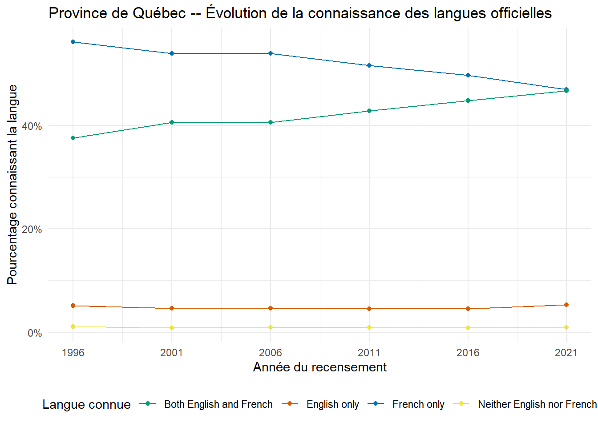
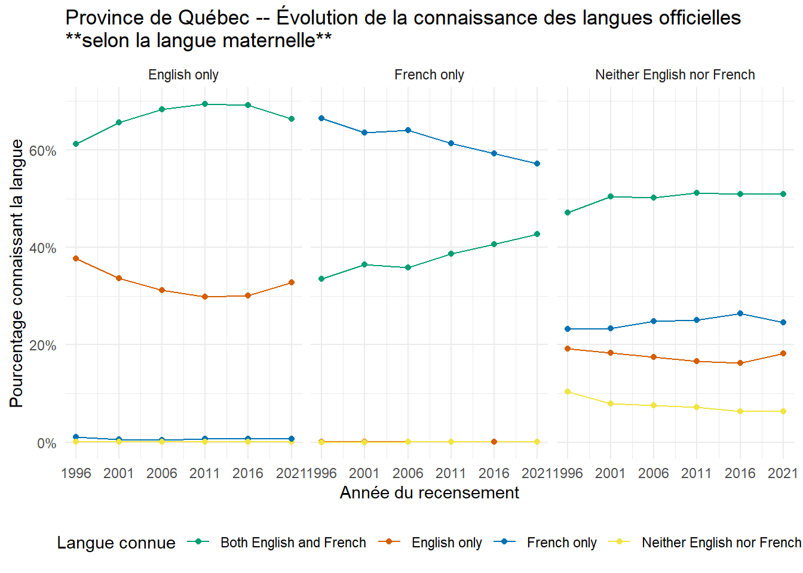
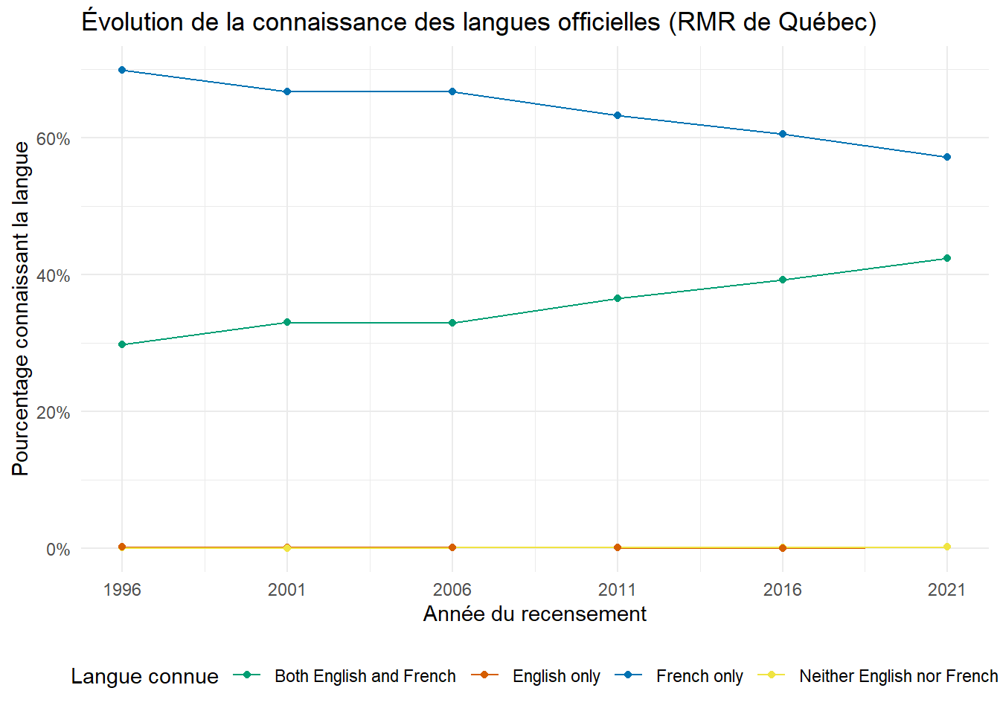
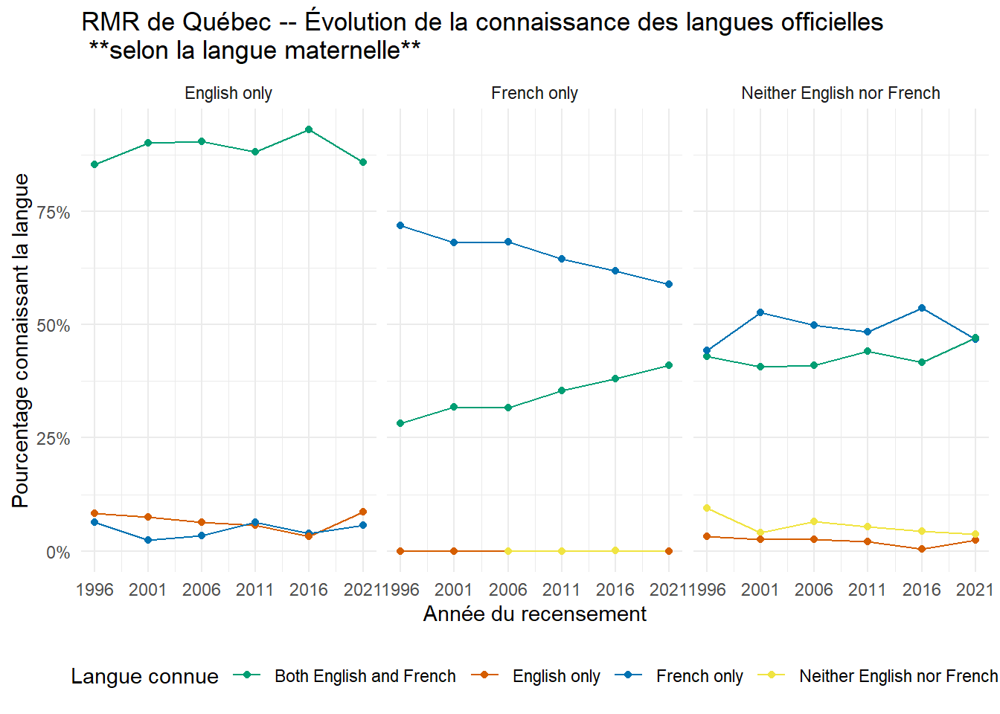

## Pourquoi est-ce qu'on est ici?  

Ce tweet de Frédéric Lacroix hier qui s'énerve le poil des jambes sur le fait que plus de gens soient bilingues à Québec qu'avant me fait un peu sourire.  Bien que la situation du français m'interpelle, je pense que ce n'est pas la bonne donnée à regarder et j'aurais plus paniqué si par exemple le pourcentage de "connait seulement l'anglais avait augmenté".   On travaille assez fort pour que nos gamisn apprennent l'anglais, ce serait con que ce pourcentage là ne monte pas.   


Anyway, je me demande  à quoi ça ressemble par langue maternelle.  Est-ce que les "non francophones ne naissance" apprennent plus le français qu'il y a 25 ans?     On va jouer un peu avec le package R {canpumf} par le toujours excellent [Jens Von Bergmann](https://mountainmath.github.io/canpumf/) qui rend les microdonnées publiques de Statcan facilement accessibles.  


spoiler: le "anglais seulement" a baissé chez les langues maternelles "anglais seulement" et est resté stable chez les "allophones".  Si j'ai une surprise, c'est ça:   je pensais que nos allophones auraient plus appris le français qu'il y a 25 ans.   

Oui, je sais, c'est horrible que mes étiquettes de données soient en anglais.  J'ai pas eu le temps de retravailler ça (et je n'ai pas l'intention), je fais ça gratis dans mes heures d'insomnies.


::: {.cell}

:::

::: {.cell}

:::

::: {.cell}

:::

# quebec entier    

## connaissances des langues   

::: {.cell}
::: {.cell-output-display}


```{=html}
<div id="qnetshdvzt" style="padding-left:0px;padding-right:0px;padding-top:10px;padding-bottom:10px;overflow-x:auto;overflow-y:auto;width:auto;height:auto;">
<style>#qnetshdvzt table {
  font-family: system-ui, 'Segoe UI', Roboto, Helvetica, Arial, sans-serif, 'Apple Color Emoji', 'Segoe UI Emoji', 'Segoe UI Symbol', 'Noto Color Emoji';
  -webkit-font-smoothing: antialiased;
  -moz-osx-font-smoothing: grayscale;
}

#qnetshdvzt thead, #qnetshdvzt tbody, #qnetshdvzt tfoot, #qnetshdvzt tr, #qnetshdvzt td, #qnetshdvzt th {
  border-style: none;
}

#qnetshdvzt p {
  margin: 0;
  padding: 0;
}

#qnetshdvzt .gt_table {
  display: table;
  border-collapse: collapse;
  line-height: normal;
  margin-left: auto;
  margin-right: auto;
  color: #333333;
  font-size: 16px;
  font-weight: normal;
  font-style: normal;
  background-color: #FFFFFF;
  width: auto;
  border-top-style: solid;
  border-top-width: 2px;
  border-top-color: #A8A8A8;
  border-right-style: none;
  border-right-width: 2px;
  border-right-color: #D3D3D3;
  border-bottom-style: solid;
  border-bottom-width: 2px;
  border-bottom-color: #A8A8A8;
  border-left-style: none;
  border-left-width: 2px;
  border-left-color: #D3D3D3;
}

#qnetshdvzt .gt_caption {
  padding-top: 4px;
  padding-bottom: 4px;
}

#qnetshdvzt .gt_title {
  color: #333333;
  font-size: 125%;
  font-weight: initial;
  padding-top: 4px;
  padding-bottom: 4px;
  padding-left: 5px;
  padding-right: 5px;
  border-bottom-color: #FFFFFF;
  border-bottom-width: 0;
}

#qnetshdvzt .gt_subtitle {
  color: #333333;
  font-size: 85%;
  font-weight: initial;
  padding-top: 3px;
  padding-bottom: 5px;
  padding-left: 5px;
  padding-right: 5px;
  border-top-color: #FFFFFF;
  border-top-width: 0;
}

#qnetshdvzt .gt_heading {
  background-color: #FFFFFF;
  text-align: center;
  border-bottom-color: #FFFFFF;
  border-left-style: none;
  border-left-width: 1px;
  border-left-color: #D3D3D3;
  border-right-style: none;
  border-right-width: 1px;
  border-right-color: #D3D3D3;
}

#qnetshdvzt .gt_bottom_border {
  border-bottom-style: solid;
  border-bottom-width: 2px;
  border-bottom-color: #D3D3D3;
}

#qnetshdvzt .gt_col_headings {
  border-top-style: solid;
  border-top-width: 2px;
  border-top-color: #D3D3D3;
  border-bottom-style: solid;
  border-bottom-width: 2px;
  border-bottom-color: #D3D3D3;
  border-left-style: none;
  border-left-width: 1px;
  border-left-color: #D3D3D3;
  border-right-style: none;
  border-right-width: 1px;
  border-right-color: #D3D3D3;
}

#qnetshdvzt .gt_col_heading {
  color: #333333;
  background-color: #FFFFFF;
  font-size: 100%;
  font-weight: normal;
  text-transform: inherit;
  border-left-style: none;
  border-left-width: 1px;
  border-left-color: #D3D3D3;
  border-right-style: none;
  border-right-width: 1px;
  border-right-color: #D3D3D3;
  vertical-align: bottom;
  padding-top: 5px;
  padding-bottom: 6px;
  padding-left: 5px;
  padding-right: 5px;
  overflow-x: hidden;
}

#qnetshdvzt .gt_column_spanner_outer {
  color: #333333;
  background-color: #FFFFFF;
  font-size: 100%;
  font-weight: normal;
  text-transform: inherit;
  padding-top: 0;
  padding-bottom: 0;
  padding-left: 4px;
  padding-right: 4px;
}

#qnetshdvzt .gt_column_spanner_outer:first-child {
  padding-left: 0;
}

#qnetshdvzt .gt_column_spanner_outer:last-child {
  padding-right: 0;
}

#qnetshdvzt .gt_column_spanner {
  border-bottom-style: solid;
  border-bottom-width: 2px;
  border-bottom-color: #D3D3D3;
  vertical-align: bottom;
  padding-top: 5px;
  padding-bottom: 5px;
  overflow-x: hidden;
  display: inline-block;
  width: 100%;
}

#qnetshdvzt .gt_spanner_row {
  border-bottom-style: hidden;
}

#qnetshdvzt .gt_group_heading {
  padding-top: 8px;
  padding-bottom: 8px;
  padding-left: 5px;
  padding-right: 5px;
  color: #333333;
  background-color: #FFFFFF;
  font-size: 100%;
  font-weight: initial;
  text-transform: inherit;
  border-top-style: solid;
  border-top-width: 2px;
  border-top-color: #D3D3D3;
  border-bottom-style: solid;
  border-bottom-width: 2px;
  border-bottom-color: #D3D3D3;
  border-left-style: none;
  border-left-width: 1px;
  border-left-color: #D3D3D3;
  border-right-style: none;
  border-right-width: 1px;
  border-right-color: #D3D3D3;
  vertical-align: middle;
  text-align: left;
}

#qnetshdvzt .gt_empty_group_heading {
  padding: 0.5px;
  color: #333333;
  background-color: #FFFFFF;
  font-size: 100%;
  font-weight: initial;
  border-top-style: solid;
  border-top-width: 2px;
  border-top-color: #D3D3D3;
  border-bottom-style: solid;
  border-bottom-width: 2px;
  border-bottom-color: #D3D3D3;
  vertical-align: middle;
}

#qnetshdvzt .gt_from_md > :first-child {
  margin-top: 0;
}

#qnetshdvzt .gt_from_md > :last-child {
  margin-bottom: 0;
}

#qnetshdvzt .gt_row {
  padding-top: 8px;
  padding-bottom: 8px;
  padding-left: 5px;
  padding-right: 5px;
  margin: 10px;
  border-top-style: solid;
  border-top-width: 1px;
  border-top-color: #D3D3D3;
  border-left-style: none;
  border-left-width: 1px;
  border-left-color: #D3D3D3;
  border-right-style: none;
  border-right-width: 1px;
  border-right-color: #D3D3D3;
  vertical-align: middle;
  overflow-x: hidden;
}

#qnetshdvzt .gt_stub {
  color: #333333;
  background-color: #FFFFFF;
  font-size: 100%;
  font-weight: initial;
  text-transform: inherit;
  border-right-style: solid;
  border-right-width: 2px;
  border-right-color: #D3D3D3;
  padding-left: 5px;
  padding-right: 5px;
}

#qnetshdvzt .gt_stub_row_group {
  color: #333333;
  background-color: #FFFFFF;
  font-size: 100%;
  font-weight: initial;
  text-transform: inherit;
  border-right-style: solid;
  border-right-width: 2px;
  border-right-color: #D3D3D3;
  padding-left: 5px;
  padding-right: 5px;
  vertical-align: top;
}

#qnetshdvzt .gt_row_group_first td {
  border-top-width: 2px;
}

#qnetshdvzt .gt_row_group_first th {
  border-top-width: 2px;
}

#qnetshdvzt .gt_summary_row {
  color: #333333;
  background-color: #FFFFFF;
  text-transform: inherit;
  padding-top: 8px;
  padding-bottom: 8px;
  padding-left: 5px;
  padding-right: 5px;
}

#qnetshdvzt .gt_first_summary_row {
  border-top-style: solid;
  border-top-color: #D3D3D3;
}

#qnetshdvzt .gt_first_summary_row.thick {
  border-top-width: 2px;
}

#qnetshdvzt .gt_last_summary_row {
  padding-top: 8px;
  padding-bottom: 8px;
  padding-left: 5px;
  padding-right: 5px;
  border-bottom-style: solid;
  border-bottom-width: 2px;
  border-bottom-color: #D3D3D3;
}

#qnetshdvzt .gt_grand_summary_row {
  color: #333333;
  background-color: #FFFFFF;
  text-transform: inherit;
  padding-top: 8px;
  padding-bottom: 8px;
  padding-left: 5px;
  padding-right: 5px;
}

#qnetshdvzt .gt_first_grand_summary_row {
  padding-top: 8px;
  padding-bottom: 8px;
  padding-left: 5px;
  padding-right: 5px;
  border-top-style: double;
  border-top-width: 6px;
  border-top-color: #D3D3D3;
}

#qnetshdvzt .gt_last_grand_summary_row_top {
  padding-top: 8px;
  padding-bottom: 8px;
  padding-left: 5px;
  padding-right: 5px;
  border-bottom-style: double;
  border-bottom-width: 6px;
  border-bottom-color: #D3D3D3;
}

#qnetshdvzt .gt_striped {
  background-color: rgba(128, 128, 128, 0.05);
}

#qnetshdvzt .gt_table_body {
  border-top-style: solid;
  border-top-width: 2px;
  border-top-color: #D3D3D3;
  border-bottom-style: solid;
  border-bottom-width: 2px;
  border-bottom-color: #D3D3D3;
}

#qnetshdvzt .gt_footnotes {
  color: #333333;
  background-color: #FFFFFF;
  border-bottom-style: none;
  border-bottom-width: 2px;
  border-bottom-color: #D3D3D3;
  border-left-style: none;
  border-left-width: 2px;
  border-left-color: #D3D3D3;
  border-right-style: none;
  border-right-width: 2px;
  border-right-color: #D3D3D3;
}

#qnetshdvzt .gt_footnote {
  margin: 0px;
  font-size: 90%;
  padding-top: 4px;
  padding-bottom: 4px;
  padding-left: 5px;
  padding-right: 5px;
}

#qnetshdvzt .gt_sourcenotes {
  color: #333333;
  background-color: #FFFFFF;
  border-bottom-style: none;
  border-bottom-width: 2px;
  border-bottom-color: #D3D3D3;
  border-left-style: none;
  border-left-width: 2px;
  border-left-color: #D3D3D3;
  border-right-style: none;
  border-right-width: 2px;
  border-right-color: #D3D3D3;
}

#qnetshdvzt .gt_sourcenote {
  font-size: 90%;
  padding-top: 4px;
  padding-bottom: 4px;
  padding-left: 5px;
  padding-right: 5px;
}

#qnetshdvzt .gt_left {
  text-align: left;
}

#qnetshdvzt .gt_center {
  text-align: center;
}

#qnetshdvzt .gt_right {
  text-align: right;
  font-variant-numeric: tabular-nums;
}

#qnetshdvzt .gt_font_normal {
  font-weight: normal;
}

#qnetshdvzt .gt_font_bold {
  font-weight: bold;
}

#qnetshdvzt .gt_font_italic {
  font-style: italic;
}

#qnetshdvzt .gt_super {
  font-size: 65%;
}

#qnetshdvzt .gt_footnote_marks {
  font-size: 75%;
  vertical-align: 0.4em;
  position: initial;
}

#qnetshdvzt .gt_asterisk {
  font-size: 100%;
  vertical-align: 0;
}

#qnetshdvzt .gt_indent_1 {
  text-indent: 5px;
}

#qnetshdvzt .gt_indent_2 {
  text-indent: 10px;
}

#qnetshdvzt .gt_indent_3 {
  text-indent: 15px;
}

#qnetshdvzt .gt_indent_4 {
  text-indent: 20px;
}

#qnetshdvzt .gt_indent_5 {
  text-indent: 25px;
}
</style>
<table class="gt_table" data-quarto-disable-processing="false" data-quarto-bootstrap="false">
  <caption>Québec entier - Évolution de la répartition des personnes connaissant les langues officielles</caption>
  <thead>
    <tr class="gt_col_headings">
      <th class="gt_col_heading gt_columns_bottom_border gt_left" rowspan="1" colspan="1" scope="col" id="knowledge_of_official_languages">knowledge_of_official_languages</th>
      <th class="gt_col_heading gt_columns_bottom_border gt_right" rowspan="1" colspan="1" scope="col" id="pop_1996">pop_1996</th>
      <th class="gt_col_heading gt_columns_bottom_border gt_right" rowspan="1" colspan="1" scope="col" id="pop_2001">pop_2001</th>
      <th class="gt_col_heading gt_columns_bottom_border gt_right" rowspan="1" colspan="1" scope="col" id="pop_2006">pop_2006</th>
      <th class="gt_col_heading gt_columns_bottom_border gt_right" rowspan="1" colspan="1" scope="col" id="pop_2011">pop_2011</th>
      <th class="gt_col_heading gt_columns_bottom_border gt_right" rowspan="1" colspan="1" scope="col" id="pop_2016">pop_2016</th>
      <th class="gt_col_heading gt_columns_bottom_border gt_right" rowspan="1" colspan="1" scope="col" id="pop_2021">pop_2021</th>
      <th class="gt_col_heading gt_columns_bottom_border gt_right" rowspan="1" colspan="1" scope="col" id="pct_pop_1996">pct_pop_1996</th>
      <th class="gt_col_heading gt_columns_bottom_border gt_right" rowspan="1" colspan="1" scope="col" id="pct_pop_2001">pct_pop_2001</th>
      <th class="gt_col_heading gt_columns_bottom_border gt_right" rowspan="1" colspan="1" scope="col" id="pct_pop_2006">pct_pop_2006</th>
      <th class="gt_col_heading gt_columns_bottom_border gt_right" rowspan="1" colspan="1" scope="col" id="pct_pop_2011">pct_pop_2011</th>
      <th class="gt_col_heading gt_columns_bottom_border gt_right" rowspan="1" colspan="1" scope="col" id="pct_pop_2016">pct_pop_2016</th>
      <th class="gt_col_heading gt_columns_bottom_border gt_right" rowspan="1" colspan="1" scope="col" id="pct_pop_2021">pct_pop_2021</th>
    </tr>
  </thead>
  <tbody class="gt_table_body">
    <tr><td headers="knowledge_of_official_languages" class="gt_row gt_left">Both English and French</td>
<td headers="pop_1996" class="gt_row gt_right">2,649,636</td>
<td headers="pop_2001" class="gt_row gt_right">2,892,051</td>
<td headers="pop_2006" class="gt_row gt_right">3,015,798</td>
<td headers="pop_2011" class="gt_row gt_right">3,317,595</td>
<td headers="pop_2016" class="gt_row gt_right">3,568,101</td>
<td headers="pop_2021" class="gt_row gt_right">3,881,736</td>
<td headers="pct_pop_1996" class="gt_row gt_right">37.6%</td>
<td headers="pct_pop_2001" class="gt_row gt_right">40.6%</td>
<td headers="pct_pop_2006" class="gt_row gt_right">40.6%</td>
<td headers="pct_pop_2011" class="gt_row gt_right">42.9%</td>
<td headers="pct_pop_2016" class="gt_row gt_right">44.8%</td>
<td headers="pct_pop_2021" class="gt_row gt_right">46.8%</td></tr>
    <tr><td headers="knowledge_of_official_languages" class="gt_row gt_left">English only</td>
<td headers="pop_1996" class="gt_row gt_right">361,584</td>
<td headers="pop_2001" class="gt_row gt_right">327,254</td>
<td headers="pop_2006" class="gt_row gt_right">341,090</td>
<td headers="pop_2011" class="gt_row gt_right">349,810</td>
<td headers="pop_2016" class="gt_row gt_right">362,415</td>
<td headers="pop_2021" class="gt_row gt_right">439,636</td>
<td headers="pct_pop_1996" class="gt_row gt_right">5.1%</td>
<td headers="pct_pop_2001" class="gt_row gt_right">4.6%</td>
<td headers="pct_pop_2006" class="gt_row gt_right">4.6%</td>
<td headers="pct_pop_2011" class="gt_row gt_right">4.5%</td>
<td headers="pct_pop_2016" class="gt_row gt_right">4.6%</td>
<td headers="pct_pop_2021" class="gt_row gt_right">5.3%</td></tr>
    <tr><td headers="knowledge_of_official_languages" class="gt_row gt_left">French only</td>
<td headers="pop_1996" class="gt_row gt_right">3,959,280</td>
<td headers="pop_2001" class="gt_row gt_right">3,845,430</td>
<td headers="pop_2006" class="gt_row gt_right">4,009,731</td>
<td headers="pop_2011" class="gt_row gt_right">3,998,237</td>
<td headers="pop_2016" class="gt_row gt_right">3,959,001</td>
<td headers="pop_2021" class="gt_row gt_right">3,903,522</td>
<td headers="pct_pop_1996" class="gt_row gt_right">56.2%</td>
<td headers="pct_pop_2001" class="gt_row gt_right">54.0%</td>
<td headers="pct_pop_2006" class="gt_row gt_right">53.9%</td>
<td headers="pct_pop_2011" class="gt_row gt_right">51.7%</td>
<td headers="pct_pop_2016" class="gt_row gt_right">49.7%</td>
<td headers="pct_pop_2021" class="gt_row gt_right">47.0%</td></tr>
    <tr><td headers="knowledge_of_official_languages" class="gt_row gt_left">Neither English nor French</td>
<td headers="pop_1996" class="gt_row gt_right">74,556</td>
<td headers="pop_2001" class="gt_row gt_right">60,548</td>
<td headers="pop_2006" class="gt_row gt_right">68,366</td>
<td headers="pop_2011" class="gt_row gt_right">72,845</td>
<td headers="pop_2016" class="gt_row gt_right">69,120</td>
<td headers="pop_2021" class="gt_row gt_right">77,472</td>
<td headers="pct_pop_1996" class="gt_row gt_right">1.1%</td>
<td headers="pct_pop_2001" class="gt_row gt_right">0.8%</td>
<td headers="pct_pop_2006" class="gt_row gt_right">0.9%</td>
<td headers="pct_pop_2011" class="gt_row gt_right">0.9%</td>
<td headers="pct_pop_2016" class="gt_row gt_right">0.9%</td>
<td headers="pct_pop_2021" class="gt_row gt_right">0.9%</td></tr>
  </tbody>
  
  
</table>
</div>
```


:::
:::

::: {.cell}
::: {.cell-output-display}
{width=672}
:::
:::


##  connaissance des langues selon la langue maternelle  


::: {.cell}
::: {.cell-output-display}


```{=html}
<div id="jasxkftqqs" style="padding-left:0px;padding-right:0px;padding-top:10px;padding-bottom:10px;overflow-x:auto;overflow-y:auto;width:auto;height:auto;">
<style>#jasxkftqqs table {
  font-family: system-ui, 'Segoe UI', Roboto, Helvetica, Arial, sans-serif, 'Apple Color Emoji', 'Segoe UI Emoji', 'Segoe UI Symbol', 'Noto Color Emoji';
  -webkit-font-smoothing: antialiased;
  -moz-osx-font-smoothing: grayscale;
}

#jasxkftqqs thead, #jasxkftqqs tbody, #jasxkftqqs tfoot, #jasxkftqqs tr, #jasxkftqqs td, #jasxkftqqs th {
  border-style: none;
}

#jasxkftqqs p {
  margin: 0;
  padding: 0;
}

#jasxkftqqs .gt_table {
  display: table;
  border-collapse: collapse;
  line-height: normal;
  margin-left: auto;
  margin-right: auto;
  color: #333333;
  font-size: 16px;
  font-weight: normal;
  font-style: normal;
  background-color: #FFFFFF;
  width: auto;
  border-top-style: solid;
  border-top-width: 2px;
  border-top-color: #A8A8A8;
  border-right-style: none;
  border-right-width: 2px;
  border-right-color: #D3D3D3;
  border-bottom-style: solid;
  border-bottom-width: 2px;
  border-bottom-color: #A8A8A8;
  border-left-style: none;
  border-left-width: 2px;
  border-left-color: #D3D3D3;
}

#jasxkftqqs .gt_caption {
  padding-top: 4px;
  padding-bottom: 4px;
}

#jasxkftqqs .gt_title {
  color: #333333;
  font-size: 125%;
  font-weight: initial;
  padding-top: 4px;
  padding-bottom: 4px;
  padding-left: 5px;
  padding-right: 5px;
  border-bottom-color: #FFFFFF;
  border-bottom-width: 0;
}

#jasxkftqqs .gt_subtitle {
  color: #333333;
  font-size: 85%;
  font-weight: initial;
  padding-top: 3px;
  padding-bottom: 5px;
  padding-left: 5px;
  padding-right: 5px;
  border-top-color: #FFFFFF;
  border-top-width: 0;
}

#jasxkftqqs .gt_heading {
  background-color: #FFFFFF;
  text-align: center;
  border-bottom-color: #FFFFFF;
  border-left-style: none;
  border-left-width: 1px;
  border-left-color: #D3D3D3;
  border-right-style: none;
  border-right-width: 1px;
  border-right-color: #D3D3D3;
}

#jasxkftqqs .gt_bottom_border {
  border-bottom-style: solid;
  border-bottom-width: 2px;
  border-bottom-color: #D3D3D3;
}

#jasxkftqqs .gt_col_headings {
  border-top-style: solid;
  border-top-width: 2px;
  border-top-color: #D3D3D3;
  border-bottom-style: solid;
  border-bottom-width: 2px;
  border-bottom-color: #D3D3D3;
  border-left-style: none;
  border-left-width: 1px;
  border-left-color: #D3D3D3;
  border-right-style: none;
  border-right-width: 1px;
  border-right-color: #D3D3D3;
}

#jasxkftqqs .gt_col_heading {
  color: #333333;
  background-color: #FFFFFF;
  font-size: 100%;
  font-weight: normal;
  text-transform: inherit;
  border-left-style: none;
  border-left-width: 1px;
  border-left-color: #D3D3D3;
  border-right-style: none;
  border-right-width: 1px;
  border-right-color: #D3D3D3;
  vertical-align: bottom;
  padding-top: 5px;
  padding-bottom: 6px;
  padding-left: 5px;
  padding-right: 5px;
  overflow-x: hidden;
}

#jasxkftqqs .gt_column_spanner_outer {
  color: #333333;
  background-color: #FFFFFF;
  font-size: 100%;
  font-weight: normal;
  text-transform: inherit;
  padding-top: 0;
  padding-bottom: 0;
  padding-left: 4px;
  padding-right: 4px;
}

#jasxkftqqs .gt_column_spanner_outer:first-child {
  padding-left: 0;
}

#jasxkftqqs .gt_column_spanner_outer:last-child {
  padding-right: 0;
}

#jasxkftqqs .gt_column_spanner {
  border-bottom-style: solid;
  border-bottom-width: 2px;
  border-bottom-color: #D3D3D3;
  vertical-align: bottom;
  padding-top: 5px;
  padding-bottom: 5px;
  overflow-x: hidden;
  display: inline-block;
  width: 100%;
}

#jasxkftqqs .gt_spanner_row {
  border-bottom-style: hidden;
}

#jasxkftqqs .gt_group_heading {
  padding-top: 8px;
  padding-bottom: 8px;
  padding-left: 5px;
  padding-right: 5px;
  color: #333333;
  background-color: #FFFFFF;
  font-size: 100%;
  font-weight: initial;
  text-transform: inherit;
  border-top-style: solid;
  border-top-width: 2px;
  border-top-color: #D3D3D3;
  border-bottom-style: solid;
  border-bottom-width: 2px;
  border-bottom-color: #D3D3D3;
  border-left-style: none;
  border-left-width: 1px;
  border-left-color: #D3D3D3;
  border-right-style: none;
  border-right-width: 1px;
  border-right-color: #D3D3D3;
  vertical-align: middle;
  text-align: left;
}

#jasxkftqqs .gt_empty_group_heading {
  padding: 0.5px;
  color: #333333;
  background-color: #FFFFFF;
  font-size: 100%;
  font-weight: initial;
  border-top-style: solid;
  border-top-width: 2px;
  border-top-color: #D3D3D3;
  border-bottom-style: solid;
  border-bottom-width: 2px;
  border-bottom-color: #D3D3D3;
  vertical-align: middle;
}

#jasxkftqqs .gt_from_md > :first-child {
  margin-top: 0;
}

#jasxkftqqs .gt_from_md > :last-child {
  margin-bottom: 0;
}

#jasxkftqqs .gt_row {
  padding-top: 8px;
  padding-bottom: 8px;
  padding-left: 5px;
  padding-right: 5px;
  margin: 10px;
  border-top-style: solid;
  border-top-width: 1px;
  border-top-color: #D3D3D3;
  border-left-style: none;
  border-left-width: 1px;
  border-left-color: #D3D3D3;
  border-right-style: none;
  border-right-width: 1px;
  border-right-color: #D3D3D3;
  vertical-align: middle;
  overflow-x: hidden;
}

#jasxkftqqs .gt_stub {
  color: #333333;
  background-color: #FFFFFF;
  font-size: 100%;
  font-weight: initial;
  text-transform: inherit;
  border-right-style: solid;
  border-right-width: 2px;
  border-right-color: #D3D3D3;
  padding-left: 5px;
  padding-right: 5px;
}

#jasxkftqqs .gt_stub_row_group {
  color: #333333;
  background-color: #FFFFFF;
  font-size: 100%;
  font-weight: initial;
  text-transform: inherit;
  border-right-style: solid;
  border-right-width: 2px;
  border-right-color: #D3D3D3;
  padding-left: 5px;
  padding-right: 5px;
  vertical-align: top;
}

#jasxkftqqs .gt_row_group_first td {
  border-top-width: 2px;
}

#jasxkftqqs .gt_row_group_first th {
  border-top-width: 2px;
}

#jasxkftqqs .gt_summary_row {
  color: #333333;
  background-color: #FFFFFF;
  text-transform: inherit;
  padding-top: 8px;
  padding-bottom: 8px;
  padding-left: 5px;
  padding-right: 5px;
}

#jasxkftqqs .gt_first_summary_row {
  border-top-style: solid;
  border-top-color: #D3D3D3;
}

#jasxkftqqs .gt_first_summary_row.thick {
  border-top-width: 2px;
}

#jasxkftqqs .gt_last_summary_row {
  padding-top: 8px;
  padding-bottom: 8px;
  padding-left: 5px;
  padding-right: 5px;
  border-bottom-style: solid;
  border-bottom-width: 2px;
  border-bottom-color: #D3D3D3;
}

#jasxkftqqs .gt_grand_summary_row {
  color: #333333;
  background-color: #FFFFFF;
  text-transform: inherit;
  padding-top: 8px;
  padding-bottom: 8px;
  padding-left: 5px;
  padding-right: 5px;
}

#jasxkftqqs .gt_first_grand_summary_row {
  padding-top: 8px;
  padding-bottom: 8px;
  padding-left: 5px;
  padding-right: 5px;
  border-top-style: double;
  border-top-width: 6px;
  border-top-color: #D3D3D3;
}

#jasxkftqqs .gt_last_grand_summary_row_top {
  padding-top: 8px;
  padding-bottom: 8px;
  padding-left: 5px;
  padding-right: 5px;
  border-bottom-style: double;
  border-bottom-width: 6px;
  border-bottom-color: #D3D3D3;
}

#jasxkftqqs .gt_striped {
  background-color: rgba(128, 128, 128, 0.05);
}

#jasxkftqqs .gt_table_body {
  border-top-style: solid;
  border-top-width: 2px;
  border-top-color: #D3D3D3;
  border-bottom-style: solid;
  border-bottom-width: 2px;
  border-bottom-color: #D3D3D3;
}

#jasxkftqqs .gt_footnotes {
  color: #333333;
  background-color: #FFFFFF;
  border-bottom-style: none;
  border-bottom-width: 2px;
  border-bottom-color: #D3D3D3;
  border-left-style: none;
  border-left-width: 2px;
  border-left-color: #D3D3D3;
  border-right-style: none;
  border-right-width: 2px;
  border-right-color: #D3D3D3;
}

#jasxkftqqs .gt_footnote {
  margin: 0px;
  font-size: 90%;
  padding-top: 4px;
  padding-bottom: 4px;
  padding-left: 5px;
  padding-right: 5px;
}

#jasxkftqqs .gt_sourcenotes {
  color: #333333;
  background-color: #FFFFFF;
  border-bottom-style: none;
  border-bottom-width: 2px;
  border-bottom-color: #D3D3D3;
  border-left-style: none;
  border-left-width: 2px;
  border-left-color: #D3D3D3;
  border-right-style: none;
  border-right-width: 2px;
  border-right-color: #D3D3D3;
}

#jasxkftqqs .gt_sourcenote {
  font-size: 90%;
  padding-top: 4px;
  padding-bottom: 4px;
  padding-left: 5px;
  padding-right: 5px;
}

#jasxkftqqs .gt_left {
  text-align: left;
}

#jasxkftqqs .gt_center {
  text-align: center;
}

#jasxkftqqs .gt_right {
  text-align: right;
  font-variant-numeric: tabular-nums;
}

#jasxkftqqs .gt_font_normal {
  font-weight: normal;
}

#jasxkftqqs .gt_font_bold {
  font-weight: bold;
}

#jasxkftqqs .gt_font_italic {
  font-style: italic;
}

#jasxkftqqs .gt_super {
  font-size: 65%;
}

#jasxkftqqs .gt_footnote_marks {
  font-size: 75%;
  vertical-align: 0.4em;
  position: initial;
}

#jasxkftqqs .gt_asterisk {
  font-size: 100%;
  vertical-align: 0;
}

#jasxkftqqs .gt_indent_1 {
  text-indent: 5px;
}

#jasxkftqqs .gt_indent_2 {
  text-indent: 10px;
}

#jasxkftqqs .gt_indent_3 {
  text-indent: 15px;
}

#jasxkftqqs .gt_indent_4 {
  text-indent: 20px;
}

#jasxkftqqs .gt_indent_5 {
  text-indent: 25px;
}
</style>
<table class="gt_table" data-quarto-disable-processing="false" data-quarto-bootstrap="false">
  <caption>Québec entier - Évolution de la répartition des personnes connaissant les langues officielles selon la langue maternelle ( sauf langue maternelle bilingue</caption>
  <thead>
    <tr class="gt_col_headings">
      <th class="gt_col_heading gt_columns_bottom_border gt_left" rowspan="1" colspan="1" scope="col" id="mother_tongue">mother_tongue</th>
      <th class="gt_col_heading gt_columns_bottom_border gt_left" rowspan="1" colspan="1" scope="col" id="knowledge_of_official_languages">knowledge_of_official_languages</th>
      <th class="gt_col_heading gt_columns_bottom_border gt_right" rowspan="1" colspan="1" scope="col" id="pop_1996">pop_1996</th>
      <th class="gt_col_heading gt_columns_bottom_border gt_right" rowspan="1" colspan="1" scope="col" id="pop_2001">pop_2001</th>
      <th class="gt_col_heading gt_columns_bottom_border gt_right" rowspan="1" colspan="1" scope="col" id="pop_2006">pop_2006</th>
      <th class="gt_col_heading gt_columns_bottom_border gt_right" rowspan="1" colspan="1" scope="col" id="pop_2011">pop_2011</th>
      <th class="gt_col_heading gt_columns_bottom_border gt_right" rowspan="1" colspan="1" scope="col" id="pop_2016">pop_2016</th>
      <th class="gt_col_heading gt_columns_bottom_border gt_right" rowspan="1" colspan="1" scope="col" id="pop_2021">pop_2021</th>
      <th class="gt_col_heading gt_columns_bottom_border gt_right" rowspan="1" colspan="1" scope="col" id="pct_pop_1996">pct_pop_1996</th>
      <th class="gt_col_heading gt_columns_bottom_border gt_right" rowspan="1" colspan="1" scope="col" id="pct_pop_2001">pct_pop_2001</th>
      <th class="gt_col_heading gt_columns_bottom_border gt_right" rowspan="1" colspan="1" scope="col" id="pct_pop_2006">pct_pop_2006</th>
      <th class="gt_col_heading gt_columns_bottom_border gt_right" rowspan="1" colspan="1" scope="col" id="pct_pop_2011">pct_pop_2011</th>
      <th class="gt_col_heading gt_columns_bottom_border gt_right" rowspan="1" colspan="1" scope="col" id="pct_pop_2016">pct_pop_2016</th>
      <th class="gt_col_heading gt_columns_bottom_border gt_right" rowspan="1" colspan="1" scope="col" id="pct_pop_2021">pct_pop_2021</th>
    </tr>
  </thead>
  <tbody class="gt_table_body">
    <tr><td headers="mother_tongue" class="gt_row gt_left">English only</td>
<td headers="knowledge_of_official_languages" class="gt_row gt_left">Both English and French</td>
<td headers="pop_1996" class="gt_row gt_right">361,440</td>
<td headers="pop_2001" class="gt_row gt_right">362,503</td>
<td headers="pop_2006" class="gt_row gt_right">406,459</td>
<td headers="pop_2011" class="gt_row gt_right">425,567</td>
<td headers="pop_2016" class="gt_row gt_right">430,534</td>
<td headers="pop_2021" class="gt_row gt_right">448,380</td>
<td headers="pct_pop_1996" class="gt_row gt_right">61.2%</td>
<td headers="pct_pop_2001" class="gt_row gt_right">65.6%</td>
<td headers="pct_pop_2006" class="gt_row gt_right">68.3%</td>
<td headers="pct_pop_2011" class="gt_row gt_right">69.4%</td>
<td headers="pct_pop_2016" class="gt_row gt_right">69.2%</td>
<td headers="pct_pop_2021" class="gt_row gt_right">66.4%</td></tr>
    <tr><td headers="mother_tongue" class="gt_row gt_left">English only</td>
<td headers="knowledge_of_official_languages" class="gt_row gt_left">English only</td>
<td headers="pop_1996" class="gt_row gt_right">222,300</td>
<td headers="pop_2001" class="gt_row gt_right">185,999</td>
<td headers="pop_2006" class="gt_row gt_right">185,454</td>
<td headers="pop_2011" class="gt_row gt_right">183,167</td>
<td headers="pop_2016" class="gt_row gt_right">187,171</td>
<td headers="pop_2021" class="gt_row gt_right">221,596</td>
<td headers="pct_pop_1996" class="gt_row gt_right">37.7%</td>
<td headers="pct_pop_2001" class="gt_row gt_right">33.7%</td>
<td headers="pct_pop_2006" class="gt_row gt_right">31.2%</td>
<td headers="pct_pop_2011" class="gt_row gt_right">29.9%</td>
<td headers="pct_pop_2016" class="gt_row gt_right">30.1%</td>
<td headers="pct_pop_2021" class="gt_row gt_right">32.8%</td></tr>
    <tr><td headers="mother_tongue" class="gt_row gt_left">English only</td>
<td headers="knowledge_of_official_languages" class="gt_row gt_left">French only</td>
<td headers="pop_1996" class="gt_row gt_right">6,300</td>
<td headers="pop_2001" class="gt_row gt_right">3,477</td>
<td headers="pop_2006" class="gt_row gt_right">2,997</td>
<td headers="pop_2011" class="gt_row gt_right">4,182</td>
<td headers="pop_2016" class="gt_row gt_right">4,334</td>
<td headers="pop_2021" class="gt_row gt_right">4,631</td>
<td headers="pct_pop_1996" class="gt_row gt_right">1.1%</td>
<td headers="pct_pop_2001" class="gt_row gt_right">0.6%</td>
<td headers="pct_pop_2006" class="gt_row gt_right">0.5%</td>
<td headers="pct_pop_2011" class="gt_row gt_right">0.7%</td>
<td headers="pct_pop_2016" class="gt_row gt_right">0.7%</td>
<td headers="pct_pop_2021" class="gt_row gt_right">0.7%</td></tr>
    <tr><td headers="mother_tongue" class="gt_row gt_left">English only</td>
<td headers="knowledge_of_official_languages" class="gt_row gt_left">Neither English nor French</td>
<td headers="pop_1996" class="gt_row gt_right">324</td>
<td headers="pop_2001" class="gt_row gt_right">369</td>
<td headers="pop_2006" class="gt_row gt_right">296</td>
<td headers="pop_2011" class="gt_row gt_right">486</td>
<td headers="pop_2016" class="gt_row gt_right">444</td>
<td headers="pop_2021" class="gt_row gt_right">556</td>
<td headers="pct_pop_1996" class="gt_row gt_right">0.1%</td>
<td headers="pct_pop_2001" class="gt_row gt_right">0.1%</td>
<td headers="pct_pop_2006" class="gt_row gt_right">0.0%</td>
<td headers="pct_pop_2011" class="gt_row gt_right">0.1%</td>
<td headers="pct_pop_2016" class="gt_row gt_right">0.1%</td>
<td headers="pct_pop_2021" class="gt_row gt_right">0.1%</td></tr>
    <tr><td headers="mother_tongue" class="gt_row gt_left">French only</td>
<td headers="knowledge_of_official_languages" class="gt_row gt_left">Both English and French</td>
<td headers="pop_1996" class="gt_row gt_right">1,905,696</td>
<td headers="pop_2001" class="gt_row gt_right">2,103,274</td>
<td headers="pop_2006" class="gt_row gt_right">2,119,530</td>
<td headers="pop_2011" class="gt_row gt_right">2,358,821</td>
<td headers="pop_2016" class="gt_row gt_right">2,520,789</td>
<td headers="pop_2021" class="gt_row gt_right">2,694,578</td>
<td headers="pct_pop_1996" class="gt_row gt_right">33.5%</td>
<td headers="pct_pop_2001" class="gt_row gt_right">36.5%</td>
<td headers="pct_pop_2006" class="gt_row gt_right">35.9%</td>
<td headers="pct_pop_2011" class="gt_row gt_right">38.6%</td>
<td headers="pct_pop_2016" class="gt_row gt_right">40.7%</td>
<td headers="pct_pop_2021" class="gt_row gt_right">42.7%</td></tr>
    <tr><td headers="mother_tongue" class="gt_row gt_left">French only</td>
<td headers="knowledge_of_official_languages" class="gt_row gt_left">English only</td>
<td headers="pop_1996" class="gt_row gt_right">1,656</td>
<td headers="pop_2001" class="gt_row gt_right">2,107</td>
<td headers="pop_2006" class="gt_row gt_right">1,517</td>
<td headers="pop_2011" class="gt_row gt_right">2,318</td>
<td headers="pop_2016" class="gt_row gt_right">2,111</td>
<td headers="pop_2021" class="gt_row gt_right">2,297</td>
<td headers="pct_pop_1996" class="gt_row gt_right">0.0%</td>
<td headers="pct_pop_2001" class="gt_row gt_right">0.0%</td>
<td headers="pct_pop_2006" class="gt_row gt_right">0.0%</td>
<td headers="pct_pop_2011" class="gt_row gt_right">0.0%</td>
<td headers="pct_pop_2016" class="gt_row gt_right">0.0%</td>
<td headers="pct_pop_2021" class="gt_row gt_right">0.0%</td></tr>
    <tr><td headers="mother_tongue" class="gt_row gt_left">French only</td>
<td headers="knowledge_of_official_languages" class="gt_row gt_left">French only</td>
<td headers="pop_1996" class="gt_row gt_right">3,784,680</td>
<td headers="pop_2001" class="gt_row gt_right">3,663,235</td>
<td headers="pop_2006" class="gt_row gt_right">3,785,692</td>
<td headers="pop_2011" class="gt_row gt_right">3,744,950</td>
<td headers="pop_2016" class="gt_row gt_right">3,671,484</td>
<td headers="pop_2021" class="gt_row gt_right">3,604,342</td>
<td headers="pct_pop_1996" class="gt_row gt_right">66.5%</td>
<td headers="pct_pop_2001" class="gt_row gt_right">63.5%</td>
<td headers="pct_pop_2006" class="gt_row gt_right">64.1%</td>
<td headers="pct_pop_2011" class="gt_row gt_right">61.3%</td>
<td headers="pct_pop_2016" class="gt_row gt_right">59.3%</td>
<td headers="pct_pop_2021" class="gt_row gt_right">57.2%</td></tr>
    <tr><td headers="mother_tongue" class="gt_row gt_left">French only</td>
<td headers="knowledge_of_official_languages" class="gt_row gt_left">Neither English nor French</td>
<td headers="pop_1996" class="gt_row gt_right">540</td>
<td headers="pop_2001" class="gt_row gt_right">849</td>
<td headers="pop_2006" class="gt_row gt_right">1,258</td>
<td headers="pop_2011" class="gt_row gt_right">1,895</td>
<td headers="pop_2016" class="gt_row gt_right">1,963</td>
<td headers="pop_2021" class="gt_row gt_right">2,112</td>
<td headers="pct_pop_1996" class="gt_row gt_right">0.0%</td>
<td headers="pct_pop_2001" class="gt_row gt_right">0.0%</td>
<td headers="pct_pop_2006" class="gt_row gt_right">0.0%</td>
<td headers="pct_pop_2011" class="gt_row gt_right">0.0%</td>
<td headers="pct_pop_2016" class="gt_row gt_right">0.0%</td>
<td headers="pct_pop_2021" class="gt_row gt_right">0.0%</td></tr>
    <tr><td headers="mother_tongue" class="gt_row gt_left">Neither English nor French</td>
<td headers="knowledge_of_official_languages" class="gt_row gt_left">Both English and French</td>
<td headers="pop_1996" class="gt_row gt_right">334,728</td>
<td headers="pop_2001" class="gt_row gt_right">379,630</td>
<td headers="pop_2006" class="gt_row gt_right">441,863</td>
<td headers="pop_2011" class="gt_row gt_right">506,037</td>
<td headers="pop_2016" class="gt_row gt_right">538,066</td>
<td headers="pop_2021" class="gt_row gt_right">597,469</td>
<td headers="pct_pop_1996" class="gt_row gt_right">47.1%</td>
<td headers="pct_pop_2001" class="gt_row gt_right">50.4%</td>
<td headers="pct_pop_2006" class="gt_row gt_right">50.2%</td>
<td headers="pct_pop_2011" class="gt_row gt_right">51.2%</td>
<td headers="pct_pop_2016" class="gt_row gt_right">51.0%</td>
<td headers="pct_pop_2021" class="gt_row gt_right">50.9%</td></tr>
    <tr><td headers="mother_tongue" class="gt_row gt_left">Neither English nor French</td>
<td headers="knowledge_of_official_languages" class="gt_row gt_left">English only</td>
<td headers="pop_1996" class="gt_row gt_right">136,656</td>
<td headers="pop_2001" class="gt_row gt_right">138,150</td>
<td headers="pop_2006" class="gt_row gt_right">153,416</td>
<td headers="pop_2011" class="gt_row gt_right">163,872</td>
<td headers="pop_2016" class="gt_row gt_right">171,354</td>
<td headers="pop_2021" class="gt_row gt_right">213,075</td>
<td headers="pct_pop_1996" class="gt_row gt_right">19.2%</td>
<td headers="pct_pop_2001" class="gt_row gt_right">18.3%</td>
<td headers="pct_pop_2006" class="gt_row gt_right">17.4%</td>
<td headers="pct_pop_2011" class="gt_row gt_right">16.6%</td>
<td headers="pct_pop_2016" class="gt_row gt_right">16.2%</td>
<td headers="pct_pop_2021" class="gt_row gt_right">18.2%</td></tr>
    <tr><td headers="mother_tongue" class="gt_row gt_left">Neither English nor French</td>
<td headers="knowledge_of_official_languages" class="gt_row gt_left">French only</td>
<td headers="pop_1996" class="gt_row gt_right">165,276</td>
<td headers="pop_2001" class="gt_row gt_right">175,871</td>
<td headers="pop_2006" class="gt_row gt_right">218,712</td>
<td headers="pop_2011" class="gt_row gt_right">247,764</td>
<td headers="pop_2016" class="gt_row gt_right">279,404</td>
<td headers="pop_2021" class="gt_row gt_right">288,175</td>
<td headers="pct_pop_1996" class="gt_row gt_right">23.3%</td>
<td headers="pct_pop_2001" class="gt_row gt_right">23.4%</td>
<td headers="pct_pop_2006" class="gt_row gt_right">24.8%</td>
<td headers="pct_pop_2011" class="gt_row gt_right">25.1%</td>
<td headers="pct_pop_2016" class="gt_row gt_right">26.5%</td>
<td headers="pct_pop_2021" class="gt_row gt_right">24.6%</td></tr>
    <tr><td headers="mother_tongue" class="gt_row gt_left">Neither English nor French</td>
<td headers="knowledge_of_official_languages" class="gt_row gt_left">Neither English nor French</td>
<td headers="pop_1996" class="gt_row gt_right">73,620</td>
<td headers="pop_2001" class="gt_row gt_right">59,329</td>
<td headers="pop_2006" class="gt_row gt_right">66,664</td>
<td headers="pop_2011" class="gt_row gt_right">70,465</td>
<td headers="pop_2016" class="gt_row gt_right">66,564</td>
<td headers="pop_2021" class="gt_row gt_right">74,730</td>
<td headers="pct_pop_1996" class="gt_row gt_right">10.4%</td>
<td headers="pct_pop_2001" class="gt_row gt_right">7.9%</td>
<td headers="pct_pop_2006" class="gt_row gt_right">7.6%</td>
<td headers="pct_pop_2011" class="gt_row gt_right">7.1%</td>
<td headers="pct_pop_2016" class="gt_row gt_right">6.3%</td>
<td headers="pct_pop_2021" class="gt_row gt_right">6.4%</td></tr>
  </tbody>
  
  
</table>
</div>
```


:::
:::

::: {.cell}
::: {.cell-output-display}
{width=672}
:::
:::

#  RMR de Québec      

## connaissance des langues  


::: {.cell}
::: {.cell-output-display}


```{=html}
<div id="soqoqushnw" style="padding-left:0px;padding-right:0px;padding-top:10px;padding-bottom:10px;overflow-x:auto;overflow-y:auto;width:auto;height:auto;">
<style>#soqoqushnw table {
  font-family: system-ui, 'Segoe UI', Roboto, Helvetica, Arial, sans-serif, 'Apple Color Emoji', 'Segoe UI Emoji', 'Segoe UI Symbol', 'Noto Color Emoji';
  -webkit-font-smoothing: antialiased;
  -moz-osx-font-smoothing: grayscale;
}

#soqoqushnw thead, #soqoqushnw tbody, #soqoqushnw tfoot, #soqoqushnw tr, #soqoqushnw td, #soqoqushnw th {
  border-style: none;
}

#soqoqushnw p {
  margin: 0;
  padding: 0;
}

#soqoqushnw .gt_table {
  display: table;
  border-collapse: collapse;
  line-height: normal;
  margin-left: auto;
  margin-right: auto;
  color: #333333;
  font-size: 16px;
  font-weight: normal;
  font-style: normal;
  background-color: #FFFFFF;
  width: auto;
  border-top-style: solid;
  border-top-width: 2px;
  border-top-color: #A8A8A8;
  border-right-style: none;
  border-right-width: 2px;
  border-right-color: #D3D3D3;
  border-bottom-style: solid;
  border-bottom-width: 2px;
  border-bottom-color: #A8A8A8;
  border-left-style: none;
  border-left-width: 2px;
  border-left-color: #D3D3D3;
}

#soqoqushnw .gt_caption {
  padding-top: 4px;
  padding-bottom: 4px;
}

#soqoqushnw .gt_title {
  color: #333333;
  font-size: 125%;
  font-weight: initial;
  padding-top: 4px;
  padding-bottom: 4px;
  padding-left: 5px;
  padding-right: 5px;
  border-bottom-color: #FFFFFF;
  border-bottom-width: 0;
}

#soqoqushnw .gt_subtitle {
  color: #333333;
  font-size: 85%;
  font-weight: initial;
  padding-top: 3px;
  padding-bottom: 5px;
  padding-left: 5px;
  padding-right: 5px;
  border-top-color: #FFFFFF;
  border-top-width: 0;
}

#soqoqushnw .gt_heading {
  background-color: #FFFFFF;
  text-align: center;
  border-bottom-color: #FFFFFF;
  border-left-style: none;
  border-left-width: 1px;
  border-left-color: #D3D3D3;
  border-right-style: none;
  border-right-width: 1px;
  border-right-color: #D3D3D3;
}

#soqoqushnw .gt_bottom_border {
  border-bottom-style: solid;
  border-bottom-width: 2px;
  border-bottom-color: #D3D3D3;
}

#soqoqushnw .gt_col_headings {
  border-top-style: solid;
  border-top-width: 2px;
  border-top-color: #D3D3D3;
  border-bottom-style: solid;
  border-bottom-width: 2px;
  border-bottom-color: #D3D3D3;
  border-left-style: none;
  border-left-width: 1px;
  border-left-color: #D3D3D3;
  border-right-style: none;
  border-right-width: 1px;
  border-right-color: #D3D3D3;
}

#soqoqushnw .gt_col_heading {
  color: #333333;
  background-color: #FFFFFF;
  font-size: 100%;
  font-weight: normal;
  text-transform: inherit;
  border-left-style: none;
  border-left-width: 1px;
  border-left-color: #D3D3D3;
  border-right-style: none;
  border-right-width: 1px;
  border-right-color: #D3D3D3;
  vertical-align: bottom;
  padding-top: 5px;
  padding-bottom: 6px;
  padding-left: 5px;
  padding-right: 5px;
  overflow-x: hidden;
}

#soqoqushnw .gt_column_spanner_outer {
  color: #333333;
  background-color: #FFFFFF;
  font-size: 100%;
  font-weight: normal;
  text-transform: inherit;
  padding-top: 0;
  padding-bottom: 0;
  padding-left: 4px;
  padding-right: 4px;
}

#soqoqushnw .gt_column_spanner_outer:first-child {
  padding-left: 0;
}

#soqoqushnw .gt_column_spanner_outer:last-child {
  padding-right: 0;
}

#soqoqushnw .gt_column_spanner {
  border-bottom-style: solid;
  border-bottom-width: 2px;
  border-bottom-color: #D3D3D3;
  vertical-align: bottom;
  padding-top: 5px;
  padding-bottom: 5px;
  overflow-x: hidden;
  display: inline-block;
  width: 100%;
}

#soqoqushnw .gt_spanner_row {
  border-bottom-style: hidden;
}

#soqoqushnw .gt_group_heading {
  padding-top: 8px;
  padding-bottom: 8px;
  padding-left: 5px;
  padding-right: 5px;
  color: #333333;
  background-color: #FFFFFF;
  font-size: 100%;
  font-weight: initial;
  text-transform: inherit;
  border-top-style: solid;
  border-top-width: 2px;
  border-top-color: #D3D3D3;
  border-bottom-style: solid;
  border-bottom-width: 2px;
  border-bottom-color: #D3D3D3;
  border-left-style: none;
  border-left-width: 1px;
  border-left-color: #D3D3D3;
  border-right-style: none;
  border-right-width: 1px;
  border-right-color: #D3D3D3;
  vertical-align: middle;
  text-align: left;
}

#soqoqushnw .gt_empty_group_heading {
  padding: 0.5px;
  color: #333333;
  background-color: #FFFFFF;
  font-size: 100%;
  font-weight: initial;
  border-top-style: solid;
  border-top-width: 2px;
  border-top-color: #D3D3D3;
  border-bottom-style: solid;
  border-bottom-width: 2px;
  border-bottom-color: #D3D3D3;
  vertical-align: middle;
}

#soqoqushnw .gt_from_md > :first-child {
  margin-top: 0;
}

#soqoqushnw .gt_from_md > :last-child {
  margin-bottom: 0;
}

#soqoqushnw .gt_row {
  padding-top: 8px;
  padding-bottom: 8px;
  padding-left: 5px;
  padding-right: 5px;
  margin: 10px;
  border-top-style: solid;
  border-top-width: 1px;
  border-top-color: #D3D3D3;
  border-left-style: none;
  border-left-width: 1px;
  border-left-color: #D3D3D3;
  border-right-style: none;
  border-right-width: 1px;
  border-right-color: #D3D3D3;
  vertical-align: middle;
  overflow-x: hidden;
}

#soqoqushnw .gt_stub {
  color: #333333;
  background-color: #FFFFFF;
  font-size: 100%;
  font-weight: initial;
  text-transform: inherit;
  border-right-style: solid;
  border-right-width: 2px;
  border-right-color: #D3D3D3;
  padding-left: 5px;
  padding-right: 5px;
}

#soqoqushnw .gt_stub_row_group {
  color: #333333;
  background-color: #FFFFFF;
  font-size: 100%;
  font-weight: initial;
  text-transform: inherit;
  border-right-style: solid;
  border-right-width: 2px;
  border-right-color: #D3D3D3;
  padding-left: 5px;
  padding-right: 5px;
  vertical-align: top;
}

#soqoqushnw .gt_row_group_first td {
  border-top-width: 2px;
}

#soqoqushnw .gt_row_group_first th {
  border-top-width: 2px;
}

#soqoqushnw .gt_summary_row {
  color: #333333;
  background-color: #FFFFFF;
  text-transform: inherit;
  padding-top: 8px;
  padding-bottom: 8px;
  padding-left: 5px;
  padding-right: 5px;
}

#soqoqushnw .gt_first_summary_row {
  border-top-style: solid;
  border-top-color: #D3D3D3;
}

#soqoqushnw .gt_first_summary_row.thick {
  border-top-width: 2px;
}

#soqoqushnw .gt_last_summary_row {
  padding-top: 8px;
  padding-bottom: 8px;
  padding-left: 5px;
  padding-right: 5px;
  border-bottom-style: solid;
  border-bottom-width: 2px;
  border-bottom-color: #D3D3D3;
}

#soqoqushnw .gt_grand_summary_row {
  color: #333333;
  background-color: #FFFFFF;
  text-transform: inherit;
  padding-top: 8px;
  padding-bottom: 8px;
  padding-left: 5px;
  padding-right: 5px;
}

#soqoqushnw .gt_first_grand_summary_row {
  padding-top: 8px;
  padding-bottom: 8px;
  padding-left: 5px;
  padding-right: 5px;
  border-top-style: double;
  border-top-width: 6px;
  border-top-color: #D3D3D3;
}

#soqoqushnw .gt_last_grand_summary_row_top {
  padding-top: 8px;
  padding-bottom: 8px;
  padding-left: 5px;
  padding-right: 5px;
  border-bottom-style: double;
  border-bottom-width: 6px;
  border-bottom-color: #D3D3D3;
}

#soqoqushnw .gt_striped {
  background-color: rgba(128, 128, 128, 0.05);
}

#soqoqushnw .gt_table_body {
  border-top-style: solid;
  border-top-width: 2px;
  border-top-color: #D3D3D3;
  border-bottom-style: solid;
  border-bottom-width: 2px;
  border-bottom-color: #D3D3D3;
}

#soqoqushnw .gt_footnotes {
  color: #333333;
  background-color: #FFFFFF;
  border-bottom-style: none;
  border-bottom-width: 2px;
  border-bottom-color: #D3D3D3;
  border-left-style: none;
  border-left-width: 2px;
  border-left-color: #D3D3D3;
  border-right-style: none;
  border-right-width: 2px;
  border-right-color: #D3D3D3;
}

#soqoqushnw .gt_footnote {
  margin: 0px;
  font-size: 90%;
  padding-top: 4px;
  padding-bottom: 4px;
  padding-left: 5px;
  padding-right: 5px;
}

#soqoqushnw .gt_sourcenotes {
  color: #333333;
  background-color: #FFFFFF;
  border-bottom-style: none;
  border-bottom-width: 2px;
  border-bottom-color: #D3D3D3;
  border-left-style: none;
  border-left-width: 2px;
  border-left-color: #D3D3D3;
  border-right-style: none;
  border-right-width: 2px;
  border-right-color: #D3D3D3;
}

#soqoqushnw .gt_sourcenote {
  font-size: 90%;
  padding-top: 4px;
  padding-bottom: 4px;
  padding-left: 5px;
  padding-right: 5px;
}

#soqoqushnw .gt_left {
  text-align: left;
}

#soqoqushnw .gt_center {
  text-align: center;
}

#soqoqushnw .gt_right {
  text-align: right;
  font-variant-numeric: tabular-nums;
}

#soqoqushnw .gt_font_normal {
  font-weight: normal;
}

#soqoqushnw .gt_font_bold {
  font-weight: bold;
}

#soqoqushnw .gt_font_italic {
  font-style: italic;
}

#soqoqushnw .gt_super {
  font-size: 65%;
}

#soqoqushnw .gt_footnote_marks {
  font-size: 75%;
  vertical-align: 0.4em;
  position: initial;
}

#soqoqushnw .gt_asterisk {
  font-size: 100%;
  vertical-align: 0;
}

#soqoqushnw .gt_indent_1 {
  text-indent: 5px;
}

#soqoqushnw .gt_indent_2 {
  text-indent: 10px;
}

#soqoqushnw .gt_indent_3 {
  text-indent: 15px;
}

#soqoqushnw .gt_indent_4 {
  text-indent: 20px;
}

#soqoqushnw .gt_indent_5 {
  text-indent: 25px;
}
</style>
<table class="gt_table" data-quarto-disable-processing="false" data-quarto-bootstrap="false">
  <caption>RMR Québec - Évolution de la répartition des personnes connaissant les langues officielles</caption>
  <thead>
    <tr class="gt_col_headings">
      <th class="gt_col_heading gt_columns_bottom_border gt_left" rowspan="1" colspan="1" scope="col" id="knowledge_of_official_languages">knowledge_of_official_languages</th>
      <th class="gt_col_heading gt_columns_bottom_border gt_right" rowspan="1" colspan="1" scope="col" id="pop_1996">pop_1996</th>
      <th class="gt_col_heading gt_columns_bottom_border gt_right" rowspan="1" colspan="1" scope="col" id="pop_2001">pop_2001</th>
      <th class="gt_col_heading gt_columns_bottom_border gt_right" rowspan="1" colspan="1" scope="col" id="pop_2006">pop_2006</th>
      <th class="gt_col_heading gt_columns_bottom_border gt_right" rowspan="1" colspan="1" scope="col" id="pop_2011">pop_2011</th>
      <th class="gt_col_heading gt_columns_bottom_border gt_right" rowspan="1" colspan="1" scope="col" id="pop_2016">pop_2016</th>
      <th class="gt_col_heading gt_columns_bottom_border gt_right" rowspan="1" colspan="1" scope="col" id="pop_2021">pop_2021</th>
      <th class="gt_col_heading gt_columns_bottom_border gt_right" rowspan="1" colspan="1" scope="col" id="pct_pop_1996">pct_pop_1996</th>
      <th class="gt_col_heading gt_columns_bottom_border gt_right" rowspan="1" colspan="1" scope="col" id="pct_pop_2001">pct_pop_2001</th>
      <th class="gt_col_heading gt_columns_bottom_border gt_right" rowspan="1" colspan="1" scope="col" id="pct_pop_2006">pct_pop_2006</th>
      <th class="gt_col_heading gt_columns_bottom_border gt_right" rowspan="1" colspan="1" scope="col" id="pct_pop_2011">pct_pop_2011</th>
      <th class="gt_col_heading gt_columns_bottom_border gt_right" rowspan="1" colspan="1" scope="col" id="pct_pop_2016">pct_pop_2016</th>
      <th class="gt_col_heading gt_columns_bottom_border gt_right" rowspan="1" colspan="1" scope="col" id="pct_pop_2021">pct_pop_2021</th>
    </tr>
  </thead>
  <tbody class="gt_table_body">
    <tr><td headers="knowledge_of_official_languages" class="gt_row gt_left">Both English and French</td>
<td headers="pop_1996" class="gt_row gt_right">197,496</td>
<td headers="pop_2001" class="gt_row gt_right">222,244</td>
<td headers="pop_2006" class="gt_row gt_right">231,845</td>
<td headers="pop_2011" class="gt_row gt_right">272,556</td>
<td headers="pop_2016" class="gt_row gt_right">304,222</td>
<td headers="pop_2021" class="gt_row gt_right">346,270</td>
<td headers="pct_pop_1996" class="gt_row gt_right">29.7%</td>
<td headers="pct_pop_2001" class="gt_row gt_right">33.0%</td>
<td headers="pct_pop_2006" class="gt_row gt_right">33.0%</td>
<td headers="pct_pop_2011" class="gt_row gt_right">36.5%</td>
<td headers="pct_pop_2016" class="gt_row gt_right">39.3%</td>
<td headers="pct_pop_2021" class="gt_row gt_right">42.4%</td></tr>
    <tr><td headers="knowledge_of_official_languages" class="gt_row gt_left">English only</td>
<td headers="pop_1996" class="gt_row gt_right">1,548</td>
<td headers="pop_2001" class="gt_row gt_right">1,146</td>
<td headers="pop_2006" class="gt_row gt_right">1,221</td>
<td headers="pop_2011" class="gt_row gt_right">1,037</td>
<td headers="pop_2016" class="gt_row gt_right">444</td>
<td headers="pop_2021" class="gt_row gt_right">1,890</td>
<td headers="pct_pop_1996" class="gt_row gt_right">0.2%</td>
<td headers="pct_pop_2001" class="gt_row gt_right">0.2%</td>
<td headers="pct_pop_2006" class="gt_row gt_right">0.2%</td>
<td headers="pct_pop_2011" class="gt_row gt_right">0.1%</td>
<td headers="pct_pop_2016" class="gt_row gt_right">0.1%</td>
<td headers="pct_pop_2021" class="gt_row gt_right">0.2%</td></tr>
    <tr><td headers="knowledge_of_official_languages" class="gt_row gt_left">French only</td>
<td headers="pop_1996" class="gt_row gt_right">463,752</td>
<td headers="pop_2001" class="gt_row gt_right">449,084</td>
<td headers="pop_2006" class="gt_row gt_right">468,610</td>
<td headers="pop_2011" class="gt_row gt_right">472,708</td>
<td headers="pop_2016" class="gt_row gt_right">468,909</td>
<td headers="pop_2021" class="gt_row gt_right">467,238</td>
<td headers="pct_pop_1996" class="gt_row gt_right">69.9%</td>
<td headers="pct_pop_2001" class="gt_row gt_right">66.7%</td>
<td headers="pct_pop_2006" class="gt_row gt_right">66.7%</td>
<td headers="pct_pop_2011" class="gt_row gt_right">63.2%</td>
<td headers="pct_pop_2016" class="gt_row gt_right">60.5%</td>
<td headers="pct_pop_2021" class="gt_row gt_right">57.2%</td></tr>
    <tr><td headers="knowledge_of_official_languages" class="gt_row gt_left">Neither English nor French</td>
<td headers="pop_1996" class="gt_row gt_right">1,080</td>
<td headers="pop_2001" class="gt_row gt_right">517</td>
<td headers="pop_2006" class="gt_row gt_right">1,295</td>
<td headers="pop_2011" class="gt_row gt_right">1,180</td>
<td headers="pop_2016" class="gt_row gt_right">1,482</td>
<td headers="pop_2021" class="gt_row gt_right">1,667</td>
<td headers="pct_pop_1996" class="gt_row gt_right">0.2%</td>
<td headers="pct_pop_2001" class="gt_row gt_right">0.1%</td>
<td headers="pct_pop_2006" class="gt_row gt_right">0.2%</td>
<td headers="pct_pop_2011" class="gt_row gt_right">0.2%</td>
<td headers="pct_pop_2016" class="gt_row gt_right">0.2%</td>
<td headers="pct_pop_2021" class="gt_row gt_right">0.2%</td></tr>
  </tbody>
  
  
</table>
</div>
```


:::
:::

::: {.cell}
::: {.cell-output-display}
{width=672}
:::
:::


##  connaissance des langues selon la langue maternelle  


::: {.cell}
::: {.cell-output-display}


```{=html}
<div id="qstaaynfal" style="padding-left:0px;padding-right:0px;padding-top:10px;padding-bottom:10px;overflow-x:auto;overflow-y:auto;width:auto;height:auto;">
<style>#qstaaynfal table {
  font-family: system-ui, 'Segoe UI', Roboto, Helvetica, Arial, sans-serif, 'Apple Color Emoji', 'Segoe UI Emoji', 'Segoe UI Symbol', 'Noto Color Emoji';
  -webkit-font-smoothing: antialiased;
  -moz-osx-font-smoothing: grayscale;
}

#qstaaynfal thead, #qstaaynfal tbody, #qstaaynfal tfoot, #qstaaynfal tr, #qstaaynfal td, #qstaaynfal th {
  border-style: none;
}

#qstaaynfal p {
  margin: 0;
  padding: 0;
}

#qstaaynfal .gt_table {
  display: table;
  border-collapse: collapse;
  line-height: normal;
  margin-left: auto;
  margin-right: auto;
  color: #333333;
  font-size: 16px;
  font-weight: normal;
  font-style: normal;
  background-color: #FFFFFF;
  width: auto;
  border-top-style: solid;
  border-top-width: 2px;
  border-top-color: #A8A8A8;
  border-right-style: none;
  border-right-width: 2px;
  border-right-color: #D3D3D3;
  border-bottom-style: solid;
  border-bottom-width: 2px;
  border-bottom-color: #A8A8A8;
  border-left-style: none;
  border-left-width: 2px;
  border-left-color: #D3D3D3;
}

#qstaaynfal .gt_caption {
  padding-top: 4px;
  padding-bottom: 4px;
}

#qstaaynfal .gt_title {
  color: #333333;
  font-size: 125%;
  font-weight: initial;
  padding-top: 4px;
  padding-bottom: 4px;
  padding-left: 5px;
  padding-right: 5px;
  border-bottom-color: #FFFFFF;
  border-bottom-width: 0;
}

#qstaaynfal .gt_subtitle {
  color: #333333;
  font-size: 85%;
  font-weight: initial;
  padding-top: 3px;
  padding-bottom: 5px;
  padding-left: 5px;
  padding-right: 5px;
  border-top-color: #FFFFFF;
  border-top-width: 0;
}

#qstaaynfal .gt_heading {
  background-color: #FFFFFF;
  text-align: center;
  border-bottom-color: #FFFFFF;
  border-left-style: none;
  border-left-width: 1px;
  border-left-color: #D3D3D3;
  border-right-style: none;
  border-right-width: 1px;
  border-right-color: #D3D3D3;
}

#qstaaynfal .gt_bottom_border {
  border-bottom-style: solid;
  border-bottom-width: 2px;
  border-bottom-color: #D3D3D3;
}

#qstaaynfal .gt_col_headings {
  border-top-style: solid;
  border-top-width: 2px;
  border-top-color: #D3D3D3;
  border-bottom-style: solid;
  border-bottom-width: 2px;
  border-bottom-color: #D3D3D3;
  border-left-style: none;
  border-left-width: 1px;
  border-left-color: #D3D3D3;
  border-right-style: none;
  border-right-width: 1px;
  border-right-color: #D3D3D3;
}

#qstaaynfal .gt_col_heading {
  color: #333333;
  background-color: #FFFFFF;
  font-size: 100%;
  font-weight: normal;
  text-transform: inherit;
  border-left-style: none;
  border-left-width: 1px;
  border-left-color: #D3D3D3;
  border-right-style: none;
  border-right-width: 1px;
  border-right-color: #D3D3D3;
  vertical-align: bottom;
  padding-top: 5px;
  padding-bottom: 6px;
  padding-left: 5px;
  padding-right: 5px;
  overflow-x: hidden;
}

#qstaaynfal .gt_column_spanner_outer {
  color: #333333;
  background-color: #FFFFFF;
  font-size: 100%;
  font-weight: normal;
  text-transform: inherit;
  padding-top: 0;
  padding-bottom: 0;
  padding-left: 4px;
  padding-right: 4px;
}

#qstaaynfal .gt_column_spanner_outer:first-child {
  padding-left: 0;
}

#qstaaynfal .gt_column_spanner_outer:last-child {
  padding-right: 0;
}

#qstaaynfal .gt_column_spanner {
  border-bottom-style: solid;
  border-bottom-width: 2px;
  border-bottom-color: #D3D3D3;
  vertical-align: bottom;
  padding-top: 5px;
  padding-bottom: 5px;
  overflow-x: hidden;
  display: inline-block;
  width: 100%;
}

#qstaaynfal .gt_spanner_row {
  border-bottom-style: hidden;
}

#qstaaynfal .gt_group_heading {
  padding-top: 8px;
  padding-bottom: 8px;
  padding-left: 5px;
  padding-right: 5px;
  color: #333333;
  background-color: #FFFFFF;
  font-size: 100%;
  font-weight: initial;
  text-transform: inherit;
  border-top-style: solid;
  border-top-width: 2px;
  border-top-color: #D3D3D3;
  border-bottom-style: solid;
  border-bottom-width: 2px;
  border-bottom-color: #D3D3D3;
  border-left-style: none;
  border-left-width: 1px;
  border-left-color: #D3D3D3;
  border-right-style: none;
  border-right-width: 1px;
  border-right-color: #D3D3D3;
  vertical-align: middle;
  text-align: left;
}

#qstaaynfal .gt_empty_group_heading {
  padding: 0.5px;
  color: #333333;
  background-color: #FFFFFF;
  font-size: 100%;
  font-weight: initial;
  border-top-style: solid;
  border-top-width: 2px;
  border-top-color: #D3D3D3;
  border-bottom-style: solid;
  border-bottom-width: 2px;
  border-bottom-color: #D3D3D3;
  vertical-align: middle;
}

#qstaaynfal .gt_from_md > :first-child {
  margin-top: 0;
}

#qstaaynfal .gt_from_md > :last-child {
  margin-bottom: 0;
}

#qstaaynfal .gt_row {
  padding-top: 8px;
  padding-bottom: 8px;
  padding-left: 5px;
  padding-right: 5px;
  margin: 10px;
  border-top-style: solid;
  border-top-width: 1px;
  border-top-color: #D3D3D3;
  border-left-style: none;
  border-left-width: 1px;
  border-left-color: #D3D3D3;
  border-right-style: none;
  border-right-width: 1px;
  border-right-color: #D3D3D3;
  vertical-align: middle;
  overflow-x: hidden;
}

#qstaaynfal .gt_stub {
  color: #333333;
  background-color: #FFFFFF;
  font-size: 100%;
  font-weight: initial;
  text-transform: inherit;
  border-right-style: solid;
  border-right-width: 2px;
  border-right-color: #D3D3D3;
  padding-left: 5px;
  padding-right: 5px;
}

#qstaaynfal .gt_stub_row_group {
  color: #333333;
  background-color: #FFFFFF;
  font-size: 100%;
  font-weight: initial;
  text-transform: inherit;
  border-right-style: solid;
  border-right-width: 2px;
  border-right-color: #D3D3D3;
  padding-left: 5px;
  padding-right: 5px;
  vertical-align: top;
}

#qstaaynfal .gt_row_group_first td {
  border-top-width: 2px;
}

#qstaaynfal .gt_row_group_first th {
  border-top-width: 2px;
}

#qstaaynfal .gt_summary_row {
  color: #333333;
  background-color: #FFFFFF;
  text-transform: inherit;
  padding-top: 8px;
  padding-bottom: 8px;
  padding-left: 5px;
  padding-right: 5px;
}

#qstaaynfal .gt_first_summary_row {
  border-top-style: solid;
  border-top-color: #D3D3D3;
}

#qstaaynfal .gt_first_summary_row.thick {
  border-top-width: 2px;
}

#qstaaynfal .gt_last_summary_row {
  padding-top: 8px;
  padding-bottom: 8px;
  padding-left: 5px;
  padding-right: 5px;
  border-bottom-style: solid;
  border-bottom-width: 2px;
  border-bottom-color: #D3D3D3;
}

#qstaaynfal .gt_grand_summary_row {
  color: #333333;
  background-color: #FFFFFF;
  text-transform: inherit;
  padding-top: 8px;
  padding-bottom: 8px;
  padding-left: 5px;
  padding-right: 5px;
}

#qstaaynfal .gt_first_grand_summary_row {
  padding-top: 8px;
  padding-bottom: 8px;
  padding-left: 5px;
  padding-right: 5px;
  border-top-style: double;
  border-top-width: 6px;
  border-top-color: #D3D3D3;
}

#qstaaynfal .gt_last_grand_summary_row_top {
  padding-top: 8px;
  padding-bottom: 8px;
  padding-left: 5px;
  padding-right: 5px;
  border-bottom-style: double;
  border-bottom-width: 6px;
  border-bottom-color: #D3D3D3;
}

#qstaaynfal .gt_striped {
  background-color: rgba(128, 128, 128, 0.05);
}

#qstaaynfal .gt_table_body {
  border-top-style: solid;
  border-top-width: 2px;
  border-top-color: #D3D3D3;
  border-bottom-style: solid;
  border-bottom-width: 2px;
  border-bottom-color: #D3D3D3;
}

#qstaaynfal .gt_footnotes {
  color: #333333;
  background-color: #FFFFFF;
  border-bottom-style: none;
  border-bottom-width: 2px;
  border-bottom-color: #D3D3D3;
  border-left-style: none;
  border-left-width: 2px;
  border-left-color: #D3D3D3;
  border-right-style: none;
  border-right-width: 2px;
  border-right-color: #D3D3D3;
}

#qstaaynfal .gt_footnote {
  margin: 0px;
  font-size: 90%;
  padding-top: 4px;
  padding-bottom: 4px;
  padding-left: 5px;
  padding-right: 5px;
}

#qstaaynfal .gt_sourcenotes {
  color: #333333;
  background-color: #FFFFFF;
  border-bottom-style: none;
  border-bottom-width: 2px;
  border-bottom-color: #D3D3D3;
  border-left-style: none;
  border-left-width: 2px;
  border-left-color: #D3D3D3;
  border-right-style: none;
  border-right-width: 2px;
  border-right-color: #D3D3D3;
}

#qstaaynfal .gt_sourcenote {
  font-size: 90%;
  padding-top: 4px;
  padding-bottom: 4px;
  padding-left: 5px;
  padding-right: 5px;
}

#qstaaynfal .gt_left {
  text-align: left;
}

#qstaaynfal .gt_center {
  text-align: center;
}

#qstaaynfal .gt_right {
  text-align: right;
  font-variant-numeric: tabular-nums;
}

#qstaaynfal .gt_font_normal {
  font-weight: normal;
}

#qstaaynfal .gt_font_bold {
  font-weight: bold;
}

#qstaaynfal .gt_font_italic {
  font-style: italic;
}

#qstaaynfal .gt_super {
  font-size: 65%;
}

#qstaaynfal .gt_footnote_marks {
  font-size: 75%;
  vertical-align: 0.4em;
  position: initial;
}

#qstaaynfal .gt_asterisk {
  font-size: 100%;
  vertical-align: 0;
}

#qstaaynfal .gt_indent_1 {
  text-indent: 5px;
}

#qstaaynfal .gt_indent_2 {
  text-indent: 10px;
}

#qstaaynfal .gt_indent_3 {
  text-indent: 15px;
}

#qstaaynfal .gt_indent_4 {
  text-indent: 20px;
}

#qstaaynfal .gt_indent_5 {
  text-indent: 25px;
}
</style>
<table class="gt_table" data-quarto-disable-processing="false" data-quarto-bootstrap="false">
  <caption>RMR de Québec - Évolution de la répartition des personnes connaissant les langues officielles selon la langue maternelle ( sauf langue maternelle bilingue</caption>
  <thead>
    <tr class="gt_col_headings">
      <th class="gt_col_heading gt_columns_bottom_border gt_left" rowspan="1" colspan="1" scope="col" id="mother_tongue">mother_tongue</th>
      <th class="gt_col_heading gt_columns_bottom_border gt_left" rowspan="1" colspan="1" scope="col" id="knowledge_of_official_languages">knowledge_of_official_languages</th>
      <th class="gt_col_heading gt_columns_bottom_border gt_right" rowspan="1" colspan="1" scope="col" id="pop_1996">pop_1996</th>
      <th class="gt_col_heading gt_columns_bottom_border gt_right" rowspan="1" colspan="1" scope="col" id="pop_2001">pop_2001</th>
      <th class="gt_col_heading gt_columns_bottom_border gt_right" rowspan="1" colspan="1" scope="col" id="pop_2006">pop_2006</th>
      <th class="gt_col_heading gt_columns_bottom_border gt_right" rowspan="1" colspan="1" scope="col" id="pop_2011">pop_2011</th>
      <th class="gt_col_heading gt_columns_bottom_border gt_right" rowspan="1" colspan="1" scope="col" id="pop_2016">pop_2016</th>
      <th class="gt_col_heading gt_columns_bottom_border gt_right" rowspan="1" colspan="1" scope="col" id="pop_2021">pop_2021</th>
      <th class="gt_col_heading gt_columns_bottom_border gt_right" rowspan="1" colspan="1" scope="col" id="pct_pop_1996">pct_pop_1996</th>
      <th class="gt_col_heading gt_columns_bottom_border gt_right" rowspan="1" colspan="1" scope="col" id="pct_pop_2001">pct_pop_2001</th>
      <th class="gt_col_heading gt_columns_bottom_border gt_right" rowspan="1" colspan="1" scope="col" id="pct_pop_2006">pct_pop_2006</th>
      <th class="gt_col_heading gt_columns_bottom_border gt_right" rowspan="1" colspan="1" scope="col" id="pct_pop_2011">pct_pop_2011</th>
      <th class="gt_col_heading gt_columns_bottom_border gt_right" rowspan="1" colspan="1" scope="col" id="pct_pop_2016">pct_pop_2016</th>
      <th class="gt_col_heading gt_columns_bottom_border gt_right" rowspan="1" colspan="1" scope="col" id="pct_pop_2021">pct_pop_2021</th>
    </tr>
  </thead>
  <tbody class="gt_table_body">
    <tr><td headers="mother_tongue" class="gt_row gt_left">English only</td>
<td headers="knowledge_of_official_languages" class="gt_row gt_left">Both English and French</td>
<td headers="pop_1996" class="gt_row gt_right">11,124</td>
<td headers="pop_2001" class="gt_row gt_right">8,431</td>
<td headers="pop_2006" class="gt_row gt_right">9,064</td>
<td headers="pop_2011" class="gt_row gt_right">8,628</td>
<td headers="pop_2016" class="gt_row gt_right">9,853</td>
<td headers="pop_2021" class="gt_row gt_right">8,484</td>
<td headers="pct_pop_1996" class="gt_row gt_right">85.4%</td>
<td headers="pct_pop_2001" class="gt_row gt_right">90.1%</td>
<td headers="pct_pop_2006" class="gt_row gt_right">90.4%</td>
<td headers="pct_pop_2011" class="gt_row gt_right">88.1%</td>
<td headers="pct_pop_2016" class="gt_row gt_right">93.0%</td>
<td headers="pct_pop_2021" class="gt_row gt_right">85.8%</td></tr>
    <tr><td headers="mother_tongue" class="gt_row gt_left">English only</td>
<td headers="knowledge_of_official_languages" class="gt_row gt_left">English only</td>
<td headers="pop_1996" class="gt_row gt_right">1,080</td>
<td headers="pop_2001" class="gt_row gt_right">702</td>
<td headers="pop_2006" class="gt_row gt_right">629</td>
<td headers="pop_2011" class="gt_row gt_right">551</td>
<td headers="pop_2016" class="gt_row gt_right">333</td>
<td headers="pop_2021" class="gt_row gt_right">852</td>
<td headers="pct_pop_1996" class="gt_row gt_right">8.3%</td>
<td headers="pct_pop_2001" class="gt_row gt_right">7.5%</td>
<td headers="pct_pop_2006" class="gt_row gt_right">6.3%</td>
<td headers="pct_pop_2011" class="gt_row gt_right">5.6%</td>
<td headers="pct_pop_2016" class="gt_row gt_right">3.1%</td>
<td headers="pct_pop_2021" class="gt_row gt_right">8.6%</td></tr>
    <tr><td headers="mother_tongue" class="gt_row gt_left">English only</td>
<td headers="knowledge_of_official_languages" class="gt_row gt_left">French only</td>
<td headers="pop_1996" class="gt_row gt_right">828</td>
<td headers="pop_2001" class="gt_row gt_right">222</td>
<td headers="pop_2006" class="gt_row gt_right">333</td>
<td headers="pop_2011" class="gt_row gt_right">618</td>
<td headers="pop_2016" class="gt_row gt_right">407</td>
<td headers="pop_2021" class="gt_row gt_right">556</td>
<td headers="pct_pop_1996" class="gt_row gt_right">6.4%</td>
<td headers="pct_pop_2001" class="gt_row gt_right">2.4%</td>
<td headers="pct_pop_2006" class="gt_row gt_right">3.3%</td>
<td headers="pct_pop_2011" class="gt_row gt_right">6.3%</td>
<td headers="pct_pop_2016" class="gt_row gt_right">3.8%</td>
<td headers="pct_pop_2021" class="gt_row gt_right">5.6%</td></tr>
    <tr><td headers="mother_tongue" class="gt_row gt_left">French only</td>
<td headers="knowledge_of_official_languages" class="gt_row gt_left">Both English and French</td>
<td headers="pop_1996" class="gt_row gt_right">179,352</td>
<td headers="pop_2001" class="gt_row gt_right">206,193</td>
<td headers="pop_2006" class="gt_row gt_right">212,978</td>
<td headers="pop_2011" class="gt_row gt_right">253,286</td>
<td headers="pop_2016" class="gt_row gt_right">278,886</td>
<td headers="pop_2021" class="gt_row gt_right">311,332</td>
<td headers="pct_pop_1996" class="gt_row gt_right">28.2%</td>
<td headers="pct_pop_2001" class="gt_row gt_right">31.8%</td>
<td headers="pct_pop_2006" class="gt_row gt_right">31.7%</td>
<td headers="pct_pop_2011" class="gt_row gt_right">35.4%</td>
<td headers="pct_pop_2016" class="gt_row gt_right">38.1%</td>
<td headers="pct_pop_2021" class="gt_row gt_right">41.0%</td></tr>
    <tr><td headers="mother_tongue" class="gt_row gt_left">French only</td>
<td headers="knowledge_of_official_languages" class="gt_row gt_left">English only</td>
<td headers="pop_1996" class="gt_row gt_right">108</td>
<td headers="pop_2001" class="gt_row gt_right">37</td>
<td headers="pop_2006" class="gt_row gt_right">74</td>
<td headers="pop_2011" class="gt_row gt_right">NA</td>
<td headers="pop_2016" class="gt_row gt_right">NA</td>
<td headers="pop_2021" class="gt_row gt_right">37</td>
<td headers="pct_pop_1996" class="gt_row gt_right">0.0%</td>
<td headers="pct_pop_2001" class="gt_row gt_right">0.0%</td>
<td headers="pct_pop_2006" class="gt_row gt_right">0.0%</td>
<td headers="pct_pop_2011" class="gt_row gt_right">NA</td>
<td headers="pct_pop_2016" class="gt_row gt_right">NA</td>
<td headers="pct_pop_2021" class="gt_row gt_right">0.0%</td></tr>
    <tr><td headers="mother_tongue" class="gt_row gt_left">French only</td>
<td headers="knowledge_of_official_languages" class="gt_row gt_left">French only</td>
<td headers="pop_1996" class="gt_row gt_right">457,668</td>
<td headers="pop_2001" class="gt_row gt_right">441,871</td>
<td headers="pop_2006" class="gt_row gt_right">458,511</td>
<td headers="pop_2011" class="gt_row gt_right">461,558</td>
<td headers="pop_2016" class="gt_row gt_right">452,981</td>
<td headers="pop_2021" class="gt_row gt_right">447,268</td>
<td headers="pct_pop_1996" class="gt_row gt_right">71.8%</td>
<td headers="pct_pop_2001" class="gt_row gt_right">68.2%</td>
<td headers="pct_pop_2006" class="gt_row gt_right">68.3%</td>
<td headers="pct_pop_2011" class="gt_row gt_right">64.6%</td>
<td headers="pct_pop_2016" class="gt_row gt_right">61.9%</td>
<td headers="pct_pop_2021" class="gt_row gt_right">58.9%</td></tr>
    <tr><td headers="mother_tongue" class="gt_row gt_left">French only</td>
<td headers="knowledge_of_official_languages" class="gt_row gt_left">Neither English nor French</td>
<td headers="pop_1996" class="gt_row gt_right">NA</td>
<td headers="pop_2001" class="gt_row gt_right">NA</td>
<td headers="pop_2006" class="gt_row gt_right">37</td>
<td headers="pop_2011" class="gt_row gt_right">32</td>
<td headers="pop_2016" class="gt_row gt_right">222</td>
<td headers="pop_2021" class="gt_row gt_right">148</td>
<td headers="pct_pop_1996" class="gt_row gt_right">NA</td>
<td headers="pct_pop_2001" class="gt_row gt_right">NA</td>
<td headers="pct_pop_2006" class="gt_row gt_right">0.0%</td>
<td headers="pct_pop_2011" class="gt_row gt_right">0.0%</td>
<td headers="pct_pop_2016" class="gt_row gt_right">0.0%</td>
<td headers="pct_pop_2021" class="gt_row gt_right">0.0%</td></tr>
    <tr><td headers="mother_tongue" class="gt_row gt_left">Neither English nor French</td>
<td headers="knowledge_of_official_languages" class="gt_row gt_left">Both English and French</td>
<td headers="pop_1996" class="gt_row gt_right">4,896</td>
<td headers="pop_2001" class="gt_row gt_right">5,143</td>
<td headers="pop_2006" class="gt_row gt_right">7,843</td>
<td headers="pop_2011" class="gt_row gt_right">9,497</td>
<td headers="pop_2016" class="gt_row gt_right">11,964</td>
<td headers="pop_2021" class="gt_row gt_right">19,081</td>
<td headers="pct_pop_1996" class="gt_row gt_right">43.0%</td>
<td headers="pct_pop_2001" class="gt_row gt_right">40.7%</td>
<td headers="pct_pop_2006" class="gt_row gt_right">41.1%</td>
<td headers="pct_pop_2011" class="gt_row gt_right">44.2%</td>
<td headers="pct_pop_2016" class="gt_row gt_right">41.6%</td>
<td headers="pct_pop_2021" class="gt_row gt_right">47.1%</td></tr>
    <tr><td headers="mother_tongue" class="gt_row gt_left">Neither English nor French</td>
<td headers="knowledge_of_official_languages" class="gt_row gt_left">English only</td>
<td headers="pop_1996" class="gt_row gt_right">360</td>
<td headers="pop_2001" class="gt_row gt_right">333</td>
<td headers="pop_2006" class="gt_row gt_right">481</td>
<td headers="pop_2011" class="gt_row gt_right">454</td>
<td headers="pop_2016" class="gt_row gt_right">111</td>
<td headers="pop_2021" class="gt_row gt_right">1,000</td>
<td headers="pct_pop_1996" class="gt_row gt_right">3.2%</td>
<td headers="pct_pop_2001" class="gt_row gt_right">2.6%</td>
<td headers="pct_pop_2006" class="gt_row gt_right">2.5%</td>
<td headers="pct_pop_2011" class="gt_row gt_right">2.1%</td>
<td headers="pct_pop_2016" class="gt_row gt_right">0.4%</td>
<td headers="pct_pop_2021" class="gt_row gt_right">2.5%</td></tr>
    <tr><td headers="mother_tongue" class="gt_row gt_left">Neither English nor French</td>
<td headers="knowledge_of_official_languages" class="gt_row gt_left">French only</td>
<td headers="pop_1996" class="gt_row gt_right">5,040</td>
<td headers="pop_2001" class="gt_row gt_right">6,658</td>
<td headers="pop_2006" class="gt_row gt_right">9,508</td>
<td headers="pop_2011" class="gt_row gt_right">10,402</td>
<td headers="pop_2016" class="gt_row gt_right">15,409</td>
<td headers="pop_2021" class="gt_row gt_right">18,933</td>
<td headers="pct_pop_1996" class="gt_row gt_right">44.3%</td>
<td headers="pct_pop_2001" class="gt_row gt_right">52.6%</td>
<td headers="pct_pop_2006" class="gt_row gt_right">49.8%</td>
<td headers="pct_pop_2011" class="gt_row gt_right">48.4%</td>
<td headers="pct_pop_2016" class="gt_row gt_right">53.6%</td>
<td headers="pct_pop_2021" class="gt_row gt_right">46.7%</td></tr>
    <tr><td headers="mother_tongue" class="gt_row gt_left">Neither English nor French</td>
<td headers="knowledge_of_official_languages" class="gt_row gt_left">Neither English nor French</td>
<td headers="pop_1996" class="gt_row gt_right">1,080</td>
<td headers="pop_2001" class="gt_row gt_right">517</td>
<td headers="pop_2006" class="gt_row gt_right">1,258</td>
<td headers="pop_2011" class="gt_row gt_right">1,148</td>
<td headers="pop_2016" class="gt_row gt_right">1,259</td>
<td headers="pop_2021" class="gt_row gt_right">1,519</td>
<td headers="pct_pop_1996" class="gt_row gt_right">9.5%</td>
<td headers="pct_pop_2001" class="gt_row gt_right">4.1%</td>
<td headers="pct_pop_2006" class="gt_row gt_right">6.6%</td>
<td headers="pct_pop_2011" class="gt_row gt_right">5.3%</td>
<td headers="pct_pop_2016" class="gt_row gt_right">4.4%</td>
<td headers="pct_pop_2021" class="gt_row gt_right">3.7%</td></tr>
  </tbody>
  
  
</table>
</div>
```


:::
:::

::: {.cell}
::: {.cell-output-display}
{width=672}
:::
:::