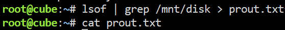
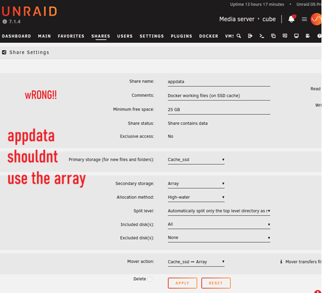

::: callout-tip
## Pourquoi est-ce qu'on est ici?

Ça fait déjà 4 ans que mon serveur roule Unraid, mais comme il écrivait/lisait à partir du array à chaque 5-10 secondes l'array ne pouvait jamais spin off. J'ai finalement pris le temps de régler ça.
:::

## Situation initiale

Les trois disques sont "spun up" en vert, on et voit presque toujours un peu de read/write activity.

## Définition de la victoire:

L'image ci-dessus montre mes 3 drives HDD avec le petit rond gris qui indique qu'ils sont "spin down". Enfin!

## Diagnostic - Vérifier que le "spin down" est activé

## Diagnostic - trouver quels fichier gardent le array vivant avec lsof

### Quels fichiers sont ouverts?

La meilleure façon que j'ai trouvé pour diagnostiquer c'est d'utiliser la commande *lsof* , qui signifie "list open files". Il existe une plugins "Open Files v2" by Derek Kaser, mais j'aime mieux jouer dans le terminal.

La commande lsof retourne beaucoup de chose, donc je la "grep" pour juste connaître les fichiers de /mnt/disk (donc /mnt/disk1, /mnt/disk2, etc) et j'envoie l'output dans un fichier txt sinon l'output se fait noyer par des "lsof: no pwd entry for UID 999".

Bon, j'ai tout réglé, il n'y a plus aucun fichier situé dans /mnt/disk, (tout est dans /mnt/cache sur le ssd , mais voici ce que vous auriez pu voir :

ici on voit un paquet de fichiers ouverts par mes dockers dans le appdata (/mnt/cache_ssd/**appdata**), notamment de homeassistant (domotique) et crafty-4 (serveur minecraft). Tout est bon présentement parce qu'ils sont sur /mnt/cache_ssd, mais imaginons qu'ils soient sur l'array (donc lu à partir de /mnt/disk1/appdata ou /mnt/disk2/appdata)

Ça indiquerait que le appdata est sur le array plutôt que sur le cache.

En fait j'avais trois problèmes qui gardaient des fichiers ouverts :

1\) mon appdata share (celui avec tous les fichiers des dockers) était sur le array. Comme mes docker roulent 24/24h car j'ai un homeassistant qui travaille 24/7 et qui doit écrire des logs des sensors pas mal tout le temps, ça empêchait le tout de dormir

2\) quand on "attach network drive" avec une lettre dans windows en utilisant samba le array ne peut pas dormir non plus.

3\) les isos qui sont partagés aux VM (genre le iso de drivers virtio) empêchent aussi le array de dormir.

## Problème #1 - migrer le appdata (et domains et system) du array vers le cache

Voici les étapes suivies pour y arriver.

### Initial (wrong) appdata share settings

Les settings de mon appdata étaient mauvaises: je lui avais dit de créer les fichiers de appdata dans le cache, mais ensuite le mover envoyait tout dans "

### Temporary share settings (move from array to cache)

Avant de mettre les bonnes share settings (pas de array), On va devoir convaincre unraid de mover le stock de array vers le cache_ssd.

On commencer par change le mover action pour aller de cache vers array:

### Disable Docker and VM

Settings - Docker - "enable docker = No"

Settings - Vm Manager - Enable VMs = NO

### Run le mover

Ma façon préférée de partir le mover est d'aller dans le terminal et de rouler

"mover start"

Le nom du répertoire est l'origine. Donc dans ce cas ci je copie **de** "/mnt/cache_ssd" **vers** le array ( /mnt/disk1 ou /mnt/disk).

Mon système va bien, ce n'est pas la grosse migration, pour la grosse migration on verrait des millions de fichiers partir de /mnt/disk1/appdata et de /mnt/disk2/appdata

Je ne sais pas 100%, mais dans mon cas le mover n'avait pas tout bougé du premier coup. J'ai re-roulé le mover quelques fois, et j'ai aussi fait du ménage (je pense que mon cache ssd était trop plein) et j'ai finalement effacé un gros répertoire. Mais maintenant mes fichiers sont au bon endroit et appdata est seulement sur le cache_ssd:

Une commande que j'aimais bien rouler pendant que le mover roulait c'est "du -sh" afin de voir que le appdata dans disk1 et disk2 était bel et bien en train de rapetisser et que le appdata dans cache_ssd était bien en train de grossir:

NOTE: On peut aussi aller dans "Main" et cliquer "move", mais ça ne nous liste pas les fichiers qui bougent

### Final appdata share settings

On fois qu'on a tout rapatrié le appdata sur le cache_ssd, on rechange les settings du appdata pour être certain qu'il ne tout plus jamais au array.

À la fin, on veut avoir les settings suivantes pour le share de appdata:

On peut enfin repartir docker et vérifier que personne n'écrit sur le disk1 avec "lsof". Aussi, mes drives doivent spin down après 15 minutes.

## Problème #2 Ne pas connecter de samba share comme lecteur réseau

Je n'ai plus la ligne exacte, mais quand je montais un lecteur réseau avec une lettre (genre ça) sur mon ordinateur windows , ça forçait le array à spinner parce que quelque chose restait ouvert sur le disk1 restait ouvert (visible avec `lsof`). Solution: don't

## Problème #3 - Ne pas monter de ISOS aux VM une fois qu'on n'en a plus besoin

When I ran

`root@cube:~# lsof | grep /mnt/disk > prout.txt root@cube:~# cat prout.txt`

`qemu-syst 2547024 root 10r REG 9,1 726501376 10748716224 /mnt/disk1/isos/virtio-win-0.1.271-1.iso`

Un des fichiers ouverts était `virtio-win-0.1.271-1.iso.`

C'est le fichier "isos" de driver qui est passé sur le cd-rom virtuel à ma VM windows. Ça gardait "isos" réveillé, et isos habite sur le array...

Comment l'enlever:

Go to **Unraid VM Manager** → select your VM → **Edit**.

Find the **CD-ROM/ISO** section.

**Detach the ISO** completely, or Change it to **“None”** (so no ISO is attached).

Voilà, une fois ces 3 soucis réglés ma vie est plus belle!

# Conclusion - Energy savings!!

J'ai regardé la consommation du UPS sur lequel mon server unraid (et modem, router, switch, hilo gateway, POE wifi access point) est branché.

Avant, j'avais au mieux environ 132W.

Maintenant j'ai 108W, et ça monte à 120W quand j'ai un drive qui spin pour seeder un torrent.

Ça coûtait cher écrire ces logs..

