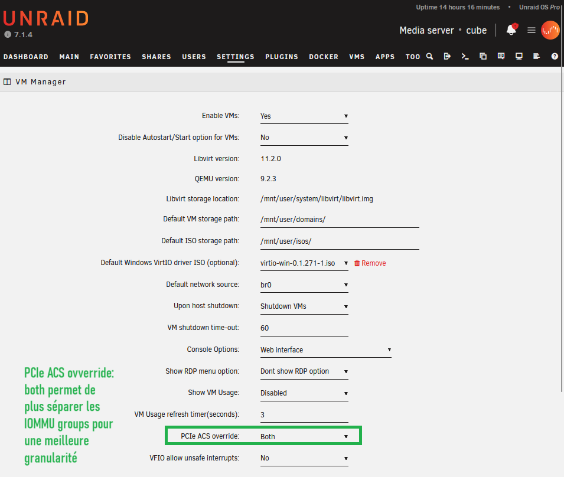
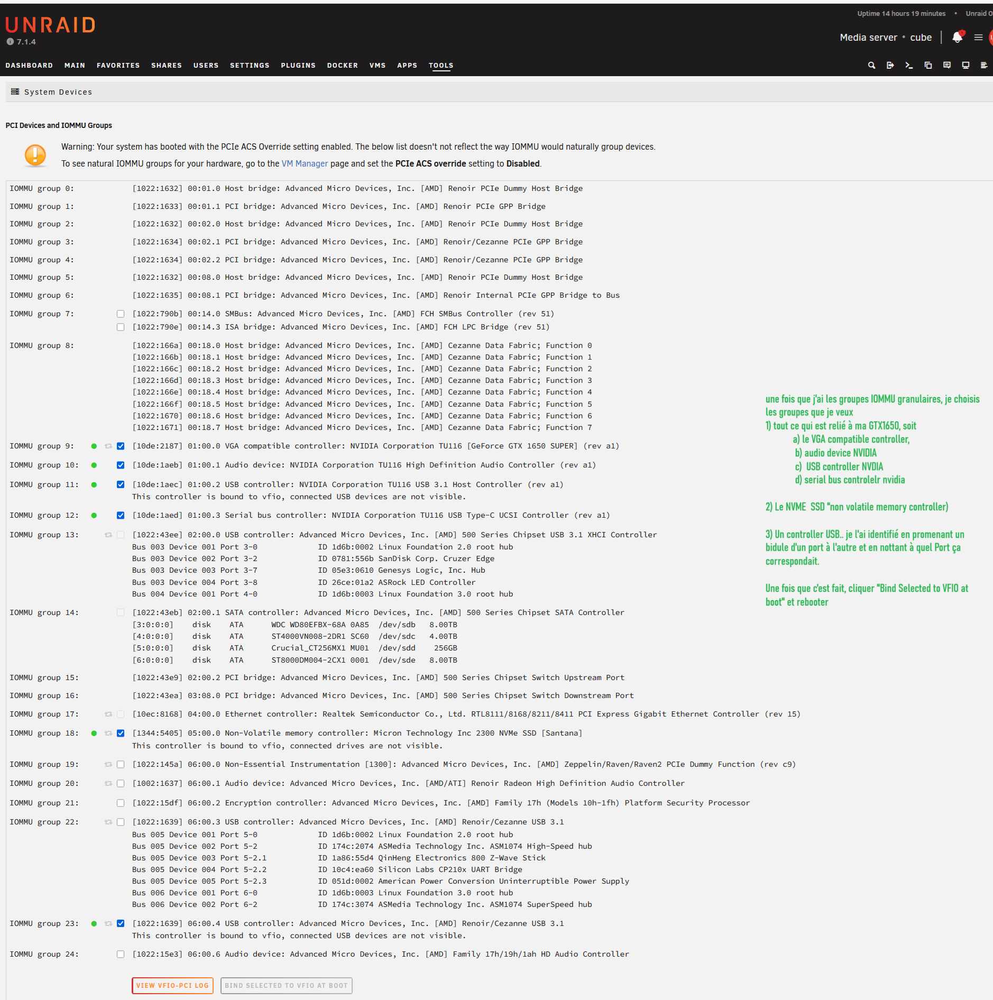
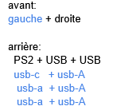
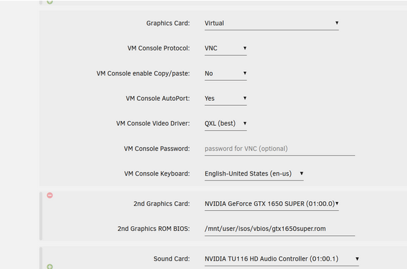
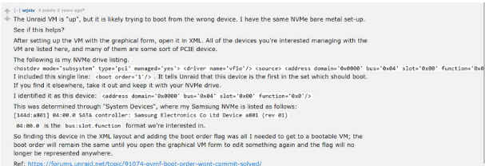
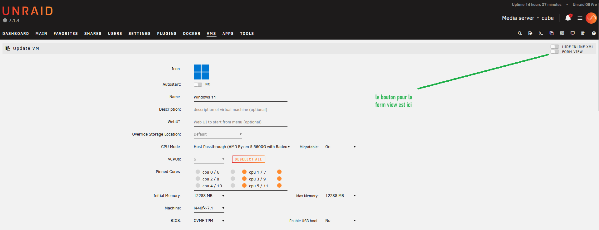
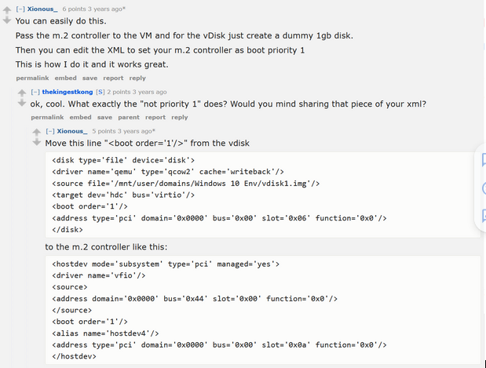
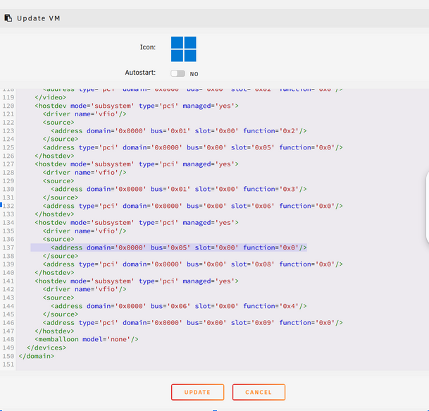
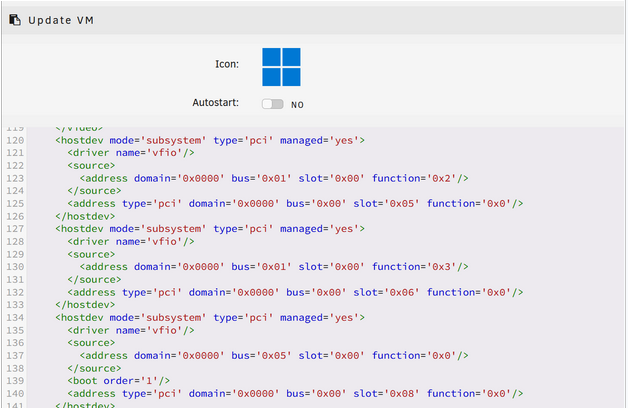
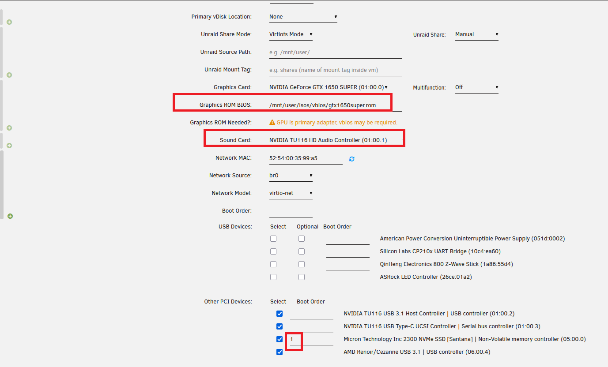

::: callout-tip
## Pourquoi est-ce qu'on est ici?

J'ai envie que mon serveur qui est allumé 24/7 puisse servir de desktop computer pour travailler. Bref, je veux brancher clavier, souris et écran dessus et m'en servir comme si c'était un ordinateur normal.
:::

# Le guide

J'ai essayé de suivre ce guide [Creating a Windows 11 Gaming VM in Unraid with Nvidia GPU Passthrough](https://thehomelabber.com/guides/unraid-win-11-gaming-vm/) sur thehomelabber.com par Blag.

Je vous invite à faire de même, et venir lire ce blog post après au cas où vous rencontrirez les mêmes soucis que moi.

## Problème #1: Comment enable iommu sur ma mobo? (ASROCK b550 pro4)

IOMMU est nécessaire pour pouvoir faire du passthrough. J'avais la flemme, mais j'Ai trouvé un forum post sur le forum de asrock "[B550 Taichi ACS enable possible£](https://forum.asrock.com/forum_posts.asp?TID=26092)" et sa description du bios matchait la mienne:

`I don't have that motherboard, but I imagine the BIOS is similar.`

`Advanced -> PCI Configuration -> SR-IOV Support (I assume you already have this enabled?)`

`Advanced -> AMD CBS -> NBIO Common Options -> Lots of fun stuff in here.`

`IOMMU, ACS, PCIe ARI Support, PCIe ARI Enumeration, Enable AER Capability, SRIS.`

`Apparently, ACS and AER are tied together, so you have to enable AER for ACS to work.`

## Problème #2: Plusieurs devices sont dans le même IOMMU group

Blag explique bien comment choisir les devices à rendre disponibles au passthrough:

Mon problème, c'est que plusieurs devices sont dans le même IOMMU group. Par exemple, si je veux passer mon GPU nvidia je dois aussi passer d'autres devices que je veux garder disponible pour unraid et les docker.

Solution: spaceinvaderone a un [video](https://www.youtube.com/watch?v=qQiMMeVNw-o) qui explique comment splitter un groupe de iommu pour envoyer juste une partie du groupe (son onboard usb controller dans une première partie ,  puis sa capture card qui est avec 3 ethernet controller dans une 2e partie à partie de 15 minutes) 

j’ai utilisé la 2e method (mettre pcie acs override = both dans settings - vm manager)

Final System devices:

Si jamais ça ne boote pas, j'ai trouvé un blog post qui dit comment éditer les settings si tu brises qqch..

<https://xtremeownage.com/2021/03/20/how-to-convert-your-physical-gaming-pc-into-an-unraid-vm-w-passthrough>

## Problème #3: Identifier le Controller USB que je veux passer au NVME.

J'ai 10 ports USB sur mon case d'ordi : 2 en avant, 8 en arrière.

Je veux passer un seul port USB à la VM (pour clavier/souris et bluetooth dongle), mais quand je regarde la liste des IOMMU groups j'ai plusieurs USB controllers (group 13, group 22 et group 23).

J'ai promené un disque dur externe d'une prise à l'autre et j'ai noté à quel "port" ça correspondait dans le GUI de unraid.

avant:  

Port 7-1 la première fois, 8-1 la 2e fois  + Port 3.7-4

arrière:

PS2 + Port 3-5 + Port 3-6

usb-c   + 3-2 ( quand je branche le sandisk), mais 4-2 quand je branche seagate?

Port 6-2.3  + Port 6-2.4

6-2.1     +6-2.2

conclusion: il semble que c’est le port avant-gauche (bleue) qui est sur son propre controlleur (celui qui donne les ports 7 et 8)

Ça correspondait au IOMMU groupe 23, que j'ai passé au passthrough.

## Problème #4 - plex ne marche plus

oh attention comme je réserve le gpu je ne peux plus mettre "--runtime=nvidia" dans les "extra parameters du du docker de plex pour lui permettre de faire

## Problème #5 - dump GPU Bios

spaceinvaderone a un video où il explique avoir créé un script pour domper le gpu bios à partir de la tour unraid, mais il a pas marché pour moi.

Au final,j'ai mis le GPU dans une autre tour et je suis allé dans GPU-Z, dump bios, et j’ai copié le .rom file dans `/user/mnt/vbios/gtx1650super.rom`

au début (avant D'installer moonlight pour le remote desktop) j'ai configuré la VM avec le virutal display adapter ET la gtx 1650 comme 2e display adapter pour le moment, il faut peser sur le petit “+” subtil en vert ici:

## Problème #6 Changer le boot order

La VM part, mais elle boot tout le temps dans le UEFI shell et quand je change le boot order dans le shell il ne le conserve pas.  

selon ce [post reddit](https://www.reddit.com/r/unRAID/comments/o171n3/booting_a_vm_from_a_m2_ssd/) , il faut que j’identifie le bus slot function de mon nvme et que je change dans le XML de setup.

"tool - system devices" me dit que je suis bus 0x05,  slot 0x00 et function 0 : 

IOMMU group 18:             \[1344:5405\] 05:00.0 Non-Volatile memory controller: Micron Technology Inc 2300 NVMe SSD \[Santana\]

             This controller is bound to vfio, connected drives are not visible.

Ensuite je vais en mode XML (c’est dans la VM, edit , en haut à droite il y a “form view”)

autre post reddit qui parle de boot order:

<https://www.reddit.com/r/unRAID/comments/o171n3/booting_a_vm_from_a_m2_ssd/>

fak j’ai trouvé cette ligne avec bus 0x05

pis j’ai ajouté boot order 1

pis holy shit ça marche!!

# FINAL SETTINGS VM

](images/clipboard-575846558.png)
