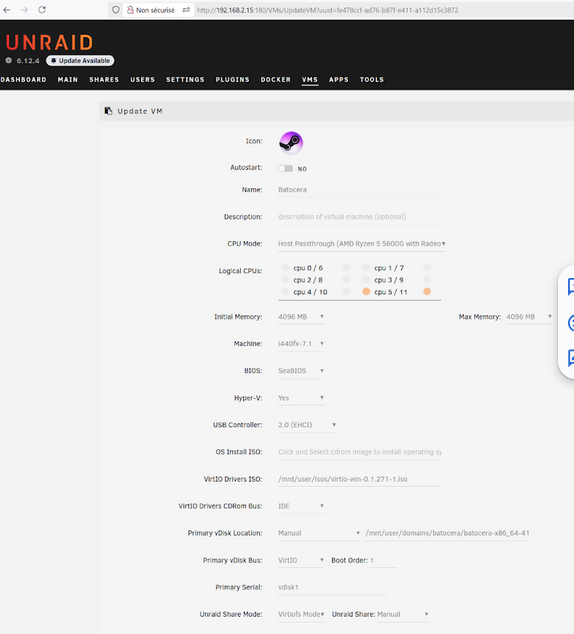
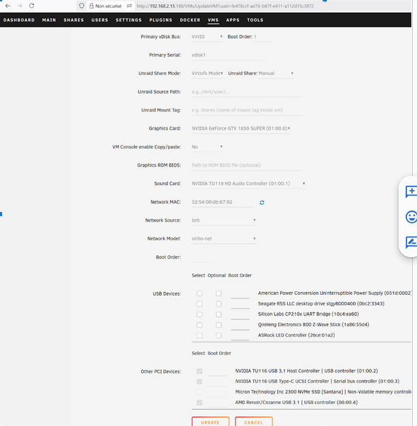
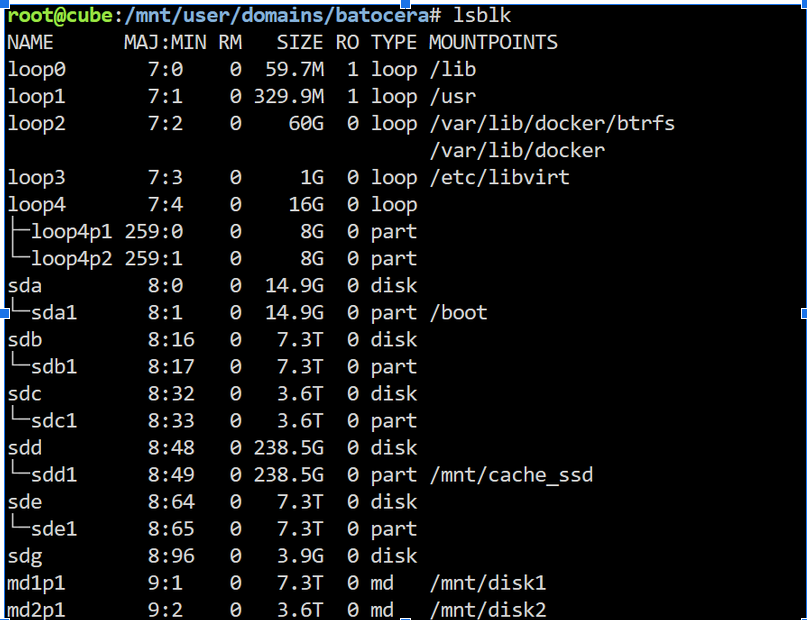

::: callout-tip
## Pourquoi est-ce qu'on est ici?

J'ai envie de créer une VM Batocera sur mon serveur unraid. Le but c'est d'amener un long fil HDMI à la Tv pour jouer à mario bros. J'ai aussi acheté un long fil USB pour pouvoir un brancher les manettes via un bluetooth dongle.
:::

Déjà, il faut être capable de créer une VM avec un passthrough GPU et USB comme décrit dans [mon autre blog post](https://www.simoncoulombe.com/posts/2025-08-22-unraid-vm-avec-passthrough-gpu-nvme-et-usb-controller/). Par contre, je ne vais pas passer le disque dur NVME, la VM batocera va se contenter d'un disque dur virtuel sur mon cache ssd (dans le share 'domains').

# Setup la VM

## Étape 1 - Downloader le fichier .img

-   [Télécharger Batocera](https://batocera.org/download) (j'ai eu la version 41)

-   dézipper le .img . Ça donne un fichier .img de genre 8GB.

## Étape 2 - Agrandir le fichier .img (!!)

Le problème c'est que si on crée une machine virtuelle avec ce fichier .img, alors le disque dur virtuel va avoir exactement la taille du iso et on n'aura donc pas de place pour nos roms, saves, configs, etc... On va donc grossir le fichier .img à 16GB pour "ajouter du vide":

`sudo fallocate -l 16G batocera.img`    ([as seen here in method 2](https://wiki.batocera.org/run%5C_batocera%5C_in%5C_vm#run%5C_batocera%5C_in%5C_a%5C_virtual%5C_machine) )

## Étape 3 Créer la VM avec le passthrough

-   'create new windows 10 VM'

-   skip de OS

-   pass the .img file as a manual vdisk:

    

-   passthrough gpu, usb controller:

    

<!-- -->

-   Launch the VM, yay it's alive.

## Étape 4 - Changer les configs pour storer les ROMS sur le NAS de unraid

Je ne veux pas avoir de copies de mes ROMS sur la VM batocera et avoir besoin d'un gros virtual disk juste pour les roms. Surtout que je ne sais pas combien mes roms vont prendre de place au final.

Je préfère que batocera aille lire les roms directement dans `/mnt/user/data/emulation/roms`, qui est une share sur mon réseau.

Documentation officielle "[Store games on a NAS](https://wiki.batocera.org/store_games_on_a_nas)"

Pour changer ce config, la façon la plus simple que j'ai trouvé c'est carrément de monter le .img sur le file system de mon unraid et d'aller modifier le config.

-   Shut down the vm

-   mount the img on my unraid: 

    -   `mkdir -p /mnt/batocera_img`

-   Create a loop device with partitions:

    -   `losetup -Pf batocera.img`

    -   

-   Find out the loop device name (e.g., /dev/loop0)

    -   `lsblk`

    -   

-   `mkdir -p /mnt/batocera_img`

-   `mount /dev/loop4p1 /mnt/batocera_img`

-   `nano /mnt/batocera_img/batocera.conf`

    -   replace `sharedevice=LOCAL` with `sharedevice=NETWORK`

    -   setup the shares:

        -   `sharedevice=NETWORK`

        -   `sharenetwork_smb1=ROMS@192.168.2.15:data/emulation/roms:guest`

        -   `sharenetwork_smb2=BIOS@192.168.2.15:data/emulation/bios:guest`

        -   `sharenetwork_smb3=SAVES@192.168.2.15:data/emulation/batocera/saves:guest`

        -   

        -   `umount /mnt/batocera_img`

        -   `losetup -d /dev/loop4`

        -   Restart batocera, update the gamelist (From the main menu (\[start\]) Game settings -\> Update Gamelists) (documentation https://wiki.batocera.org/menu_tree#update_gamelists)

# Troubleshooting

## sound batocera stopped working after plugging Playstation controller

[LexingtonG4M8in0 on reddit](https://www.reddit.com/r/batocera/comments/p5v5zh/no_sound_through_hdmi/) : Timmun90 did you go into (From Batocera main MENU ) KODI / setting ⚙️/ System / Audio : In the AUDIO PASSTHROUGH - ENABLE Allow PASSTHROUGH and your TVs or Audio Passthrough DEVICE should be selected. I’m my setup I have a Samsung 57” Shown as HDA INTEL PCH , SAMSUNG on HDMI #0 Lastly make sure that your AUDIO OUTPUT matches KODI. ON BATOCERA / System Settings / Harware Audio Output should be set to same as above HDMI# 0

## batocera is slow

Change resolution to "maximum 1920-1080". Il essayait de rouler en 4k pcq j'ai une télé 4k.

games settings - video mode - MAXIMUM 1920x1080

## comment obtenir des bios

Le plus facile c'est d'allerl sur internet archive (archive.org) et de chercher "BATOCERA BIOS 41 FULL" et de tout dézipper ça dans le répertoire de bios. Dans mon cas, c'est `/mnt/user/data/emulation/bios`

## comment se connecter par ssh

le plus facile :

`ssh root@batocera`

`password: linux`

## comment pairer des manettes de ps4

J’ai utilisé MANUAL PAIRING dans la [documentation officielle.](https://wiki.batocera.org/bluetooth_controllers_-_manual_setup)

La manette playstation s’appelait “Wireless Controller” et on la met en mode pairing en faisant les boutons SHARE+PS pendant quelques secondes.

`ssh root@batocera`

`password: linux`

Note to self, ma manette bleue est 24:A6:FA:59:E5:EF et je pense que la noire est Device 84:17:66:C0:04:59 Wireless Controller ?
