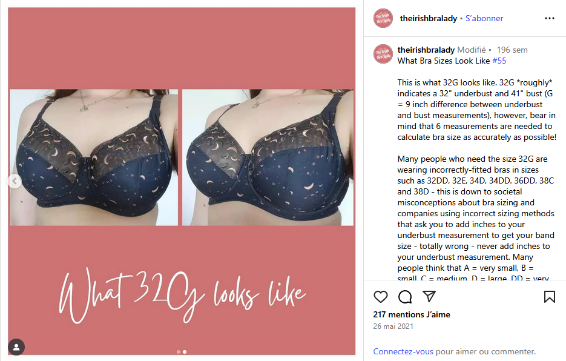
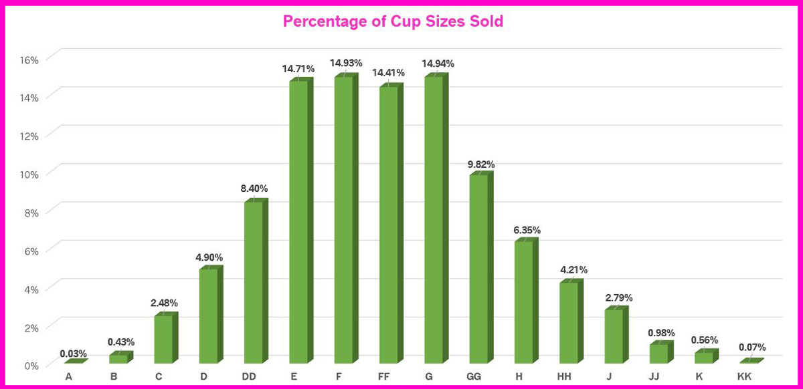

::: callout-tip
## Pourquoi est-ce qu'on est ici?

Parce que le ridicule ne tue pas et parce que ça a été révolutionnaire
chez nous, Simon te mansplain les brassières polonaises😁.

Pas de data science ici, juste un ti partage d'info avant qu'on l'oublie.
:::

**Contexte**: Ma blonde vient de traverser une crise de "ma taille
existe pas" parce qu'à Québec les boutiques ne tiennent rien en haut de
G de bonnet. Rendu là, tu te fais dire que ta seule option pour
t’habiller c’est d’avoir une réduction mammaire. C'est rough. C’est un
besoin essentiel. Spoiler: Ce post existe parce qu'il il y a des
options. **En Pologne ça monte jusqu'à 32R, donc rassurez-vous.**

**Objectif**: Aider la prochaine découragée,ou aider ma blonde si qqun
devient distributeur au Québec. :)

Je pense que la première étape c'est de clarifier qu'un "G" c'est
probablement plus petit que ce que le lecteur lambda pense, surtout si la fille
a un petit "band". Par exemple, voici une photo d'à quoi ressemble un
32G publié par
[theirishbralady](https://www.instagram.com/p/CPWApmcHUMw/?img_index=2)sur
instagram. Vous en vvoyez de cette taille là tous les jours, c'est rien
qui justifie de dire "l'industrie ne peut rien produire pour soutenir
votre poitrine".

## Méthodologie pour se procurer a bra that fits qui a fonctionné chez nous(le mansplain):

### 1- Déterminer la taille 

Vous allez devoir vous mesurer (6 mesures!)  et entrer vos mesures dans le bra size calculator pour obtenir le bra size.  

La calculatrice est ici:   https://www.abrathatfits.org/calculator.php

Vous voulez la taille avec **le système UK**.  C'est reconnu comme le mieux, c'est comme ça, c'est pas moi qui fait les règlements.    

C'est peut-être là que vous allez avoir la surprise de votre vie et réaliser que vous êtes pas 36 ni 38 mais bien 32, mais avec un + gros bonnet.   Ça va nous permettre de défaire le procédé par lequel une boutique a utilisé les sister  size essayer de vendre la 38D en stock alors que vous faites du 32FF.    Tout ça pour garder moins d'inventaire. Maudit capitalisme.  

### 2- Déterminer la forme  

La "bra size" c'est le volume, mais à volume égal il y en a pour toutes les formes.  
Le [guide reddit abrathatfits](https://www.reddit.com/r/ABraThatFits/wiki/beginners_guide) va tout vous expliquer ça, mais le but c'est de savoir si vous êtes:  

   * projected shape (en forme de verre) vs shallow shape  (en forme de bol ou d'assiette)       
   * vertical fullness (penchée à 90 degrés par en avant, est-ce qu'il y a plus de viande en haut du mamelon, en bas, ou bien c'est égal? )  
   * horizontal fullness (penchée à 90 degrés par en avant, est-ce qu'il y a plus de viande enre les mamelons, à l'extérieur ou bien c'est égal?)    
   
### 3- Trouver un modèle qui fite votre taille et forme.     

Le plus simple c'est d'essayer de suivre les recommandations de modèles de la [section #3 du beginners guide](https://www.reddit.com/r/ABraThatFits/wiki/beginners_guide/) abrathat fits selon la taille et la forme.

Si vous êtes découragée (on le serait à moins!), vous pouvez demander de l'aide :     

**Option A**  [poster ses mesures et sa forme sur reddit
abrathatfits](https://www.reddit.com/r/ABraThatFits/wiki/ask_for_help)
pour obtenir rapidement des recommandations de modèles à essayer. (merci
les bénévoles).

**Option B** écrivez directement à Samantha de Broad Lingerie à Toronto, c'est un trésor national.   

### 4- Achetez en ligne  , puis retournez 20x jusqu'à avoir trouvé    

Une fois qu'on a trouvé la bra size et des modèles qui peuvent convenir à votre forme, c'est le temps de commander DES DIZAINES DE BRASSIÈRES.  

Si vous trouvez localement quelqu'un qui a le modèle et la taille que vous recherchez, cool, mais soyez intraitable sur la taille.  Sérieux, même la boutique de Québec qui vendait du G ne croyait pas que ma blonde faisait du 32.  Il a fallu qu'elle insiste et se fasse mesurer pour que la madame "spécialiste" soit obligée de lui donner raison.  

On a commandé le plus possible chez amazon.ca parce qu'ils offrent les retour gratuits.  Ils tiennent plusieurs marques UK (Freya, Panacha, etc..)
Gênez vous pas pour commander 6 tailles du même modèle, soit la taille précise  selon le calculateur, plus ou moins un bonnet, et aussi essayer 3 autres bonnets avec une bande plus petite ou plus
grande selon votre feeling.   

Aussi, commandez plusieurs modèles!  À un certain moment on avait pour 2000\$ de brassières à retourner chez nous.  C'était un vrai centre d'expédition.  

### 5- **Go Polish!**    

Si vous êtes rendu ici, je suis désolé, ça veut dire que vous avez cherché pendant des semaines et que vous avez rien trouvé.  On s'est rendu là nous aussi.  La solution c'était "go Polish", et d'aller voir les marques polonaises.   Il existe plusieurs marques polonaises, notamment Ewa Michalak, Comexim, Gorsenia et Samanta.   

Ewa Michalak c'est considéré comme le nec plus ultra.  Le magasin le plus proche qui en tient c'est Broad Lingerie à Toronto, mais ça vaut la peine parce que Samantha est géniale.  

Les polonaises peuvent servir dans 2 cas précis:   vous avez une taille qui n'existe pas dans les autres compagnies, ou bien votre poitrine est plus "projetée" que la moyenne.  

C'est vraiment libérateur de pouvoir commander TOUTES LES TAILLES POSSIBLES.  Soudainement, c'est pas votre corps qui ne fait pas, c'est l'industrie qui
était nulle.  

C'est libérateur, oui, mais c'est pas facile à acheter ces marques polonaises.  Voici ce que j'ai trouvé de mieux pour les commander.  

-   EWA MICHALAK (les préfs de ma blonde)

    -   au Canada, il existe seulement 2 boutiques canadiennes avec
        bonne politique de retour:

        -   Broad Lingerie (Toronto). PS : Samantha est un trésor
            national
        -   Forever Yours (Vancouver)
        -   💰Opportunité d’affaire, aucun concurrent au Québec!

    -   en Pologne du fournisseur :80\$ shipping, et en plus on se fait charger la tps/tvq et des frais de courtage par la DHL.  

-   Comexim (un bon 2e choix si l'autre prend sa retraite)

    -   💰Opportunité d’affaire, il n'y a rien au Canada!  
    -   Aux USA il y a BreakoutBras. Retours impliquent un formulaire de
        douane pour se faire la tps .  Nous on n'a pas réussi à se faire rembourser la tps sur un bon 600$ de brassières.  
    -   Directement du fournisseur en Pologne  :10\$ de shipping (pas cher!)   (Alterations 10\$!).
        Vraiment un bon deal, vous pouvez demander de mettre les
        bretelles plus proches, rapetisser le "gore", etc..

Les marques polonaises sont considérées parmi les meilleures, pourtant
aucune boutique du Québec ne les distribue. Voir article NYT: "The Best
Bras Might Be Made in Poland"

Pour la petite histoire: L’URSS faisait toute sa lingerie à Lodz en
Pologne et les dames qui travaillaient là on lancé leurs ateliers
depuis.

## Section opportunité d'affaires   

Au cas où ça intéresse quelqu'un:   le marché existe! «[A Sophisticated
Pair](https://web.archive.org/web/20191105115714/http://sophisticatedpair.com/blog/year-4-stats-cup-size-distribution/)»
a publié ses ventes (en Caroline du Nord) et les bonnets G+ représentent
35% de ses ventes.

## Section geek

Les boutiques mentionnées utilisent "shopify". Il y a sur github un
script python pour récolter l'inventaire. J'ai pensé partager l'app que
j'ai fait à ma blonde qui envoie un email quand sa taille est en stock
et en spécial, mais ce serait weird d'avoir les tailles de soutifs de
mes contacts

Voilà, have fun
