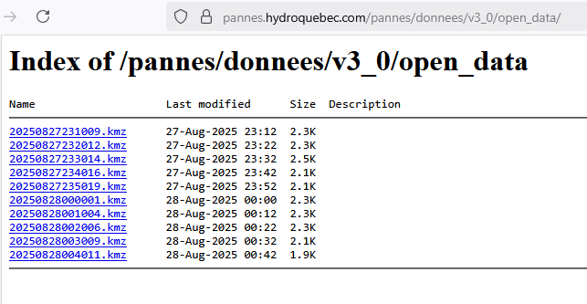

::: callout-tip
## Pourquoi est-ce qu'on est ici?

Hydro-Québec rend les données d'info-panne disponible, mais seulement
pour 1 journée.\
J'ai commencé à sauvegarder ces fichiers il y a 3 ans à l'aide de github
actions dans mon repo
[hydroquebecoutage](http://pannes.hydroquebec.com/pannes/donnees/v3_0/open_data/).
C'est enfin le moment de trouver qui est le pauvre hère qui a manqué le
plus longtemps de courant durant ces 3 années!
:::

# Les données

## Info-Panne

Les fichiers kmz d'info panne sont disponibles à l'adresse
`http://pannes.hydroquebec.com/pannes/donnees/v3_0/open_data/`.

Si vous le visitez aujourd'hui, vous allez voir les polygones des pannes
des 24 dernières heures:



``` sql
J'ai accumulé près de 40 000 KMZ en 3 ans.
```

Ce sont seulement des polygônes. On n'a pas d'information comme la durée
de la panne.

J'ai donc dû faire une hypothèse: Les pannes indiquées dans un fichier
durent du timestamp du fichier jusqu'au timestamp du fichier suivant.

Ensuite j'ai lu chacun des KMZ, j'ai ajouté un peu de metadata aux
pannes (outage_start, outage_end, outage_duration_sec, row_num,
file_name) et j'ai ajouté ça à mon serveur PostGIS.

``` r
st_write(
    kmz_data, 
    con, 
    "outage", 
    append = TRUE,  
    row.names = FALSE,
    layer_options = "GEOMETRY_NAME=geom"  # explicitly enforce column name
)
```

## Les bâtiments

Le [référentiel québécois sur les
bâtiments](https://www.donneesquebec.ca/recherche/dataset/referentiel_bati)
contient les polygônes de tous les bâtiments du Québec. Ça semble avoir
été créé à partir d'orthophotographie et bien de l'intelligence
artificielle.

Je l'ai téléchargé en format GPKG et je l'ai aussi ajouté à mon serveur
PostGIS. Tant qu'à être là, on reprojette en CRS4326 pour être
compatible avec les pannes.

``` bash
ogr2ogr -f "PostgreSQL" PG:"host=192.168.2.15 port=5432 dbname=dbname user=user password=password" "C:\Users\Simon\Downloads\RefBati_GPKG\Referentiel_batiment.gpkg" -nln batiments_4326 -overwrite -t_srs EPSG:4326 -lco GEOMETRY_NAME=geom -lco FID=id
```

Mon LLM préféré m'a dit de créer un index spatial, qui se faisait en
roulant ceci dans `psql` :

`CREATE INDEX idx_batiments_geom ON batiments_4326 USING GIST(geom);`

# Combiner les deux

Une fois que c'est fait, je roule cette query. Ça va me redonner une
ligne par bâtiment-panne:

``` R
buildings_sf <- st_read(con, query = "
+   SELECT DISTINCT b.*, o.source_file, o.outage_start, o.outage_end, o.outage_duration_sec
+   FROM batiments_4326 AS b
+   JOIN outages AS o
+     ON ST_Intersects(b.geom, o.geom)
```

... mais ça roule encore pour le moment.
Je pense que je devrais faire deux choses :
1 ) remplacer les bâtiments par un centroide
2) ne pas retourner la geometry des batiments...    


anyway, on se reparle quand c'est fini!


