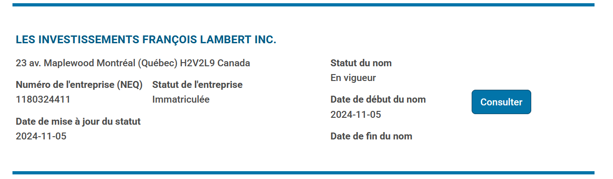
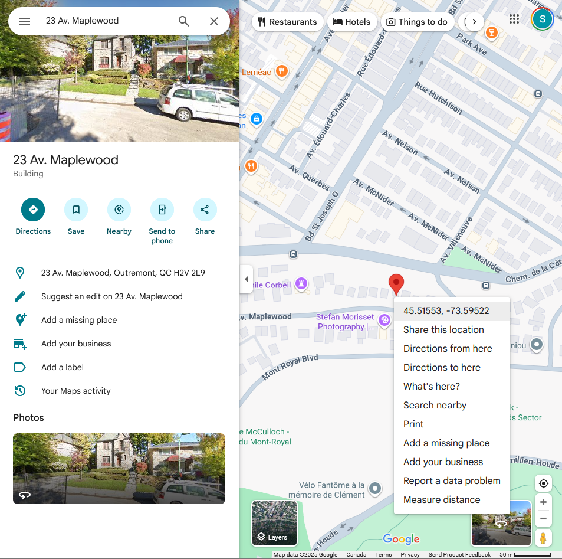
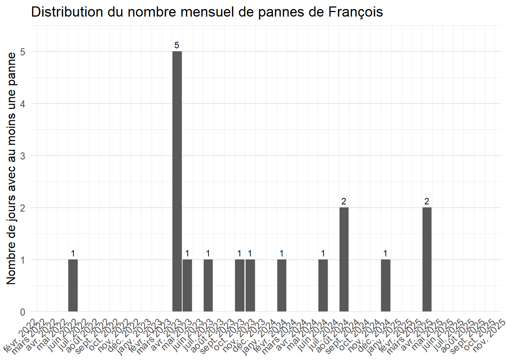
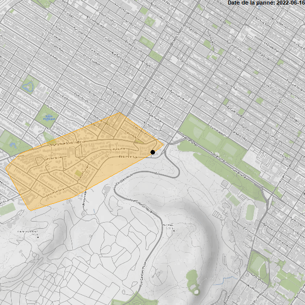

::: callout-tip
## Pourquoi est-ce qu'on est ici?

On m'a dit qu'il y a une compagnie qui s'appelle "François Lambert" basée à Outremont qui pense
être championne provinciale des pannes de courant.
:::

Vous vous souvenez peut-être de mon [post sur les pannes d'hydro québec](https://www.simoncoulombe.com/posts/2025-08-28-qui-a-manqu%C3%A9-le-plus-de-courant-au-qu%C3%A9bec-depuis-2022-/). J'espère pour vous, ça fait genre 3 jours.

Anyway, on m'a dit qu'il y a une compagnie qui s'appelle "François Lambert" basée à Outremont qui pense être championne provinciale des pannes.

Je pense que vous me voyez venir gros comme un éléphant.

## 

# Étape #1 - Trouver l'adresse de la compagnie  

C'est pas extrêmement sorcier. On va sur le [registre des entreprises du Québec](https://www.registreentreprises.gouv.qc.ca/REQNA/GR/GR03/GR03A71.RechercheRegistre.MVC/GR03A71) pis on cherche une compagnie qui s'appelle "François Lambert".

Il y en a plus que je pensais, mais jai trouvé une seule adresse à Outremont. On va supposer que c'est celle là



Cherche ça dans google maps, right click, sort la latitude/longitude: 45.515 , -73.5922



# Étape 2 - Compter les jours de pannes


::: {.cell}

:::

::: {.cell}

:::

::: {.cell}
::: {.cell-output-display}


```{=html}
<div id="kgmzifidff" style="padding-left:0px;padding-right:0px;padding-top:10px;padding-bottom:10px;overflow-x:auto;overflow-y:auto;width:auto;height:auto;">
<style>#kgmzifidff table {
  font-family: system-ui, 'Segoe UI', Roboto, Helvetica, Arial, sans-serif, 'Apple Color Emoji', 'Segoe UI Emoji', 'Segoe UI Symbol', 'Noto Color Emoji';
  -webkit-font-smoothing: antialiased;
  -moz-osx-font-smoothing: grayscale;
}

#kgmzifidff thead, #kgmzifidff tbody, #kgmzifidff tfoot, #kgmzifidff tr, #kgmzifidff td, #kgmzifidff th {
  border-style: none;
}

#kgmzifidff p {
  margin: 0;
  padding: 0;
}

#kgmzifidff .gt_table {
  display: table;
  border-collapse: collapse;
  line-height: normal;
  margin-left: auto;
  margin-right: auto;
  color: #333333;
  font-size: 16px;
  font-weight: normal;
  font-style: normal;
  background-color: #FFFFFF;
  width: auto;
  border-top-style: solid;
  border-top-width: 2px;
  border-top-color: #A8A8A8;
  border-right-style: none;
  border-right-width: 2px;
  border-right-color: #D3D3D3;
  border-bottom-style: solid;
  border-bottom-width: 2px;
  border-bottom-color: #A8A8A8;
  border-left-style: none;
  border-left-width: 2px;
  border-left-color: #D3D3D3;
}

#kgmzifidff .gt_caption {
  padding-top: 4px;
  padding-bottom: 4px;
}

#kgmzifidff .gt_title {
  color: #333333;
  font-size: 125%;
  font-weight: initial;
  padding-top: 4px;
  padding-bottom: 4px;
  padding-left: 5px;
  padding-right: 5px;
  border-bottom-color: #FFFFFF;
  border-bottom-width: 0;
}

#kgmzifidff .gt_subtitle {
  color: #333333;
  font-size: 85%;
  font-weight: initial;
  padding-top: 3px;
  padding-bottom: 5px;
  padding-left: 5px;
  padding-right: 5px;
  border-top-color: #FFFFFF;
  border-top-width: 0;
}

#kgmzifidff .gt_heading {
  background-color: #FFFFFF;
  text-align: center;
  border-bottom-color: #FFFFFF;
  border-left-style: none;
  border-left-width: 1px;
  border-left-color: #D3D3D3;
  border-right-style: none;
  border-right-width: 1px;
  border-right-color: #D3D3D3;
}

#kgmzifidff .gt_bottom_border {
  border-bottom-style: solid;
  border-bottom-width: 2px;
  border-bottom-color: #D3D3D3;
}

#kgmzifidff .gt_col_headings {
  border-top-style: solid;
  border-top-width: 2px;
  border-top-color: #D3D3D3;
  border-bottom-style: solid;
  border-bottom-width: 2px;
  border-bottom-color: #D3D3D3;
  border-left-style: none;
  border-left-width: 1px;
  border-left-color: #D3D3D3;
  border-right-style: none;
  border-right-width: 1px;
  border-right-color: #D3D3D3;
}

#kgmzifidff .gt_col_heading {
  color: #333333;
  background-color: #FFFFFF;
  font-size: 100%;
  font-weight: normal;
  text-transform: inherit;
  border-left-style: none;
  border-left-width: 1px;
  border-left-color: #D3D3D3;
  border-right-style: none;
  border-right-width: 1px;
  border-right-color: #D3D3D3;
  vertical-align: bottom;
  padding-top: 5px;
  padding-bottom: 6px;
  padding-left: 5px;
  padding-right: 5px;
  overflow-x: hidden;
}

#kgmzifidff .gt_column_spanner_outer {
  color: #333333;
  background-color: #FFFFFF;
  font-size: 100%;
  font-weight: normal;
  text-transform: inherit;
  padding-top: 0;
  padding-bottom: 0;
  padding-left: 4px;
  padding-right: 4px;
}

#kgmzifidff .gt_column_spanner_outer:first-child {
  padding-left: 0;
}

#kgmzifidff .gt_column_spanner_outer:last-child {
  padding-right: 0;
}

#kgmzifidff .gt_column_spanner {
  border-bottom-style: solid;
  border-bottom-width: 2px;
  border-bottom-color: #D3D3D3;
  vertical-align: bottom;
  padding-top: 5px;
  padding-bottom: 5px;
  overflow-x: hidden;
  display: inline-block;
  width: 100%;
}

#kgmzifidff .gt_spanner_row {
  border-bottom-style: hidden;
}

#kgmzifidff .gt_group_heading {
  padding-top: 8px;
  padding-bottom: 8px;
  padding-left: 5px;
  padding-right: 5px;
  color: #333333;
  background-color: #FFFFFF;
  font-size: 100%;
  font-weight: initial;
  text-transform: inherit;
  border-top-style: solid;
  border-top-width: 2px;
  border-top-color: #D3D3D3;
  border-bottom-style: solid;
  border-bottom-width: 2px;
  border-bottom-color: #D3D3D3;
  border-left-style: none;
  border-left-width: 1px;
  border-left-color: #D3D3D3;
  border-right-style: none;
  border-right-width: 1px;
  border-right-color: #D3D3D3;
  vertical-align: middle;
  text-align: left;
}

#kgmzifidff .gt_empty_group_heading {
  padding: 0.5px;
  color: #333333;
  background-color: #FFFFFF;
  font-size: 100%;
  font-weight: initial;
  border-top-style: solid;
  border-top-width: 2px;
  border-top-color: #D3D3D3;
  border-bottom-style: solid;
  border-bottom-width: 2px;
  border-bottom-color: #D3D3D3;
  vertical-align: middle;
}

#kgmzifidff .gt_from_md > :first-child {
  margin-top: 0;
}

#kgmzifidff .gt_from_md > :last-child {
  margin-bottom: 0;
}

#kgmzifidff .gt_row {
  padding-top: 8px;
  padding-bottom: 8px;
  padding-left: 5px;
  padding-right: 5px;
  margin: 10px;
  border-top-style: solid;
  border-top-width: 1px;
  border-top-color: #D3D3D3;
  border-left-style: none;
  border-left-width: 1px;
  border-left-color: #D3D3D3;
  border-right-style: none;
  border-right-width: 1px;
  border-right-color: #D3D3D3;
  vertical-align: middle;
  overflow-x: hidden;
}

#kgmzifidff .gt_stub {
  color: #333333;
  background-color: #FFFFFF;
  font-size: 100%;
  font-weight: initial;
  text-transform: inherit;
  border-right-style: solid;
  border-right-width: 2px;
  border-right-color: #D3D3D3;
  padding-left: 5px;
  padding-right: 5px;
}

#kgmzifidff .gt_stub_row_group {
  color: #333333;
  background-color: #FFFFFF;
  font-size: 100%;
  font-weight: initial;
  text-transform: inherit;
  border-right-style: solid;
  border-right-width: 2px;
  border-right-color: #D3D3D3;
  padding-left: 5px;
  padding-right: 5px;
  vertical-align: top;
}

#kgmzifidff .gt_row_group_first td {
  border-top-width: 2px;
}

#kgmzifidff .gt_row_group_first th {
  border-top-width: 2px;
}

#kgmzifidff .gt_summary_row {
  color: #333333;
  background-color: #FFFFFF;
  text-transform: inherit;
  padding-top: 8px;
  padding-bottom: 8px;
  padding-left: 5px;
  padding-right: 5px;
}

#kgmzifidff .gt_first_summary_row {
  border-top-style: solid;
  border-top-color: #D3D3D3;
}

#kgmzifidff .gt_first_summary_row.thick {
  border-top-width: 2px;
}

#kgmzifidff .gt_last_summary_row {
  padding-top: 8px;
  padding-bottom: 8px;
  padding-left: 5px;
  padding-right: 5px;
  border-bottom-style: solid;
  border-bottom-width: 2px;
  border-bottom-color: #D3D3D3;
}

#kgmzifidff .gt_grand_summary_row {
  color: #333333;
  background-color: #FFFFFF;
  text-transform: inherit;
  padding-top: 8px;
  padding-bottom: 8px;
  padding-left: 5px;
  padding-right: 5px;
}

#kgmzifidff .gt_first_grand_summary_row {
  padding-top: 8px;
  padding-bottom: 8px;
  padding-left: 5px;
  padding-right: 5px;
  border-top-style: double;
  border-top-width: 6px;
  border-top-color: #D3D3D3;
}

#kgmzifidff .gt_last_grand_summary_row_top {
  padding-top: 8px;
  padding-bottom: 8px;
  padding-left: 5px;
  padding-right: 5px;
  border-bottom-style: double;
  border-bottom-width: 6px;
  border-bottom-color: #D3D3D3;
}

#kgmzifidff .gt_striped {
  background-color: rgba(128, 128, 128, 0.05);
}

#kgmzifidff .gt_table_body {
  border-top-style: solid;
  border-top-width: 2px;
  border-top-color: #D3D3D3;
  border-bottom-style: solid;
  border-bottom-width: 2px;
  border-bottom-color: #D3D3D3;
}

#kgmzifidff .gt_footnotes {
  color: #333333;
  background-color: #FFFFFF;
  border-bottom-style: none;
  border-bottom-width: 2px;
  border-bottom-color: #D3D3D3;
  border-left-style: none;
  border-left-width: 2px;
  border-left-color: #D3D3D3;
  border-right-style: none;
  border-right-width: 2px;
  border-right-color: #D3D3D3;
}

#kgmzifidff .gt_footnote {
  margin: 0px;
  font-size: 90%;
  padding-top: 4px;
  padding-bottom: 4px;
  padding-left: 5px;
  padding-right: 5px;
}

#kgmzifidff .gt_sourcenotes {
  color: #333333;
  background-color: #FFFFFF;
  border-bottom-style: none;
  border-bottom-width: 2px;
  border-bottom-color: #D3D3D3;
  border-left-style: none;
  border-left-width: 2px;
  border-left-color: #D3D3D3;
  border-right-style: none;
  border-right-width: 2px;
  border-right-color: #D3D3D3;
}

#kgmzifidff .gt_sourcenote {
  font-size: 90%;
  padding-top: 4px;
  padding-bottom: 4px;
  padding-left: 5px;
  padding-right: 5px;
}

#kgmzifidff .gt_left {
  text-align: left;
}

#kgmzifidff .gt_center {
  text-align: center;
}

#kgmzifidff .gt_right {
  text-align: right;
  font-variant-numeric: tabular-nums;
}

#kgmzifidff .gt_font_normal {
  font-weight: normal;
}

#kgmzifidff .gt_font_bold {
  font-weight: bold;
}

#kgmzifidff .gt_font_italic {
  font-style: italic;
}

#kgmzifidff .gt_super {
  font-size: 65%;
}

#kgmzifidff .gt_footnote_marks {
  font-size: 75%;
  vertical-align: 0.4em;
  position: initial;
}

#kgmzifidff .gt_asterisk {
  font-size: 100%;
  vertical-align: 0;
}

#kgmzifidff .gt_indent_1 {
  text-indent: 5px;
}

#kgmzifidff .gt_indent_2 {
  text-indent: 10px;
}

#kgmzifidff .gt_indent_3 {
  text-indent: 15px;
}

#kgmzifidff .gt_indent_4 {
  text-indent: 20px;
}

#kgmzifidff .gt_indent_5 {
  text-indent: 25px;
}
</style>
<table class="gt_table" data-quarto-disable-processing="false" data-quarto-bootstrap="false">
  <thead>
    <tr class="gt_col_headings">
      <th class="gt_col_heading gt_columns_bottom_border gt_right" rowspan="1" colspan="1" scope="col" id="numero_de_panne">numero_de_panne</th>
      <th class="gt_col_heading gt_columns_bottom_border gt_right" rowspan="1" colspan="1" scope="col" id="date">date</th>
    </tr>
  </thead>
  <tbody class="gt_table_body">
    <tr><td headers="numero_de_panne" class="gt_row gt_right">1</td>
<td headers="date" class="gt_row gt_right">2022-06-16</td></tr>
    <tr><td headers="numero_de_panne" class="gt_row gt_right">2</td>
<td headers="date" class="gt_row gt_right">2023-04-05</td></tr>
    <tr><td headers="numero_de_panne" class="gt_row gt_right">3</td>
<td headers="date" class="gt_row gt_right">2023-04-06</td></tr>
    <tr><td headers="numero_de_panne" class="gt_row gt_right">4</td>
<td headers="date" class="gt_row gt_right">2023-04-07</td></tr>
    <tr><td headers="numero_de_panne" class="gt_row gt_right">5</td>
<td headers="date" class="gt_row gt_right">2023-04-08</td></tr>
    <tr><td headers="numero_de_panne" class="gt_row gt_right">6</td>
<td headers="date" class="gt_row gt_right">2023-04-09</td></tr>
    <tr><td headers="numero_de_panne" class="gt_row gt_right">7</td>
<td headers="date" class="gt_row gt_right">2023-05-25</td></tr>
    <tr><td headers="numero_de_panne" class="gt_row gt_right">8</td>
<td headers="date" class="gt_row gt_right">2023-07-13</td></tr>
    <tr><td headers="numero_de_panne" class="gt_row gt_right">9</td>
<td headers="date" class="gt_row gt_right">2023-10-10</td></tr>
    <tr><td headers="numero_de_panne" class="gt_row gt_right">10</td>
<td headers="date" class="gt_row gt_right">2023-11-17</td></tr>
    <tr><td headers="numero_de_panne" class="gt_row gt_right">11</td>
<td headers="date" class="gt_row gt_right">2024-02-07</td></tr>
    <tr><td headers="numero_de_panne" class="gt_row gt_right">12</td>
<td headers="date" class="gt_row gt_right">2024-06-06</td></tr>
    <tr><td headers="numero_de_panne" class="gt_row gt_right">13</td>
<td headers="date" class="gt_row gt_right">2024-08-10</td></tr>
    <tr><td headers="numero_de_panne" class="gt_row gt_right">14</td>
<td headers="date" class="gt_row gt_right">2024-08-20</td></tr>
    <tr><td headers="numero_de_panne" class="gt_row gt_right">15</td>
<td headers="date" class="gt_row gt_right">2024-12-15</td></tr>
    <tr><td headers="numero_de_panne" class="gt_row gt_right">16</td>
<td headers="date" class="gt_row gt_right">2025-04-29</td></tr>
    <tr><td headers="numero_de_panne" class="gt_row gt_right">17</td>
<td headers="date" class="gt_row gt_right">2025-04-30</td></tr>
  </tbody>
  
  
</table>
</div>
```


:::
:::


## Les pannes de la compagnie françois lambert  


::: {.cell}
::: {.cell-output-display}
{width=672}
:::
:::


## La carte des pannes de la compagnie françois lambert  


::: {.cell}
::: {.cell-output .cell-output-stdout}

```
     left    bottom     right       top 
-73.61017  45.50241 -73.57423  45.52759 
```


:::
:::

::: {.cell}

:::

::: {.cell}

:::



