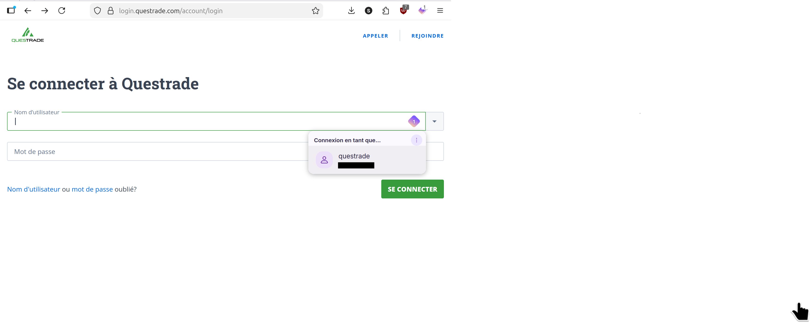
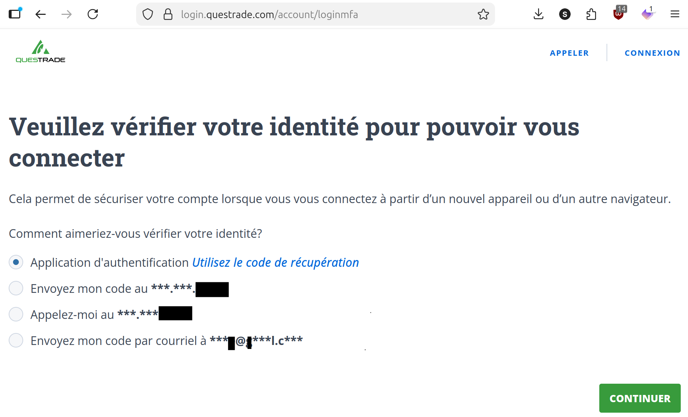
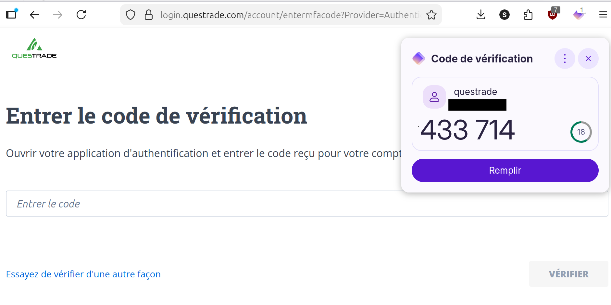
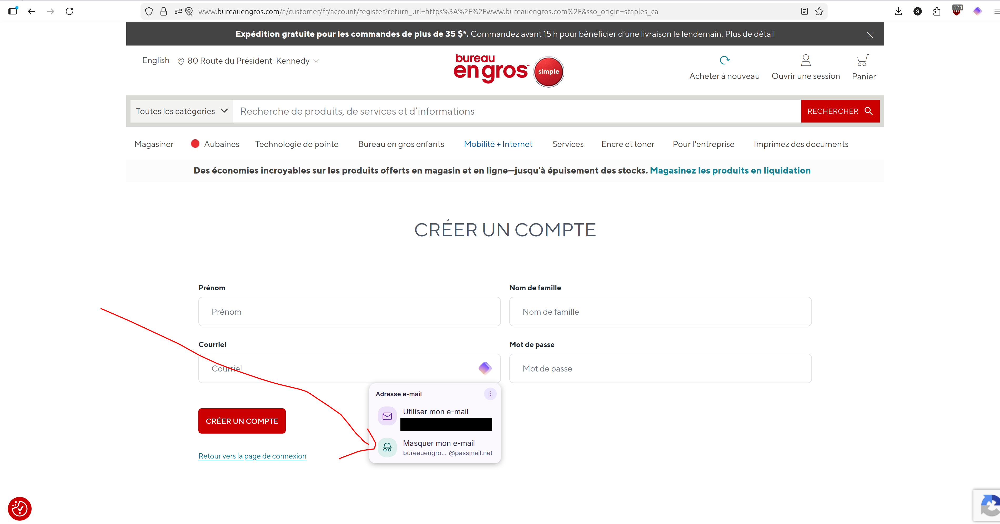
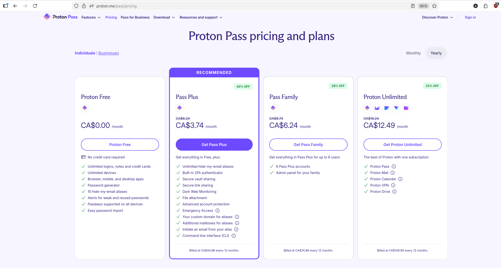
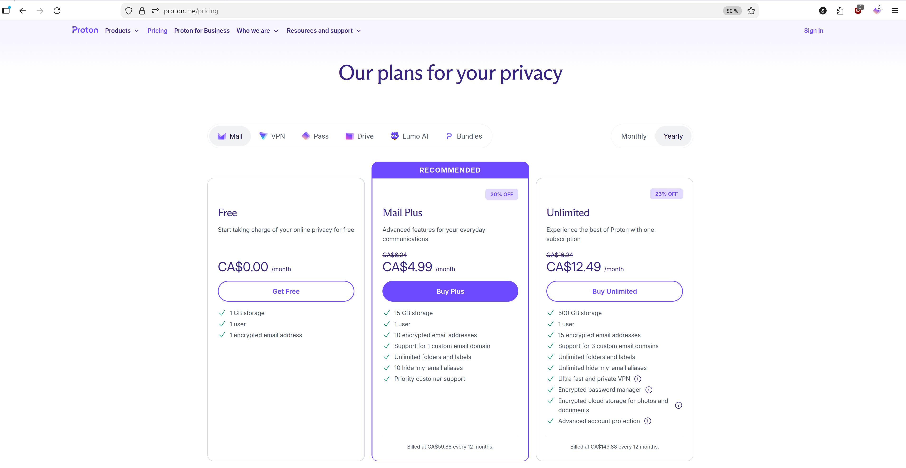
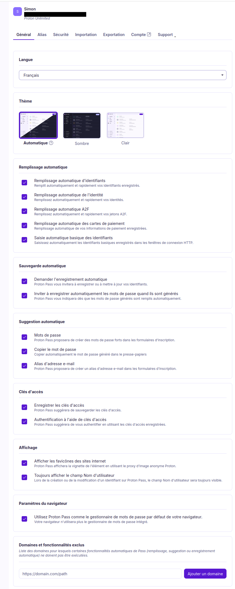
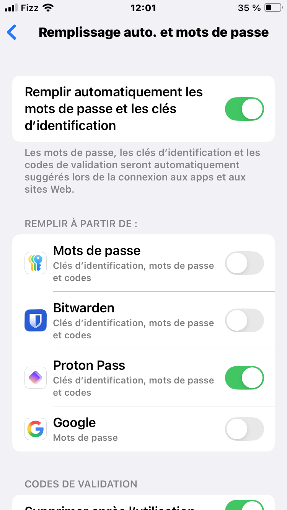
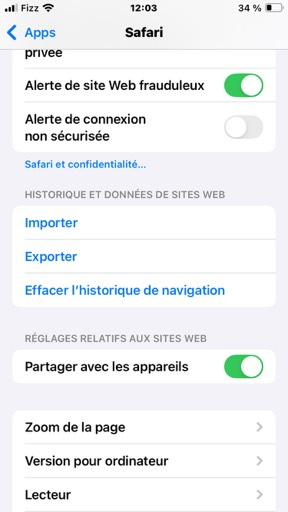
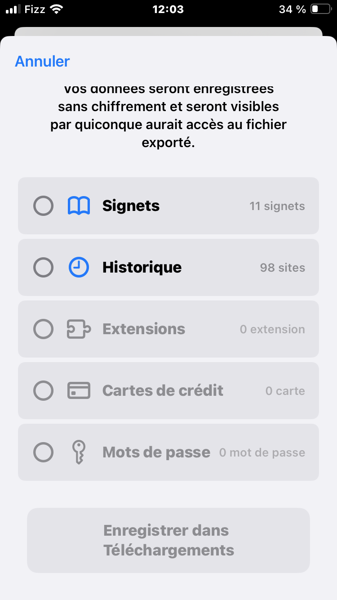

::: callout-tip
## Pourquoi est-ce qu'on est ici?

Parce que le TOTP (time-based-one-time-password, va me permettre de
m'authentifier à Questrade sans devoir trouver et charger mon téléphone
et que le hide-my-email alias illimité va me permettre de savoir quand
bureau en gros vend mon adresse email (et leur couper l'accès à ma boite
de courriel)
:::

# C'est quoi un password manager déjà?

Si tu sais déjà, skip cette section.

En deux mots: on sait tous qu'on n'est pas supposés d'utiliser même mot
de passe partout et qu'il est supposé être super compliqué.

Dans les fait, c'est pas vrai que je vais écrire le mot de passe
%%$/%?$/?TGFDGFgfdg! dans un cartable pis que je vais l'écrire à chaque
fois.\
Le password manager c'est un genre de coffre fort que tu ouvres avec un
seul mot de passe (ou un PIN) que tu dois retenir, et qui ensuite te
donne accès à tous tes mots de passes compliqués et uniques.

Tu vas sur un site web, il détecte que t'es sur le site de
desjardins.com et offre de pré-remplir ton username et ton password
ultra compliqué.

Retenir 1 mot de passe, ça je suis
capable de gérer.

Idéalement pour en tirer le maximum, tu vas utiliser ton "password
manager" comme manager partout: sur ton téléphone, sur ton ordi à la
maison, etc. Comme ça, tout est centralisé pis si tu changes le mot de
passe à 1 place ça va le changer partout.

Deux grands joueurs gratuits queje connais et utilise
[Bitwarden](https://bitwarden.com) et [Proton
Pass](https://proton.me/pass) qui sont les deux open source et fiables.

# New-to-me Feature #1: Le TOTP

Le 2FA (2 factor authentication) c'est un beau principe qui devrait
protéger mon compte. Genre le pirate aura besoin de qqch que je sais
(mon password) et de quelque chose que j'ai (mon téléphone) pour pirater
mon compte de banque.

C'est cool, mais mon skillset cérébral fait que j'ai besoin de "Find my
iphone" pour le trouver la moitié du temps, pis l'autre moitié du temps
j'ai besoin d'un fin limier pcq il a manqué de batterie. Anyway, t'auras
compris que ça m'écoeure de courir après mon téléphone,

Les versions "premium" de BitWarden et Proton Pass offrent le TOTP ou
*time-based-one-time-password*, qui va générer un code à 6-chiffres
directement sur l'ordinateur et offrir de le paster à la bonne place
dans le site web directement dans mon firefox/safari.

Bref j'ai rien à faire. C'est pas *tous* les sites qui l'offrent
(looking at you desjardins), mais ça progresse.

Ça coûte genre 4\$ par mois pour Proton Pass ou 20\$USD par année pour
Bitwarden.

Ça ressemble à ça et c'est un petit game changer pour moi:

# New to me Feature #2: Les alias d'email

## 

À tout moment, tu peux te mettre à recevoir du spam sur ton adresse
email, soit parce que bureau en gros a vendu ton adresse email, soit
parce qu'ils se sont fait hacker.

Une solution simple c'est de créer une nouvelle adresse à chaque site où
tu t'inscris. Genre tu te crées le compte
`randomshit.canadiantire@gmail.com` Comme ça tu n'as pas fuité ton
email, si jamais tu reçois du spam tu sais de qui ça vient (canadian
tire) et tu peux toujours effacer le email pour ne plus en recevoir.

C'est beau, mais on a autre chose à faire que de créer
`randomshit.canadiantire@gmail.com` juste pour acheter des ratchets en
spécial à 70%.

La solution c'est les service d'alias de email, qui vont créer cette
adresse là pour toi au moment où tu en as besoin.

Par exemple, dans le screenshot ci-bas il y a proton pass qui me propose
de créer un nouvel email juste pour bureau en gros en un seul clic:

Il y a plusieurs services qui font
ça, notamment Proton Pass (encore) , Addy.io et duckduckgo.

# Fournisseurs de services

On va focusser sur Proton et Bitwarden dont j'ai beaucoup parlé
aujourd'hui.

## Bitwarden   

Bitwarden est un chouchou de la communauté.

**Bitwarden gratuit** : password manager seulement

**Bitwarden premium**: password manager + build-in TOTP = 20\$USD/an =
2.30\$CAD par mois

Bitwarden n'offre pas le service de hide-my-alias, mais il s'intègre
bien avec des sites web comme addy.io qui le font et offrent le service
gratuitement.

Bitwarden est moins cher fondamentalement si vous ne vous intéressez
qu'au service de password manager, mais si vous cherchez une solution
tout en un (email sécurisé, VPN, drive, ET password manager) je vais
vous diriger vers Proton.

## *Proton*

Proton offre plusieurs services et est une bonne place pour "centraliser
ses abonnements" en Suisse loin des griffes des géants du web.

\
En particulier, j'utilise

- proton mail (comme google mail, mais ils lisent pas mes courriels)

- proton vpn (pour télécharger des isos de linux)

- proton pass (gestionnaire de mot de pass, authenticateur TOTP, hide my
  email alias)

- proton drive (genre de google drive) - proton calendar, proton docs
  etc...

Tous ces services existent en version gratuites, mais pour le TOTP il
faut aller dans les options payantes.

Ce qui nous intéresse aujourd'hui c'est Proton Pass, qui a lui même
plusieurs niveaux de services:

- **Proton Pass Free**: Password manager + 10 hide-my-email aliases (PAS
  DE TOTP 2FA authenticator )

- **Proton Pass Plus:** Password manager **+ unlimited
  hide-my-email-aliases + Built-In TOTP 2FA Autenticator 3.74\$
  CAD/mois**

- Proton Pass Family: Comme plus, mais pour 6 personnes. 6.24\$ CAD/mois

Si vous avez besoin de plus de services (par exemple les courriels) ça
peut valoir la peine d'upgrader le service de email vers Proton Mail
Plus

- Proton Mail Free = 1GB storage

- Proton Mail Plus = 15 GB Storage , supprot for custom email domain
  4.99\$ CAD/mois

  

**Donc si vous prenez le "email plus" et le "pass plus" ça revient à
7.73\$/mois pour un beau setup confidentiel où personne ne lit vos
emails et où vous avez le TOTP et unlimited email aliases.**

Tant qu'à y être, si vous payez aussi ailleurs pour des services comme
un VPN ou pour du storage à la google drive, ça peut valoir la peine
d'upgrader vers **"proton unlimited" pour 12.49\$/mois.qui vous offre
tout** (email plus, pass ,plus, 500 GB de storage, VPN , etc..)

On jase, mais si vous allez vous inscrire sur proton, et prenez un
service payant vous pouvez prendre [mon code de referral
référence](pr.tn/ref/0J22NN7T) qui va nous donner 20\$USD à tous les
deux :)

# Comment migrer vers le gestionnaire de mot de passe

Voici comment j'ai configuré mon affaire

**1. Créer un compte Proton**

Va sur [proton.me](https://proton.me) et crée un compte. La version
gratuite est suffisante pour commencer.

**2. Installer le plugin sur le desktop et le configurer**

Dans ton Firefox, cherche "Proton Pass" dans les extensions et
installe-le. Connecte-toi à ton compte.

Dans les settings du plugin, coche toutes les options, surtout tout en
bas: **"Utiliser Proton Pass comme gestionnaire de mots de passe par
défaut de votre navigateur"**. C'est ce qui fait que Firefox arrête de
te demander s'il peut sauvegarder tes mots de passe et laisse Proton
Pass gérer ça.

**4. Configurer sur iPhone**

Dans les **Réglages** → **Général** → **Remplissage automatique et mots
de passe**, j'active seulement "Remplir à partir de Proton Pass" et je
désactive "Mots de passe Apple".

**5. Importer tes mots de passe existants**

T'as probablement des mots de passe éparpillés partout. La bonne
nouvelle c'est que Proton Pass (et Bitwarden) peuvent importer depuis
plein de sources:

- **Firefox**: Menu → Mots de passe → Exporter les mots de passe ([doc
  officielle](https://support.mozilla.org/en-US/kb/export-login-data-firefox))

- **iPhone/Safari**: Réglages → Apps → Safari → Historique et données de
  site web → Exporter → Mots de passe

  

C'est un peu de setup, mais une fois que ça roule ça *spark joy*.

# En résumé

Si tu sais pas où est ton téléphone : active le TOTP premium.

Si tu veux pas donner ton adresse à n'importe qui: active le
hide-my-email alias.

Le choix entre Bitwarden et Proton Pass est vraiment "les deux sont
bons", prends celui qui fit le mieux dans ton écosystème existant.

Si j'avais juste besoin du password managers et de TOTP et de
hide-my-alias j'irais probablement vers Bitwarden + Addy.io à 20\$USD
par an, mais comme j'ai aussi besoin d'un email et d'un calendrier
relativement sécurisé, d'un VPN et d'un peu de "drive", j'ai pris le
*Proton Unlimited* à 12\$CAD/mois. Alternativement, le proton family
coûte 2x plus cher maias tu peux le partager à 6 personnes.

Si tu prends Proton, mon [lien de référence](https://pr.tn/ref/0J22NN7T)
nous donne 20\$USD de crédit à chacun si tu prends un abonnement payant.
:)
